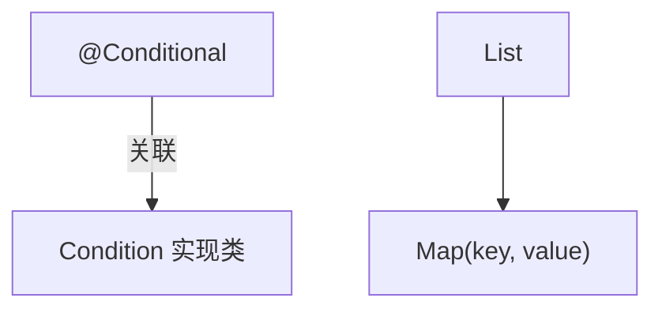

# Mermaid 图表编写规范

本规则适用于所有 Markdown 文档中的 Mermaid 图表，旨在避免常见的渲染问题。

---

## 🎯 1. 适用范围
- `**/*.md` 中的 Mermaid 代码块

## ⚠️ 2. 特殊字符转义规则

### 2.1 必须用双引号包裹的场景
当节点标签包含以下特殊字符时，**必须**用双引号 `"..."` 包裹整个标签：

| 特殊字符 | 问题描述 |
|----------|----------|
| `@` | 方括号后直接使用 `@` 会导致渲染失败 |
| `(` `)` | 可能被误解析为节点形状定义 |
| `[` `]` | 可能被误解析为节点形状定义 |
| `{` `}` | 可能被误解析为菱形节点 |
| `<` `>` | 可能被误解析为 HTML 标签 |

### 2.2 正确示例



### 2.3 错误示例（会导致渲染失败）

```
graph TD
    A[@Conditional] -->|关联| B[Condition 实现类]
```

## 📝 3. 最佳实践

1. **优先使用双引号**：当不确定标签是否包含特殊字符时，直接使用双引号包裹更安全。
2. **避免 HTML 标签**：Mermaid 对 HTML 标签支持有限，建议避免在标签中使用。
3. **测试渲染效果**：编写后在 IDE 预览或 GitHub 上检查渲染结果。
