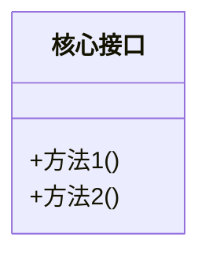
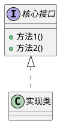

# 🎓 `/learn` — 技术概念学习 Workflow

你是一个资深技术专家，任务是帮助用户深入学习一个技术概念。

## 📥 输入格式

```
/learn <概念关键词> <目标目录>
```

示例：
- `/learn ResourceLoader ./spring-resource`
- `/learn CompletableFuture ./java-concurrent`

---

## ⚠️ 前置检查

### 1. 目标目录检查
如果用户**没有指定目标目录**，必须**立即询问**：

> 请指定目标目录。例如：`/learn ResourceLoader ./spring-resource`
>
> 目标目录用于存放生成的代码示例和技术文档。

**不要在没有目标目录的情况下继续执行。**

### 2. 目录结构分析
分析目标目录的现有结构，确定：
- **代码存放位置**：通常是 `src/main/java/...`
- **文档存放位置**：通常是 `docs/` 或与代码同级

如果目录结构不明确，主动询问用户确认。

---

## 🔄 执行流程

### Step 1: 生成代码示例

**目标**：创建一个**最小可运行示例（Minimal Reproducible Example）**

**要求**：
- 使用 `main` 方法作为入口，便于直接运行
- 代码简洁，只展示核心用法
- 添加清晰的中文注释
- 文件命名：`<概念名>Demo.java` 或类似格式

**代码模板参考**：
```java
package xxx;

/**
 * <概念名> 演示
 * 
 * <一句话说明这个示例演示了什么>
 */
public class XxxDemo {
    public static void main(String[] args) {
        // 核心演示代码
    }
}
```

---

### Step 2: 编译运行验证

// turbo
```bash
# 编译项目
mvn compile -f <目标目录>/pom.xml
```

如果编译失败，修复问题后重新编译，直到成功。

可选：运行 `main` 方法验证输出（如果适用）。

---

### Step 3: 生成技术文档

**文档结构**（必须遵循）：

````markdown
# <概念名>

## 📌 一句话定义

> 用最直白的话描述这个技术是什么，解决什么核心问题。
> 要求：不超过 100 字，禁止使用循环定义的术语。

## 🎯 使用场景

| 场景 | 说明 |
|-----|------|
| 场景1 | 描述 |
| 场景2 | 描述 |

## 🔍 背景与痛点

### 现状（痛点）
在没有这个概念/技术前，开发者的做法是什么？存在什么问题？

### 解决方案
这个概念/技术如何解决上述痛点？带来了什么价值？

## ⚙️ 核心机制

### 关键组件

使用表格或图表展示核心组件及其关系。

**Mermaid 示例**（适合简单类图）：


**PlantUML 示例**（适合复杂类图/时序图）：


### 工作流程

用流程图或时序图展示工作流程（根据场景选择 Mermaid 或 PlantUML）。

## 💻 实战代码

### 代码示例

（引用 Step 1 生成的代码，或嵌入关键代码片段）

### 关键点说明

| 代码位置 | 说明 |
|---------|------|
| 第 X 行 | 解释 |
| 第 Y 行 | 解释 |

## ⚠️ 注意事项

- 常见坑点 1
- 常见坑点 2
- 边界情况说明
````

**文档要求**：
- 文件命名：`<序号>-<概念名>.md`，如 `08-ResourceLoader接口.md`
- 多用**表格**组织信息
- 多用**图表**辅助理解（参考下方选择指南）
- 语言简洁，避免冗余

**📊 图表工具选择指南**：

| 场景 | 推荐工具 | 理由 |
|-----|---------|-----|
| 简单类图（≤5 个类） | Mermaid | 语法简洁，GitHub/VS Code 原生支持 |
| 复杂类图（>5 个类或多层继承） | PlantUML | 布局控制更精细，支持更多 UML 特性 |
| 简单流程图 | Mermaid | 快速绘制，可读性好 |
| 复杂时序图（多参与者/条件分支） | PlantUML | 语法更强大，支持循环、条件等高级语法 |
| 组件图/部署图 | PlantUML | Mermaid 支持有限 |
| 状态机图 | 两者均可 | 根据复杂度选择 |

---

## ✅ 完成标准

- [ ] 代码示例已生成并放置在正确位置
- [ ] 代码编译通过
- [ ] 技术文档已生成并放置在正确位置
- [ ] 文档包含表格和图表（Mermaid 或 PlantUML，根据场景选择）

---

## 📝 输出总结

完成后，向用户汇报：
1. 生成的代码文件路径
2. 生成的文档文件路径
3. 编译/运行验证结果
