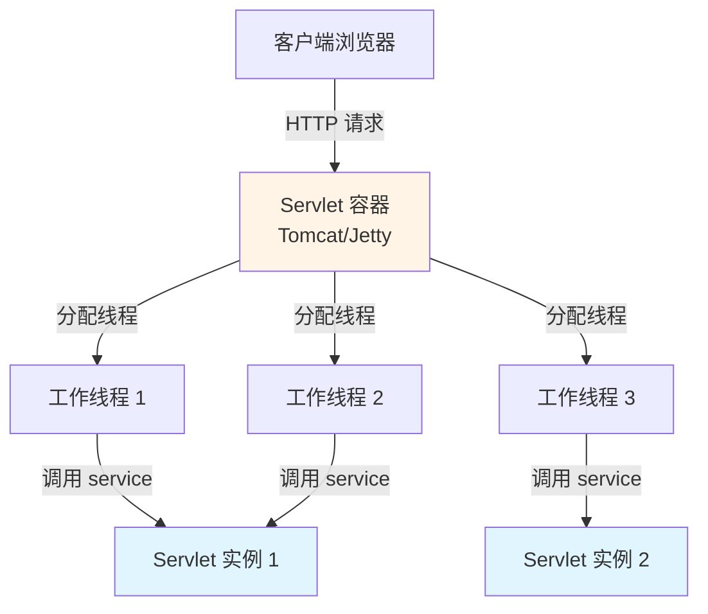
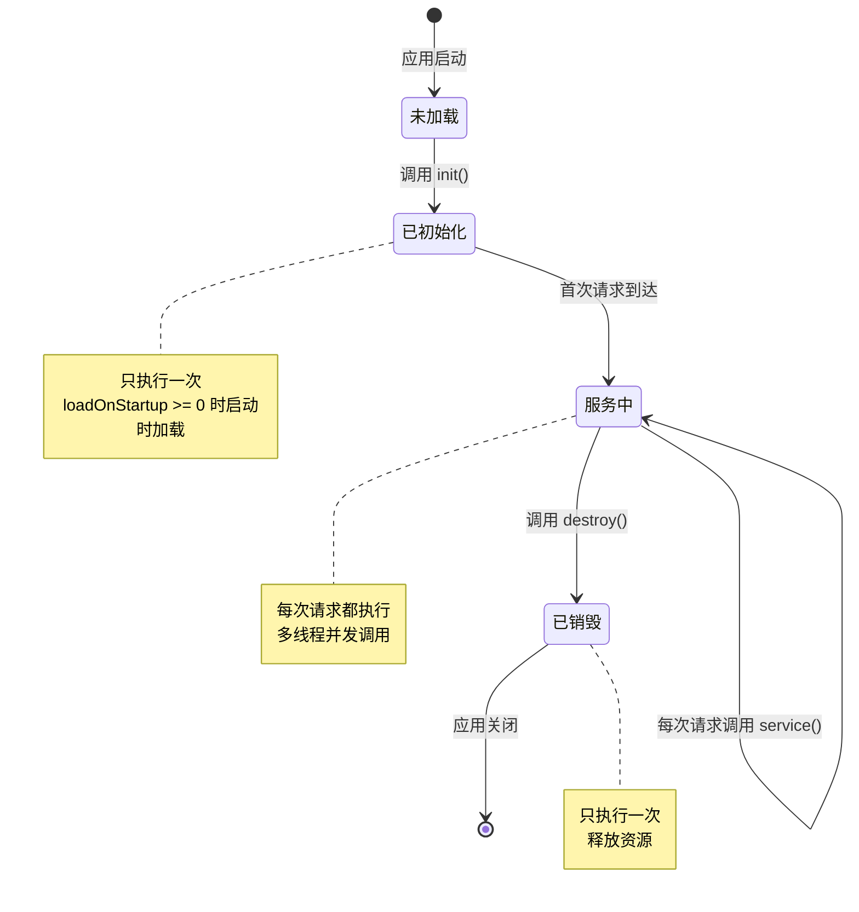
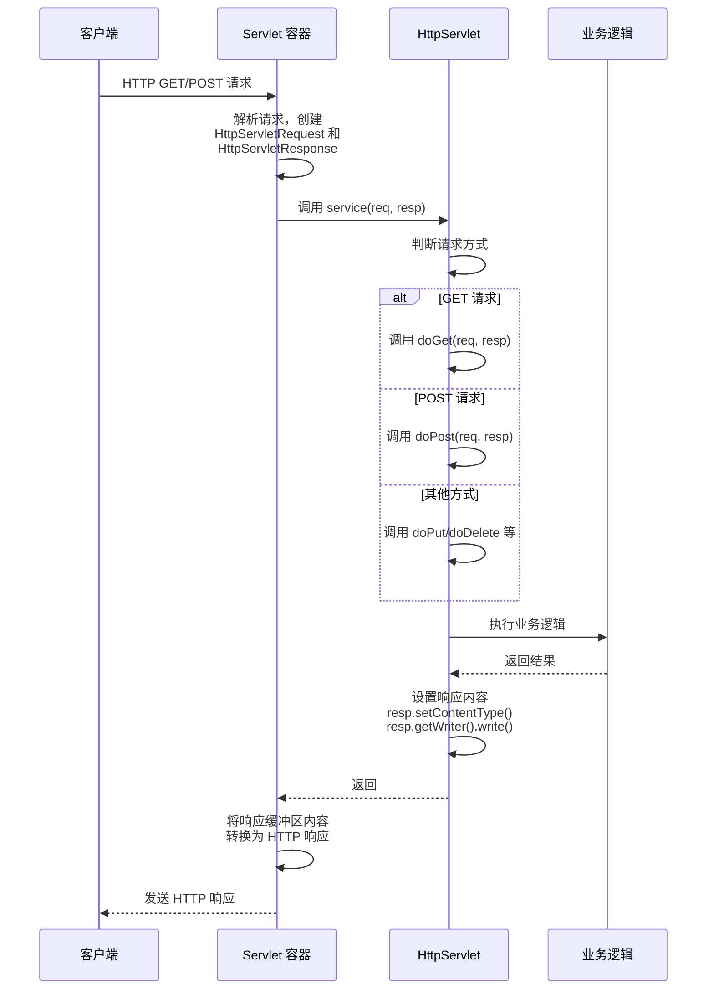
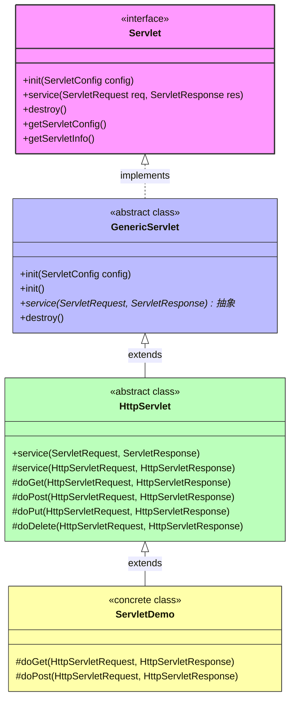
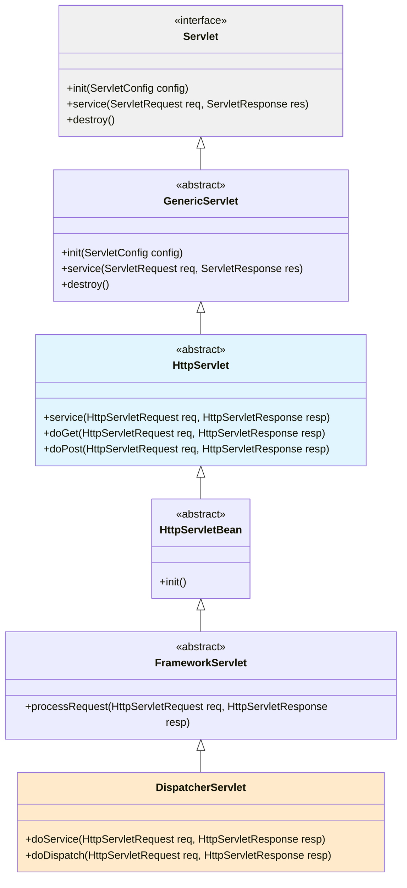
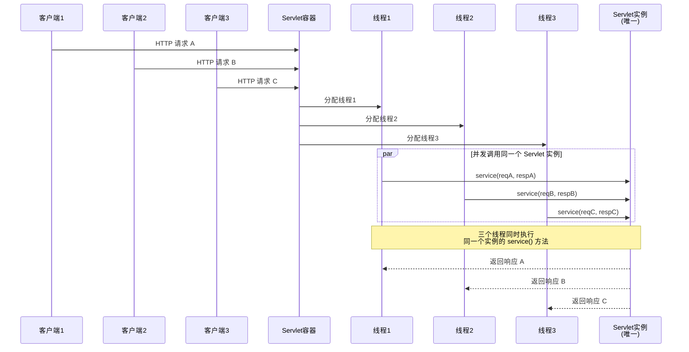

# Servlet 基础

## 📌 一句话定义

> Servlet 是运行在服务器端的 Java 程序，用于**接收和响应 HTTP 请求**，是 Java Web 应用的核心组件。它由 Servlet 容器（如 Tomcat）管理生命周期，通过标准化的 API 处理客户端请求并生成动态内容。

## 🎯 使用场景

| 场景 | 说明 |
|-----|------|
| **Web 请求处理** | 处理 HTTP 请求，实现登录、注册、数据查询等业务逻辑 |
| **动态内容生成** | 根据用户请求动态生成 HTML、JSON、XML 等响应内容 |
| **Web 框架基础** | 作为 Spring MVC、Struts 等框架的底层基础（如 DispatcherServlet） |
| **API 网关** | 作为 RESTful API 的入口，进行请求路由和处理 |
| **过滤器和拦截器** | 通过 Filter 实现请求预处理（如权限校验、日志记录） |

## 🔍 背景与痛点

### 现状（痛点）

在 Servlet 出现之前，Web 开发主要使用 **CGI（Common Gateway Interface）**：

1. **每次请求创建新进程**
   - CGI 为每个请求启动一个独立进程，开销巨大
   - 内存消耗高，性能低下
   - 无法复用资源（数据库连接等）

2. **缺乏标准化**
   - 不同语言（Perl、C、Shell）实现方式各异
   - 难以维护和移植

3. **静态网页局限**
   - 早期 Web 只能提供静态 HTML 文件
   - 无法根据用户输入动态生成内容

### 解决方案

Servlet 通过以下方式解决了上述问题：

| 问题 | Servlet 的解决方案 |
|------|-------------------|
| **进程开销** | 使用**多线程模型**，每个请求由独立线程处理，共享同一个 Servlet 实例 |
| **标准化** | 提供**统一的 Java API**（`jakarta.servlet.*`），跨平台、跨容器 |
| **动态内容** | 支持**请求参数解析**和**动态响应生成**（HTML、JSON 等） |
| **生命周期管理** | 由 Servlet 容器统一管理初始化、服务和销毁 |
| **资源复用** | 单例模式，实例变量可存储共享资源（需注意线程安全） |

**核心优势**：
- ✅ 高性能（线程池 + 单例）
- ✅ 可移植（符合 Jakarta EE 规范）
- ✅ 易扩展（通过继承扩展功能）

---

## ⚙️ 核心机制

### Servlet 容器架构



**关键点**：
- Servlet 容器负责管理 Servlet 的生命周期
- 多个线程可以同时调用同一个 Servlet 实例（**单例模式**）
- 容器通过线程池提高性能

---

### Servlet 生命周期



#### 生命周期三阶段

| 阶段 | 方法 | 调用时机 | 执行次数 | 主要用途 |
|------|------|----------|----------|----------|
| **1. 初始化** | `init(ServletConfig config)` | 首次请求时 / 应用启动时 | **1 次** | 加载配置、初始化资源 |
| **2. 服务** | `service(HttpServletRequest req, HttpServletResponse resp)` | 每次请求到达时 | **每次请求** | 处理业务逻辑、生成响应 |
| **3. 销毁** | `destroy()` | 应用关闭 / Servlet 卸载时 | **1 次** | 释放资源、保存状态 |

---

### 请求处理流程



**核心步骤**：
1. 容器接收 HTTP 请求，创建 `HttpServletRequest` 和 `HttpServletResponse` 对象
2. 调用 Servlet 的 `service()` 方法
3. `service()` 根据请求方式（GET/POST 等）调用对应的 `doXxx()` 方法
4. 业务逻辑处理请求，通过 `response` 对象写入响应内容
5. 容器将响应发送给客户端

---

## 🏗️ Servlet 继承体系

### 继承层次结构

Servlet 采用**分层设计**，从通用到专用逐步扩展功能：



---

### 各层次详解

#### 1️⃣ Servlet 接口（顶层规范）

**定位**：定义 Servlet 的生命周期规范和基础能力

```java
package jakarta.servlet;

public interface Servlet {
    // 初始化方法
    void init(ServletConfig config) throws ServletException;
    
    // 获取配置
    ServletConfig getServletConfig();
    
    // 服务方法（核心）
    void service(ServletRequest req, ServletResponse res) 
        throws ServletException, IOException;
    
    // 获取信息
    String getServletInfo();
    
    // 销毁方法
    void destroy();
}
```

**特点**：
- ✅ 协议无关（不限于 HTTP）
- ✅ 定义了 `init()` → `service()` → `destroy()` 生命周期
- ✅ 使用通用的 `ServletRequest` 和 `ServletResponse`

---

#### 2️⃣ GenericServlet 抽象类（基础实现）

**定位**：提供 Servlet 接口的骨架实现

```java
package jakarta.servlet;

public abstract class GenericServlet implements Servlet, ServletConfig {
    
    private transient ServletConfig config;
    
    // 实现 init()，简化配置管理
    @Override
    public void init(ServletConfig config) throws ServletException {
        this.config = config;
        this.init(); // 调用无参 init()，供子类重写
    }
    
    // 提供无参 init()，方便子类重写
    public void init() throws ServletException {
        // 默认空实现
    }
    
    // service() 仍然是抽象方法，强制子类实现
    @Override
    public abstract void service(ServletRequest req, ServletResponse res)
        throws ServletException, IOException;
    
    @Override
    public void destroy() {
        // 默认空实现
    }
    
    // 实现 ServletConfig 接口的方法
    @Override
    public ServletConfig getServletConfig() {
        return config;
    }
    
    @Override
    public String getServletName() {
        return config.getServletName();
    }
    
    @Override
    public ServletContext getServletContext() {
        return config.getServletContext();
    }
    
    @Override
    public String getInitParameter(String name) {
        return config.getInitParameter(name);
    }
}
```

**作用**：
- ✅ 实现了配置管理（`ServletConfig`）
- ✅ 简化了 `init()` 方法（提供无参版本）
- ✅ 提供了常用工具方法（如 `log()`）
- ⚠️ 仍然是**协议无关**的

---

#### 3️⃣ HttpServlet 抽象类（HTTP 专用）

**定位**：专门处理 HTTP 协议，实现请求方法分发

```java
package jakarta.servlet.http;

public abstract class HttpServlet extends GenericServlet {
    
    // 重写 service()，将通用请求转换为 HTTP 请求
    @Override
    public void service(ServletRequest req, ServletResponse res)
        throws ServletException, IOException {
        
        HttpServletRequest request = (HttpServletRequest) req;
        HttpServletResponse response = (HttpServletResponse) res;
        
        service(request, response); // 调用 HTTP 版本的 service()
    }
    
    // HTTP 版本的 service()，根据请求方式分发
    protected void service(HttpServletRequest req, HttpServletResponse resp)
        throws ServletException, IOException {
        
        String method = req.getMethod();
        
        if (method.equals(METHOD_GET)) {
            long lastModified = getLastModified(req);
            if (lastModified == -1) {
                doGet(req, resp); // 调用 doGet()
            } else {
                // 处理缓存逻辑
                long ifModifiedSince = req.getDateHeader(HEADER_IFMODSINCE);
                if (ifModifiedSince < lastModified) {
                    maybeSetLastModified(resp, lastModified);
                    doGet(req, resp);
                } else {
                    resp.setStatus(HttpServletResponse.SC_NOT_MODIFIED);
                }
            }
        } else if (method.equals(METHOD_POST)) {
            doPost(req, resp); // 调用 doPost()
        } else if (method.equals(METHOD_PUT)) {
            doPut(req, resp);
        } else if (method.equals(METHOD_DELETE)) {
            doDelete(req, resp);
        } else if (method.equals(METHOD_OPTIONS)) {
            doOptions(req, resp);
        } else if (method.equals(METHOD_TRACE)) {
            doTrace(req, resp);
        } else {
            // 不支持的方法
            String errMsg = lStrings.getString("http.method_not_implemented");
            Object[] errArgs = new Object[1];
            errArgs[0] = method;
            errMsg = MessageFormat.format(errMsg, errArgs);
            resp.sendError(HttpServletResponse.SC_NOT_IMPLEMENTED, errMsg);
        }
    }
    
    // 默认实现返回 405 Method Not Allowed
    protected void doGet(HttpServletRequest req, HttpServletResponse resp)
        throws ServletException, IOException {
        String protocol = req.getProtocol();
        String msg = lStrings.getString("http.method_get_not_supported");
        resp.sendError(getMethodNotSupportedCode(protocol), msg);
    }
    
    protected void doPost(HttpServletRequest req, HttpServletResponse resp)
        throws ServletException, IOException {
        String protocol = req.getProtocol();
        String msg = lStrings.getString("http.method_post_not_supported");
        resp.sendError(getMethodNotSupportedCode(protocol), msg);
    }
    
    // ... doDelete(), doPut() 等类似
}
```

**核心机制**：
- ✅ **重载 service() 方法**：实现从通用 Servlet 到 HTTP Servlet 的转换
- ✅ **HTTP 方法分发**：根据 `req.getMethod()` 自动调用对应的 `doXxx()` 方法
- ✅ **支持缓存优化**：处理 `If-Modified-Since` 等 HTTP 缓存头
- ✅ **默认错误响应**：未实现的方法返回 405 错误

---

### 层次对比

| 层次 | 类型 | 名称 | 协议 | 主要职责 | 是否抽象 |
|------|------|------|------|----------|----------|
| **1** | interface | `Servlet` | 协议无关 | 定义生命周期规范 | ✅ 接口 |
| **2** | abstract class | `GenericServlet` | 协议无关 | 实现配置管理和生命周期 | ✅ 抽象类 |
| **3** | abstract class | `HttpServlet` | **HTTP 专用** | 实现 HTTP 方法分发 | ✅ 抽象类 |
| **4** | concrete class | `ServletDemo` | HTTP | 实现业务逻辑 | ❌ 具体类 |

---

### 设计模式解析

#### 1. **模板方法模式**

`HttpServlet.service()` 是经典的模板方法：

```java
// 模板方法（已实现，定义算法骨架）
protected void service(HttpServletRequest req, HttpServletResponse resp) {
    String method = req.getMethod();
    
    // 算法步骤
    if ("GET".equals(method)) {
        doGet(req, resp);  // 钩子方法，子类实现
    } else if ("POST".equals(method)) {
        doPost(req, resp); // 钩子方法，子类实现
    }
    // ...
}

// 钩子方法（默认实现，子类可重写）
protected void doGet(HttpServletRequest req, HttpServletResponse resp) {
    resp.sendError(405); // 默认返回错误
}
```

**优势**：
- ✅ 父类控制流程，子类只需实现细节
- ✅ 避免代码重复（HTTP 协议解析逻辑）
- ✅ 扩展灵活（子类只重写需要的方法）

---

#### 2. **适配器模式**

`GenericServlet` 是适配器，将 `ServletConfig` 委托给内部实现：

```java
public abstract class GenericServlet implements Servlet, ServletConfig {
    private ServletConfig config;
    
    // 适配 ServletConfig 接口
    @Override
    public String getInitParameter(String name) {
        return config.getInitParameter(name);
    }
    
    @Override
    public ServletContext getServletContext() {
        return config.getServletContext();
    }
}
```

---

### 为什么这样设计？

#### ✅ **关注点分离**

```java
// 如果要实现 FTP 协议的 Servlet（理论上）
class FtpServlet extends GenericServlet {
    @Override
    public void service(ServletRequest req, ServletResponse res) {
        // 处理 FTP 协议
    }
}

// HTTP 协议则继承 HttpServlet
class MyServlet extends HttpServlet {
    @Override
    protected void doGet(HttpServletRequest req, HttpServletResponse resp) {
        // 处理 HTTP GET
    }
}
```

#### ✅ **开闭原则**
- `Servlet` 接口：对扩展开放（可以实现自定义协议）
- `HttpServlet` 抽象类：对修改封闭（HTTP 逻辑已封装）

#### ✅ **最小知识原则**
开发者只需：
- 继承 `HttpServlet`
- 重写 `doGet()` / `doPost()`
- 无需关心 HTTP 协议解析细节

---

### 实际开发建议

**99% 的情况下**，我们只需要：

```java
// ✅ 推荐：继承 HttpServlet
@WebServlet("/demo")
public class MyServlet extends HttpServlet {
    
    @Override
    protected void doGet(HttpServletRequest req, HttpServletResponse resp) 
            throws IOException {
        // 业务逻辑
        resp.getWriter().write("Hello, Servlet!");
    }
}
```

**很少直接实现 `Servlet` 接口或继承 `GenericServlet`**：

```java
// ❌ 不推荐：太底层，需要手动处理 HTTP 协议
public class MyServlet implements Servlet {
    @Override
    public void service(ServletRequest req, ServletResponse res) {
        // 需要自己解析 HTTP Method、处理缓存等
    }
}
```

---

### 关键要点总结

| 问题 | 答案 |
|------|------|
| **Servlet 是接口还是类？** | `Servlet` 是**接口**，定义生命周期规范 |
| **HttpServlet 是接口还是类？** | `HttpServlet` 是**抽象类**，实现 HTTP 协议处理 |
| **为什么不直接实现 Servlet 接口？** | 接口太底层，`HttpServlet` 已封装 HTTP 协议逻辑 |
| **GenericServlet 的作用是什么？** | 提供 Servlet 接口的骨架实现，简化开发 |
| **实际开发中继承谁？** | 继承 `HttpServlet`，重写 `doGet()` / `doPost()` |

---

## 💻 实战代码

### 代码示例 1：基本用法

完整代码：[ServletDemo.java](../src/main/java/io/github/daihaowxg/_05_spring_web/servlet/ServletDemo.java)

**核心代码片段**：

```java
@WebServlet(
    name = "servletDemo",
    urlPatterns = {"/demo/servlet"},
    loadOnStartup = 1
)
public class ServletDemo extends HttpServlet {

    @Override
    protected void doGet(HttpServletRequest req, HttpServletResponse resp) throws IOException {
        // 1. 获取请求参数
        String name = req.getParameter("name");
        
        // 2. 设置响应类型和编码
        resp.setContentType("text/html; charset=UTF-8");
        
        // 3. 输出响应内容
        PrintWriter writer = resp.getWriter();
        writer.println("<h1>欢迎，" + name + "！</h1>");
    }
}
```

**关键点说明**：

| 代码位置 | 说明 |
|---------|------|
| `@WebServlet` | Servlet 3.0+ 注解配置，替代 `web.xml` |
| `urlPatterns` | 配置 URL 映射路径 |
| `loadOnStartup = 1` | 应用启动时立即加载，值越小优先级越高 |
| `doGet(req, resp)` | 处理 HTTP GET 请求 |
| `req.getParameter("name")` | 获取 URL 查询参数或表单参数 |
| `resp.setContentType()` | 设置响应 MIME 类型和编码 |
| `resp.getWriter()` | 获取字符输出流，写入响应内容 |

**访问方式**：
```
http://localhost:8080/demo/servlet?name=张三
```

---

### 代码示例 2：生命周期演示

完整代码：[ServletLifecycleDemo.java](../src/main/java/io/github/daihaowxg/_05_spring_web/servlet/ServletLifecycleDemo.java)

**核心代码片段**：

```java
@WebServlet(name = "servletLifecycleDemo", urlPatterns = {"/demo/lifecycle"}, loadOnStartup = 1)
public class ServletLifecycleDemo extends HttpServlet {

    private String initTime;      // 初始化时间（实例变量）
    private int requestCount = 0; // 请求计数器（非线程安全！）

    @Override
    public void init(ServletConfig config) throws ServletException {
        super.init(config);
        initTime = LocalDateTime.now().format(FORMATTER);
        log.info("【生命周期】Servlet 初始化，时间: {}", initTime);
    }

    @Override
    protected void service(HttpServletRequest req, HttpServletResponse resp) 
            throws ServletException, IOException {
        requestCount++; // 注意：非线程安全，仅用于演示
        log.info("【生命周期】处理请求，累计请求次数: {}", requestCount);
        super.service(req, resp);
    }

    @Override
    public void destroy() {
        log.info("【生命周期】Servlet 销毁，总请求次数: {}", requestCount);
    }
}
```

**执行流程观察**：

1. **启动应用** → 控制台输出：
   ```
   【生命周期】Servlet 初始化，时间: 2026-01-20 09:30:15
   ```

2. **发起请求** → 控制台输出：
   ```
   【生命周期】处理请求，累计请求次数: 1
   【生命周期】处理请求，累计请求次数: 2
   ...
   ```

3. **停止应用** → 控制台输出：
   ```
   【生命周期】Servlet 销毁，总请求次数: 10
   ```

---

## 🔗 Servlet 与 Spring MVC 的关系

### 继承关系



### Spring MVC 对 Servlet 的扩展

| 层次 | 类名 | 核心功能 |
|------|------|----------|
| **1. 标准接口** | `Servlet` | 定义生命周期方法 |
| **2. 通用实现** | `GenericServlet` | 实现基础生命周期管理 |
| **3. HTTP 协议** | `HttpServlet` | 支持 HTTP 协议（GET、POST 等） |
| **4. Spring 集成** | `HttpServletBean` | 将 Servlet 配置参数注入为 Bean 属性 |
| **5. 框架基础** | `FrameworkServlet` | 集成 Spring ApplicationContext |
| **6. MVC 核心** | `DispatcherServlet` | 实现前端控制器模式，处理请求分发 |

**关键点**：
- ✅ **DispatcherServlet 本质上是一个 Servlet**
- ✅ Spring MVC 通过继承扩展了 Servlet 的功能
- ✅ 学习 Servlet 是理解 Spring MVC 的基础

---

## ⚡ Jakarta EE 9+ 的变化

### 命名空间迁移

Spring Boot 3.x 升级到 **Jakarta EE 9+**，所有 `javax.*` 包名变更为 `jakarta.*`：

| Spring Boot 版本 | Servlet API | 包名 |
|-----------------|-------------|------|
| **2.x** | Servlet 4.0 (Java EE 8) | `javax.servlet.*` |
| **3.x** | Servlet 6.0 (Jakarta EE 9+) | `jakarta.servlet.*` |

**代码迁移示例**：

```diff
- import javax.servlet.http.HttpServlet;
- import javax.servlet.http.HttpServletRequest;
- import javax.servlet.http.HttpServletResponse;
+ import jakarta.servlet.http.HttpServlet;
+ import jakarta.servlet.http.HttpServletRequest;
+ import jakarta.servlet.http.HttpServletResponse;
```

### Spring Boot 3.x 兼容性

| 组件 | 版本 | 说明 |
|------|------|------|
| Spring Framework | 6.x | 全面支持 Jakarta EE 9+ |
| Tomcat | 10.x | 默认嵌入式容器 |
| Servlet API | 6.0 | Jakarta Servlet 规范 |

> [!IMPORTANT]
> 迁移到 Spring Boot 3.x 时，所有 Servlet 相关代码必须将 `javax.servlet` 替换为 `jakarta.servlet`。

---

## ⚠️ 注意事项

### 1. 线程安全问题（核心）

#### 常见误解

**❌ 错误理解**：一个线程一个 Servlet 实例  
**✅ 正确理解**：一个 Servlet 实例，被多个线程共享调用

---

#### Servlet 单例 + 多线程工作原理

Servlet 容器采用 **"单例 Servlet + 线程池"** 的架构：



**关键要点**：

| 组件 | 数量 | 生命周期 | 线程独立性 |
|------|------|---------|------------|
| **Servlet 实例** | **1 个**（单例） | 应用启动 → 应用关闭 | 多线程共享 |
| **工作线程** | **多个**（线程池） | 请求开始 → 请求结束 | 每个请求独立 |
| **HttpServletRequest** | 每个请求 1 个 | 请求开始 → 请求结束 | 每个请求独立 |
| **HttpServletResponse** | 每个请求 1 个 | 请求开始 → 请求结束 | 每个请求独立 |

**类比**：
- **Servlet 实例** = 餐厅的厨房（只有 1 个）
- **工作线程** = 厨师（多个厨师同时在同一个厨房工作）
- **请求/响应对象** = 顾客订单（每个顾客一份订单）

---

#### 实例变量的线程安全问题

**问题代码**：

```java
@WebServlet("/unsafe")
public class UnsafeServlet extends HttpServlet {
    private int count = 0; // ❌ 实例变量，被所有线程共享！
    
    @Override
    protected void doGet(HttpServletRequest req, HttpServletResponse resp) 
            throws IOException {
        count++; // ❌ 多线程并发时会出现竞争条件
        
        resp.getWriter().println("访问次数: " + count);
    }
}
```

**问题根源**：

```java
// count++ 不是原子操作，实际分为三步：
// 1. 读取 count 的值（假设是 0）
// 2. 加 1（得到 1）
// 3. 写回 count

// 线程交错执行示例：
// 线程1: 读取 count=0 → 计算得到 1
// 线程2: 读取 count=0 → 计算得到 1  ← 线程1还未写回
// 线程1: 写回 count=1
// 线程2: 写回 count=1  ← 覆盖了线程1的结果
// 最终结果: count=1（而不是预期的 2）
```

---

#### 代码验证

**验证代码**（演示单例和线程安全问题）：

```java
@WebServlet("/thread-safety-demo")
public class ThreadSafetyDemo extends HttpServlet {
    
    // 实例变量（被所有线程共享）
    private int instanceCounter = 0;
    
    @Override
    protected void doGet(HttpServletRequest req, HttpServletResponse resp) 
            throws IOException {
        
        // 局部变量（每个线程独立）
        int localCounter = 0;
        
        // 模拟耗时操作，增加并发冲突概率
        for (int i = 0; i < 5; i++) {
            instanceCounter++;  // ❌ 多线程不安全
            localCounter++;     // ✅ 线程安全
            
            try {
                Thread.sleep(100);
            } catch (InterruptedException e) {
                e.printStackTrace();
            }
        }
        
        resp.setContentType("text/plain; charset=UTF-8");
        resp.getWriter().println("当前线程: " + Thread.currentThread().getName());
        resp.getWriter().println("Servlet 实例: " + this.hashCode());
        resp.getWriter().println("实例计数器: " + instanceCounter);  // 不可预测
        resp.getWriter().println("局部计数器: " + localCounter);    // 始终是 5
    }
}
```

**测试结果**（同时发起 3 个请求）：

| 请求 | 线程名称 | Servlet 实例 | 实例计数器 | 局部计数器 |
|------|---------|-------------|-----------|-----------|
| 请求1 | http-nio-8080-exec-1 | 123456789 | 12 ❌ | 5 ✅ |
| 请求2 | http-nio-8080-exec-2 | 123456789 ✅ | 15 ❌ | 5 ✅ |
| 请求3 | http-nio-8080-exec-3 | 123456789 ✅ | 15 ❌ | 5 ✅ |

**观察**：
- ✅ **线程不同**：每个请求使用不同的线程
- ✅ **实例相同**：所有请求使用同一个 Servlet 实例（hashCode 相同）
- ❌ **实例计数器错误**：应该是 15，但可能是其他值（竞态条件）
- ✅ **局部计数器正确**：每个线程独立，始终是 5

---

#### 解决方案

##### 方案 1：使用局部变量（推荐）

```java
@Override
protected void doGet(HttpServletRequest req, HttpServletResponse resp) {
    int count = 0;  // ✅ 局部变量，存储在线程栈中，线程安全
    count++;
    
    // 每个线程都有自己的 count 副本，互不干扰
}
```

##### 方案 2：使用线程安全类

```java
// 实例变量，但使用线程安全类
private final AtomicInteger counter = new AtomicInteger(0);

@Override
protected void doGet(HttpServletRequest req, HttpServletResponse resp) {
    counter.incrementAndGet();  // ✅ 原子操作，线程安全
}
```

##### 方案 3：使用同步（不推荐）

```java
private int counter = 0;

@Override
protected synchronized void doGet(HttpServletRequest req, HttpServletResponse resp) {
    counter++;  // ✅ 同步方法，线程安全
    // ⚠️ 但是所有请求都串行化了，性能极差！
}
```

**性能对比**：

| 方案 | 线程安全 | 性能 | 推荐指数 |
|------|---------|------|----------|
| **局部变量** | ✅ | ⭐⭐⭐⭐⭐ | ⭐⭐⭐⭐⭐ |
| **AtomicInteger** | ✅ | ⭐⭐⭐⭐ | ⭐⭐⭐⭐ |
| **synchronized** | ✅ | ⭐ | ❌ |

---

#### 为什么设计成单例？

**对比 Servlet 和 Struts2 Action**：

| 框架 | 实例模式 | 并发方式 | 线程安全 | 内存消耗 |
|------|---------|---------|---------|---------|
| **Servlet** | **单例** | 多线程 | ⚠️ 需注意 | ✅ 低 |
| **Struts2 Action** | **多例** | 每请求一个对象 | ✅ 天然安全 | ⚠️ 高 |

**Servlet 单例的优势**：
- ✅ **节省内存**：不需要为每个请求创建对象
- ✅ **提高性能**：避免频繁的对象创建和销毁
- ✅ **资源复用**：可在 `init()` 中初始化共享资源（如数据库连接池）

**代价**：
- ⚠️ 需要开发者注意**实例变量的线程安全**

---

### 2. 单例特性

**特点**：
- Servlet 容器为每个 Servlet **只创建一个实例**
- 多个请求共享同一个实例
- 通过**多线程**方式处理并发请求

**影响**：
- ✅ **节省内存**：不需要为每个请求创建对象
- ⚠️ **线程安全**：实例变量需要特别注意
- ✅ **资源复用**：可以在 `init()` 中初始化共享资源（如数据库连接池）

---

### 3. 配置方式选择

| 配置方式 | 适用场景 | 优缺点 |
|---------|---------|--------|
| **注解配置** (`@WebServlet`) | Servlet 3.0+ 项目 | ✅ 简洁、直观<br>⚠️ 无法动态修改 |
| **XML 配置** (`web.xml`) | 传统项目、需要动态配置 | ⚠️ 繁琐<br>✅ 灵活、可外部化 |
| **编程式注册** (`ServletRegistrationBean`) | Spring Boot 项目 | ✅ 最灵活<br>✅ 可条件化注册 |

**Spring Boot 推荐方式**：

```java
@Configuration
public class ServletConfig {
    
    @Bean
    public ServletRegistrationBean<CustomServlet> customServlet() {
        return new ServletRegistrationBean<>(new CustomServlet(), "/custom/*");
    }
}
```

---

### 4. 常见误区

| 误区 | 正确理解 |
|------|---------|
| ❌ Servlet 是多例的 | ✅ Servlet 是单例的，通过多线程处理并发 |
| ❌ `init()` 每次请求都执行 | ✅ `init()` 只执行一次 |
| ❌ `destroy()` 在请求结束后执行 | ✅ `destroy()` 在应用关闭时执行 |
| ❌ 实例变量可以随意使用 | ✅ 实例变量需要注意线程安全 |

---

## 📚 延伸阅读

- [Jakarta Servlet 6.0 规范](https://jakarta.ee/specifications/servlet/6.0/)
- [Spring Framework Web MVC 文档](https://docs.spring.io/spring-framework/reference/web/webmvc.html)
- 下一篇：[03-DispatcherServlet源码深度解析.md](./03-DispatcherServlet源码深度解析.md)

---

**总结**：Servlet 是 Java Web 开发的基石，理解其生命周期和工作机制是掌握 Spring MVC 的前提。Spring MVC 的核心组件 DispatcherServlet 就是在 Servlet 基础上扩展而来，通过前端控制器模式实现了强大的请求分发和处理能力。
