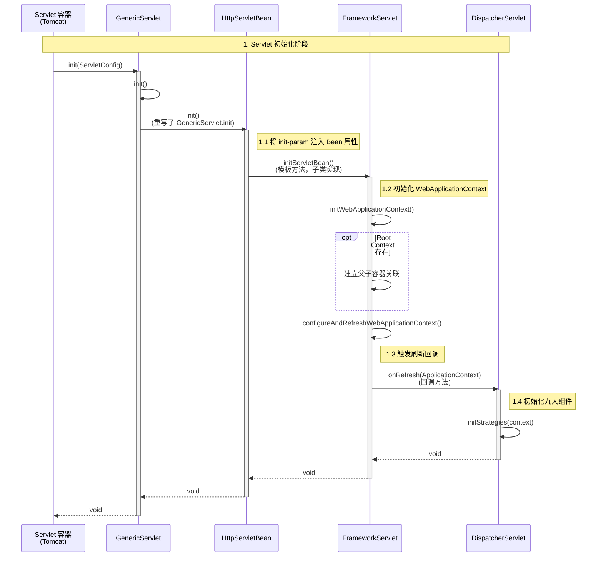

# DispatcherServlet 初始化与 onRefresh 触发流程

> **文档创建时间**：2026-01-20
> **适用版本**：Spring Framework 6.x / Spring Boot 3.x
> **前置阅读**：[00-Servlet基础.md](./00-Servlet基础.md)

---

## 📌 一、核心流程概述

`DispatcherServlet` 的初始化始于 Servlet 容器（如 Tomcat）调用其 `init()` 方法。整个调用链路利用了模板方法模式，在父类中定义骨架，在子类中实现具体逻辑。

**核心方法调用链**：
`HttpServletBean.init()` → `FrameworkServlet.initServletBean()` → `FrameworkServlet.initWebApplicationContext()` → `DispatcherServlet.onRefresh()`

---

## 📊 二、初始化时序图

下图展示了从 Servlet 容器启动到 `DispatcherServlet.onRefresh()` 被触发的完整过程。



---

## 🔍 三、源码深度剖析

### 3.1 HttpServletBean.init()
**所在包**：`org.springframework.web.servlet`
**职责**：将 `web.xml` 或注解中的 `init-param` 参数注入到 Servlet 实例的属性中。

```java
@Override
public final void init() throws ServletException {
    // 1. 将 Servlet 配置参数（init-param）封装为 PropertyValues
    PropertyValues pvs = new ServletConfigPropertyValues(getServletConfig(), this.requiredProperties);
    
    if (!pvs.isEmpty()) {
        try {
            // 2. 将参数注入到当前 Servlet 实例（BeanWrapper）
            BeanWrapper bw = PropertyAccessorFactory.forBeanPropertyAccess(this);
            ResourceLoader resourceLoader = new ServletContextResourceLoader(getServletContext());
            bw.registerCustomEditor(Resource.class, new ResourceEditor(resourceLoader, getEnvironment()));
            initBeanWrapper(bw);
            bw.setPropertyValues(pvs, true);
        }
        catch (BeansException ex) {
            // ...
        }
    }

    // 3. 调用模板方法，供子类继续初始化
    initServletBean();
}
```

### 3.2 FrameworkServlet.initServletBean()
**所在包**：`org.springframework.web.servlet`
**职责**：初始化 Web 应用上下文（WebApplicationContext）。

```java
@Override
protected final void initServletBean() throws ServletException {
    // ... 日志记录 ...
    
    try {
        // 核心：初始化 WebApplicationContext
        this.webApplicationContext = initWebApplicationContext();
        
        // 废弃的方法，通常为空
        initFrameworkServlet();
    }
    catch (ServletException | RuntimeException ex) {
        // ...
    }
}
```

### 3.3 FrameworkServlet.initWebApplicationContext()
**职责**：创建或查找 `WebApplicationContext`，设置父子关系，并刷新上下文。

```java
protected WebApplicationContext initWebApplicationContext() {
    // 1. 获取根容器（Root WebApplicationContext）作为父容器
    WebApplicationContext rootContext =
            WebApplicationContextUtils.getWebApplicationContext(getServletContext());
    
    WebApplicationContext wac = null;

    // ... 省略获取 wac 的多种方式（构造注入、属性查找等） ...

    if (wac == null) {
        // 2. 如果没有现成的，创建一个新的 WebApplicationContext
        wac = createWebApplicationContext(rootContext);
    }

    if (!this.refreshEventReceived) {
        // 3. 关键调用：刷新完成后的回调
        synchronized (this.onRefreshMonitor) {
            onRefresh(wac);
        }
    }
    
    // 4. 发布上下文刷新事件
    if (this.publishContext) {
        // PublishContext...
    }
    
    return wac;
}
```

### 3.4 DispatcherServlet.onRefresh()
**职责**：这是 `DispatcherServlet` 初始化的**高潮**。当 Spring 容器启动完成或刷新时，此方法被调用，用于初始化 MVC 的九大核心组件。

```java
@Override
protected void onRefresh(ApplicationContext context) {
    initStrategies(context);
}

/**
 * 初始化九大组件
 */
protected void initStrategies(ApplicationContext context) {
    initMultipartResolver(context);    // 文件上传解析器
    initLocaleResolver(context);       // 本地化解析器
    initThemeResolver(context);        // 主题解析器
    initHandlerMappings(context);      // 处理器映射器（核心）
    initHandlerAdapters(context);      // 处理器适配器（核心）
    initHandlerExceptionResolvers(context); // 异常解析器
    initRequestToViewNameTranslator(context); // 视图名转换器
    initViewResolvers(context);        // 视图解析器（核心）
    initFlashMapManager(context);      // FlashMap 管理器
}
```

---

## ⚡ 四、总结

`DispatcherServlet` 的 `onRefresh` 并不是凭空触发的，而是严格遵循 Servlet 生命周期，通过 Spring 封装的层级结构（`HttpServletBean` -> `FrameworkServlet`）逐步引导调用的。

1. **容器启动**：调用 `init()`
2. **属性注入**：`HttpServletBean` 处理配置参数
3. **上下文加载**：`FrameworkServlet` 加载 Spring `WebApplicationContext`
4. **组件初始化**：`DispatcherServlet.onRefresh()` 中完成 MVC 组件的装配

理解这个流程，有助于在 `DispatcherServlet` 初始化失败时（如找不到 Bean、Context 加载错误）快速定位问题所在的层级。

---

## 📚 关联阅读

- [03-DispatcherServlet源码深度解析.md](./03-DispatcherServlet源码深度解析.md)
- [04-DispatcherServlet调试指南.md](./04-DispatcherServlet调试指南.md)
