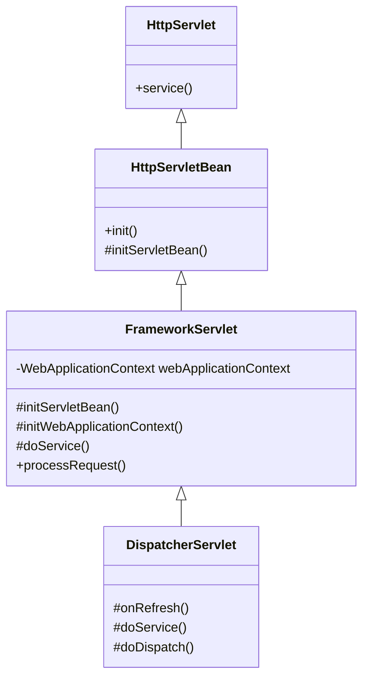
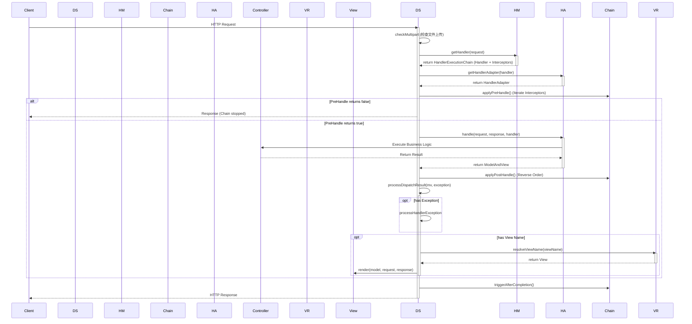

# DispatcherServlet 源码深度解析

> **文档创建时间**：2026-01-20
> **Spring Framework 版本**：6.x
> **核心类**：`org.springframework.web.servlet.DispatcherServlet`

---

## 📖 一、核心定位与类体系

**DispatcherServlet** 是 Spring Web MVC 的核心（**Front Controller**），它负责接收所有进入的 HTTP 请求，并将它们分发给具体的处理器（Controller），最后将结果通过视图解析器返回给客户端。

### 1.1 类继承图谱



- **HttpServletBean**: 这是一个简单的适配器，将 Servlet 的 `init-param`（web.xml 配置参数）注入到 Servlet 实例的 Bean 属性中。
- **FrameworkServlet**: 负责初始化 Spring 的 **WebApplicationContext**（Web 应用上下文），并将自身注册到 `ServletContext` 中。它实现了 `processRequest` 方法来统一处理 GET, POST 等请求，并为当前线程设置 LocaleContext 和 RequestAttributes。
- **DispatcherServlet**: 实现了 `onRefresh` 方法来初始化 MVC 的九大组件，并实现了 `doDispatch` 方法来控制请求分发的全流程。

---

## ⚙️ 二、初始化机制 (Initialization)

DispatcherServlet 的初始化始于 `onRefresh()` 事件。当 Spring 容器启动完毕或刷新时，会触发此方法。

### 2.1 核心入口：`initStrategies`

```java
// DispatcherServlet.java

@Override
protected void onRefresh(ApplicationContext context) {
    initStrategies(context);
}

protected void initStrategies(ApplicationContext context) {
    initMultipartResolver(context);     // 1. 文件上传解析器
    initLocaleResolver(context);        // 2. 本地化解析器
    initThemeResolver(context);         // 3. 主题解析器
    initHandlerMappings(context);       // 4. 处理器映射器（核心）
    initHandlerAdapters(context);       // 5. 处理器适配器（核心）
    initHandlerExceptionResolvers(context); // 6. 异常解析器
    initRequestToViewNameTranslator(context); // 7. 视图名转换器
    initViewResolvers(context);         // 8. 视图解析器（核心）
    initFlashMapManager(context);       // 9. FlashMap 管理器（重定向参数）
}
```

### 2.2 初始化策略 (Convention over Configuration)

Spring MVC 采用了一种灵活的 **"检测-回退"** 策略：

1. **检测 (Detect)**: 尝试从 `ApplicationContext` 中查找指定类型的 Bean（例如查找实现了 `HandlerMapping` 接口的 Bean）。
2. **回退 (Fallback)**: 如果容器中找不到，则读取 `DispatcherServlet.properties` 文件（位于 spring-webmvc 包中），使用其中定义的默认实现类。

**以 `initHandlerMappings` 为例**：

```java
private void initHandlerMappings(ApplicationContext context) {
    this.handlerMappings = null;

    if (this.detectAllHandlerMappings) {
        // 1. 从容器中查找所有 HandlerMapping 类型的 Bean
        Map<String, HandlerMapping> matchingBeans =
                BeanFactoryUtils.beansOfTypeIncludingAncestors(context, HandlerMapping.class, true, false);
        if (!matchingBeans.isEmpty()) {
            this.handlerMappings = new ArrayList<>(matchingBeans.values());
            // 2. 根据 @Order 注解或 Ordered 接口排序
            AnnotationAwareOrderComparator.sort(this.handlerMappings);
        }
    }
    
    // ... (省略按名称查找逻辑)

    // 3. 如果通过以上方式都没找到，则使用默认策略
    if (this.handlerMappings == null) {
        this.handlerMappings = getDefaultStrategies(context, HandlerMapping.class);
        if (logger.isTraceEnabled()) {
             logger.trace("No HandlerMappings declared for servlet '" + getServletName() +
                     "': using default strategies from DispatcherServlet.properties");
        }
    }
}
```

> **Properties 默认值 (DispatcherServlet.properties)**:
> ```properties
> org.springframework.web.servlet.HandlerMapping=org.springframework.web.servlet.handler.BeanNameUrlHandlerMapping,\
> org.springframework.web.servlet.mvc.method.annotation.RequestMappingHandlerMapping,\
> org.springframework.web.servlet.function.support.RouterFunctionMapping
> ```

---

## 🚀 三、请求处理流程 (Request Processing)

`doDispatch` 是 DispatcherServlet 的心脏，控制了整个请求的生命周期。

### 3.1 核心流程图



### 3.2 核心方法深度剖析 (`doDispatch`)

这是 `DispatcherServlet` 的心脏逻辑，定义了请求处理的“标准流程”。

```java
protected void doDispatch(HttpServletRequest request, HttpServletResponse response) throws Exception {
    HttpServletRequest processedRequest = request;
    HandlerExecutionChain mappedHandler = null;
    boolean multipartRequestParsed = false;

    // 获取异步管理器，用于处理 Spring MVC 的异步请求特性（如 Callable/DeferredResult）
    WebAsyncManager asyncManager = WebAsyncUtils.getAsyncManager(request);

    try {
        ModelAndView mv = null;
        Exception dispatchException = null;

        try {
            // 1. 检查是否为 Multipart 请求（文件上传）。如果是，则将 request 包装为 MultipartHttpServletRequest
            processedRequest = checkMultipart(request);
            multipartRequestParsed = (processedRequest != request);

            // 2. 核心步骤：查找 Handler（处理器 + 拦截器链）
            // 策略模式体现：遍历所有的 HandlerMapping，找到能处理当前 URL 的处理器（及其相关的拦截器链）
            mappedHandler = getHandler(processedRequest);
            if (mappedHandler == null) {
                // 如果找不到 Handler，通常会流转到 404 处理逻辑
                noHandlerFound(processedRequest, response);
                return;
            }

            // 3. 核心步骤：查找适配器。
            // 适配器模式体现：根据不同的 Handler 类型（注解方法/接口实现类）通过 ha.supports() 找到对应的执行器
            HandlerAdapter ha = getHandlerAdapter(mappedHandler.getHandler());

            // 4. 处理缓存：Last-Modified 检查。
            // 如果请求方法支持缓存且内容未变，则直接返回 304 节省响应带宽
            String method = request.getMethod();
            boolean isGet = HttpMethod.GET.matches(method);
            if (isGet || HttpMethod.HEAD.matches(method)) {
                long lastModified = ha.getLastModified(request, mappedHandler.getHandler());
                if (new ServletWebRequest(request, response).checkNotModified(lastModified) && isGet) {
                    return;
                }
            }

            // 5. 执行拦截器：preHandle 链。
            // 责任链模式体现：任何一个拦截器返回 false，都会中断后续执行流程
            if (!mappedHandler.applyPreHandle(processedRequest, response)) {
                // 如果拦截器返回 false，流程终止
                return;
            }

            // 6. 核心步骤：执行业务逻辑。真正执行 Handler（Controller 方法）
            // 返回 ModelAndView（可能是 null，例如 @ResponseBody）
            // 适配器内部会处理：参数解析(ArgumentResolver)、方法反射调用、返回值处理(ReturnValueHandler)
            mv = ha.handle(processedRequest, response, mappedHandler.getHandler());

            // 如果当前请求已开启异步处理（即开启了子线程处理业务），则主线程直接返回
            if (asyncManager.isConcurrentHandlingStarted()) {
                return;
            }

            // 如果 mv 对象中没有设置视图名，则根据请求路径推断出默认视图名（例如 /user 对应 user.jsp/html）
            applyDefaultViewName(processedRequest, mv);
            
            // 7. 执行拦截器：postHandle 链（逆序执行）。
            // 只有 handler 成功执行且未抛出异常时才会执行
            mappedHandler.applyPostHandle(processedRequest, response, mv);
        }
        catch (Exception ex) {
            dispatchException = ex; // 捕获业务执行阶段的异常
        }
        catch (Throwable err) {
            // 处理 Error（如 OOM/栈溢出），将其封装为 ServletException 以便交由异常解析器处理
            dispatchException = new ServletException("Handler dispatch failed: " + err, err);
        }
        
        // 8. 核心步骤：处理结果（视图渲染与异常显示）。
        // 渲染视图，并在这个方法的最后阶段触发所有的 afterCompletion 钩子
        // 即使上面抛出了异常，也会进入这里进行异常视图解析
        processDispatchResult(processedRequest, response, mappedHandler, mv, dispatchException);
    }
    catch (Exception ex) {
        // 兜底处理：如果在渲染过程中报错，直接通过 triggerAfterCompletion 触发清理逻辑
        triggerAfterCompletion(processedRequest, response, mappedHandler, ex);
    }
    catch (Throwable err) {
        triggerAfterCompletion(processedRequest, response, mappedHandler,
                new ServletException("Handler processing failed: " + err, err));
    }
    finally {
        // 9. 资源清理阶段
        if (asyncManager.isConcurrentHandlingStarted()) {
            // 如果是异步请求，触发拦截器的“异步处理开始”的回调
            if (mappedHandler != null) {
                mappedHandler.applyAfterConcurrentHandlingStarted(processedRequest, response);
            }
            asyncManager.setMultipartRequestParsed(multipartRequestParsed);
        }
        else {
            // 如果不是异步，或者同步流程已结束：清理文件上传时产生的临时文件/流资源
            if (multipartRequestParsed || asyncManager.isMultipartRequestParsed()) {
                // 清理 Multipart 资源
                cleanupMultipart(processedRequest);
            }
        }
    }
}
```

---

## 🔍 四、核心组件解析

### 4.1 HandlerMapping (寻路者)

负责根据请求（URL, Header, Method 等）找到对应的处理器。

- **核心方法**: `getHandler(HttpServletRequest request)`
- **返回值**: `HandlerExecutionChain` (Handler 对象 + HandlerInterceptor 列表)
- **主要实现**:
    - `RequestMappingHandlerMapping`: 处理 `@RequestMapping` 注解的方法。这是最常用的。
    - `SimpleUrlHandlerMapping`: 显式配置 URL 到 Bean 的映射。

### 4.2 HandlerAdapter (执行者)

负责调用 Handler 来处理请求。为什么需要 Adapter？因为 Handler 可以是任何对象（Function, Controller 接口, 普通 Bean 方法），DispatcherServlet 需要一个统一的接口来调用它们。

- **核心方法**: `handle(HttpServletRequest request, HttpServletResponse response, Object handler)`
- **主要实现**:
    - `RequestMappingHandlerAdapter`: 执行带有 `@RequestMapping` 的方法。它内部非常复杂，负责参数解析（`ArgumentResolver`）和返回值处理（`ReturnValueHandler`）。
    - `SimpleControllerHandlerAdapter`: 执行实现了 `Controller` 接口的 Bean。

### 4.3 ViewResolver (渲染者)

负责将逻辑视图名（String）解析为真正的 `View` 对象。

- **核心方法**: `resolveViewName(String viewName, Locale locale)`
- **主要实现**:
    - `ContentNegotiatingViewResolver`: 本身不解析，而是委托给其他 Resolver，根据 Media Type 决定使用哪个 View。
    - `InternalResourceViewResolver`: 解析 JSP 资源（例如 `/WEB-INF/views/home.jsp`）。
    - `ThymeleafViewResolver`: 解析 Thymeleaf 模板。

---

## 🏗️ 五、设计模式总结

1. **前端控制器模式 (Front Controller)**: `DispatcherServlet` 作为统一入口。
2. **策略模式 (Strategy)**: 九大组件（HandlerMapping, ViewResolver 等）都是接口，可以有多种实现策略。
3. **适配器模式 (Adapter)**: `HandlerAdapter` 使得 DispatcherServlet 可以调用各种不同类型的 Handler。
4. **责任链模式 (Chain of Responsibility)**: `HandlerExecutionChain` 中的拦截器链 (`HandlerInterceptor`)。
5. **组合模式 (Composite)**: `HandlerMethodArgumentResolverComposite` 和 `HandlerMethodReturnValueHandlerComposite` 组合了多个解析器。
6. **模板方法模式 (Template Method)**: `FrameworkServlet` 定义了 `doService`，留给子类实现；`HttpServletBean` 定义了初始化流程。

---

## 📝 六、总结

`DispatcherServlet` 的强大之处在于其**高度可扩展性**。通过 `initStrategies` 方法，它构建了一个灵活的请求处理管道。
- 如果你想改变路由规则，实现自定义 `HandlerMapping`。
- 如果你想支持新的 Controller 写法，实现自定义 `HandlerAdapter`。
- 如果你想改变参数注入方式，实现自定义 `HandlerMethodArgumentResolver`。
- 如果你想改变异常处理逻辑，实现自定义 `HandlerExceptionResolver`。

理解了 `doDispatch` 的流程，就掌握了 Spring MVC 的命脉。

---

## 附录：异步处理核心 WebAsyncManager 深度解析

在 `doDispatch` 源码中频繁出现的 `WebAsyncManager` 是 Spring MVC 处理**异步请求**（Servlet 3.0+）的核心枢纽。下面从背景、原理到源码实现深度剖析这个“幕后英雄”。

### 1. 出现的背景：从“阻塞”到“解耦”

在传统的 Servlet 2.5 规范中，Web 服务器（驱动层）采用的是 **“一个请求对应一个线程”** 的同步模型。

*   **同步时代的痛点**：若业务逻辑（如调用微服务、生成大报表）需要执行 5 秒，则负责处理该请求的 **容器线程（Worker Thread）** 就会被阻塞 5 秒。
*   **后果**：高并发下，容器线程池（通常 200 个）会迅速耗尽。即便 CPU 此时非常空闲，服务器也无法处理新请求，导致系统吞吐量呈断崖式下跌。
*   **Servlet 3.0 的救星**：引入了异步处理特性，允许 Servlet 将请求线程归还给池子，让业务在自定义线程池中跑，跑完再写回响应。

### 2. 什么是 WebAsyncManager？

它是 Spring MVC 对底层 Servlet 异步特性的**高度抽象与生命周期管家**。其本质是解决“谁来管理异步子线程与原始 HTTP 响应之间的桥梁”问题。

### 3. 四大核心职责深度剖析

#### 3.1 状态监控与线程释放 (`isConcurrentHandlingStarted`)
这是你在 `doDispatch` 中看到的最直接逻辑。当 Controller 返回 `Callable` 或 `DeferredResult` 时，`WebAsyncManager` 会标记当前处理序列已进入异步模式。此时，`DispatcherServlet` 立即 `return`，归还宝贵的容器线程。

#### 3.2 结果持有与二次派发 (Redispatch)
当异步子线程处理完数据后，它无法直接完成响应（因为它没有 `DispatcherServlet` 的上下文）。`WebAsyncManager` 会触发一次 **“再次分发（Redispatch）”**，让请求重新进入容器。
*   **注意**：第二次进入 `doDispatch` 时，它会直接带着结果走渲染流程，而不再重复执行业务代码。

#### 3.3 核心“黑科技”：上下文透传 (Context Propagation)
这是 Spring 最复杂且最人性化的设计。在异步模式下，业务逻辑运行在“另一个线程”中。
*   **挑战**：如果主线程中有用户信息（`SecurityContext`）、本地化信息（`LocaleContext`），子线程通过 `ThreadLocal` 是拿不到的。
*   **解决方案**：`WebAsyncManager` 内部维护了一组拦截器（`CallableProcessingInterceptor` 等），负责在子线程启动前将主线程的上下文“镜像”过去，执行完后再清理。

#### 3.4 屏蔽底层复杂性
Servlet 原生的 `AsyncContext` API 极其繁琐（需要手动设置监听器、处理超时、处理 Dispatch 类型）。`WebAsyncManager` 封装了这些细节，让开发者只需要关注 `DeferredResult` 这一种优雅的对象。

### 4. 源码逻辑回归 (`doDispatch`)

```java
// 执行业务 Handler 时，如果内部开启了异步 (如返回了 Callable)
mv = ha.handle(processedRequest, response, mappedHandler.getHandler());

// 询问管家：是否开启了异步模式？
if (asyncManager.isConcurrentHandlingStarted()) {
    // 关键：此时主线程立即撤退。响应并未关闭，TCP 连接保持。
    // 异步子线程在后台拼命跑，跑完后 WebAsyncManager 会叫它回来。
    return;
}
```

### 5. 开发人员如何使用？

在实际开发中，开发人员不需要直接操作 `WebAsyncManager`，而是通过 Controller 返回特定的异步类型。`WebAsyncManager` 会自动拦截并处理。

#### 方案 A：`Callable<V>` (简单轻量)
Spring MVC 会将任务提交到内部配置的 TaskExecutor 中执行。

```java
@GetMapping("/async-callable")
public Callable<String> handleCallable() {
    return () -> {
        TimeUnit.SECONDS.sleep(2); // 模拟耗时逻辑
        return "响应结果";
    };
}
```

#### 方案 B：`DeferredResult<V>` (最灵活、最推荐)
常用于外部事件驱动（如消息队列通知、长轮询）。

```java
@GetMapping("/async-deferred")
public DeferredResult<String> handleDeferred() {
    DeferredResult<String> result = new DeferredResult<>(5000L, "超时结果");
    
    // 在另一个线程（甚至不是 Spring 管理的线程）中动态设置结果
    CompletableFuture.runAsync(() -> {
        String data = service.getSlowData();
        result.setResult(data); // 触发 WebAsyncManager 的 Redispatch
    });
    
    return result;
}
```

#### 方案 C：`WebAsyncTask<V>` (可自定义超时/执行器)
是对 `Callable` 的增强封装。

```java
@GetMapping("/async-task")
public WebAsyncTask<String> handleTask() {
    Callable<String> callable = () -> "结果";
    // 显式指定 3 秒超时和超时时的默认返回
    return new WebAsyncTask<>(3000L, callable);
}
```

### 6. 什么时候该用它？
*   **推荐场景**：涉及外部 IO 调用（Feign 调微服务、DB 慢查询）、需要消息推送（长轮询）的场景。
*   **无需使用**：简单的 CRUD 或纯内存运算。

---

**总结**：`WebAsyncManager` 是 Spring 从“同步阻塞”迈向“非阻塞/响应式”架构的重要过渡。它保护了容器线程池，提高了系统在长耗时业务下的生存能力。
