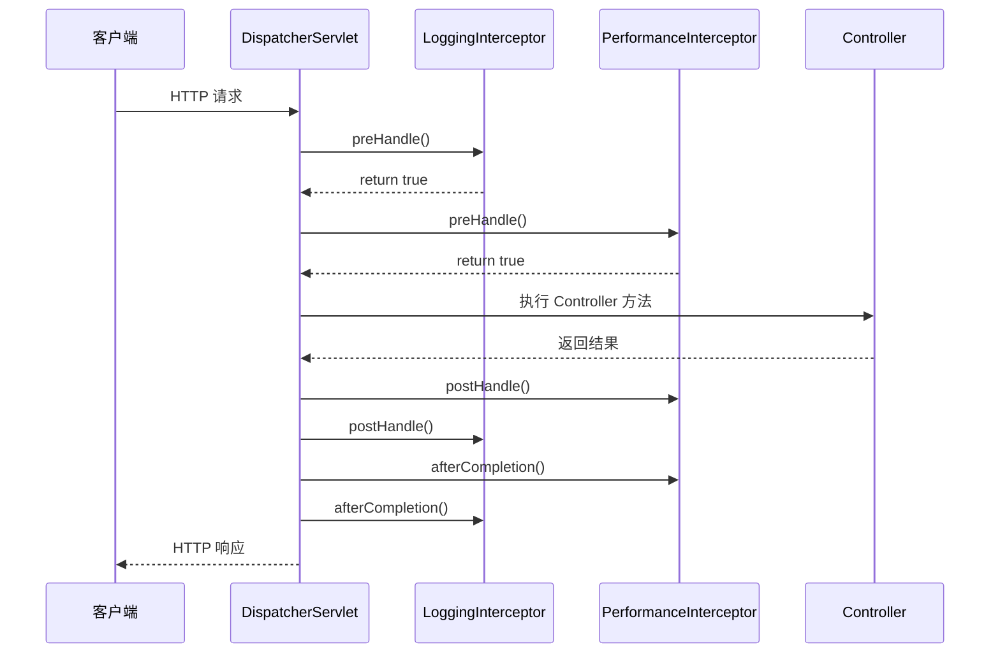

# 拦截器链调试指南

> **文档创建时间**：2026-01-20  
> **适用版本**：Spring Boot 3.5.9 / Spring Framework 6.x  
> **配套 Demo**：[LoggingInterceptor.java](../src/main/java/io/github/daihaowxg/_05_spring_web/interceptor/LoggingInterceptor.java)

---

## 📌 一、拦截器执行流程



### 执行顺序规则

| 方法 | 执行顺序 | 说明 |
|------|----------|------|
| `preHandle` | 顺序（1→2→3） | 按注册顺序执行 |
| `postHandle` | 逆序（3→2→1） | Controller 成功后才执行 |
| `afterCompletion` | 逆序（3→2→1） | 无论成功或异常都执行 |

---

## 🔍 二、核心调试断点

### 2.1 拦截器链构建

**断点位置**：`AbstractHandlerMapping.getHandler()`

```java
// AbstractHandlerMapping.getHandler() 简化版
public final HandlerExecutionChain getHandler(HttpServletRequest request) {
    Object handler = getHandlerInternal(request);
    
    // 构建 HandlerExecutionChain（包含 Handler + 拦截器链）
    HandlerExecutionChain executionChain = getHandlerExecutionChain(handler, request);
    
    return executionChain;
}
```

**观察变量**：
- `executionChain.interceptorList` — 匹配的拦截器列表

---

### 2.2 preHandle 执行

**断点位置**：`HandlerExecutionChain.applyPreHandle()`

```java
// HandlerExecutionChain.applyPreHandle() 简化版
boolean applyPreHandle(HttpServletRequest request, HttpServletResponse response) {
    for (int i = 0; i < this.interceptorList.size(); i++) {
        HandlerInterceptor interceptor = this.interceptorList.get(i);
        
        // 如果返回 false，中断执行并触发 afterCompletion
        if (!interceptor.preHandle(request, response, this.handler)) {
            triggerAfterCompletion(request, response, null);
            return false;
        }
        
        this.interceptorIndex = i;  // 记录成功执行的拦截器索引
    }
    return true;
}
```

**关键点**：
- 任一拦截器返回 `false`，后续拦截器和 Controller 都不会执行
- `interceptorIndex` 记录了成功执行的最后一个拦截器索引

---

### 2.3 postHandle 执行

**断点位置**：`HandlerExecutionChain.applyPostHandle()`

```java
// HandlerExecutionChain.applyPostHandle() 简化版
void applyPostHandle(HttpServletRequest request, HttpServletResponse response, 
                     ModelAndView mv) {
    // 逆序执行
    for (int i = this.interceptorList.size() - 1; i >= 0; i--) {
        HandlerInterceptor interceptor = this.interceptorList.get(i);
        interceptor.postHandle(request, response, this.handler, mv);
    }
}
```

**注意**：如果 Controller 抛出异常，`postHandle` 不会执行

---

### 2.4 afterCompletion 执行

**断点位置**：`HandlerExecutionChain.triggerAfterCompletion()`

```java
// HandlerExecutionChain.triggerAfterCompletion() 简化版
void triggerAfterCompletion(HttpServletRequest request, HttpServletResponse response, 
                            Exception ex) {
    // 逆序执行，只执行 preHandle 成功的拦截器
    for (int i = this.interceptorIndex; i >= 0; i--) {
        HandlerInterceptor interceptor = this.interceptorList.get(i);
        try {
            interceptor.afterCompletion(request, response, this.handler, ex);
        }
        catch (Throwable ex2) {
            logger.error("afterCompletion threw exception", ex2);
        }
    }
}
```

**关键点**：
- 无论成功或异常，都会执行
- 只执行 `preHandle` 成功的拦截器（通过 `interceptorIndex` 判断）

---

## 🧪 三、测试用例

### 3.1 正常请求测试

```bash
curl http://localhost:8080/api/users/1
```

**预期日志**：
```
【preHandle】请求开始
  ├─ 请求方法: GET /api/users/1
【postHandle】Controller 执行完成
【afterCompletion】请求完成
  ├─ 耗时: 39 ms
  ├─ 异常: 无
```

### 3.2 中断请求测试

修改 `LoggingInterceptor.preHandle()` 返回 `false`，观察后续拦截器和 Controller 是否被跳过。

---

## 📚 四、DispatcherServlet 中的调用位置

```java
// DispatcherServlet.doDispatch() 中拦截器相关代码
protected void doDispatch(...) {
    try {
        // 1. 获取 Handler（包含拦截器链）
        mappedHandler = getHandler(processedRequest);
        
        // 2. 执行 preHandle
        if (!mappedHandler.applyPreHandle(processedRequest, response)) {
            return;  // 中断请求
        }
        
        // 3. 执行 Controller
        mv = ha.handle(processedRequest, response, mappedHandler.getHandler());
        
        // 4. 执行 postHandle
        mappedHandler.applyPostHandle(processedRequest, response, mv);
    }
    catch (Exception ex) {
        dispatchException = ex;
    }
    
    // 5. 处理结果（包含 afterCompletion）
    processDispatchResult(processedRequest, response, mappedHandler, mv, dispatchException);
}
```

---

## 🎯 五、学习检验

完成本指南后，你应该能够回答：

- [ ] 拦截器的三个方法分别在什么时机执行？
- [ ] 多拦截器场景下，执行顺序是什么？
- [ ] `preHandle` 返回 `false` 会发生什么？
- [ ] Controller 抛出异常时，`postHandle` 和 `afterCompletion` 分别会执行吗？
- [ ] 如何在代码中获取拦截器列表？
