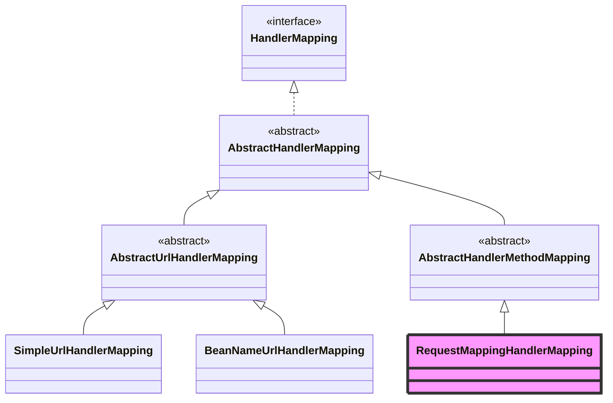

# HandlerMapping 详解

> **文档创建时间**：2026-01-20
> **适用版本**：Spring Framework 6.x / Spring Boot 3.x
> **前置阅读**：[02-DispatcherServlet属性详解.md](./02-DispatcherServlet属性详解.md)

---

## 📌 一、一句话定义

**HandlerMapping** 是 Spring MVC 的“导航仪”，它的职责是根据当前请求（URL、Method、Header 等）找到最合适的**处理器（Handler）**，并将其与相关的**拦截器（Interceptors）**封装在一起返回。

---

## 🏗️ 二、核心接口与返回值

### 2.1 HandlerMapping 接口
核心方法只有一个：

```java
public interface HandlerMapping {
    // 根据请求返回处理执行链
    @Nullable
    HandlerExecutionChain getHandler(HttpServletRequest request) throws Exception;
}
```

### 2.2 HandlerExecutionChain (执行链)
`HandlerMapping` 并不只返回一个 `Object handler`，而是返回一个包装类：

```java
public class HandlerExecutionChain {
    private final Object handler; // 真正的处理器（如 HandlerMethod）
    private final List<HandlerInterceptor> interceptorList; // 匹配该请求的拦截器链
    // ...
}
```

---

## 🔍 三、继承体系

Spring 提供了多种 `HandlerMapping` 实现，以支持不同的映射方式（注解、配置文件等）。



### 3.1 核心实现类

| 实现类 | 映射依据 | 说明 |
| :--- | :--- | :--- |
| **RequestMappingHandlerMapping** | `@RequestMapping` 注解 | **最重要的实现**，用于处理所有 Controller 中的注解映射。 |
| **SimpleUrlHandlerMapping** | 配置的 URL 映射 | 常用于静态资源映射（如 `ResourceHttpRequestHandler`）。 |
| **BeanNameUrlHandlerMapping** | Bean 的名称 | 将以 `/` 开头的 Bean 名称作为 URL 进行映射。 |
| **RouterFunctionMapping** | 函数式路由 | 支持 WebMvc.fn 函数式编程模型。 |

---

## ⚙️ 四、工作原理：RequestMappingHandlerMapping

这是我们最常用的映射器，它的工作分为两个阶段：**注册阶段**与**匹配阶段**。

### 1. 注册阶段 (探测与扫描)
在 `HandlerMapping` bean 初始化时（`afterPropertiesSet`）：
1. 扫描 Spring 容器中所有的 Bean。
2. 筛选带有 `@Controller` 或 `@RequestMapping` 注解的类。
3. 解析方法上的 `@RequestMapping` 内容，封装为 `RequestMappingInfo` 对象。
4. 将 `RequestMappingInfo` 与对应的 `HandlerMethod`（包含类名和方法名）存入内存中的 **Registry (Map)**。

### 2. 匹配阶段 (查找)
当请求请求到达 `doDispatch` 时：
1. 遍历所有的 `HandlerMapping`（通常按优先级顺序）。
2. 调用 `getHandler(request)`。
3. 在内存 Registry 中根据 URL、Method 等属性查找匹配的 `RequestMappingInfo`。
4. 如果找到，查找该 URL 对应的所有拦截器。
5. 返回 `HandlerExecutionChain`。

---

## 🔗 五、HandlerMapping 与拦截器

`HandlerMapping` 的另一个重要职责是**查找拦截器**投影。

在 `AbstractHandlerMapping` 中：
- 内部维护了一个 `interceptors` 列表。
- 这些拦截器通过 `WebMvcConfigurer.addInterceptors` 注册。
- 当匹配到 Handler 后，`HandlerMapping` 会根据配置的 `PathPattern` 过滤出适用于当前 URL 的拦截器，塞进 `HandlerExecutionChain`。

---

## 🧪 六、调试技巧

### 6.1 如何查看系统中所有的映射？
可以通过调试 `DispatcherServlet` 的 `handlerMappings` 属性，或者在启动日志中观察：

```text
Mapped URL [/api/users/{id}] onto public User UserController.getUser(Long)
```

### 6.2 关键断点建议
- `AbstractHandlerMapping.getHandler`: 请求进入映射器的总入口。
- `AbstractHandlerMethodMapping.lookupHandlerMethod`: 注解映射的具体查找逻辑。

---

## 🎯 七、学习检验

- [ ] 为什么 `HandlerMapping` 返回的是 `HandlerExecutionChain` 而不是 `Handler`？
- [ ] 系统中有多个 `HandlerMapping` 时，顺序是怎样的？（提示：`Ordered` 接口）
- [ ] 静态资源的请求（如 `/static/logo.png`）是由哪个 `HandlerMapping` 处理的？
- [ ] 如果同一个 URL 被两个不同的 Controller 方法配置了，会发生什么？（提示：`AmbiguousMappingException`）

---

## 📚 下一步建议

- [03-DispatcherServlet源码深度解析.md](./03-DispatcherServlet源码深度解析.md) —— 查看映射器在主流程中是如何被调用的。
- [07-HandlerAdapter详解.md](./07-HandlerAdapter详解.md) —— 了解找到处理器后，如何适配并执行它。
