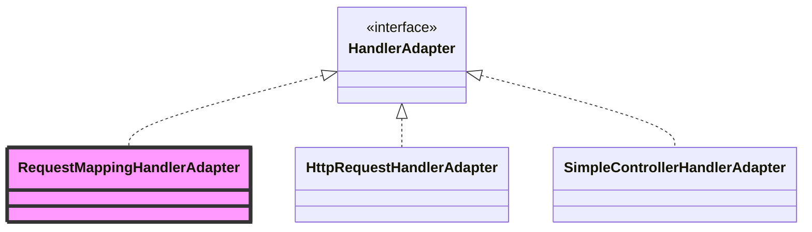

# HandlerAdapter 详解

> **文档创建时间**：2026-01-20
> **适用版本**：Spring Framework 6.x / Spring Boot 3.x
> **前置阅读**：[06-HandlerMapping详解.md](./06-HandlerMapping详解.md)

---

## 📌 一、一句话定义

**HandlerAdapter** 是 Spring MVC 的“执行器”，它的职责是解耦 `DispatcherServlet` 与各种不同类型的**处理器（Handler）**。它利用**适配器模式**，使得 DispatcherServlet 可以用统一的方式调用任何类型的 Handler（如注解方法、接口实现类、甚至是一个函数）。

---

## 🏗️ 二、为什么需要适配器？

在 Spring MVC 中，`HandlerMapping` 找到的 `handler` 可能是：
1. **HandlerMethod**：带有 `@RequestMapping` 的方法（最常见）。
2. **Controller 接口实现子类**：实现了 `org.springframework.web.servlet.mvc.Controller` 接口。
3. **HttpRequestHandler 实现子类**：处理原生 Servlet 请求的类。
4. **Servlet 实例**：直接作为 Handler 使用。

由于这些 Handler 的调用方式完全不同（有的直接调方法，有的调 `handleRequest`），`DispatcherServlet` 不可能通过 `if-else` 去硬编码调用逻辑。因此，它为每种 Handler 准备了一个专用的“转换头”——也就是 **HandlerAdapter**。

---

## 🔍 三、核心接口定义

```java
public interface HandlerAdapter {
    // 1. 判断是否支持该类型的 Handler
    boolean supports(Object handler);

    // 2. 执行 Handler 并返回结果封装对象
    @Nullable
    ModelAndView handle(HttpServletRequest request, HttpServletResponse response, Object handler) throws Exception;

    // 3. 获取上次修改时间（通常返回 -1）
    long getLastModified(HttpServletRequest request, Object handler);
}
```

---

## 📊 四、继承体系与核心实现



### 4.1 三大核心实现类

| 实现类 | 适配的 Handler 类型 | 说明 |
| :--- | :--- | :--- |
| **RequestMappingHandlerAdapter** | `HandlerMethod` | **核心之重**。负责处理 `@RequestMapping`。它是 Spring MVC 中最复杂的组件之一，集成了参数解析和返回值处理流程。 |
| **HttpRequestHandlerAdapter** | `HttpRequestHandler` 实现类 | 用于处理静态资源请求（如 `DefaultServletHttpRequestHandler`）。 |
| **SimpleControllerHandlerAdapter** | `Controller` 接口实现类 | 兼容老版本基于接口形式的控制器。 |

---

## ⚙️ 五、深度剖析：RequestMappingHandlerAdapter

这是最核心的适配器，它的执行流程实际上是一条**处理流水线**：

### 1. 参数解析 (Argument Resolvers)
在调用任务方法前，适配器会遍历所有的 `HandlerMethodArgumentResolver`，根据方法参数上的注解（如 `@RequestParam`, `@RequestBody`, `@PathVariable`）从请求中提取并转换数据。

### 2. 业务调用
通过反射机制执行具体的 Controller 方法。

### 3. 返回值处理 (Return Value Handlers)
执行完方法后，根据返回值的类型（如 `String`, `ModelAndView`, 或带有 `@ResponseBody` 的对象），遍历所有的 `HandlerMethodReturnValueHandler` 进行处理（如视图解析、JSON 序列化）。

---

## 🔗 六、HandlerAdapter 的选择过程

在 `DispatcherServlet.doDispatch()` 中，适配器的选择逻辑如下：

```java
protected HandlerAdapter getHandlerAdapter(Object handler) throws ServletException {
    if (this.handlerAdapters != null) {
        for (HandlerAdapter adapter : this.handlerAdapters) {
            // 依次询问每个适配器：你支持这个 Handler 吗？
            if (adapter.supports(handler)) {
                return adapter;
            }
        }
    }
    throw new ServletException("No adapter for handler [" + handler + "]");
}
```

---

## 🧪 七、调试建议

### 7.1 观察适配器列表
在 `DispatcherServlet` 初始化或执行时，观察 `handlerAdapters` 变量。Spring Boot 默认会注册以上提到的三种适配器。

### 7.2 关键断点
- `DispatcherServlet.getHandlerAdapter`: 观察选择特定适配器的过程。
- `RequestMappingHandlerAdapter.invokeHandlerMethod`: 注解方法执行的核心入口。
- `ServletInvocableHandlerMethod.invokeAndHandle`: 参数解析与返回值处理的汇合点。

---

## 🎯 八、学习检验

- [ ] 为什么要使用“适配器模式”而不是直接在 `DispatcherServlet` 中调用？
- [ ] `@RequestBody` 对应的解析是在哪一类组件中完成的？（提示：`ArgumentResolver`）
- [ ] 如果我实现了一个实现了 `Controller` 接口的类，应该由哪个适配器来运行？
- [ ] 为什么 `handle` 方法返回的是 `ModelAndView`？对于 `@ResponseBody` 标记的方法，这个 `ModelAndView` 会是什么样子的？（提示：null）

---

## 📚 下一步建议

- [08-参数解析与返回值处理详解.md](./08-参数解析与返回值处理详解.md) —— 深入了解 `RequestMappingHandlerAdapter` 内部的流水线细节。
