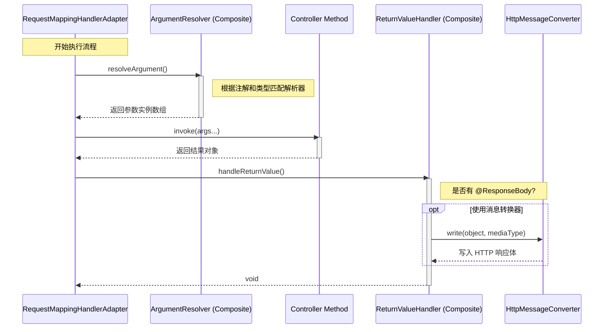

# 参数解析与返回值处理详解

> **文档创建时间**：2026-01-20
> **适用版本**：Spring Framework 6.x / Spring Boot 3.x
> **前置阅读**：[07-HandlerAdapter详解.md](./07-HandlerAdapter详解.md)

---

## 📌 一、一句话定义

在 `RequestMappingHandlerAdapter` 的执行流水线中，**参数解析器（ArgumentResolver）**负责将 HTTP 请求数据转换为方法参数对象，而**返回值处理器（ReturnValueHandler）**负责将方法返回的对象转换为 HTTP 响应数据。

它们是 Spring MVC 实现灵活注解驱动（如 `@RequestParam`, `@RequestBody`, `@ResponseBody`）的核心功臣。

---

## 🏗️ 二、参数解析器：HandlerMethodArgumentResolver

### 2.1 接口定义
每一个参数解析器都需要实现两个方法：

```java
public interface HandlerMethodArgumentResolver {
    // 1. 判断是否支持该参数（根据参数类型、注解等）
    boolean supportsParameter(MethodParameter parameter);

    // 2. 实际解析参数，从 request 中提取数据并转换
    @Nullable
    Object resolveArgument(MethodParameter parameter, @Nullable ModelAndViewContainer mavContainer,
                           NativeWebRequest webRequest, @Nullable WebDataBinderFactory binderFactory) throws Exception;
}
```

### 2.2 核心实现类

| 实现类 | 匹配的注解 / 类型 | 说明 |
| :--- | :--- | :--- |
| **RequestParamMethodArgumentResolver** | `@RequestParam` | 从 URL 查询参数或表单中取值。 |
| **PathVariableMethodArgumentResolver** | `@PathVariable` | 从 URI 模板变量中取值。 |
| **RequestResponseBodyMethodProcessor** | `@RequestBody` | **核心**。通过消息转换器（Jackson 等）读取请求体。 |
| **ServletRequestMethodArgumentResolver**| `HttpServletRequest`, `HttpSession` | 直接注入原生的 Servlet API 对象。 |

---

## 🏗️ 三、返回值处理器：HandlerMethodReturnValueHandler

### 3.1 接口定义

```java
public interface HandlerMethodReturnValueHandler {
    // 1. 判断是否支持该返回值类型
    boolean supportsReturnType(MethodParameter returnType);

    // 2. 处理返回值（如写入响应体、设置视图名等）
    void handleReturnValue(@Nullable Object returnValue, MethodParameter returnType,
                           ModelAndViewContainer mavContainer, NativeWebRequest webRequest) throws Exception;
}
```

### 3.2 核心实现类

| 实现类 | 匹配条件 | 说明 |
| :--- | :--- | :--- |
| **RequestResponseBodyMethodProcessor** | `@ResponseBody` | **核心**。通过消息转换器将对象序列化为 JSON/XML 写入输出流。 |
| **ViewNameMethodReturnValueHandler** | `String` 返回值 | 将返回的字符串视作逻辑视图名。 |
| **ModelAndViewMethodReturnValueHandler**| `ModelAndView` | 处理经典的 MVC 模型视图对象。 |
| **HttpHeadersReturnValueHandler** | `HttpHeaders` | 只返回响应头而不包含体。 |

---

## ⚙️ 四、核心机制：组合模式与消息转换

### 4.1 组合模式 (Composite)
Spring 并不是简单地循环遍历列表，而是使用了**组合模式**：
- `HandlerMethodArgumentResolverComposite`
- `HandlerMethodReturnValueHandlerComposite`

这两个类会在内部缓存“哪个参数由哪个解析器处理”的映射关系，从而提高查找性能。

### 4.2 消息转换器 (HttpMessageConverter)
对于 JSON 交互（前后端分离常用），`RequestResponseBodyMethodProcessor` 本身不负责具体的序列化，而是委托给 **HttpMessageConverter** 列表。它会根据请求头的 `Content-Type` 和 `Accept` 来决定使用哪个转换器（如 Jackson, Gson, Protobuf）。

---

## 📊 五、执行全景图



---

## 🧪 六、调试建议

### 6.1 常用断点
- `HandlerMethodArgumentResolverComposite.getArgumentResolver`: 观察 Spring 是如何为你的参数挑选“导游”的。
- `HandlerMethodReturnValueHandlerComposite.selectHandler`: 观察返回值是如何被分类处理的。
- `AbstractMessageConverterMethodProcessor.writeWithMessageConverters`: 调试 JSON 序列化时的内容协商逻辑。

### 6.2 观察变量
在调试 `RequestMappingHandlerAdapter` 时，可以查看 `argumentResolvers` 和 `returnValueHandlers` 属性，查看当前系统中注册的所有处理器（Spring Boot 默认会注册 30 个左右）。

---

## 🎯 七、学习检验

- [ ] 为什么 `RequestResponseBodyMethodProcessor` 既实现了参数解析又实现了返回值处理？
- [ ] 如果一个方法参数没有任何注解，Spring 会默认用什么解析器？（提示：`ModelAttributeMethodProcessor` 或直接报错）
- [ ] 什么是“内容协商 (Content Negotiation)”？它是通过哪个组件完成的？
- [ ] 如何自定义一个参数解析器来自动注入当前登录用户？

---

## 📚 下一步建议

- [09-ViewResolver与视图渲染详解.md](./09-ViewResolver与视图渲染详解.md) —— 了解非 `@ResponseBody` 场景下，页面是如何跳转并渲染的。
