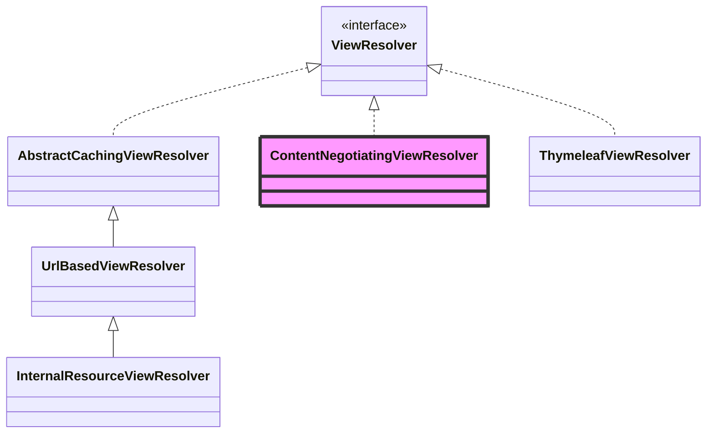
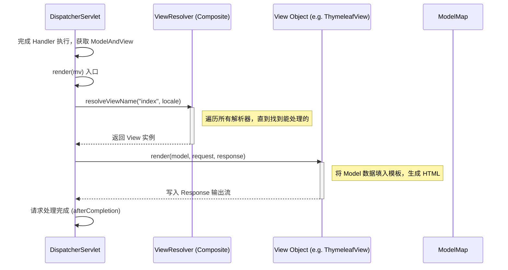

# ViewResolver 与视图渲染详解

> **文档创建时间**：2026-01-20
> **适用版本**：Spring Framework 6.x / Spring Boot 3.x
> **前置阅读**：[08-参数解析与返回值处理详解.md](./08-参数解析与返回值处理详解.md)

---

## 📌 一、一句话定义

**ViewResolver（视图解析器）** 的职责是将逻辑视图名（如 `"user/profile"`）解析为物理视图对象（**View**）；而 **View** 本身负责根据模型数据（Model）进行页面渲染并生成 HTTP 响应。

在前后端分离的今天，虽然使用的频率不如 `@ResponseBody` 高，但在处理模板引擎（Thymeleaf, FreeMarker）或内容协商时仍然是核心组件。

---

## 🏗️ 二、核心接口：ViewResolver 与 View

### 2.1 ViewResolver (解析器)
负责“找页面”。

```java
public interface ViewResolver {
    // 根据视图名和本地化信息解析出 View 对象
    @Nullable
    View resolveViewName(String viewName, Locale locale) throws Exception;
}
```

### 2.2 View (视图)
负责“画页面”。

```java
public interface View {
    // 获取 Content-Type（如 text/html）
    @Nullable
    default String getContentType() { return null; }

    // 执行渲染逻辑
    void render(@Nullable Map<String, ?> model, HttpServletRequest request, HttpServletResponse response) throws Exception;
}
```

---

## 🔍 三、继承体系与核心实现

### 3.1 核心实现类图



### 3.2 常见实现类说明

| 实现类 | 说明 |
| :--- | :--- |
| **InternalResourceViewResolver** | 用于 JSP 视图。通过拼接前缀（prefix）和后缀（suffix）查找 `WEB-INF` 下的资源。 |
| **ThymeleafViewResolver** | Spring Boot 3.x 推荐。用于解析 Thymeleaf 模板。 |
| **ContentNegotiatingViewResolver** | **最重要的管理器**。它是组合模式的体现，不直接解析视图，而是根据 Media Type（JSON, HTML, XML）挑选最合适的解析器。 |
| **BeanNameViewResolver** | 将视图名当作 Bean 名称，去容器中查找 View 类型的 Bean（常用于下载、Excel 导出）。 |

---

## ⚙️ 四、视图处理完整流程

当 `HandlerAdapter` 执行完成后，如果返回值不是处理响应体（即不是 `@ResponseBody`），流程会流转到 `DispatcherServlet.processDispatchResult`。

### 📊 渲染时序图



---

## ⚖️ 五、核心机制：内容协商 (Content Negotiation)

**ContentNegotiatingViewResolver** 是目前最常用的解析器，它实现了一套“择优录取”的机制：

1. **获取期望类型**：根据请求头 `Accept`、URL 后缀或请求参数（如 `?format=json`）确定客户端想要的媒体类型。
2. **获取候选视图**：调用其他所有 `ViewResolver` 尝试解析出 `View` 对象列表。
3. **匹配最优解**：对比 `Accept` 类型与各 `View` 支持的 `ContentType`，返回最匹配的一个。

> **提示**：这也是为什么即便方法返回 `ModelAndView`，你依然可以得到 JSON 响应的原因（如果配置了 MappingJackson2JsonView）。

---

## 🧪 六、调试建议

### 6.1 关键断点
- `DispatcherServlet.processDispatchResult`: 处理 Handler 返回结果的总入口。
- `DispatcherServlet.resolveViewName`: 查找视图解析器的逻辑。
- `ContentNegotiatingViewResolver.getBestView`: 内容协商的核心筛选逻辑。
- `AbstractView.render`: 物理渲染之前的准备逻辑。

### 6.2 观察变量
- 观察 `mv` (ModelAndView) 对象中的 `view` (视图名) 和 `model` (数据)。
- 在 `DispatcherServlet` 中观察 `viewResolvers` 列表的顺序及包含的解析器。

---

## 🎯 七、学习检验

- [ ] 视图解析器中的 `prefix`（前缀）和 `suffix`（后缀）是如何工作的？
- [ ] 为什么在 Spring Boot 3.x 项目中很难找到 `InternalResourceViewResolver`？（提示：默认推荐 Thymeleaf）
- [ ] 既然已经有了 `ViewResolver`，为什么还需要 `ContentNegotiatingViewResolver`？
- [ ] 如果一个方法返回了字符串 `"redirect:/home"`，底层执行的是视图渲染还是 Servlet 重定向？

---

## 📚 下一步建议

- [10-ExceptionResolver异常处理详解.md](./10-ExceptionResolver异常处理详解.md) —— 学习当流程中抛出异常时，Spring 是如何兜底并展示错误页面的。
