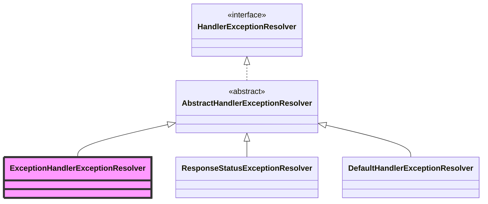
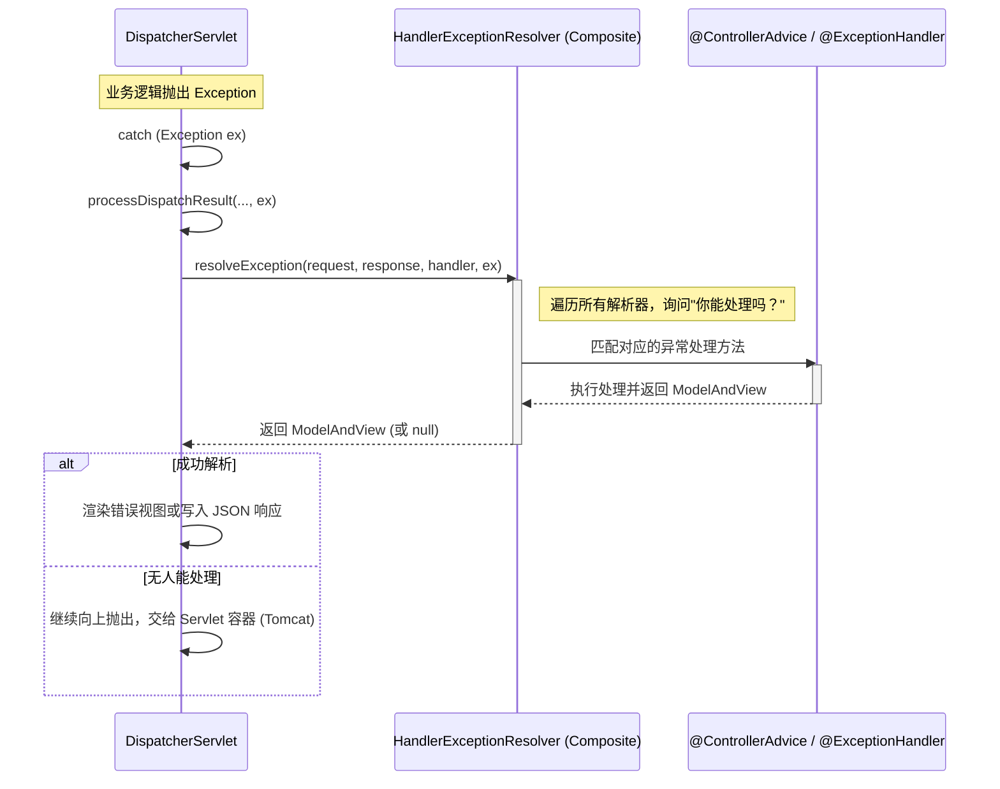

# ExceptionResolver 异常处理详解

> **文档创建时间**：2026-01-20
> **适用版本**：Spring Framework 6.x / Spring Boot 3.x
> **前置阅读**：[09-ViewResolver与视图渲染详解.md](./09-ViewResolver与视图渲染详解.md)

---

## 📌 一、一句话定义

**HandlerExceptionResolver** 是 Spring MVC 的“后勤保障部”，它的职责是捕获在请求处理流程（映射、适配、执行、渲染）中抛出的任何异常，并尝试将其转换为可读的错误页面（ModelAndView）或错误响应体（如 JSON）。

---

## 🏗️ 二、核心接口：HandlerExceptionResolver

```java
public interface HandlerExceptionResolver {
    // 根据异常信息，解析出一个 ModelAndView（可以是错误页或 JSON）
    @Nullable
    ModelAndView resolveException(
            HttpServletRequest request, HttpServletResponse response, 
            @Nullable Object handler, Exception ex);
}
```

---

## 🔍 三、继承体系与核心实现

Spring 默认提供了一套组合拳来处理不同类型的异常。



### 3.1 三大核心实现类

| 实现类 | 触发条件 | 说明 |
| :--- | :--- | :--- |
| **ExceptionHandlerExceptionResolver** | `@ExceptionHandler` 注解 | **最核心实现**。负责处理 `@ControllerAdvice` 或 Controller 内部由该注解定义的方法。 |
| **ResponseStatusExceptionResolver** | `@ResponseStatus` 注解 | 处理带有该注解的自定义异常，并将其映射为 HTTP 状态码。 |
| **DefaultHandlerExceptionResolver** | 标准 Spring MVC 异常 | 处理 Spring 内部定义的标准异常（如 `HttpRequestMethodNotSupportedException` 405 错误）。 |

---

## ⚙️ 四、异常处理完整流程

当 `doDispatch` 中的逻辑抛出异常时，`DispatcherServlet` 会接管控制权。

### 📊 异常处理时序图



---

## 🔗 五、@ControllerAdvice 的原理

`ExceptionHandlerExceptionResolver` 在初始化时会：
1. 扫描容器中所有带有 `@ControllerAdvice` 注解的 Bean。
2. 提取这些 Bean 中所有带有 `@ExceptionHandler` 注解的方法。
3. 在 `resolveException` 时，根据抛出的异常类型（如 `ChildException`）在内存中查找最匹配的处理方法（遵循 Java 继承最近原则）。

---

## 🧪 六、调试建议

### 6.1 关键断点
- `DispatcherServlet.processDispatchResult`: 查看异常是如何被捕获并传给处理逻辑的。
- `HandlerExceptionResolverComposite.resolveException`: 观察多个解析器的遍历过程。
- `ExceptionHandlerExceptionResolver.getExceptionHandlerMethod`: 调试 `@ExceptionHandler` 方法的匹配过程（排查为什么没进你的全局异常处理器）。

### 6.2 常见问题排查
- **404 错误**：默认情况下，404 不会抛出异常，因此不进 ExceptionResolver。若需处理，需设置 `spring.mvc.throw-exception-if-no-handler-found=true`。
- **异常被覆盖**：检查是否有多个 `@ControllerAdvice` 存在竞态条件。

---

## 🎯 七、学习检验

- [ ] 为什么全局异常处理器通常返回 `ResponseEntity` 也能被处理？（提示：`ExceptionHandlerExceptionResolver` 内部集成了返回值处理器）
- [ ] 如果异常发生在 Filter 中，`HandlerExceptionResolver` 能捕获到吗？
- [ ] 当 `resolveException` 返回 `null` 时，Spring MVC 会怎么处理？
- [ ] 什么是 `/error` 端点？它和 `HandlerExceptionResolver` 有什么关系？（提示：这是 Spring Boot 提供的 BasicErrorController 兜底机制）

---

## 📚 下一步建议

- [11-Spring Boot Web自动配置原理详解.md](./11-Spring Boot Web自动配置原理详解.md) —— 跳出 MVC 组件细节，看 Spring Boot 是如何通过条件注解将这些精妙设计的组件自动装配到容器中的。
