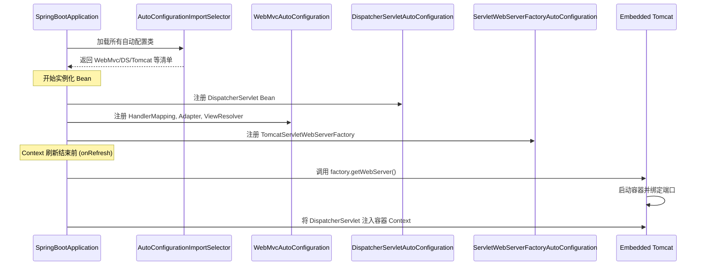

# Spring Boot Web 自动配置原理详解

> **文档创建时间**：2026-01-20
> **适用版本**：Spring Boot 3.5.9 / Spring Framework 6.x
> **前置阅读**：[10-ExceptionResolver异常处理详解.md](./10-ExceptionResolver异常处理详解.md)

---

## 📌 一、一句话定义

**Spring Boot Web 自动配置**是通过一系列 `@AutoConfiguration` 类和条件注解（`@ConditionalOnXXX`），在应用启动时自动向容器中注册 `DispatcherServlet`、容器工厂以及 Spring MVC 核心组件（Mapping, Adapter, Resolver 等）的机制。

它让我们能以“零配置”启动一个功能完整的 Web 服务。

---

## 🏗️ 二、核心配置源：AutoConfiguration.imports

在 Spring Boot 3.x 中，自动配置类的列表不再维护在 `spring.factories` 中，而是位于：
`META-INF/spring/org.springframework.boot.autoconfigure.AutoConfiguration.imports`

**与 Web 相关的核心配置类**：
- `DispatcherServletAutoConfiguration`：注册 `DispatcherServlet`。
- `WebMvcAutoConfiguration`：配置 HandlerMapping、Adapter、消息转换器等。
- `ServletWebServerFactoryAutoConfiguration`：配置嵌入式 Tomcat/Jetty。
- `HttpEncodingAutoConfiguration`：配置字符编码过滤器。

---

## 🔍 三、三大核心自动配置流程

### 1. 注册 DispatcherServlet
由 `DispatcherServletAutoConfiguration` 负责。

- **DispatcherServlet Bean**：创建一个名为 `dispatcherServlet` 的 Bean。
- **Registration Bean**：创建一个 `DispatcherServletRegistrationBean`，负责将上面的 Servlet 注册到 Servlet 容器，并映射到 `/` 路径。

> **条件控制**：使用了 `@ConditionalOnClass(DispatcherServlet.class)`，确保只有在 Classpath 下有 MVC 依赖时才触发。

### 2. 配置 MVC 核心组件
由 `WebMvcAutoConfiguration` 负责。这是一个极其庞大的配置类，它采用“自适应”策略：

- **内容协商**：自动注册 `ContentNegotiationManager`。
- **静态资源**：自动配置 `/static`, `/public`, `/resources` 等路径的映射。
- **默认转换器**：自动注册 Jackson、String、ByteArray 等 `HttpMessageConverter`。
- **欢迎页**：自动查找 `index.html`。

> **核心原则：不破坏用户自定义**。大量使用 `@ConditionalOnMissingBean`。如果你自己定义了 `ViewResolver`，Spring Boot 就不再自动创建默认的。

### 3. 创建与启动嵌入式容器
由 `ServletWebServerFactoryAutoConfiguration` 及其关联类触发。

- **工厂创建**：根据 Classpath 下的类（如 `Tomcat.class`）自动创建一个 `TomcatServletWebServerFactory`。
- **Context 刷新**：在 `ServletWebServerApplicationContext` 刷新（Refresh）过程中，会调用 `createWebServer()`，此时才会真正启动 Tomcat 并打开 8080 端口。

---

## 📊 四、Web 自动配置全景时序图



---

## ⚙️ 五、如何开启和关闭自动配置？

### 5.1 修改默认行为 (WebMvcConfigurer)
这是最推荐的方式。通过实现 `WebMvcConfigurer` 接口，可以在保留自动配置的基础上增量修改（如添加拦截器、跨域配置）。

```java
@Configuration
public class MyMvcConfig implements WebMvcConfigurer {
    @Override
    public void addInterceptors(InterceptorRegistry registry) {
        // 增量添加
    }
}
```

### 5.2 全盘接管 (@EnableWebMvc)
如果你在配置类上加上了 `@EnableWebMvc` 注解，`WebMvcAutoConfiguration` 上的 `@ConditionalOnMissingBean(WebMvcConfigurationSupport.class)` 将不再满足，**所有的 Web 自动配置将失效**，你需要手动配置所有组件。

---

## 🧪 六、调试建议

### 6.1 查看自动配置报告
启动应用时加上 `--debug` 属性，或者查看 `ConditionEvaluationReport`。
- **Positive matches**：生效的配置及其原因。
- **Negative matches**：未生效的配置（通常因为缺少某些类或用户已自定义 Bean）。

### 6.2 关键断点
- `AutoConfigurationImportSelector.getAutoConfigurationEntry`：查看加载了哪些配置类。
- `WebMvcAutoConfiguration.WebMvcAutoConfigurationAdapter`：查看具体的 MVC 组件装配逻辑。
- `ServletWebServerApplicationContext.onRefresh()`：查看嵌入式服务器启动的起点。

---

## 🎯 七、学习检验

- [ ] Spring Boot 3.x 自动配置文件的路径是什么？
- [ ] 为什么加上 `@EnableWebMvc` 会导致自动配置失效？
- [ ] 若想修改 Tomcat 的端口，有哪几种方式？（配置文件、WebServerFactoryCustomizer）
- [ ] `DispatcherServlet` 是在什么时候被放入 Tomcat 容器的？

---

## 📚 总结

至此，您已经完成了从 **Servlet 基础** 到 **Spring MVC 核心架构**，再到 **Spring Boot 自动配置** 的全链路源码学习。

本系列文档构建了完整的 Web 开发底层知识图谱。建议接下来的延伸学习方向：

1. **[12-WebMvcConfigurer 详解](./12-WebMvcConfigurer详解.md)**：这是日常开发中最常用的接口，掌握它能让你自如地扩展 Spring MVC。
2. **源码实战**：按照规划手动实现一个自定义的 `ArgumentResolver`。
3. **性能优化**：研究 Tomcat 参数调优与异步 Servlet 机制。
4. **安全集成**：深入分析 Spring Security 的过滤器链原理。
