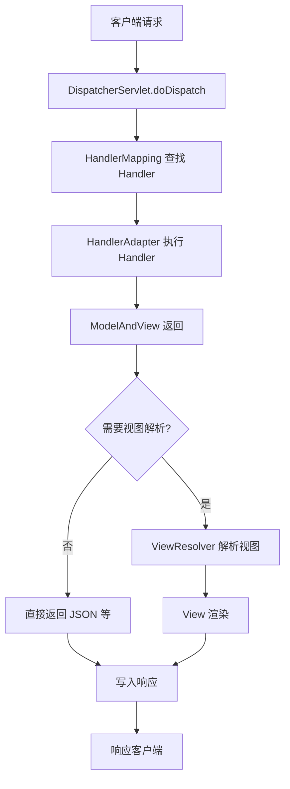

# Spring Web 源码学习规划

> **文档创建时间**：2026-01-18  
> **Spring Boot 版本**：3.5.9  
> **Java 版本**：25  
> **学习深度**：源码级别深度分析  
> **实践形式**：Demo 应用 + 源码调试

---

## 📌 一、学习目标

通过深入阅读 Spring Web 和 Spring Boot Web 自动配置源码，掌握以下核心能力：

1. **理解 Spring Web MVC 架构设计**
   - 掌握 DispatcherServlet 的初始化流程和请求处理机制
   - 理解 HandlerMapping、HandlerAdapter、ViewResolver 等核心组件的协作关系

2. **掌握 Spring Boot Web 自动配置原理**
   - 理解 `spring-boot-starter-web` 的自动配置类加载机制
   - 掌握嵌入式容器（Tomcat/Jetty）的启动和集成原理

3. **熟悉 Spring Web MVC 核心扩展点**
   - 拦截器（Interceptor）机制
   - 异常处理（ExceptionResolver）机制
   - 参数解析（ArgumentResolver）和返回值处理（ReturnValueHandler）机制

4. **对比 Spring Boot 3.x 与旧版本的差异**
   - Spring Boot 3.x 基于 Jakarta EE 9+ 的变化
   - Spring 6.x 对 Spring Web MVC 的改进和优化

---

## 🗂️ 二、知识体系划分

### 模块一：Spring Web MVC 基础架构

**核心类**：
- `DispatcherServlet` - 前端控制器
- `HandlerMapping` - 处理器映射器
- `HandlerAdapter` - 处理器适配器
- `ViewResolver` - 视图解析器
- `ModelAndView` - 模型与视图封装

**学习重点**：
- DispatcherServlet 的初始化流程（`onRefresh()` 方法）
- 请求处理的九大组件初始化机制
- 请求处理流程（`doDispatch()` 方法）

**版本差异**：
> [!IMPORTANT]
> Spring 6.x（Spring Boot 3.x）将 `javax.servlet.*` 替换为 `jakarta.servlet.*`，所有 Servlet API 相关代码需要更新包名。

---

### 模块二：DispatcherServlet 请求处理流程

**核心流程**：


**源码阅读清单**：
1. `DispatcherServlet.doDispatch()` - 请求分发主流程
2. `HandlerExecutionChain` - 拦截器链执行
3. `RequestMappingHandlerMapping.getHandler()` - 查找 @RequestMapping 映射
4. `RequestMappingHandlerAdapter.handleInternal()` - 执行控制器方法
5. `ServletInvocableHandlerMethod.invokeAndHandle()` - 方法调用与返回值处理

**Demo 实践**：
- 创建自定义拦截器，调试拦截器链执行流程
- 通过断点跟踪完整的请求处理链路

---

### 模块三：HandlerMapping 与 HandlerAdapter

**HandlerMapping 类型**：
- `RequestMappingHandlerMapping` - 处理 @RequestMapping 注解
- `BeanNameUrlHandlerMapping` - 通过 Bean 名称映射 URL
- `RouterFunctionMapping` - 函数式路由（Spring 5.x+）

**HandlerAdapter 类型**：
- `RequestMappingHandlerAdapter` - 处理 @RequestMapping 注解的适配器
- `HttpRequestHandlerAdapter` - 处理 HttpRequestHandler
- `SimpleControllerHandlerAdapter` - 处理 Controller 接口

**源码阅读清单**：
1. `RequestMappingHandlerMapping.afterPropertiesSet()` - 扫描和注册映射
2. `RequestMappingInfo` - 请求映射信息封装
3. `HandlerMethod` - 控制器方法封装
4. `InvocableHandlerMethod` - 可调用的处理器方法

**Demo 实践**：
- 自定义 HandlerMapping 实现特定的路由规则
- 调试 @RequestMapping 注解的扫描和注册过程

**版本差异**：
> [!NOTE]
> Spring 6.x 增强了 `RouterFunctionMapping` 的功能，支持更灵活的函数式路由定义。

---

### 模块四：参数解析与返回值处理

**参数解析器（HandlerMethodArgumentResolver）**：
- `RequestParamMethodArgumentResolver` - 解析 @RequestParam
- `PathVariableMethodArgumentResolver` - 解析 @PathVariable
- `RequestBodyMethodArgumentResolver` - 解析 @RequestBody
- `SessionAttributeMethodArgumentResolver` - 解析 @SessionAttribute

**返回值处理器（HandlerMethodReturnValueHandler）**：
- `RequestResponseBodyMethodProcessor` - 处理 @ResponseBody
- `ModelAndViewMethodReturnValueHandler` - 处理 ModelAndView
- `ViewNameMethodReturnValueHandler` - 处理 String 视图名

**源码阅读清单**：
1. `HandlerMethodArgumentResolverComposite` - 参数解析器组合
2. `HandlerMethodReturnValueHandlerComposite` - 返回值处理器组合
3. `RequestResponseBodyMethodProcessor.resolveArgument()` - 解析 @RequestBody
4. `HttpMessageConverter` - HTTP 消息转换器机制

**Demo 实践**：
- 实现自定义参数解析器（例如：自动解析请求头中的用户信息）
- 实现自定义返回值处理器（例如：统一响应格式封装）

---

### 模块五：视图解析机制

**核心类**：
- `ViewResolver` - 视图解析器接口
- `InternalResourceViewResolver` - JSP 视图解析器
- `ContentNegotiatingViewResolver` - 内容协商视图解析器
- `View` - 视图接口

**源码阅读清单**：
1. `DispatcherServlet.resolveViewName()` - 视图解析流程
2. `ContentNegotiationManager` - 内容协商管理器
3. `View.render()` - 视图渲染

**版本差异**：
> [!IMPORTANT]
> Spring Boot 3.x 默认不再支持 JSP，推荐使用 Thymeleaf、FreeMarker 等模板引擎，或直接返回 JSON（前后端分离）。

**Demo 实践**：
- 配置 Thymeleaf 视图解析器
- 调试视图解析和渲染流程

---

### 模块六：Spring Boot Web 自动配置原理

**核心自动配置类**：
- `WebMvcAutoConfiguration` - Spring MVC 自动配置
- `DispatcherServletAutoConfiguration` - DispatcherServlet 自动配置
- `ServletWebServerFactoryAutoConfiguration` - 嵌入式容器自动配置
- `HttpMessageConvertersAutoConfiguration` - 消息转换器自动配置

**源码阅读清单**：
1. `WebMvcAutoConfiguration.WebMvcAutoConfigurationAdapter` - MVC 配置适配
2. `DispatcherServletAutoConfiguration.DispatcherServletConfiguration` - DispatcherServlet Bean 注册
3. `ServletWebServerFactoryAutoConfiguration` - Tomcat/Jetty 自动配置
4. `@ConditionalOnClass`、`@ConditionalOnMissingBean` - 条件注解机制

**Demo 实践**：
- 通过 `@EnableAutoConfiguration` 排除特定自动配置类
- 自定义 WebMvcConfigurer 覆盖默认配置
- 调试自动配置类的加载顺序和条件判断

**版本差异**：
> [!WARNING]
> Spring Boot 3.x 的自动配置文件路径从 `META-INF/spring.factories` 变更为 `META-INF/spring/org.springframework.boot.autoconfigure.AutoConfiguration.imports`。

---

### 模块七：Servlet 容器集成（Tomcat）

**核心类**：
- `ServletWebServerFactory` - Servlet 容器工厂接口
- `TomcatServletWebServerFactory` - Tomcat 容器工厂
- `ServletWebServerApplicationContext` - Web 应用上下文
- `WebServer` - Web 服务器接口

**源码阅读清单**：
1. `ServletWebServerApplicationContext.onRefresh()` - 容器启动流程
2. `ServletWebServerApplicationContext.createWebServer()` - 创建嵌入式容器
3. `TomcatServletWebServerFactory.getWebServer()` - Tomcat 实例创建
4. `Tomcat.start()` - Tomcat 启动

**Demo 实践**：
- 自定义 Tomcat 配置（端口、线程池等）
- 调试嵌入式 Tomcat 的启动流程
- 对比传统 WAR 部署和嵌入式容器的区别

**版本差异**：
> [!NOTE]
> Spring Boot 3.x 默认使用 Tomcat 10.x，支持 Jakarta Servlet 6.0 规范。

---

## 🛤️ 三、学习路径（源码级别）

### 第一阶段：基础使用与环境搭建（1-2 天）

**目标**：熟悉 Spring Web MVC 的基本使用，搭建调试环境

**实践任务**：
1. 创建基础的 REST API（Controller + Service）
2. 配置 IDEA 源码调试环境（关联 Spring Framework 源码）
3. 编写第一个拦截器和异常处理器

**代码示例**：
```java
@RestController
@RequestMapping("/api/users")
public class UserController {
    
    @GetMapping("/{id}")
    public User getUser(@PathVariable Long id) {
        // Demo: 调试 @PathVariable 参数解析流程
        return new User(id, "张三");
    }
    
    @PostMapping
    public User createUser(@RequestBody User user) {
        // Demo: 调试 @RequestBody JSON 反序列化流程
        return user;
    }
}
```

**调试重点**：
- 在 `DispatcherServlet.doDispatch()` 打断点，观察完整请求流程
- 在 `RequestMappingHandlerMapping.getHandlerInternal()` 观察路由匹配

---

### 第二阶段：核心组件源码分析（5-7 天）

**目标**：深入理解 DispatcherServlet、HandlerMapping、HandlerAdapter 的源码实现

**阅读顺序**：
1. **DispatcherServlet 初始化**
   - `DispatcherServlet.onRefresh()` → `initStrategies()`
   - 九大组件的初始化逻辑

2. **HandlerMapping 注册流程**
   - `RequestMappingHandlerMapping.afterPropertiesSet()`
   - `detectHandlerMethods()` 扫描控制器方法
   - `registerHandlerMethod()` 注册映射关系

3. **请求处理流程**
   - `DispatcherServlet.doDispatch()` 完整流程
   - `HandlerExecutionChain` 拦截器链
   - `HandlerAdapter.handle()` 方法调用

4. **参数解析与返回值处理**
   - `ServletInvocableHandlerMethod.invokeAndHandle()`
   - `HandlerMethodArgumentResolverComposite.resolveArgument()`
   - `HandlerMethodReturnValueHandlerComposite.handleReturnValue()`

**实践任务**：
- 创建思维导图，绘制完整的请求处理流程
- 实现自定义的 HandlerMethodArgumentResolver
- 实现自定义的 HandlerMethodReturnValueHandler

**调试技巧**：
- 使用条件断点过滤特定请求
- 通过 "Step Into" 逐步跟踪源码执行路径
- 使用 IDEA 的 "Evaluate Expression" 查看对象状态

---

### 第三阶段：自动配置流程深度剖析（3-5 天）

**目标**：理解 Spring Boot 如何自动配置 Spring Web MVC

**阅读顺序**：
1. **自动配置加载机制**
   - `@EnableAutoConfiguration` 注解
   - `AutoConfigurationImportSelector.selectImports()`
   - `META-INF/spring/org.springframework.boot.autoconfigure.AutoConfiguration.imports` 文件解析

2. **Web MVC 自动配置**
   - `WebMvcAutoConfiguration` 条件注解判断
   - `WebMvcConfigurationSupport` 配置基类
   - 默认的 HandlerMapping、HandlerAdapter、ViewResolver 注册

3. **DispatcherServlet 自动配置**
   - `DispatcherServletAutoConfiguration` 注册 DispatcherServlet Bean
   - `DispatcherServletRegistrationBean` 注册到 Servlet 容器

4. **嵌入式容器自动配置**
   - `ServletWebServerFactoryAutoConfiguration` 条件判断
   - `TomcatServletWebServerFactory` Bean 创建
   - `ServletWebServerApplicationContext.onRefresh()` 启动容器

**实践任务**：
- 使用 `spring-boot-configuration-processor` 查看自动配置报告
- 自定义 `WebMvcConfigurer`，覆盖默认配置
- 排除默认的自动配置类，手动配置 MVC 组件

**Demo 代码**：
```java
@Configuration
public class CustomWebMvcConfig implements WebMvcConfigurer {
    
    @Override
    public void addInterceptors(InterceptorRegistry registry) {
        // Demo: 注册自定义拦截器
        registry.addInterceptor(new LoggingInterceptor())
                .addPathPatterns("/api/**");
    }
    
    @Override
    public void addArgumentResolvers(List<HandlerMethodArgumentResolver> resolvers) {
        // Demo: 注册自定义参数解析器
        resolvers.add(new CurrentUserArgumentResolver());
    }
}
```

**版本差异对比**：
| 配置项 | Spring Boot 2.x | Spring Boot 3.x |
|--------|-----------------|-----------------|
| Servlet API | `javax.servlet.*` | `jakarta.servlet.*` |
| 自动配置文件 | `META-INF/spring.factories` | `META-INF/spring/org.springframework.boot.autoconfigure.AutoConfiguration.imports` |
| 默认 Tomcat 版本 | 9.x (Servlet 4.0) | 10.x (Servlet 6.0) |
| Spring Framework | 5.x | 6.x |

---

### 第四阶段：实战案例与扩展点（3-5 天）

**目标**：通过实战案例加深对源码的理解，掌握常用扩展点

**实战案例一：统一响应格式封装**
```java
// 自定义返回值处理器
@Component
public class ResponseWrapperReturnValueHandler implements HandlerMethodReturnValueHandler {
    
    @Override
    public boolean supportsReturnType(MethodParameter returnType) {
        // 支持所有 @ResponseBody 方法
        return returnType.hasMethodAnnotation(ResponseBody.class);
    }
    
    @Override
    public void handleReturnValue(Object returnValue, 
                                    MethodParameter returnType,
                                    ModelAndViewContainer mavContainer,
                                    NativeWebRequest webRequest) throws Exception {
        // 封装统一响应格式
        Result<?> result = Result.success(returnValue);
        // 委托给 RequestResponseBodyMethodProcessor 处理
        // ...
    }
}
```

**实战案例二：自定义参数解析器（解析 JWT Token）**
```java
@Component
public class CurrentUserArgumentResolver implements HandlerMethodArgumentResolver {
    
    @Override
    public boolean supportsParameter(MethodParameter parameter) {
        return parameter.hasParameterAnnotation(CurrentUser.class);
    }
    
    @Override
    public Object resolveArgument(MethodParameter parameter,
                                   ModelAndViewContainer mavContainer,
                                   NativeWebRequest webRequest,
                                   WebDataBinderFactory binderFactory) {
        // 从请求头解析 JWT Token，获取当前用户
        String token = webRequest.getHeader("Authorization");
        return JwtUtil.parseUser(token);
    }
}
```

**实战案例三：全局异常处理**
```java
@ControllerAdvice
public class GlobalExceptionHandler {
    
    @ExceptionHandler(BusinessException.class)
    public ResponseEntity<Result<?>> handleBusinessException(BusinessException e) {
        // Demo: 调试异常处理流程
        return ResponseEntity.ok(Result.error(e.getCode(), e.getMessage()));
    }
}
```

**调试任务**：
- 调试统一响应格式的处理流程
- 调试 JWT Token 参数解析流程
- 调试全局异常处理的执行链路

**扩展阅读**：
- Spring Web MVC 拦截器 vs Servlet Filter
- CORS 跨域配置原理
- 文件上传下载的底层实现

---

## 📚 四、参考资料

### 官方文档
- [Spring Framework Reference - Web Servlet](https://docs.spring.io/spring-framework/reference/web/webmvc.html)
- [Spring Boot Reference - Web](https://docs.spring.io/spring-boot/reference/web/servlet.html)
- [Spring Boot 3.0 Migration Guide](https://github.com/spring-projects/spring-boot/wiki/Spring-Boot-3.0-Migration-Guide)

### 源码仓库
- [Spring Framework GitHub](https://github.com/spring-projects/spring-framework)
- [Spring Boot GitHub](https://github.com/spring-projects/spring-boot)

### 推荐书籍
- 《Spring 源码深度解析》 - 郝佳
- 《Spring Boot 编程思想》 - 小马哥

### 关键类源码清单
| 模块 | 核心类 | 所在包 |
|------|--------|--------|
| 前端控制器 | `DispatcherServlet` | `org.springframework.web.servlet` |
| 处理器映射 | `RequestMappingHandlerMapping` | `org.springframework.web.servlet.mvc.method.annotation` |
| 处理器适配 | `RequestMappingHandlerAdapter` | `org.springframework.web.servlet.mvc.method.annotation` |
| 方法调用 | `ServletInvocableHandlerMethod` | `org.springframework.web.servlet.mvc.method.annotation` |
| 参数解析 | `HandlerMethodArgumentResolver` | `org.springframework.web.method.support` |
| 返回值处理 | `HandlerMethodReturnValueHandler` | `org.springframework.web.method.support` |
| 视图解析 | `ViewResolver` | `org.springframework.web.servlet` |
| 自动配置 | `WebMvcAutoConfiguration` | `org.springframework.boot.autoconfigure.web.servlet` |
| 容器工厂 | `TomcatServletWebServerFactory` | `org.springframework.boot.web.embedded.tomcat` |

---

## ✅ 五、学习检验标准

完成本规划后，你应该能够回答以下问题：

### 基础理解
- [ ] DispatcherServlet 的九大组件是什么？
- [ ] 一个 HTTP 请求如何被路由到具体的 Controller 方法？
- [ ] @RequestBody 注解是如何将 JSON 转换为 Java 对象的？
- [ ] @ResponseBody 注解是如何将对象序列化为 JSON 的？

### 源码级别
- [ ] DispatcherServlet 的初始化流程是什么？
- [ ] RequestMappingHandlerMapping 如何扫描和注册 @RequestMapping？
- [ ] HandlerAdapter 如何调用 Controller 方法？
- [ ] 拦截器链是如何执行的？
- [ ] 异常处理器的匹配和调用流程是什么？

### 自动配置
- [ ] Spring Boot 如何自动配置 DispatcherServlet？
- [ ] WebMvcAutoConfiguration 做了哪些默认配置？
- [ ] 如何自定义或覆盖默认的 MVC 配置？
- [ ] 嵌入式 Tomcat 是如何启动的？

### 实战能力
- [ ] 能否实现自定义的参数解析器？
- [ ] 能否实现自定义的返回值处理器？
- [ ] 能否实现自定义的 HandlerMapping？
- [ ] 能否通过断点调试完整的请求处理流程？

---

## 🎯 六、后续扩展方向

完成本规划后，可以进一步学习：

1. **WebFlux 响应式编程**
   - Spring WebFlux 架构设计
   - Reactor 响应式编程模型

2. **Spring Security 集成**
   - 认证与授权机制
   - Filter Chain 执行流程

3. **Spring Cloud 微服务**
   - 服务注册与发现
   - 负载均衡与熔断

4. **性能优化**
   - 异步处理（@Async、DeferredResult）
   - 长连接（WebSocket、SSE）

---

**祝学习顺利！深入源码，理解本质。** 🚀
