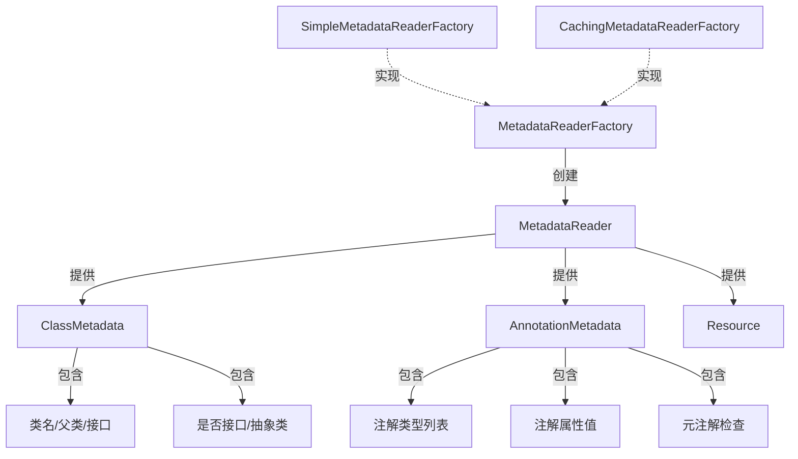

# MetadataReader：Spring 元数据读取 API

> 本文档介绍 Spring Framework 的 `MetadataReader` API，这是组件扫描的底层机制，能够**在不加载类到 JVM 的情况下**读取 `.class` 文件的元数据。

---

## 📥 01. 一句话定义

**MetadataReader** 是 Spring 提供的底层 API，用于通过 ASM 字节码库直接解析 `.class` 文件，提取类结构和注解信息，而**无需将类加载到 JVM**——这是 Spring 组件扫描的核心技术。

---

## 🔍 02. 背景与痛点

### 现状：传统反射方案

在没有 `MetadataReader` 之前，如果想检查一个类是否带有某个注解，通常会使用 Java 反射：

```java
Class<?> clazz = Class.forName("com.example.MyService");
if (clazz.isAnnotationPresent(Component.class)) {
    // 注册为 Bean
}
```

### 痛点：反射的问题

| 问题 | 说明 |
|------|------|
| **类加载开销** | `Class.forName()` 会将类加载到 JVM，触发静态初始化块 |
| **类加载副作用** | 某些类的静态初始化可能依赖外部资源（数据库连接、网络请求等），导致扫描失败 |
| **内存占用** | 扫描数百个类时，所有被扫描的类都会驻留在内存中 |
| **无法过滤** | 必须先加载类才能判断，无法在加载前排除不需要的类 |

### 价值：MetadataReader 的优势

| 优势 | 说明 |
|------|------|
| **零加载** | 基于 ASM 直接读取 `.class` 字节码，不触发类加载 |
| **零副作用** | 不执行静态初始化块，安全无侵入 |
| **高性能** | 只解析需要的元数据，不构建完整的 Class 对象 |
| **过滤前置** | 可以在决定是否注册 Bean 之前进行判断 |

---

## ⚙️ 03. 核心机制

### 组件关系



### 核心接口说明

| 接口 | 职责 | 关键方法 |
|------|------|----------|
| `MetadataReaderFactory` | 工厂接口 | `getMetadataReader(String className)` |
| `MetadataReader` | 元数据读取器 | `getClassMetadata()`, `getAnnotationMetadata()` |
| `ClassMetadata` | 类结构信息 | `getClassName()`, `getSuperClassName()`, `getInterfaceNames()` |
| `AnnotationMetadata` | 注解信息 | `hasAnnotation()`, `getAnnotationAttributes()`, `hasMetaAnnotation()` |

### 工厂实现选择

| 实现类 | 特点 | 适用场景 |
|--------|------|----------|
| `SimpleMetadataReaderFactory` | 每次都创建新的 ClassReader | 单次读取、测试代码 |
| `CachingMetadataReaderFactory` | 缓存 MetadataReader | 批量扫描、生产环境 |

---

## 💻 04. 实战演示

### 目标类（被读取）

```java
@Service("sampleService")
@CustomAnnotation(module = "metadata-demo", version = "2.0", enabled = true)
public class SampleService implements Runnable {
    @Override
    public void run() {
        System.out.println("SampleService is running...");
    }
}
```

### 演示代码

```java
import org.springframework.core.type.AnnotationMetadata;
import org.springframework.core.type.ClassMetadata;
import org.springframework.core.type.classreading.MetadataReader;
import org.springframework.core.type.classreading.SimpleMetadataReaderFactory;

public class MetadataReaderDemo {

    public static void main(String[] args) throws IOException {
        // 1️⃣ 创建工厂
        SimpleMetadataReaderFactory factory = new SimpleMetadataReaderFactory();

        // 2️⃣ 获取 MetadataReader（传入类的全限定名）
        MetadataReader reader = factory.getMetadataReader(SampleService.class.getName());

        // 3️⃣ 读取类元数据
        ClassMetadata classMetadata = reader.getClassMetadata();
        System.out.println("类名: " + classMetadata.getClassName());
        System.out.println("父类: " + classMetadata.getSuperClassName());
        System.out.println("接口: " + String.join(", ", classMetadata.getInterfaceNames()));

        // 4️⃣ 读取注解元数据
        AnnotationMetadata annoMetadata = reader.getAnnotationMetadata();
        System.out.println("注解类型: " + annoMetadata.getAnnotationTypes());

        // 检查特定注解
        boolean hasService = annoMetadata.hasAnnotation(Service.class.getName());
        System.out.println("是否有 @Service: " + hasService);

        // 读取注解属性
        Map<String, Object> attrs = annoMetadata.getAnnotationAttributes(CustomAnnotation.class.getName());
        System.out.println("@CustomAnnotation 属性: " + attrs);

        // 检查元注解（@Service 上有 @Component）
        boolean hasComponent = annoMetadata.hasMetaAnnotation("org.springframework.stereotype.Component");
        System.out.println("是否有元注解 @Component: " + hasComponent);
    }
}
```

### 运行输出

```
类名: io.github.daihaowxg.springmetadata.metadata_reader.SampleService
父类: java.lang.Object
接口: java.lang.Runnable
注解类型: [org.springframework.stereotype.Service, io.github.daihaowxg.springmetadata.metadata_reader.CustomAnnotation]
是否有 @Service: true
@CustomAnnotation 属性: {module=metadata-demo, version=2.0, enabled=true}
是否有元注解 @Component: true
```

### 关键点拨

1. **类名格式**：`getMetadataReader()` 接受类的全限定名（如 `com.example.MyClass`），会自动转换为资源路径 `com/example/MyClass.class`。

2. **元注解检查**：`hasMetaAnnotation()` 可以检查注解的注解。例如 `@Service` 上标注了 `@Component`，所以可以通过元注解检查发现它。

3. **注解属性类型**：返回的 `Map<String, Object>` 中，属性值已经被解析为对应的 Java 类型（String、int、boolean、Class<?> 等）。

---

## ⚖️ 05. 选型权衡

### 适用场景（银弹）

| 场景 | 说明 |
|------|------|
| **组件扫描** | 扫描 classpath 下的所有类，判断哪些是 Spring 组件 |
| **条件化配置** | 在类加载前判断是否满足条件（如 `@ConditionalOnClass`） |
| **代码分析工具** | 静态分析代码结构和注解，无需运行应用 |
| **热部署/插件系统** | 在加载插件类之前，先检查其元数据 |

### 不适用场景

| 场景 | 原因 | 替代方案 |
|------|------|----------|
| **运行时动态获取注解值** | 类已经加载，用反射更直接 | `clazz.getAnnotation()` |
| **需要类实例** | MetadataReader 只读元数据，不能创建实例 | `Class.forName()` + `newInstance()` |
| **读取方法/字段级别的注解** | `AnnotationMetadata` 默认只读类级别注解 | 使用 `MethodMetadata` 或反射 |

### 与反射 API 对比

| 维度 | MetadataReader | 反射 API |
|------|----------------|----------|
| 是否加载类 | ❌ 不加载 | ✅ 必须加载 |
| 性能 | 更快（只解析需要的部分） | 较慢（需要完整加载类） |
| 副作用 | 无 | 可能触发静态初始化 |
| 功能完整性 | 有限（只有元数据） | 完整（可以创建实例、调用方法） |
| Spring 集成 | 原生支持 | 需要手动处理 |

---

## 💡 06. 总结与自查

### 核心要点回顾

1. `MetadataReader` 是 Spring 组件扫描的底层 API，基于 ASM 字节码库实现。
2. 它可以在**不加载类**的情况下读取类结构和注解信息。
3. 通过 `MetadataReaderFactory` 创建，有两种实现：`Simple`（无缓存） 和 `Caching`（有缓存）。
4. 主要提供 `ClassMetadata`（类结构）和 `AnnotationMetadata`（注解信息）两类元数据。

### 自查 Checklist

- [x] 我是否解释清了 Why 而不仅仅是 How？
- [x] 读者是否能通过这个文档快速上手？
- [x] 边界情况（Edge cases）是否已提及？

### 代码示例位置

完整可运行的代码示例位于：

```
sample03-spring-reading/spring-metadata/src/main/java/
└── io/github/daihaowxg/springmetadata/metadata_reader/
    ├── CustomAnnotation.java      # 自定义注解
    ├── SampleService.java         # 被读取的目标类
    └── MetadataReaderDemo.java    # 演示主类（可直接运行）
```

---

> **延伸阅读**：Spring 的 `ClassPathBeanDefinitionScanner` 和 `ClassPathScanningCandidateComponentProvider` 正是基于 `MetadataReader` 实现的，理解这个 API 有助于理解 Spring 组件扫描的底层原理。
