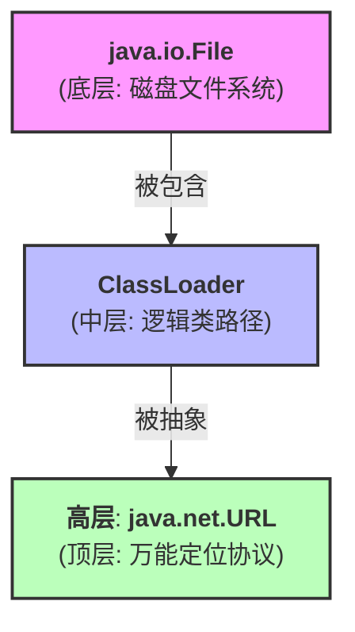

# JDK 资源访问使用手册 (Handbook)

本手册总结了在 Java (JDK) 中访问资源的几种原生方式。理解这些方式是掌握 Spring 资源抽象 (Resource Interface) 的基础。

---

## 1. 使用 `java.io.File` (直接文件访问)

最传统的访问方式，直接与操作系统的文件系统交互。

### 📌 核心用法
```java
File file = new File("path/to/resource.txt");
if (file.exists()) {
    InputStream is = new FileInputStream(file);
    // ... 处理流
}
```

### ✅ 适用场景
- 访问程序运行环境磁盘上的**绝对路径**。
- 访问与程序运行目录相关的**相对路径**（如日志文件夹）。

### ❌ 局限性
- **无法访问 Classpath 资源**：它不认识项目编译后的 `classes` 目录或类路径。
- **JAR 包噩梦**：一旦项目打包成 JAR，包内的资源对 `File` 来说是不可见的，因为它没有物理层面的 **绝对路径**。
- **环境依赖**：路径分隔符 (`/` vs `\`) 和工作目录的变化会导致代码失效。

---

## 2. 使用 `ClassLoader` (类路径访问)

Java 推荐的访问项目内部资源（如配置文件）的方式。

### 📌 核心用法
```java
// 方式 A: ClassLoader (推荐，使用相对路径)
ClassLoader cl = Thread.currentThread().getContextClassLoader();
InputStream is = cl.getResourceAsStream("sample.txt");

// 方式 B: Class (支持相对于包的路径或绝对路径)
InputStream is2 = MyClass.class.getResourceAsStream("/sample.txt");
```

### ✅ 适用场景
- 访问 `src/main/resources` 下的配置文件、图片、SQL 等。
- **兼容 JAR 包**：无论在开发环境还是打包后的 JAR 中，都能准确找到资源。

### ❌ 局限性
- **无法访问外部文件**：只能读取类路径（Classpath）包含的目录。
- **API 琐碎**：需要处理 `URL`、`InputStream` 以及手动关闭流。

### 📌 Class vs ClassLoader 路径规则详解
这是最容易混淆的地方，核心差异在于**起始点**：

1. **`MyClass.class.getResource(path)`**：
   - **不以 `/` 开头**：相对于 **当前类所在的包 (Package)**。例如 `sample.txt` 会去 `io/github/.../jdk/` 下找。
   - **以 `/` 开头**：相对于 **类路径根目录 (Classpath Root)**。

2. **`ClassLoader.getResource(path)`**：
   - **始终**相对于 **类路径根目录**。
   - **注意**：路径**不能**以 `/` 开头，否则会返回 `null`。

| 调用方式 | 示例路径 | 实际查找位置 |
| :--- | :--- | :--- |
| `Class.getResource` | `"sample.txt"` | 当前包目录下 |
| `Class.getResource` | `"/sample.txt"` | 类路径根目录下 |
| `ClassLoader.getResource` | `"sample.txt"` | 类路径根目录下 |
| `ClassLoader.getResource` | `"/sample.txt"` | ❌ 错误用法 (返回 null) |

---

## 3. 使用 `java.net.URL` (统一资源访问)

通过通用的 URL 协议格式访问不同来源的资源。

### 📌 核心用法
```java
// 访问网络资源
URL webUrl = new URI("https://api.example.com/data").toURL();
// 访问本地文件
URL fileUrl = new File("C:/test.txt").toURI().toURL();
// 访问 JAR 内部
URL jarUrl = new URL("jar:file:/app.jar!/config.xml");

InputStream is = url.openStream();
```

### ✅ 适用场景
- 需要统一处理本地文件、网络资源、JAR 包内资源。
- 标准化的资源定位。

### ❌ 局限性
- **格式要求严格**：构造 URL 的字符串必须符合规范。
- **弃用警告**：现代 JDK (20+) 建议先转 `URI` 再转 `URL`。
- **异常处理重**：涉及 `MalformedURLException`, `URISyntaxException` 等。

---

## 4. 核心对比表

| 特性 | java.io.File | ClassLoader | java.net.URL |
| :--- | :--- | :--- | :--- |
| **访问来源** | 磁盘物理路径 | 类路径 (Classpath) | 多种协议 (http, file, jar) |
| **JAR 兼容性** | ❌ 无法访问包内 | ✅ 完美支持 | ✅ 支持 (需特定格式) |
| **可移植性** | ❌ 依赖操作系统 | ✅ 跨平台一致 | ⚠️ 取决于协议 |
| **主要用途** | 外部日志、用户上传文件 | 配置文件、内部资源 | 网络调用、通用定位 |

---

## 🚀 递进演进模型：从物理到抽象

这三者之间存在着明显的抽象层次递进关系，每一代都是对前代的增强与兼容：



*   **File** 是基础：它只解决“本地磁盘有什么”的问题。
*   **ClassLoader** 是增强：它解决了“项目运行需要什么”的问题，它能感知类路径，并能深入到 **JAR 包内部**。
*   **URL** 是终极抽象：它通过不同协议（`file:`、`jar:`、`http:`）统一了前两者的定位方式，并扩展了网络访问能力。

这种**层层包裹、向后兼容**的特性，使得 `URL` 成为了 JDK 中最通用的资源定位符。

---

## 💡 为什么需要 Spring `Resource`？

通过上述手册可以看出，JDK 原生方式存在以下痛点：
1. **API 不统一**：你必须根据资源在哪里决定调用哪个类。
2. **逻辑复杂**：判断文件是否存在、是否有可读权限等操作在不同 API 下代码各异。
3. **灵活性差**：如果配置文件从本地移动到网络上，代码几乎需要重写。

**Spring 的封装：**
```java
// 无论在哪里，一句代码搞定
Resource res = resourceLoader.getResource("classpath:config.xml"); // 或 "file:/opt/config.xml"
InputStream is = res.getInputStream();
```
Spring 通过一个 `Resource` 接口，抹平了所有的差异。
