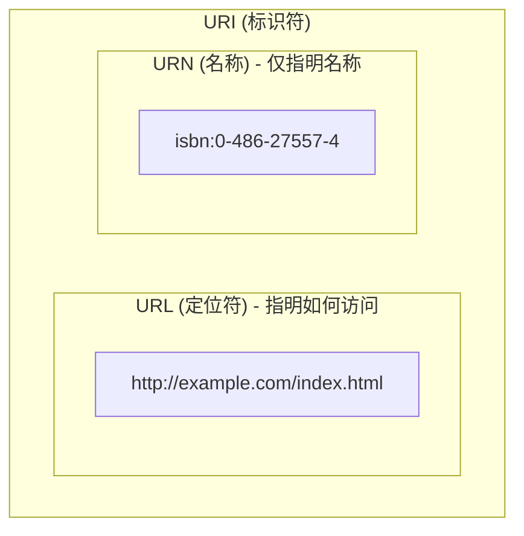

# URI 与 URL 的区别详解

在 Java 资源访问中，`java.net.URI` 和 `java.net.URL` 是两个经常成对出现但又有所区别的核心类。本篇文档将详细解释它们的定义、联系以及在开发中的使用建议。

---

## 1. 定义与核心概念

### 📌 URI (Uniform Resource Identifier) - 统一资源标识符
*   **核心功能**：**标识**。
*   **定义**：它是一个用于标识某一互联网资源的字符串。它就像是“身份证号”，只要能唯一标识一个资源即可，不一定非要告诉你怎么去找到它。
*   **组成**：包括 **URL**（定位）和 **URN**（命名）。

### 📌 URL (Uniform Resource Locator) - 统一资源定位符
*   **核心功能**：**定位**。
*   **定义**：它不仅标识了资源，还指明了如何**定位**并**访问**该资源。它就像是“家庭地址”，告诉你资源在哪以及通过什么协议（http, ftp, file 等）去获取它。

---

## 2. 两者的关系

**“所有的 URL 都是 URI，但并非所有的 URI 都是 URL。”**

我们可以用下面的包含关系来表示：



*   **URL** 告诉你：协议 + 存放位置。
*   **URN** 告诉你：名字（无论位置怎么变，名字不变）。

---

## 3. 在 JDK 中的区别与使用建议

在现代 Java 开发中（尤其是 JDK 20 之后），`URI` 和 `URL` 的分工变得非常明确：

### 🛑 为什么 `new URL(String)` 被弃用了？
从 JDK 20 开始，许多 `URL` 的构造方法被标记为 **Deprecated**。原因如下：
1.  **解析不严格**：`URL` 类的构造函数对字符串的校验比较宽松，容易产生歧义。
2.  **职责混淆**：`URL` 应该只负责“定位”和“打开连接”，而复杂的字符串解析应该交给 `URI`。

### ✅ 推荐的使用路径：`URI -> URL`
目前的最佳实践是：**先用 `URI` 解析字符串，确认无误后再转换为 `URL`。**

```java
// ❌ 不推荐 (构造函数已弃用)
URL url = new URL("https://github.com/zen");

// ✅ 推荐做法
try {
    URI uri = new URI("https://github.com/zen");
    URL url = uri.toURL(); // 只有当 URI 包含协议( scheme)时才能转为 URL
    InputStream is = url.openStream();
} catch (URISyntaxException | MalformedURLException e) {
    // 处理异常
}
```

---

## 4. 总结对比

| 特性 | URI (`java.net.URI`) | URL (`java.net.URL`) |
| :--- | :--- | :--- |
| **主要关注点** | **标识**与**解析** | **定位**与**打开连接** |
| **校验严格度** | 非常严格 (遵循 RFC 2396) | 相对宽松 |
| **是否包含协议** | 可选 (如 `mailto:a@b.com` 或 `docs/test.txt`) | **必须**包含协议头 (如 `http:`, `file:`) |
| **主要用途** | 路径处理、URI 解析、跨层传递 | 打开网络连接、读取资源流 |
| **最佳实践** | 应当作为资源标识的**首选**输入方式 | 仅在需要**打开输入流**时通过 `uri.toURL()` 获取 |

---

## 💡 结论
在开发 Spring 或 JDK 资源访问代码时，请养成**优先接收 URI 字符串，解析后再按需转 URL**的习惯。这正是我们在 `JdkUrlAccessExample.java` 示例中采用的模式。
