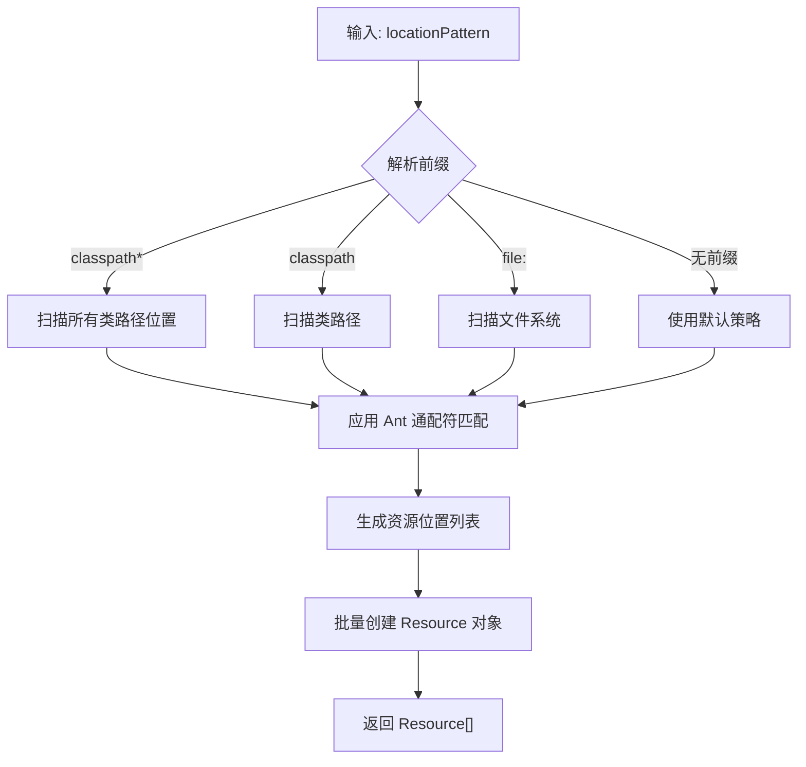

# ResourcePatternResolver 技术详解

> 最后更新时间：2026-01-15

## 01. 一句话定义

ResourcePatternResolver 是 Spring 中用于批量加载资源的接口，它扩展了 ResourceLoader，支持 Ant 风格通配符模式（如 `**/*.xml`）和 `classpath*:` 前缀，能够一次性加载多个匹配的资源。

## 02. 背景与痛点

### 现状：ResourceLoader 的局限性

在 ResourcePatternResolver 出现之前，开发者只能使用 ResourceLoader 逐个加载资源：

```java
ResourceLoader loader = new DefaultResourceLoader();
Resource config1 = loader.getResource("classpath:config/module1.xml");
Resource config2 = loader.getResource("classpath:config/module2.xml");
Resource config3 = loader.getResource("classpath:config/module3.xml");
// 必须一个个写，无法自动化
```

### 痛点

1. **批量加载困难**：当需要加载某个目录下所有配置文件时，必须手动罗列文件名或递归遍历目录。
2. **多模块配置问题**：在多 Jar 包项目中，`classpath:` 只能找到第一个匹配的资源，无法加载所有 Jar 包中同名或同模式的资源（如 MyBatis Mapper）。
3. **模式匹配缺失**：无法使用通配符进行模糊匹配，灵活性差。

### 价值

ResourcePatternResolver 通过引入 `getResources(String locationPattern)` 方法，解决了上述所有问题：
- 支持一次性加载所有匹配的资源
- `classpath*:` 前缀能够跨 Jar 包扫描
- 支持 Ant 风格通配符，模式匹配强大

## 03. 核心机制

### 第一性原理

ResourcePatternResolver 的核心设计思想是**路径模式匹配 + 批量资源定位**。它通过解析路径模式，生成一组资源位置，然后批量加载。

### 关键组件

```
┌─────────────────────────────────────────────────────────────┐
│              ResourcePatternResolver (接口)                 │
├─────────────────────────────────────────────────────────────┤
│ + getResources(locationPattern): Resource[]                 │
│   └─ 解析模式，返回匹配的资源数组                       │
└─────────────────────────────────────────────────────────────┘
                         │
                         │ implements
                         ▼
┌─────────────────────────────────────────────────────────────┐
│      PathMatchingResourcePatternResolver (默认实现)          │
├─────────────────────────────────────────────────────────────┤
│  依赖组件：                                              │
│  - PathMatcher: Ant 风格路径匹配器                        │
│  - ResourceLoader: 底层资源加载器                           │
└─────────────────────────────────────────────────────────────┘
```

### 路径模式语法

| 模式 | 说明 | 示例 |
| :--- | :--- | :--- |
| `classpath:` | 从类路径加载（仅第一个匹配） | `classpath:config.xml` |
| `classpath*:` | 从类路径加载（所有匹配） | `classpath*:config.xml` |
| `*` | 匹配单层任意字符 | `*.xml` (匹配 a.xml, b.xml) |
| `**` | 匹配多层任意字符 | `**/*.xml` (递归匹配所有 xml) |
| `?` | 匹配单个字符 | `file?.txt` (匹配 file1.txt) |

### 工作流程



## 04. 实战演示

### 代码范例

```java
import org.springframework.core.io.Resource;
import org.springframework.core.io.support.PathMatchingResourcePatternResolver;
import org.springframework.core.io.support.ResourcePatternResolver;

public class ResourcePatternResolverDemo {

    public static void main(String[] args) throws IOException {
        ResourcePatternResolver resolver = new PathMatchingResourcePatternResolver();

        // 1. 加载所有 .properties 文件
        System.out.println("=== 演示 1: 加载所有 properties ===");
        Resource[] props = resolver.getResources("classpath*:*.properties");
        for (Resource r : props) {
            System.out.println("找到: " + r.getFilename());
        }

        // 2. 递归加载 config 目录下所有 XML 文件
        System.out.println("\n=== 演示 2: 递归加载 config/**/*.xml ===");
        Resource[] xmls = resolver.getResources("classpath*:config/**/*.xml");
        for (Resource r : xmls) {
            System.out.println("找到: " + r.getDescription());
        }

        // 3. 跨 Jar 包加载同名资源
        System.out.println("\n=== 演示 3: 跨 Jar 包加载 ===");
        Resource[] configFiles = resolver.getResources("classpath*:logback.xml");
        System.out.println("找到 " + configFiles.length + " 个 logback.xml");
    }
}
```

### 关键点拨

1. **`classpath` vs `classpath*` 的本质区别**
   - `classpath:` 只在找到第一个匹配后停止
   - `classpath*:` 会遍历所有 Jar 包和类路径目录

2. **Ant 通配符的递归特性**
   - `*` 只匹配当前层级
   - `**` 可以递归匹配任意层级
   - `**/*.xml` 会递归查找所有子目录中的 XML 文件

3. **性能考虑**
   - `classpath*:` 需要扫描所有 Jar 包，性能开销较大
   - 在明确的单个 Jar 场景下，优先使用 `classpath:`

## 05. 选型权衡

### 适用场景

| 场景 | 推荐方案 | 原因 |
| :--- | :--- | :--- |
| 加载单个明确资源 | `ResourceLoader` | 性能最优 |
| 扫描配置目录 | `ResourcePatternResolver` | 批量处理，自动化 |
| 多模块项目加载 Mapper | `classpath*:` | 跨 Jar 包扫描 |
| 框架配置扫描 | `**/*.xml` 或 `**/*.properties` | 递归匹配 |
| 类路径所有同名资源 | `classpath*:` 前缀 | 打破隔离 |

### 不适用场景

1. **明确知道资源位置**：如果只需加载一个已知资源，使用 ResourceLoader 即可，避免模式匹配的开销。
2. **对性能极度敏感**：`classpath*:` 需要扫描所有 Jar 包，在大项目中可能影响启动速度。
3. **资源不在类路径**：对于文件系统资源，直接使用 `file:` 前缀配合 ResourceLoader 更简单。

### 对比表格

| 特性 | ResourceLoader | ResourcePatternResolver |
| :--- | :--- | :--- |
| 返回类型 | 单个 `Resource` | 数组 `Resource[]` |
| 模式匹配 | 不支持 | 支持 Ant 通配符 |
| 跨 Jar 扫描 | 不支持 | 支持 `classpath*:` |
| 性能 | 快 | 较慢（需要扫描） |
| 使用复杂度 | 简单 | 中等 |

## 06. 总结与自查

- [x] 我是否解释清了 Why 而不仅仅是 How？ - 解释了批量加载和跨 Jar 扫描的必要性
- [x] 读者是否能通过这个文档快速上手？ - 提供了完整的代码示例和对比表格
- [x] 边界情况是否已提及？ - 说明了 `classpath:` 与 `classpath*:` 的区别、性能考虑等
