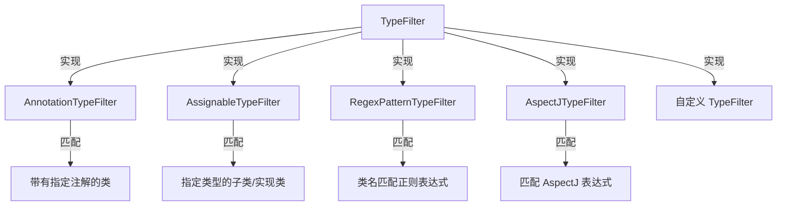

# TypeFilter：Spring 组件扫描过滤器

> 本文档介绍 Spring Framework 的 `TypeFilter` 接口，这是 `@ComponentScan` 背后的过滤机制，用于在组件扫描时精确控制哪些类应该被注册为 Bean。

---

## 📥 01. 一句话定义

**TypeFilter** 是 Spring 组件扫描的过滤器接口，通过与 `MetadataReader` 配合，**在不加载类的情况下**判断一个类是否应该被包含或排除——这是 `@ComponentScan` 的 `includeFilters` 和 `excludeFilters` 属性的底层实现。

---

## 🔍 02. 背景与痛点

### 现状：默认的组件扫描

默认情况下，`@ComponentScan` 只会扫描带有 `@Component`（及其派生注解如 `@Service`、`@Repository`、`@Controller`）的类：

```java
@ComponentScan("com.example")  // 只扫描 @Component 类
public class AppConfig {}
```

### 痛点：需要更灵活的过滤

| 需求 | 问题 |
|------|------|
| 扫描自定义注解标记的类 | 默认只识别 `@Component` 系列 |
| 扫描特定接口的实现类 | 必须给每个实现类加 `@Component` |
| 排除某些类（如测试类、Mock 类） | 无法按类名模式排除 |
| 基于多条件组合过滤 | 单一注解无法表达复杂逻辑 |

### 价值：TypeFilter 的优势

| 优势 | 说明 |
|------|------|
| **灵活过滤** | 支持按注解、类型、正则、AspectJ 表达式等多种方式过滤 |
| **可组合** | `includeFilters` 和 `excludeFilters` 可以同时使用 |
| **可扩展** | 通过实现 `TypeFilter` 接口自定义任意过滤逻辑 |
| **高性能** | 基于 `MetadataReader`，不加载类即可判断 |

---

## ⚙️ 03. 核心机制

### TypeFilter 接口

```java
@FunctionalInterface
public interface TypeFilter {
    boolean match(MetadataReader metadataReader, 
                  MetadataReaderFactory metadataReaderFactory) throws IOException;
}
```

- **返回 `true`**：表示匹配，该类会被包含/排除（取决于用在 include 还是 exclude）
- **返回 `false`**：表示不匹配

### 内置实现



| 实现类 | 构造参数 | 匹配规则 |
|--------|----------|----------|
| `AnnotationTypeFilter` | 注解 Class | 类上有该注解（支持元注解） |
| `AssignableTypeFilter` | 类/接口 Class | 是该类型的子类或实现类 |
| `RegexPatternTypeFilter` | Pattern 正则 | 全限定类名匹配正则表达式 |
| `AspectJTypeFilter` | AspectJ 表达式 | 匹配 AspectJ 类型表达式 |

### 与 @ComponentScan 的关系

```java
@ComponentScan(
    basePackages = "com.example",
    includeFilters = @Filter(type = ANNOTATION, classes = MyCustomAnnotation.class),
    excludeFilters = @Filter(type = REGEX, pattern = ".*Test.*")
)
```

`@Filter` 注解的 `type` 属性对应不同的 `TypeFilter` 实现：

| @Filter type | 对应 TypeFilter |
|--------------|-----------------|
| `ANNOTATION` | `AnnotationTypeFilter` |
| `ASSIGNABLE_TYPE` | `AssignableTypeFilter` |
| `REGEX` | `RegexPatternTypeFilter` |
| `ASPECTJ` | `AspectJTypeFilter` |
| `CUSTOM` | 自定义的 `TypeFilter` 实现类 |

---

## 💻 04. 实战演示

### 内置过滤器示例

```java
import org.springframework.core.type.filter.*;
import org.springframework.core.type.classreading.*;

public class TypeFilterDemo {
    public static void main(String[] args) throws IOException {
        SimpleMetadataReaderFactory factory = new SimpleMetadataReaderFactory();
        MetadataReader reader = factory.getMetadataReader(SampleService.class.getName());

        // 1️⃣ AnnotationTypeFilter - 匹配 @Service 注解
        TypeFilter serviceFilter = new AnnotationTypeFilter(Service.class);
        boolean hasService = serviceFilter.match(reader, factory);
        System.out.println("有 @Service: " + hasService);  // true

        // 2️⃣ AssignableTypeFilter - 匹配 Runnable 实现类
        TypeFilter runnableFilter = new AssignableTypeFilter(Runnable.class);
        boolean isRunnable = runnableFilter.match(reader, factory);
        System.out.println("实现 Runnable: " + isRunnable);  // true

        // 3️⃣ RegexPatternTypeFilter - 匹配类名
        TypeFilter regex = new RegexPatternTypeFilter(Pattern.compile(".*Service$"));
        boolean matchesName = regex.match(reader, factory);
        System.out.println("类名以 Service 结尾: " + matchesName);  // true
    }
}
```

### 自定义 TypeFilter 示例

```java
// 自定义过滤器：必须同时满足 @Service 注解 + 实现 Runnable + 非抽象类
TypeFilter customFilter = (metadataReader, metadataReaderFactory) -> {
    var classMetadata = metadataReader.getClassMetadata();
    var annotationMetadata = metadataReader.getAnnotationMetadata();

    boolean hasServiceAnnotation = annotationMetadata.hasAnnotation(Service.class.getName())
            || annotationMetadata.hasMetaAnnotation(Service.class.getName());

    boolean implementsRunnable = false;
    for (String interfaceName : classMetadata.getInterfaceNames()) {
        if (Runnable.class.getName().equals(interfaceName)) {
            implementsRunnable = true;
            break;
        }
    }

    boolean isNotAbstract = !classMetadata.isAbstract();

    return hasServiceAnnotation && implementsRunnable && isNotAbstract;
};
```

### 在 @ComponentScan 中使用自定义 TypeFilter

```java
@Configuration
@ComponentScan(
    basePackages = "com.example",
    includeFilters = @Filter(type = FilterType.CUSTOM, classes = MyCustomTypeFilter.class)
)
public class AppConfig {}

// 自定义 TypeFilter 必须是独立的类
public class MyCustomTypeFilter implements TypeFilter {
    @Override
    public boolean match(MetadataReader metadataReader, 
                         MetadataReaderFactory metadataReaderFactory) throws IOException {
        // 你的过滤逻辑
        return true;
    }
}
```

### 运行输出示例

```
【1. AnnotationTypeFilter - 按注解过滤】
匹配 @Service 注解：
  SampleService: ✅
  CustomAnnotation: ❌
  TypeFilterDemo: ❌
  ArrayList: ❌

【2. AssignableTypeFilter - 按类型过滤】
匹配 Runnable 实现类：
  SampleService: ✅
  CustomAnnotation: ❌
  TypeFilterDemo: ❌
  ArrayList: ❌

【3. RegexPatternTypeFilter - 按正则表达式过滤】
匹配类名以 'Service' 结尾：
  SampleService: ✅
  CustomAnnotation: ❌
  TypeFilterDemo: ❌
  ArrayList: ❌
```

---

## ⚖️ 05. 选型权衡

### 各 TypeFilter 实现的适用场景

| TypeFilter | 适用场景 | 示例 |
|------------|----------|------|
| `AnnotationTypeFilter` | 扫描自定义注解标记的类 | `@MyCustomComponent` |
| `AssignableTypeFilter` | 扫描某接口的所有实现类 | 所有 `Repository` 接口实现 |
| `RegexPatternTypeFilter` | 按命名规范批量包含/排除 | 排除 `*Test`、`*Mock` 类 |
| `AspectJTypeFilter` | 复杂的类型匹配表达式 | 包级别 + 类型模式组合 |
| 自定义 `TypeFilter` | 多条件组合、动态判断 | 注解 + 接口 + 非抽象类 |

### 使用建议

| 场景 | 推荐方案 |
|------|----------|
| 简单的注解过滤 | `AnnotationTypeFilter` |
| 接口实现类扫描 | `AssignableTypeFilter` |
| 排除测试/Mock 类 | `RegexPatternTypeFilter` |
| 复杂业务逻辑 | 自定义 `TypeFilter` |

### 注意事项

1. **过滤顺序**：`excludeFilters` 优先于 `includeFilters`。如果一个类同时匹配 include 和 exclude，会被排除。

2. **useDefaultFilters**：默认为 `true`，会包含 `@Component` 系列注解。如果只想使用自定义过滤器，需要设置为 `false`：
   ```java
   @ComponentScan(
       basePackages = "com.example",
       useDefaultFilters = false,
       includeFilters = @Filter(type = ANNOTATION, classes = MyAnnotation.class)
   )
   ```

3. **性能考虑**：复杂的自定义 `TypeFilter` 会影响启动速度，应避免在 `match()` 中执行耗时操作。

---

## 💡 06. 总结与自查

### 核心要点回顾

1. `TypeFilter` 是 `@ComponentScan` 过滤机制的底层接口。
2. 通过 `match(MetadataReader, MetadataReaderFactory)` 方法判断是否匹配。
3. 内置 4 种实现：`AnnotationTypeFilter`、`AssignableTypeFilter`、`RegexPatternTypeFilter`、`AspectJTypeFilter`。
4. 可以通过实现 `TypeFilter` 接口自定义任意过滤逻辑。

### 自查 Checklist

- [x] 我是否解释清了 Why 而不仅仅是 How？
- [x] 读者是否能通过这个文档快速上手？
- [x] 边界情况（Edge cases）是否已提及？

### 代码示例位置

完整可运行的代码示例位于：

```
sample03-spring-reading/spring-metadata/src/main/java/
└── io/github/daihaowxg/springmetadata/type_filter/
    └── TypeFilterDemo.java    # 演示主类（可直接运行）
```

---

> **延伸阅读**：`ClassPathScanningCandidateComponentProvider` 是 Spring 中使用 `TypeFilter` 的核心类，理解 `TypeFilter` 有助于理解 `@ComponentScan` 的完整工作流程。
