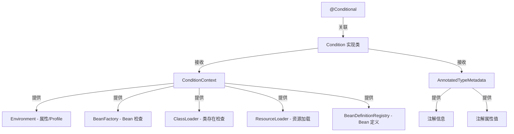

# Condition：Spring 条件化 Bean 注册

> 本文档介绍 Spring Framework 的 `Condition` 接口，这是 `@Conditional` 注解的底层实现，用于在 Bean 注册时进行条件判断，决定是否将 Bean 加入容器。

---

## 📥 01. 一句话定义

**Condition** 是 Spring 条件化配置的核心接口，通过 `matches()` 方法在 Bean 注册阶段判断条件是否满足——返回 `true` 则注册 Bean，返回 `false` 则跳过。这是 Spring Boot 自动配置（`@ConditionalOnXxx`）的基础。

---

## 🔍 02. 背景与痛点

### 现状：硬编码的条件判断

在没有 `Condition` 之前，如果需要根据环境条件决定是否创建某个 Bean，通常会这样做：

```java
@Configuration
public class AppConfig {

    @Bean
    public DataSource dataSource() {
        String env = System.getProperty("env");
        if ("prod".equals(env)) {
            return createProdDataSource();
        } else {
            return createDevDataSource();
        }
    }
}
```

### 痛点：硬编码方式的问题

| 问题 | 说明 |
|------|------|
| **代码耦合** | Bean 定义和条件判断混在一起，职责不清 |
| **难以复用** | 相同的条件逻辑需要重复编写 |
| **测试困难** | 条件判断嵌入业务代码，难以单独测试 |
| **不够声明式** | 无法通过注解清晰表达意图 |

### 价值：Condition 的优势

| 优势 | 说明 |
|------|------|
| **解耦** | 条件判断逻辑独立成类，与 Bean 定义分离 |
| **可复用** | 一个 Condition 可用于多个 Bean |
| **声明式** | 通过 `@Conditional` 注解清晰表达意图 |
| **可组合** | 多个 Condition 可以组合使用 |
| **Spring Boot 基石** | 所有 `@ConditionalOnXxx` 都基于此 |

---

## ⚙️ 03. 核心机制

### Condition 接口

```java
@FunctionalInterface
public interface Condition {
    boolean matches(ConditionContext context, AnnotatedTypeMetadata metadata);
}
```

- **返回 `true`**：条件满足，Bean 会被注册
- **返回 `false`**：条件不满足，Bean 跳过注册

### 核心组件关系



### ConditionContext 能力

| 方法 | 返回类型 | 用途 |
|------|----------|------|
| `getEnvironment()` | `Environment` | 读取配置属性、检查 Profile |
| `getBeanFactory()` | `ConfigurableListableBeanFactory` | 检查 Bean 是否存在 |
| `getClassLoader()` | `ClassLoader` | 检查类是否存在 |
| `getResourceLoader()` | `ResourceLoader` | 加载资源文件 |
| `getRegistry()` | `BeanDefinitionRegistry` | 检查/注册 BeanDefinition |

### Spring Boot 内置条件注解

| 注解 | 判断条件 |
|------|----------|
| `@ConditionalOnProperty` | 属性存在且值匹配 |
| `@ConditionalOnClass` | 类存在于 classpath |
| `@ConditionalOnMissingClass` | 类不存在于 classpath |
| `@ConditionalOnBean` | 容器中存在指定 Bean |
| `@ConditionalOnMissingBean` | 容器中不存在指定 Bean |
| `@ConditionalOnWebApplication` | 是 Web 应用 |
| `@ConditionalOnExpression` | SpEL 表达式为 true |

---

## 💻 04. 实战演示

### 示例 1：简单的操作系统条件

```java
/**
 * 只在 macOS 上注册 Bean
 */
public class OnMacOsCondition implements Condition {

    @Override
    public boolean matches(ConditionContext context, AnnotatedTypeMetadata metadata) {
        String osName = context.getEnvironment().getProperty("os.name", "");
        return osName.toLowerCase().contains("mac");
    }
}

// 使用
@Configuration
public class AppConfig {

    @Bean
    @Conditional(OnMacOsCondition.class)
    public String macOsOnlyService() {
        return "This service runs on macOS";
    }
}
```

### 示例 2：自定义条件注解（类似 @ConditionalOnProperty）

```java
// 1️⃣ 自定义注解
@Target({ElementType.TYPE, ElementType.METHOD})
@Retention(RetentionPolicy.RUNTIME)
@Conditional(OnPropertyCondition.class)  // 关联 Condition 实现
public @interface ConditionalOnMyProperty {
    String value();                       // 属性名
    String havingValue() default "";      // 期望的值
    boolean matchIfMissing() default false;
}

// 2️⃣ Condition 实现
public class OnPropertyCondition implements Condition {

    @Override
    public boolean matches(ConditionContext context, AnnotatedTypeMetadata metadata) {
        // 从注解中获取配置
        var attrs = metadata.getAnnotationAttributes(ConditionalOnMyProperty.class.getName());
        String propertyName = (String) attrs.get("value");
        String havingValue = (String) attrs.get("havingValue");
        boolean matchIfMissing = (boolean) attrs.get("matchIfMissing");

        // 从环境中获取属性值
        String propertyValue = context.getEnvironment().getProperty(propertyName);

        if (propertyValue == null) {
            return matchIfMissing;
        }
        return havingValue.isEmpty() || havingValue.equals(propertyValue);
    }
}

// 3️⃣ 使用
@Configuration
public class FeatureConfig {

    @Bean
    @ConditionalOnMyProperty(value = "feature.enabled", havingValue = "true")
    public FeatureService featureService() {
        return new FeatureService();
    }
}
```

### 运行输出示例

```
=== Condition 接口用法演示 ===

【1. @Conditional 基本用法 - OnMacOsCondition】
  [OnMacOsCondition] os.name = Mac OS X, 匹配结果: true
macOsOnlyService Bean 是否存在: true
Bean 值: This service runs on macOS

【2. 自定义条件注解 - @ConditionalOnMyProperty】

场景 1：设置 feature.enabled=true
  [OnPropertyCondition] 属性 feature.enabled = true, 期望 = true, 匹配: true
featureService Bean 是否存在: true

场景 2：设置 feature.enabled=false
  [OnPropertyCondition] 属性 feature.enabled = false, 期望 = true, 匹配: false
featureService Bean 是否存在: false

场景 3：属性 feature.enabled 不存在
  [OnPropertyCondition] 属性 feature.enabled 不存在, matchIfMissing = false
featureService Bean 是否存在: false
```

### 关键点拨

1. **AnnotatedTypeMetadata 的作用**：提供被 `@Conditional` 标注的类/方法的注解信息，可以从中读取自定义注解的属性值。

2. **多个 Condition 的组合**：一个 Bean 可以标注多个 `@Conditional`，所有条件都必须满足才会注册。

3. **执行时机**：Condition 在 Bean 定义解析阶段执行，早于 Bean 实例化。

---

## ⚖️ 05. 选型权衡

### 适用场景

| 场景 | 示例 |
|------|------|
| **多环境配置** | 开发/测试/生产使用不同的实现 |
| **功能开关** | 通过配置属性开启/关闭功能 |
| **依赖检测** | 某个类存在时才注册相关 Bean |
| **互斥配置** | 只注册一种实现（如缓存：Redis 或 Caffeine） |

### 不适用场景

| 场景 | 原因 | 替代方案 |
|------|------|----------|
| **运行时动态开关** | Condition 只在启动时执行一次 | 使用 Feature Flag 框架 |
| **简单的 Profile 切换** | 过度设计 | 直接使用 `@Profile` |
| **需要依赖其他 Bean 的判断** | Condition 执行时 Bean 可能还未创建 | 使用 `@ConditionalOnBean` 或延迟判断 |

### 与 @Profile 的对比

| 维度 | @Conditional | @Profile |
|------|--------------|----------|
| 灵活性 | 高，可自定义任意逻辑 | 低，只能基于 Profile 名称 |
| 复杂度 | 需要实现 Condition 类 | 简单，一个注解搞定 |
| 适用场景 | 复杂条件判断 | 简单的环境区分 |

---

## 💡 06. 总结与自查

### 核心要点回顾

1. `Condition` 是 Spring 条件化配置的核心接口，只有一个 `matches()` 方法。
2. 通过 `@Conditional` 注解将 Condition 与 Bean 定义关联。
3. `ConditionContext` 提供 Environment、BeanFactory、ClassLoader 等能力。
4. 可以通过自定义注解 + Condition 实现类来封装复杂条件逻辑。
5. Spring Boot 的 `@ConditionalOnXxx` 系列注解都是基于 `Condition` 实现。

### 自查 Checklist

- [x] 我是否解释清了 Why 而不仅仅是 How？
- [x] 读者是否能通过这个文档快速上手？
- [x] 边界情况（Edge cases）是否已提及？

### 代码示例位置

完整可运行的代码示例位于：

```
spring-metadata/src/main/java/io/github/daihaowxg/springmetadata/condition/
├── OnMacOsCondition.java         # 操作系统条件
├── OnPropertyCondition.java      # 属性条件
├── ConditionalOnMyProperty.java  # 自定义条件注解
└── ConditionDemo.java            # 演示主类（可直接运行）
```

运行命令：
```bash
mvn exec:java -Dexec.mainClass="io.github.daihaowxg.springmetadata.condition.ConditionDemo"
```

---

> **延伸阅读**：Spring Boot 的自动配置（`spring-boot-autoconfigure`）大量使用 `Condition`，理解这个接口是理解 Spring Boot 魔法的关键。查看 `OnClassCondition`、`OnBeanCondition`、`OnPropertyCondition` 等源码可以学到更多技巧。
