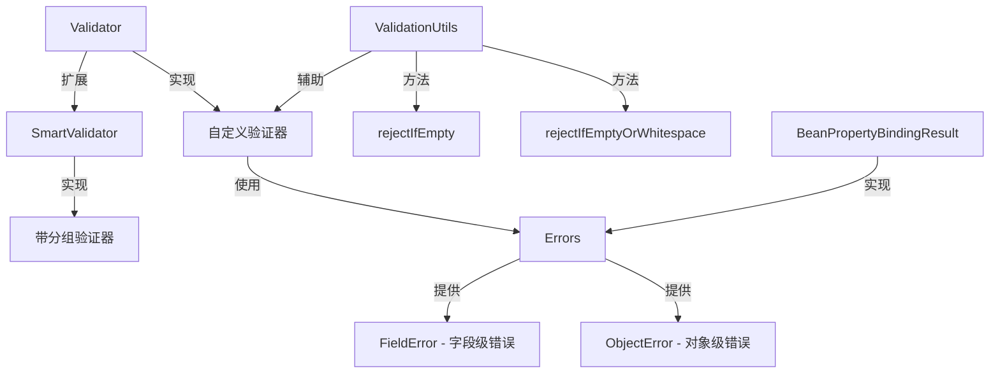

# Validator：Spring 对象验证核心接口

> 本文档介绍 Spring Framework 的 `Validator` 接口，这是 Spring MVC 数据绑定与验证的基础，用于在运行时校验对象的业务规则。

---

## 📥 01. 一句话定义

**Validator** 是 Spring 的对象验证抽象接口，通过 `supports()` 判断是否支持某类型，通过 `validate()` 执行验证逻辑并将错误收集到 `Errors` 对象中。它是 Spring MVC 表单验证、数据绑定校验的底层实现。

---

## 🔍 02. 背景与痛点

### 现状：散落各处的验证代码

在没有统一验证抽象之前，验证逻辑通常散落在业务代码中：

```java
public void createUser(User user) {
    // 验证逻辑与业务逻辑混杂
    if (user.getUsername() == null || user.getUsername().isEmpty()) {
        throw new IllegalArgumentException("用户名不能为空");
    }
    if (user.getEmail() == null || !user.getEmail().contains("@")) {
        throw new IllegalArgumentException("邮箱格式不正确");
    }
    // 业务逻辑...
    userRepository.save(user);
}
```

### 痛点：硬编码验证的问题

| 问题 | 说明 |
|------|------|
| **职责不清** | 验证逻辑与业务逻辑混杂在一起 |
| **难以复用** | 相同的验证规则需要重复编写 |
| **错误处理不统一** | 有的抛异常、有的返回错误码，风格不一 |
| **无法批量收集错误** | 只能发现第一个错误，用户体验差 |
| **难以测试** | 验证逻辑嵌入业务代码，无法单独测试 |

### 价值：Validator 的优势

| 优势 | 说明 |
|------|------|
| **职责分离** | 验证逻辑独立成类，与业务代码解耦 |
| **可复用** | 同一个 Validator 可用于多处 |
| **批量错误收集** | 通过 Errors 对象收集所有验证错误 |
| **统一错误模型** | FieldError、ObjectError 标准化错误表示 |
| **与 Spring MVC 集成** | 无缝接入 Controller 数据绑定 |

---

## ⚙️ 03. 核心机制

### Validator 接口定义

```java
public interface Validator {
    
    /**
     * 判断该验证器是否支持验证给定的类
     */
    boolean supports(Class<?> clazz);
    
    /**
     * 执行验证逻辑，将错误添加到 errors 对象
     */
    void validate(Object target, Errors errors);
}
```

### SmartValidator 接口（扩展）

```java
public interface SmartValidator extends Validator {
    
    /**
     * 带验证提示（分组）的验证方法
     * @param validationHints 验证分组（如 JSR-303 的 Group）
     */
    void validate(Object target, Errors errors, Object... validationHints);
}
```

### 核心组件关系



### Errors 接口核心方法

| 方法 | 说明 |
|------|------|
| `reject(errorCode, defaultMessage)` | 添加全局错误（对象级） |
| `rejectValue(field, errorCode, defaultMessage)` | 添加字段级错误 |
| `hasErrors()` | 是否有任何错误 |
| `getFieldErrors()` | 获取所有字段错误 |
| `getGlobalErrors()` | 获取所有全局错误 |

### ValidationUtils 工具类

Spring 提供的验证工具类，简化常见的空值检查：

```java
// 字段为 null 或空字符串时拒绝
ValidationUtils.rejectIfEmpty(errors, "username", "username.required");

// 字段为 null、空字符串或只有空白字符时拒绝
ValidationUtils.rejectIfEmptyOrWhitespace(errors, "email", "email.required");
```

---

## 💻 04. 实战演示

### 示例 1：基础 Validator 实现

```java
/**
 * User 对象的自定义验证器
 */
public class UserValidator implements Validator {

    @Override
    public boolean supports(Class<?> clazz) {
        return User.class.isAssignableFrom(clazz);
    }

    @Override
    public void validate(Object target, Errors errors) {
        User user = (User) target;

        // 使用工具类检查空值
        ValidationUtils.rejectIfEmptyOrWhitespace(errors, "username", 
                "username.required", "用户名不能为空");
        ValidationUtils.rejectIfEmptyOrWhitespace(errors, "email", 
                "email.required", "邮箱不能为空");

        // 自定义验证：用户名长度
        String username = user.getUsername();
        if (username != null && (username.length() < 3 || username.length() > 20)) {
            errors.rejectValue("username", "username.length", 
                    "用户名长度必须在 3-20 个字符之间");
        }

        // 自定义验证：邮箱格式
        String email = user.getEmail();
        if (email != null && !email.contains("@")) {
            errors.rejectValue("email", "email.invalid", "邮箱格式不正确");
        }

        // 自定义验证：年龄范围
        Integer age = user.getAge();
        if (age != null && (age < 0 || age > 150)) {
            errors.rejectValue("age", "age.range", "年龄必须在 0-150 之间");
        }
    }
}
```

### 示例 2：使用 Validator

```java
// 创建验证器
UserValidator validator = new UserValidator();

// 创建待验证对象
User user = new User("ab", "invalid-email", 200);

// 创建 Errors 容器
Errors errors = new BeanPropertyBindingResult(user, "user");

// 执行验证
if (validator.supports(user.getClass())) {
    validator.validate(user, errors);
}

// 检查结果
if (errors.hasErrors()) {
    for (FieldError error : errors.getFieldErrors()) {
        System.out.printf("字段 [%s]: %s%n", 
                error.getField(), 
                error.getDefaultMessage());
    }
}
```

### 示例 3：SmartValidator 分组验证

```java
public class SmartUserValidator implements SmartValidator {

    public interface BasicValidation {}   // 基础验证分组
    public interface FullValidation {}    // 完整验证分组

    @Override
    public void validate(Object target, Errors errors, Object... validationHints) {
        User user = (User) target;
        boolean fullValidation = containsHint(validationHints, FullValidation.class);

        // 基础验证：始终执行
        ValidationUtils.rejectIfEmptyOrWhitespace(errors, "username", 
                "username.required", "用户名不能为空");

        // 完整验证：仅在指定分组时执行
        if (fullValidation) {
            if (user.getAge() == null) {
                errors.rejectValue("age", "age.required", "年龄不能为空");
            }
        }
    }
}
```

### 运行输出示例

```
=== Spring Validator 接口用法演示 ===

【1. Validator 基础用法 - UserValidator】
──────────────────────────────────────────────────

场景 1：验证有效用户
  待验证对象: User{username='zhangsan', email='zhangsan@example.com', age=25}
  验证通过: true

场景 2：验证空字段
  待验证对象: User{username='', email='', age=null}
  ✗ 字段 [username]: 用户名不能为空 (错误码: username.required)
  ✗ 字段 [email]: 邮箱不能为空 (错误码: email.required)

场景 3：验证非法值
  待验证对象: User{username='ab', email='invalid-email', age=200}
  ✗ 字段 [username]: 用户名长度必须在 3-20 个字符之间 (错误码: username.length)
  ✗ 字段 [email]: 邮箱格式不正确 (错误码: email.invalid)
  ✗ 字段 [age]: 年龄必须在 0-150 之间 (错误码: age.range)

【2. SmartValidator 分组验证 - SmartUserValidator】
──────────────────────────────────────────────────

场景 1：BasicValidation（仅验证用户名、邮箱）
  待验证对象: User{username='zhangsan', email='zhangsan@example.com', age=null}
  验证通过: true

场景 2：FullValidation（验证所有字段，包括年龄）
  待验证对象: User{username='zhangsan', email='zhangsan@example.com', age=null}
  验证通过: false
  ✗ 字段 [age]: 年龄不能为空 (错误码: age.required)
```

### 关键点拨

1. **supports() 必须正确实现**：返回 `false` 会导致验证被跳过，使用 `isAssignableFrom()` 支持子类。

2. **ValidationUtils 简化空值检查**：避免重复的 `null` 和空字符串判断。

3. **BeanPropertyBindingResult**：是 `Errors` 的常用实现，绑定到 JavaBean 属性。

4. **错误码（errorCode）的作用**：支持国际化，可通过 `MessageSource` 解析为本地化消息。

---

## ⚖️ 05. 选型权衡

### Spring Validator vs JSR-303 (Bean Validation)

| 维度 | Spring Validator | JSR-303 (Bean Validation) |
|------|------------------|---------------------------|
| **规范** | Spring 专有 | Java 标准 (javax.validation) |
| **验证位置** | 编程式（代码中） | 声明式（注解在字段上） |
| **灵活性** | 高，可实现任意逻辑 | 中等，需自定义注解 |
| **跨字段验证** | 简单直接 | 需使用类级约束 |
| **集成方式** | 直接使用 | 需要实现类（如 Hibernate Validator） |

### 适用场景

| 场景 | 推荐方案 |
|------|----------|
| **简单字段约束** | JSR-303 注解（`@NotNull`、`@Size`） |
| **复杂业务规则** | Spring Validator |
| **跨字段关联验证** | Spring Validator |
| **需要 Context 的验证** | Spring Validator（可注入服务） |
| **通用 POJO 验证** | JSR-303 + Hibernate Validator |

### 不适用场景

| 场景 | 原因 | 替代方案 |
|------|------|----------|
| **简单的非空、长度检查** | 过度设计 | 使用 JSR-303 注解 |
| **需要跨系统通用** | Spring 专有接口 | 使用 JSR-303 标准 |

### 组合使用

Spring 支持两者混合使用，通过 `LocalValidatorFactoryBean` 桥接：

```java
@Configuration
public class ValidationConfig {
    
    @Bean
    public Validator validator() {
        return new LocalValidatorFactoryBean();
    }
}
```

---

## 💡 06. 总结与自查

### 核心要点回顾

1. `Validator` 是 Spring 对象验证的核心接口，包含 `supports()` 和 `validate()` 两个方法。
2. `Errors` 接口用于收集验证错误，支持字段级和对象级错误。
3. `SmartValidator` 扩展了 `Validator`，支持分组验证（Validation Hints）。
4. `ValidationUtils` 工具类简化常见的空值检查。
5. Spring Validator 与 JSR-303 可以混合使用，各取所长。

### 自查 Checklist

- [x] 我是否解释清了 Why 而不仅仅是 How？
- [x] 读者是否能通过这个文档快速上手？
- [x] 边界情况（Edge cases）是否已提及？

### 代码示例位置

完整可运行的代码示例位于：

```
spring-validator/src/main/java/io/github/daihaowxg/springvalidator/validator/
├── User.java                # 领域模型
├── UserValidator.java       # Validator 实现
├── SmartUserValidator.java  # SmartValidator 实现（分组验证）
└── ValidatorDemo.java       # 演示主类（可直接运行）
```

运行命令：
```bash
cd spring-validator
mvn exec:java -Dexec.mainClass="io.github.daihaowxg.springvalidator.validator.ValidatorDemo"
```

---

> **延伸阅读**：
> - Spring MVC 中的 `@InitBinder` 可以为 Controller 绑定自定义 Validator
> - `WebDataBinder.addValidators()` 支持多个 Validator 链式验证
> - `@Validated` 注解与 `@Valid` 的区别在于前者支持分组验证
