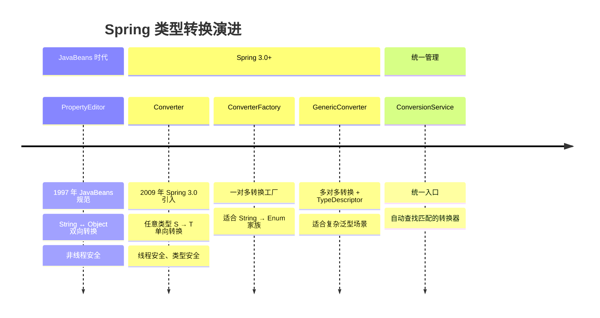
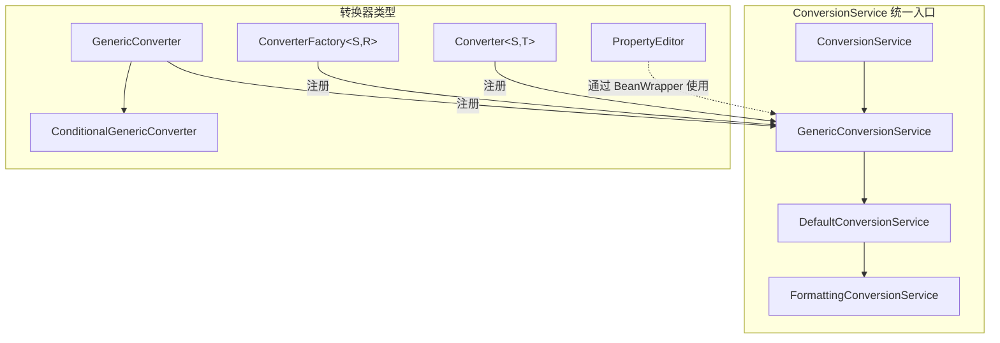
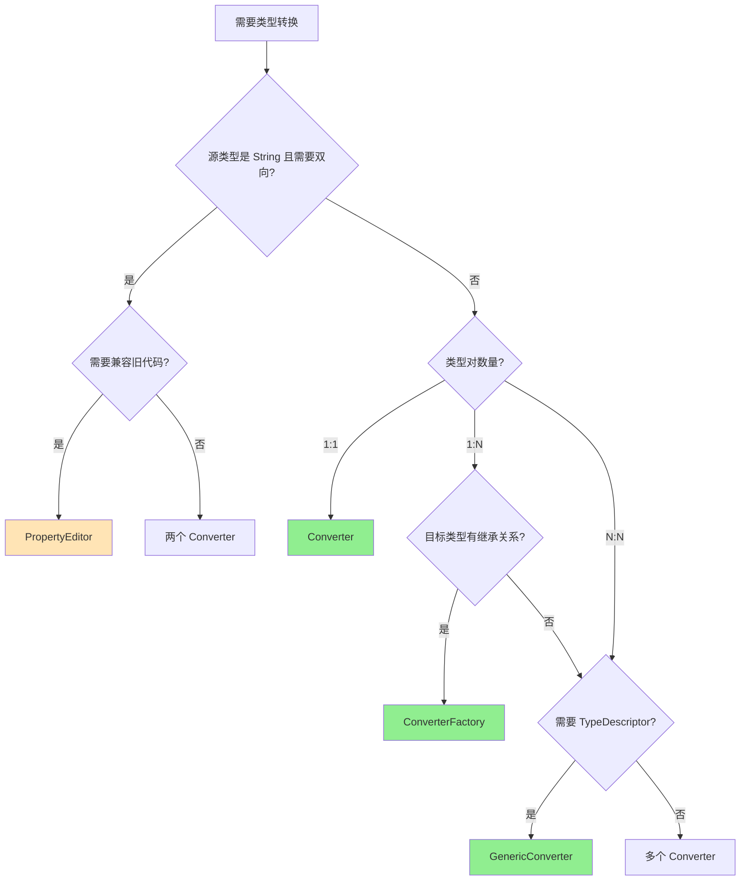

# Spring 类型转换体系综述

> 本文档综合介绍 Spring 类型转换体系的四大核心接口：`PropertyEditor`、`Converter`、`ConverterFactory`、`GenericConverter`，帮助开发者理解它们的设计哲学、适用场景和选型策略。

---

## 📥 01. 一句话定义

**Spring 类型转换体系** 是一套将任意类型 A 转换为类型 B 的机制，从传统的 `PropertyEditor`（String ↔ Object）演进到现代的 `Converter` 家族（任意类型 ↔ 任意类型），由 `ConversionService` 统一管理和调度。

---

## 🔍 02. 演进脉络



---

## ⚙️ 03. 核心接口对比

### 四大接口速览

| 接口 | 源类型 | 目标类型 | 类型关系 | 线程安全 | 复杂度 |
|------|--------|----------|----------|----------|--------|
| `PropertyEditor` | String | Object | 1:1 双向 | ❌ | 低 |
| `Converter<S, T>` | 任意 | 任意 | 1:1 单向 | ✅ | 低 |
| `ConverterFactory<S, R>` | 任意 | R 的子类 | 1:N 单向 | ✅ | 中 |
| `GenericConverter` | 任意 | 任意 | N:N 单向 | ✅ | 高 |

### 接口签名对比

```java
// 1️⃣ PropertyEditor - JavaBeans 规范
public interface PropertyEditor {
    void setAsText(String text);    // String → Object
    String getAsText();             // Object → String
}

// 2️⃣ Converter - 1:1 类型转换
@FunctionalInterface
public interface Converter<S, T> {
    T convert(S source);            // S → T
}

// 3️⃣ ConverterFactory - 1:N 类型转换
public interface ConverterFactory<S, R> {
    <T extends R> Converter<S, T> getConverter(Class<T> targetType);
}

// 4️⃣ GenericConverter - N:N 类型转换
public interface GenericConverter {
    Set<ConvertiblePair> getConvertibleTypes();
    Object convert(Object source, TypeDescriptor sourceType, TypeDescriptor targetType);
}
```

### 组件关系图



---

## 💻 04. 选型决策树



### 选型速查表

| 场景 | 推荐接口 | 理由 |
|------|----------|------|
| String → 自定义类型 | `Converter` | 简单直接，线程安全 |
| String → 所有枚举类型 | `ConverterFactory` | 一个工厂覆盖所有 Enum |
| 多种数字类型 → Money | `GenericConverter` | 多对一，共享转换逻辑 |
| String → `List<T>` | `GenericConverter` | 需要泛型信息 |
| 需要双向转换 | 两个 `Converter` | 比 PropertyEditor 更现代 |
| 兼容 JavaBeans | `PropertyEditor` | 旧项目或特殊需求 |

---

## ⚖️ 05. 优劣对比

### PropertyEditor

| 优点 | 缺点 |
|------|------|
| ✅ 双向转换 | ❌ 源类型只能是 String |
| ✅ JavaBeans 标准 | ❌ 非线程安全 |
| ✅ Spring 深度集成 | ❌ 接口臃肿（含 GUI 方法） |

### Converter

| 优点 | 缺点 |
|------|------|
| ✅ 任意类型转换 | ❌ 只能单向转换 |
| ✅ 线程安全 | ❌ 无法访问泛型信息 |
| ✅ 函数式接口，简洁 | |
| ✅ 类型安全 | |

### ConverterFactory

| 优点 | 缺点 |
|------|------|
| ✅ 一个工厂多个转换器 | ❌ 目标类型必须有继承关系 |
| ✅ 自动扩展新类型 | ❌ 比 Converter 复杂 |
| ✅ 消除重复代码 | |

### GenericConverter

| 优点 | 缺点 |
|------|------|
| ✅ 多对多类型转换 | ❌ 复杂度最高 |
| ✅ 访问完整 TypeDescriptor | ❌ 需要手动处理类型匹配 |
| ✅ 支持条件转换 | |

---

## 💡 06. 最佳实践

### 1. 选型原则：最小复杂度

```
Converter > ConverterFactory > GenericConverter > PropertyEditor
```

> [!TIP]
> 从左到右尝试，只有当左侧无法满足需求时才使用右侧更复杂的接口。

### 2. 注册方式

| 接口 | 注册方式 |
|------|----------|
| `PropertyEditor` | `CustomEditorConfigurer` |
| `Converter` | `ConversionService.addConverter()` |
| `ConverterFactory` | `ConversionService.addConverterFactory()` |
| `GenericConverter` | `ConversionService.addConverter()` |

### 3. Spring Boot 自动配置

Spring Boot 自动配置了 `DefaultFormattingConversionService`，只需将 Converter 声明为 `@Component` 即可自动注册：

```java
@Component
public class StringToAddressConverter implements Converter<String, Address> {
    @Override
    public Address convert(String source) {
        // ...
    }
}
```

### 4. 常见陷阱

| 陷阱 | 说明 | 解决方案 |
|------|------|----------|
| PropertyEditor 非线程安全 | 多线程共享会出问题 | 使用 Converter |
| Converter 无法双向 | 需要两个实现 | 分别实现 A→B 和 B→A |
| ConverterFactory 目标类型无继承关系 | 无法使用工厂模式 | 使用 GenericConverter |
| GenericConverter 过度使用 | 代码复杂难维护 | 优先用简单接口 |

---

## 📚 子模块文档

| 模块 | 文档 | 说明 |
|------|------|------|
| [property-editor](file:///Users/wxg/my-projects/daihaowxg/spring-samples/sample03-spring-reading/spring-convert/property-editor/docs/PropertyEditor属性编辑器.md) | PropertyEditor 属性编辑器 | JavaBeans 规范，String ↔ Object |
| [converter](file:///Users/wxg/my-projects/daihaowxg/spring-samples/sample03-spring-reading/spring-convert/converter/docs/Converter类型转换器.md) | Converter 类型转换器 | 1:1 类型转换，推荐首选 |
| [converter-factory](file:///Users/wxg/my-projects/daihaowxg/spring-samples/sample03-spring-reading/spring-convert/converter-factory/docs/ConverterFactory接口.md) | ConverterFactory 转换工厂 | 1:N 类型转换 |
| [generic-converter](file:///Users/wxg/my-projects/daihaowxg/spring-samples/sample03-spring-reading/spring-convert/generic-converter/docs/GenericConverter泛型转换器.md) | GenericConverter 泛型转换器 | N:N + TypeDescriptor |

---

## 🔗 延伸阅读

- **Formatter 接口**：结合 Converter 和格式化，适用于日期、货币等需要本地化的场景
- **ConversionService SPI**：`org.springframework.core.convert.ConversionService`
- **Spring Boot 自动配置**：`WebMvcAutoConfiguration` 中的 `mvcConversionService`

---

> **总结**：Spring 类型转换体系从 PropertyEditor 演进到 Converter 家族，核心目标是提供灵活、类型安全、线程安全的类型转换能力。新项目应优先使用 Converter，按需选择 ConverterFactory 或 GenericConverter，仅在兼容旧代码时使用 PropertyEditor。
