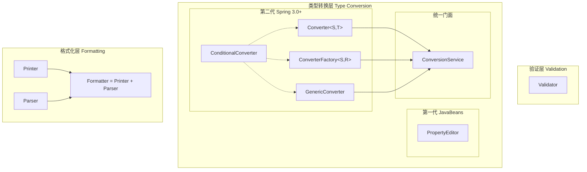
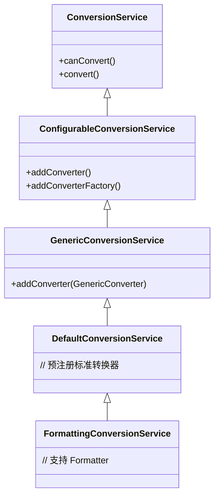

# Spring 类型处理体系分类

> 本文档对 Spring 中与**验证**、**类型转换**、**格式化**相关的核心接口进行系统分类，帮助开发者快速理解各接口的职责边界与适用场景。

---

## 📊 总览

Spring 类型处理体系可按**功能职责**分为三层：



---

## 1️⃣ 验证层 (Validation)

**职责**：对象业务规则校验，与类型转换**无关**。

| 接口 | 全限定名 | 职责 |
|------|----------|------|
| **Validator** | `org.springframework.validation.Validator` | 验证目标对象是否满足业务约束 |

### 接口签名

```java
public interface Validator {
    // 判断是否支持验证该类型
    boolean supports(Class<?> clazz);
    
    // 执行验证，错误信息写入 Errors
    void validate(Object target, Errors errors);
}
```

### 适用场景

- 表单提交校验
- 业务规则验证（如：订单金额 > 0）
- 跨字段联合校验（如：确认密码 = 密码）

---

## 2️⃣ 类型转换层 (Type Conversion)

**职责**：将类型 A 的值转换为类型 B。

### 2.1 第一代：JavaBeans 规范

| 接口 | 全限定名 | 转换方向 | 线程安全 |
|------|----------|----------|----------|
| **PropertyEditor** | `java.beans.PropertyEditor` | `String ↔ Object` 双向 | ❌ |

```java
public interface PropertyEditor {
    void setAsText(String text);   // String → Object
    String getAsText();            // Object → String
}
```

> [!WARNING]
> PropertyEditor 为 JDK 原生接口，非线程安全，新项目应优先使用 Converter。

---

### 2.2 第二代：Spring 3.0+ 原生体系

#### 2.2.1 Converter（1:1 单一类型对转换）

| 接口 | 全限定名 | 类型关系 |
|------|----------|----------|
| **Converter\<S, T\>** | `org.springframework.core.convert.converter.Converter` | 1:1 单向 |

```java
@FunctionalInterface
public interface Converter<S, T> {
    T convert(S source);  // S → T
}
```

**适用场景**：简单的类型转换，如 `String → LocalDate`

---

#### 2.2.2 ConverterFactory（1:N 工厂模式转换）

| 接口 | 全限定名 | 类型关系 |
|------|----------|----------|
| **ConverterFactory\<S, R\>** | `org.springframework.core.convert.converter.ConverterFactory` | 1:N 单向 |

```java
public interface ConverterFactory<S, R> {
    <T extends R> Converter<S, T> getConverter(Class<T> targetType);
}
```

**适用场景**：一个源类型 → 一族目标类型，如 `String → Enum<?>`

---

#### 2.2.3 GenericConverter（N:N 多类型对转换）

| 接口 | 全限定名 | 类型关系 |
|------|----------|----------|
| **GenericConverter** | `org.springframework.core.convert.converter.GenericConverter` | N:N 单向 |

```java
public interface GenericConverter {
    Set<ConvertiblePair> getConvertibleTypes();
    Object convert(Object source, TypeDescriptor sourceType, TypeDescriptor targetType);
}
```

**适用场景**：
- 多种源类型 → 单一目标类型（如 `Number/String → Money`）
- 需要运行时泛型信息（如 `String → List<T>`）

---

#### 2.2.4 ConditionalConverter（条件匹配增强）

| 接口 | 全限定名 | 职责 |
|------|----------|------|
| **ConditionalConverter** | `org.springframework.core.convert.converter.ConditionalConverter` | 为 Converter 添加条件匹配能力 |

```java
public interface ConditionalConverter {
    boolean matches(TypeDescriptor sourceType, TypeDescriptor targetType);
}
```

**设计模式**：Mixin 接口，与 `Converter`、`ConverterFactory`、`GenericConverter` 组合使用。

**组合示例**：

```java
// 条件 Converter
public interface ConditionalConverter extends Converter<S, T>, ConditionalConverter {}

// 条件 GenericConverter (Spring 内置)
public interface ConditionalGenericConverter extends GenericConverter, ConditionalConverter {}
```

---

### 2.3 统一门面：ConversionService

| 接口 | 全限定名 | 职责 |
|------|----------|------|
| **ConversionService** | `org.springframework.core.convert.ConversionService` | 统一管理所有转换器，对外提供 `convert()` API |

```java
public interface ConversionService {
    boolean canConvert(Class<?> sourceType, Class<?> targetType);
    <T> T convert(Object source, Class<T> targetType);
}
```

**实现类继承关系**：



---

## 3️⃣ 格式化层 (Formatting)

**职责**：面向用户展示的格式化与解析，支持国际化（Locale）。

| 接口 | 全限定名 | 方向 | 职责 |
|------|----------|------|------|
| **Printer\<T\>** | `org.springframework.format.Printer` | T → String | 将对象格式化为展示字符串 |
| **Parser\<T\>** | `org.springframework.format.Parser` | String → T | 将用户输入解析为对象 |

### 接口签名

```java
@FunctionalInterface
public interface Printer<T> {
    String print(T object, Locale locale);
}

@FunctionalInterface
public interface Parser<T> {
    T parse(String text, Locale locale) throws ParseException;
}
```

### Formatter = Printer + Parser

```java
public interface Formatter<T> extends Printer<T>, Parser<T> {
    // 组合接口，无额外方法
}
```

### 与 Converter 的区别

| 对比项 | Converter | Formatter |
|--------|-----------|-----------|
| **Locale 支持** | ❌ | ✅ |
| **应用场景** | 后端类型转换 | 前端展示/输入 |
| **典型用途** | `String → Integer` | 日期、货币格式化 |

---

## 🔀 接口关系总结

### 按功能分类

| 层级 | 接口 | 核心职责 |
|------|------|----------|
| **验证层** | `Validator` | 业务规则校验 |
| **转换层-遗留** | `PropertyEditor` | String ↔ Object |
| **转换层-现代** | `Converter` | 1:1 类型转换 |
| **转换层-现代** | `ConverterFactory` | 1:N 工厂转换 |
| **转换层-现代** | `GenericConverter` | N:N 泛型转换 |
| **转换层-增强** | `ConditionalConverter` | 条件匹配能力 |
| **转换层-门面** | `ConversionService` | 统一调度入口 |
| **格式化层** | `Printer` | 对象 → 展示字符串 |
| **格式化层** | `Parser` | 用户输入 → 对象 |

### 按复杂度排序

```
简单 ←────────────────────────────→ 复杂

Converter < ConverterFactory < GenericConverter

Printer/Parser（独立） < Formatter（组合）
```

---

## 🎯 选型决策表

| 场景 | 推荐接口 | 理由 |
|------|----------|------|
| 简单类型转换 | `Converter` | 函数式接口，简洁 |
| String → 枚举家族 | `ConverterFactory` | 一个工厂覆盖所有枚举 |
| 需要泛型信息 | `GenericConverter` | TypeDescriptor 支持 |
| 按条件选择转换器 | `ConditionalConverter` | Mixin 增强 |
| 需要 Locale 格式化 | `Formatter` | 支持国际化 |
| 业务规则校验 | `Validator` | 非类型转换 |
| 兼容旧系统 | `PropertyEditor` | 仅限遗留代码 |

---

## 📚 相关文档

| 文档 | 说明 |
|------|------|
| [Spring类型转换体系综述](file:///Users/wxg/my-projects/daihaowxg/spring-samples/sample03-spring-reading/spring-convert/docs/Spring类型转换体系综述.md) | 四大转换接口详解 |
| [PropertyEditor属性编辑器](file:///Users/wxg/my-projects/daihaowxg/spring-samples/sample03-spring-reading/spring-convert/property-editor/docs/PropertyEditor属性编辑器.md) | PropertyEditor 详解 |

---

> **总结**：Spring 类型处理体系分为验证、转换、格式化三层。验证由 `Validator` 负责；类型转换从 `PropertyEditor` 演进到 `Converter` 家族，由 `ConversionService` 统一管理；格式化由 `Printer`/`Parser` 提供 Locale 感知的双向转换能力。
