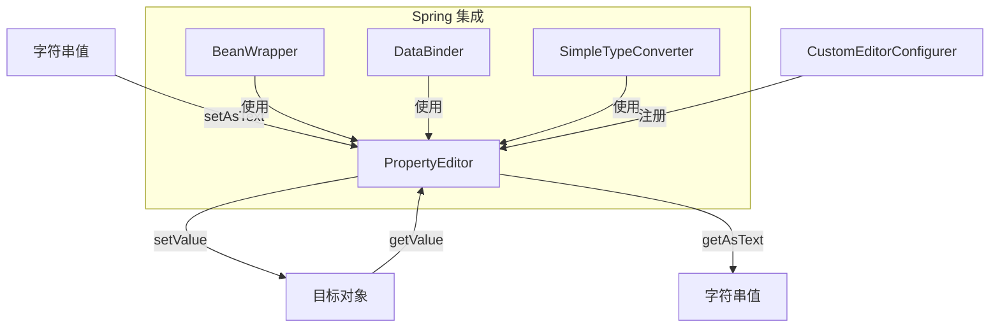

# PropertyEditor：Spring 属性类型转换器

> 本文档介绍 Java `PropertyEditor` 接口及其在 Spring 框架中的应用，用于实现 String ↔ Object 的双向转换，是 Spring 数据绑定机制的基础组件之一。

---

## 📥 01. 一句话定义

**PropertyEditor** 是 JavaBeans 规范定义的属性编辑器接口，用于在 **String** 与 **任意 Java 类型** 之间进行双向转换。Spring 利用它将配置文件中的字符串值、HTTP 请求参数等自动转换为 Bean 属性的目标类型。

---

## 🔍 02. 背景与痛点

### 现状：手动类型转换

在没有统一的类型转换机制之前，开发者需要手动处理类型转换：

```java
@Bean
public DataSource dataSource() {
    String portStr = env.getProperty("db.port");
    int port = Integer.parseInt(portStr);  // 手动转换
    
    String dateStr = env.getProperty("db.created");
    Date date = new SimpleDateFormat("yyyy-MM-dd").parse(dateStr);  // 手动转换
    
    // ... 创建 DataSource
}
```

### 痛点：手动转换的问题

| 问题 | 说明 |
|------|------|
| **重复代码** | 每处使用都要写相同的转换逻辑 |
| **容易出错** | 格式不统一，容易产生 Bug |
| **不可扩展** | 新类型需要到处添加转换代码 |
| **难以测试** | 转换逻辑分散在业务代码中 |

### 价值：PropertyEditor 的优势

| 优势 | 说明 |
|------|------|
| **统一入口** | 一个类型一个 Editor，集中管理 |
| **自动转换** | 框架自动调用，无需手动介入 |
| **可复用** | 一次编写，处处可用 |
| **易于测试** | 转换逻辑独立，可单独测试 |
| **Spring 深度集成** | 配置文件、数据绑定自动生效 |

---

## ⚙️ 03. 核心机制

### PropertyEditor 接口

```java
public interface PropertyEditor {
    // String → Object
    void setAsText(String text) throws IllegalArgumentException;
    
    // Object → String
    String getAsText();
    
    // 存取值
    void setValue(Object value);
    Object getValue();
    
    // ... 其他 GUI 相关方法（Spring 中不常用）
}
```

> **实践建议**：继承 `PropertyEditorSupport`，只需重写 `setAsText()` 和 `getAsText()` 两个方法。

### 核心组件关系



### PropertyEditor 工作流程

1. **获取字符串值**：从配置文件、HTTP 参数等获取原始字符串
2. **查找 Editor**：根据目标类型查找对应的 PropertyEditor
3. **调用 setAsText**：将字符串转换为目标对象
4. **设置属性**：通过 setValue 将对象设置到 Bean 属性

### Spring 内置 PropertyEditor

| Editor 类 | 目标类型 | 说明 |
|-----------|----------|------|
| `CustomNumberEditor` | Number | 数字类型转换 |
| `CustomBooleanEditor` | Boolean | 布尔类型转换 |
| `CustomDateEditor` | Date | 日期类型转换 |
| `StringTrimmerEditor` | String | 字符串修剪 |
| `URLEditor` | URL | URL 转换 |
| `FileEditor` | File | 文件路径转换 |
| `ClassEditor` | Class | 类名转换 |
| `ResourceEditor` | Resource | 资源路径转换 |

---

## 💻 04. 实战演示

### 示例 1：自定义 Address 类型转换

```java
// 1️⃣ 定义目标类型
public class Address {
    private String province;
    private String city;
    private String street;
    
    public Address(String province, String city, String street) {
        this.province = province;
        this.city = city;
        this.street = street;
    }
    // getter/setter 省略
}

// 2️⃣ 实现 PropertyEditor
public class AddressEditor extends PropertyEditorSupport {

    @Override
    public void setAsText(String text) throws IllegalArgumentException {
        if (text == null || text.isBlank()) {
            setValue(null);
            return;
        }
        String[] parts = text.split("/");
        if (parts.length != 3) {
            throw new IllegalArgumentException("地址格式错误，期望 '省/市/街道'");
        }
        setValue(new Address(parts[0].trim(), parts[1].trim(), parts[2].trim()));
    }

    @Override
    public String getAsText() {
        Address addr = (Address) getValue();
        return addr == null ? "" 
            : addr.getProvince() + "/" + addr.getCity() + "/" + addr.getStreet();
    }
}
```

### 示例 2：直接使用 PropertyEditor

```java
// 创建 Editor 实例
AddressEditor editor = new AddressEditor();

// String → Address
editor.setAsText("广东省/深圳市/南山区");
Address address = (Address) editor.getValue();
System.out.println(address);  // Address{province='广东省', city='深圳市', street='南山区'}

// Address → String
editor.setValue(new Address("北京市", "朝阳区", "建国路"));
String text = editor.getAsText();
System.out.println(text);  // 北京市/朝阳区/建国路
```

### 示例 3：Spring 容器注册

```java
@Configuration
public class PropertyEditorConfig {

    @Bean
    public static CustomEditorConfigurer customEditorConfigurer() {
        CustomEditorConfigurer configurer = new CustomEditorConfigurer();
        
        Map<Class<?>, Class<? extends PropertyEditor>> editors = new HashMap<>();
        editors.put(Address.class, AddressEditor.class);
        configurer.setCustomEditors(editors);
        
        return configurer;
    }
}
```

### 运行输出示例

```
=== PropertyEditor 接口用法演示 ===

【1. 直接使用 PropertyEditor】
  [AddressEditor] setAsText: "广东省/深圳市/南山区" → Address{...}
转换结果: Address{province='广东省', city='深圳市', street='南山区'}
  [AddressEditor] getAsText: Address{...} → "北京市/朝阳区/建国路"
转换结果: 北京市/朝阳区/建国路

【2. 使用 Spring SimpleTypeConverter】
  [AddressEditor] setAsText: "上海市/浦东新区/陆家嘴" → Address{...}
转换结果: Address{province='上海市', city='浦东新区', street='陆家嘴'}

【3. Spring 容器集成】
[PropertyEditorConfig] 已注册自定义 PropertyEditor:
  - Address.class → AddressEditor.class
```

### 关键点拨

1. **继承 PropertyEditorSupport**：避免实现大量无用的 GUI 方法
2. **静态注册 vs 非静态**：`CustomEditorConfigurer` 的 `@Bean` 方法必须是 `static`，因为它是 `BeanFactoryPostProcessor`
3. **线程安全**：PropertyEditor 不是线程安全的，每次使用需创建新实例（customEditors 方式会自动创建新实例）

---

## ⚖️ 05. 选型权衡

### 适用场景

| 场景 | 示例 |
|------|------|
| **配置属性转换** | 将 properties 中的字符串转为复杂对象 |
| **表单数据绑定** | HTTP 请求参数转为 Java 对象 |
| **自定义类型** | 需要统一的 String ↔ Object 转换 |

### 不适用场景

| 场景 | 原因 | 替代方案 |
|------|------|----------|
| **非 String 源类型** | PropertyEditor 只能处理 String 源 | 使用 `Converter<S, T>` |
| **复杂转换逻辑** | 需要依赖其他 Bean | 使用 `ConversionService` |
| **泛型类型** | 无法处理 `List<Address>` | 使用 `GenericConverter` |
| **需要 Spring 容器特性** | 无法注入依赖 | 使用 `Converter` + `@Component` |

### PropertyEditor vs Converter

| 维度 | PropertyEditor | Converter |
|------|----------------|-----------|
| 来源 | JavaBeans 规范 | Spring 3.0+ |
| 源类型 | 只能是 String | 任意类型 |
| 线程安全 | 否 | 是 |
| Spring 集成 | 需要专门注册 | 通过 ConversionService 统一管理 |
| **推荐程度** | 旧项目或特殊场景 | **新项目优先使用** |

> [!TIP]
> **建议**：新项目优先使用 Spring 的 `Converter` 接口，它更加灵活、类型安全且线程安全。PropertyEditor 适合需要兼容 JavaBeans 规范的场景。

---

## 💡 06. 总结与自查

### 核心要点回顾

1. `PropertyEditor` 是 JavaBeans 规范的接口，实现 String ↔ Object 双向转换
2. 继承 `PropertyEditorSupport`，只需重写 `setAsText()` 和 `getAsText()`
3. 通过 `CustomEditorConfigurer` 将自定义 Editor 注册到 Spring 容器
4. Spring 提供多个内置 PropertyEditor（CustomDateEditor、URLEditor 等）
5. 新项目建议使用 `Converter` 接口替代

### 自查 Checklist

- [x] 我是否解释清了 Why 而不仅仅是 How？
- [x] 读者是否能通过这个文档快速上手？
- [x] 边界情况（Edge cases）是否已提及？

### 代码示例位置

完整可运行的代码示例位于：

```
property-editor/src/main/java/io/github/daihaowxg/propertyeditor/editor/
├── Address.java              # 自定义地址类型
├── AddressEditor.java        # 地址 PropertyEditor
├── DateEditor.java           # 日期 PropertyEditor
├── PropertyEditorConfig.java # Spring 配置类
└── PropertyEditorDemo.java   # 演示主类（可直接运行）
```

运行命令：
```bash
cd sample03-spring-reading/property-editor
mvn compile exec:java -Dexec.mainClass="io.github.daihaowxg.propertyeditor.editor.PropertyEditorDemo"
```

---

> **延伸阅读**：Spring 3.0 引入的 `Converter` 和 `ConversionService` 是更现代的类型转换方案，支持任意类型间转换且线程安全。建议同时了解 `org.springframework.core.convert` 包下的相关类。
