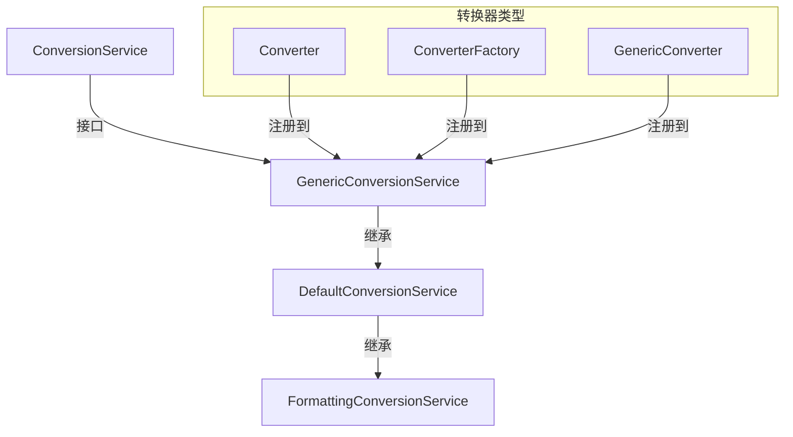

# Converter：Spring 类型转换器

> 本文档介绍 Spring 3.0+ 引入的 `Converter` 接口，这是一个类型安全、线程安全的类型转换机制，用于替代传统的 `PropertyEditor`。

---

## 📥 01. 一句话定义

**Converter** 是 Spring 的类型转换接口，将任意源类型 `S` 转换为目标类型 `T`（`Converter<S, T>`）。它是线程安全的单例，通过 `ConversionService` 统一管理，是 Spring 数据绑定的现代化解决方案。

---

## 🔍 02. 背景与痛点

### 现状：PropertyEditor 的局限

在 Spring 3.0 之前，类型转换主要依赖 `PropertyEditor`：

```java
public class AddressEditor extends PropertyEditorSupport {
    @Override
    public void setAsText(String text) {
        // 只能处理 String → Object
        setValue(parseAddress(text));
    }
}
```

### 痛点：PropertyEditor 的问题

| 问题 | 说明 |
|------|------|
| **源类型受限** | 只能从 String 转换，无法处理 Integer → Enum 等场景 |
| **非线程安全** | 每次使用需要创建新实例，性能较差 |
| **上下文不足** | 无法感知泛型参数，如 `List<Address>` |
| **接口臃肿** | 继承自 JavaBeans 规范，包含大量 GUI 相关方法 |

### 价值：Converter 的优势

| 优势 | 说明 |
|------|------|
| **任意类型** | 支持 `S → T` 任意类型间转换 |
| **线程安全** | 无状态单例，可安全共享 |
| **类型安全** | 编译时类型检查 |
| **接口简洁** | 函数式接口，只有一个 `convert()` 方法 |
| **统一管理** | 通过 ConversionService 集中管理 |

---

## ⚙️ 03. 核心机制

### Converter 接口

```java
@FunctionalInterface
public interface Converter<S, T> {
    T convert(S source);
}
```

- **S**：源类型（Source）
- **T**：目标类型（Target）
- **单向转换**：如需双向，需实现两个 Converter

### ConversionService 体系



### 转换器层次

| 接口 | 说明 | 适用场景 |
|------|------|----------|
| `Converter<S, T>` | 1:1 类型转换 | String → Address |
| `ConverterFactory<S, R>` | 1:N 类型转换 | String → Enum 家族 |
| `GenericConverter` | N:N 类型转换 | 复杂泛型场景 |

### ConversionService 方法

| 方法 | 说明 |
|------|------|
| `canConvert(S, T)` | 检查是否支持 S → T 转换 |
| `convert(source, T)` | 执行转换 |
| `convert(source, TypeDescriptor)` | 支持泛型的转换 |

---

## 💻 04. 实战演示

### 示例 1：实现 Converter

```java
public class StringToAddressConverter implements Converter<String, Address> {

    @Override
    public Address convert(String source) {
        if (source == null || source.isBlank()) {
            return null;
        }
        String[] parts = source.split("/");
        if (parts.length != 3) {
            throw new IllegalArgumentException("格式错误，期望 '省/市/街道'");
        }
        return new Address(parts[0], parts[1], parts[2]);
    }
}
```

### 示例 2：使用 DefaultConversionService

```java
DefaultConversionService service = new DefaultConversionService();

// 注册自定义 Converter
service.addConverter(new StringToAddressConverter());
service.addConverter(new AddressToStringConverter());

// 执行转换
Address addr = service.convert("广东省/深圳市/南山区", Address.class);
String text = service.convert(addr, String.class);

// 检查转换能力
boolean can = service.canConvert(String.class, Address.class); // true
```

### 示例 3：Spring 容器集成

```java
@Configuration
public class ConverterConfig {

    @Bean
    public FormattingConversionServiceFactoryBean conversionService() {
        FormattingConversionServiceFactoryBean factory = 
            new FormattingConversionServiceFactoryBean();
        
        Set<Object> converters = new HashSet<>();
        converters.add(new StringToAddressConverter());
        converters.add(new AddressToStringConverter());
        factory.setConverters(converters);
        
        return factory;
    }
}
```

### 运行输出示例

```
=== Spring Converter 接口用法演示 ===

【1. 直接使用 Converter】
  [StringToAddressConverter] "广东省/深圳市/南山区" → Address{...}
转换结果: Address{province='广东省', city='深圳市', street='南山区'}

【2. 使用 DefaultConversionService】
  [StringToAddressConverter] "上海市/浦东新区/陆家嘴" → Address{...}
转换结果: Address{province='上海市', city='浦东新区', street='陆家嘴'}
String → Address 可转换: true

【3. Spring 容器集成】
ConversionService 类型: DefaultFormattingConversionService
转换结果: Address{province='浙江省', city='杭州市', street='西湖区'}
```

### 关键点拨

1. **无状态设计**：Converter 应该是无状态的，可安全共享
2. **空值处理**：`convert()` 方法应处理 null 输入
3. **异常抛出**：格式错误时应抛出 `IllegalArgumentException`

---

## ⚖️ 05. 选型权衡

### Converter vs PropertyEditor

| 维度 | Converter | PropertyEditor |
|------|-----------|----------------|
| 源类型 | **任意类型** | 只能是 String |
| 线程安全 | **是** | 否 |
| 接口设计 | **函数式，简洁** | 臃肿，含 GUI 代码 |
| 泛型支持 | **通过 GenericConverter** | 不支持 |
| Spring 版本 | 3.0+ | 所有版本 |
| **推荐程度** | ⭐⭐⭐⭐⭐ | ⭐⭐ |

### 适用场景

| 场景 | 推荐 |
|------|------|
| 新项目 | ✅ Converter |
| String → 自定义类型 | ✅ Converter |
| Integer → Enum | ✅ Converter（PropertyEditor 无法实现） |
| 需要泛型支持 | ✅ GenericConverter |

### 不适用场景

| 场景 | 原因 | 替代方案 |
|------|------|----------|
| 需要双向转换快捷方式 | Converter 是单向的 | 实现两个 Converter |
| 需要格式化支持 | 纯转换不含格式 | 使用 `Formatter` |
| 旧项目兼容 | 已有 PropertyEditor 生态 | 保留 PropertyEditor |

---

## 💡 06. 总结与自查

### 核心要点回顾

1. `Converter<S, T>` 是 Spring 3.0+ 的类型转换接口
2. 支持任意类型间转换，线程安全，可作为单例
3. 通过 `ConversionService` 统一管理和调用
4. `ConverterFactory` 用于 1:N 转换，`GenericConverter` 用于复杂泛型
5. **新项目应优先使用 Converter 替代 PropertyEditor**

### 自查 Checklist

- [x] 我是否解释清了 Why 而不仅仅是 How？
- [x] 读者是否能通过这个文档快速上手？
- [x] 边界情况（Edge cases）是否已提及？

### 代码示例位置

完整可运行的代码示例位于：

```
converter/src/main/java/io/github/daihaowxg/converter/converter/
├── Address.java                  # 自定义地址类型
├── StringToAddressConverter.java # String → Address
├── AddressToStringConverter.java # Address → String
├── StringToDateConverter.java    # String → Date
├── ConverterConfig.java          # Spring 配置类
└── ConverterDemo.java            # 演示主类（可直接运行）
```

运行命令：
```bash
cd sample03-spring-reading/converter
mvn compile exec:java -Dexec.mainClass="io.github.daihaowxg.converter.converter.ConverterDemo"
```

---

> **延伸阅读**：`Formatter` 接口结合了 Converter 和格式化功能，适用于需要本地化输出的场景（如日期、货币）。`@DateTimeFormat` 和 `@NumberFormat` 注解底层就是基于 Formatter 实现的。
