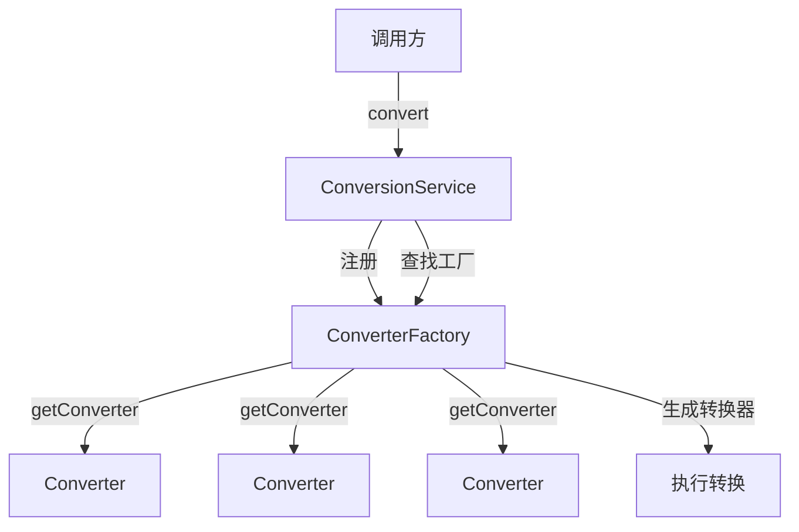

# ConverterFactory：Spring 类型转换工厂

> 本文档介绍 Spring `ConverterFactory` 接口，用于为一组相关类型创建转换器的工厂模式实现，是 Spring 类型转换体系的核心组件之一。

---

## 📥 01. 一句话定义

**ConverterFactory** 是 Spring 提供的类型转换工厂接口，用于创建从一种源类型到一组目标类型的转换器。它通过"一个工厂多个转换器"的模式，避免为每个目标类型单独编写 Converter。

---

## 🔍 02. 背景与痛点

### 现状：为每种类型单独编写 Converter

当需要将字符串转换为多种枚举类型时，传统做法是为每个枚举编写单独的 Converter：

```java
// ❌ 痛点：需要为每个枚举类型编写一个 Converter
public class StringToColorConverter implements Converter<String, Color> {
    @Override
    public Color convert(String source) {
        return Enum.valueOf(Color.class, source.toUpperCase());
    }
}

public class StringToPriorityConverter implements Converter<String, Priority> {
    @Override
    public Priority convert(String source) {
        return Enum.valueOf(Priority.class, source.toUpperCase());
    }
}

// 还有更多枚举类型...每个都要写一遍
```

### 痛点：单独 Converter 的问题

| 问题 | 说明 |
|------|------|
| **重复代码** | 每个枚举的转换逻辑几乎完全相同 |
| **维护困难** | 新增枚举类型需要新增 Converter 并注册 |
| **注册繁琐** | 需要为每个 Converter 单独注册到 ConversionService |
| **代码膨胀** | 类数量随目标类型线性增长 |

### 价值：ConverterFactory 的优势

| 优势 | 说明 |
|------|------|
| **一次实现** | 一个工厂覆盖所有相关类型 |
| **单点注册** | 只需注册一个 ConverterFactory |
| **自动扩展** | 新增目标类型无需修改代码 |
| **代码简洁** | 消除重复的 Converter 类 |

---

## ⚙️ 03. 核心机制

### ConverterFactory 接口

```java
public interface ConverterFactory<S, R> {
    /**
     * 获取从 S 到目标类型 T 的转换器。
     * @param targetType 目标类型（R 的子类型）
     * @return 对应的 Converter
     */
    <T extends R> Converter<S, T> getConverter(Class<T> targetType);
}
```

> **关键设计**：`S` 是源类型，`R` 是目标类型的父类型（如 `Enum`），`T` 是具体的目标类型（如 `Color`）。

### 核心组件关系



### ConverterFactory 工作流程

1. **注册工厂**：将 ConverterFactory 注册到 ConversionService
2. **发起转换**：调用 `conversionService.convert("RED", Color.class)`
3. **查找工厂**：根据源类型(String)和目标类型(Color)查找匹配的 ConverterFactory
4. **获取转换器**：调用 `factory.getConverter(Color.class)` 获取具体 Converter
5. **执行转换**：调用 `converter.convert("RED")` 返回转换结果

### Spring 内置 ConverterFactory

| 工厂类 | 源类型 | 目标类型范围 | 说明 |
|--------|--------|--------------|------|
| `StringToEnumConverterFactory` | String | Enum 子类 | 字符串转枚举 |
| `StringToNumberConverterFactory` | String | Number 子类 | 字符串转数字 |
| `NumberToNumberConverterFactory` | Number | Number 子类 | 数字间转换 |
| `IntegerToEnumConverterFactory` | Integer | Enum 子类 | 整数转枚举（按序号） |

---

## 💻 04. 实战演示

### 示例 1：自定义 StringToEnumConverterFactory

```java
// ConverterFactory 实现：将字符串转换为任意枚举类型
public class StringToEnumConverterFactory implements ConverterFactory<String, Enum> {

    @Override
    @SuppressWarnings({"unchecked", "rawtypes"})
    public <T extends Enum> Converter<String, T> getConverter(Class<T> targetType) {
        return new StringToEnumConverter<>(targetType);
    }

    // 内部 Converter 实现
    private static class StringToEnumConverter<T extends Enum<T>> implements Converter<String, T> {
        private final Class<T> enumType;

        StringToEnumConverter(Class<T> enumType) {
            this.enumType = enumType;
        }

        @Override
        public T convert(String source) {
            if (source == null || source.isBlank()) {
                return null;
            }
            return Enum.valueOf(enumType, source.trim().toUpperCase());
        }
    }
}
```

### 示例 2：直接使用 ConverterFactory

```java
// 创建工厂实例
StringToEnumConverterFactory factory = new StringToEnumConverterFactory();

// 获取 Color 类型的 Converter
Converter<String, Color> colorConverter = factory.getConverter(Color.class);
Color red = colorConverter.convert("red");  // → RED(红色)

// 获取 Priority 类型的 Converter（同一个工厂！）
Converter<String, Priority> priorityConverter = factory.getConverter(Priority.class);
Priority high = priorityConverter.convert("high");  // → HIGH(高)
```

### 示例 3：通过 ConversionService 使用

```java
// 创建 ConversionService 并注册 ConverterFactory
FormattingConversionService conversionService = new FormattingConversionService();
conversionService.addConverterFactory(new StringToEnumConverterFactory());

// 使用统一的 API 进行转换
Color blue = conversionService.convert("blue", Color.class);
Priority medium = conversionService.convert("medium", Priority.class);
```

### 示例 4：Spring 容器集成

```java
@Configuration
public class ConverterFactoryConfig {

    @Bean
    public FormattingConversionService conversionService() {
        FormattingConversionService conversionService = new FormattingConversionService();
        conversionService.addConverterFactory(new StringToEnumConverterFactory());
        return conversionService;
    }
}
```

### 运行输出示例

```
=== ConverterFactory 接口用法演示 ===

【1. 直接使用 ConverterFactory】
  [StringToEnumConverter] "red" → RED(红色)
  [StringToEnumConverter] "GREEN" → GREEN(绿色)
转换结果: RED(红色), GREEN(绿色)
  [StringToEnumConverter] "high" → HIGH(高)
  [StringToEnumConverter] "LOW" → LOW(低)
转换结果: HIGH(高), LOW(低)

【2. 通过 ConversionService 使用】
  [StringToEnumConverter] "blue" → BLUE(蓝色)
  [StringToEnumConverter] "medium" → MEDIUM(中)
Color 转换结果: BLUE(蓝色)
Priority 转换结果: MEDIUM(中)
支持 String → Color: true
支持 String → Priority: true

【3. Spring 容器集成】
[ConverterFactoryConfig] 已注册自定义 ConverterFactory:
  - StringToEnumConverterFactory → 支持所有 Enum 类型的转换
从容器获取的 ConversionService 转换结果:
  Color: RED(红色)
  Priority: HIGH(高)
```

### 关键点拨

1. **泛型设计**：`ConverterFactory<S, R>` 中 `R` 是目标类型的父类型，`getConverter` 返回的 `Converter<S, T>` 中 `T extends R`
2. **线程安全**：与 PropertyEditor 不同，Converter 是线程安全的，可以共享实例
3. **类型匹配**：Spring 根据源类型和目标类型的继承关系自动查找合适的 ConverterFactory

---

## ⚖️ 05. 选型权衡

### 适用场景

| 场景 | 示例 |
|------|------|
| **一对多转换** | String → 所有枚举类型 |
| **共享转换逻辑** | 所有目标类型使用相同的转换算法 |
| **类型家族** | Number → 各种数字类型（Integer, Long, Double 等） |

### 不适用场景

| 场景 | 原因 | 替代方案 |
|------|------|----------|
| **一对一转换** | 过度设计，增加复杂度 | 使用 `Converter<S, T>` |
| **转换逻辑差异大** | 无法共享逻辑，工厂失去意义 | 分别实现 Converter |
| **需要上下文信息** | ConverterFactory 无法访问转换上下文 | 使用 `GenericConverter` |

### Converter vs ConverterFactory vs GenericConverter

| 维度 | Converter | ConverterFactory | GenericConverter |
|------|-----------|------------------|------------------|
| 类型关系 | 1:1（一对一） | 1:N（一对多） | M:N（多对多） |
| 典型场景 | String → Date | String → Enum | 集合类型转换 |
| 复杂度 | 低 | 中 | 高 |
| 上下文访问 | ❌ | ❌ | ✅ |
| **推荐程度** | 默认选择 | 目标类型有父类型关系 | 需要细粒度控制 |

> [!TIP]
> **选择建议**：优先使用 `Converter`（简单直接），当需要为一组相关类型提供转换时使用 `ConverterFactory`，只有在需要访问转换上下文或处理复杂类型时才使用 `GenericConverter`。

---

## 💡 06. 总结与自查

### 核心要点回顾

1. `ConverterFactory<S, R>` 是一个转换器工厂，用于创建从 S 到 R 子类型的转换器
2. 核心方法 `getConverter(Class<T> targetType)` 根据目标类型返回对应的 Converter
3. 适用于"一对多"的转换场景，如 String → 所有枚举类型
4. 通过 `conversionService.addConverterFactory()` 注册到 Spring
5. Spring 提供多个内置 ConverterFactory（StringToEnumConverterFactory 等）

### 自查 Checklist

- [x] 我是否解释清了 Why 而不仅仅是 How？
- [x] 读者是否能通过这个文档快速上手？
- [x] 边界情况（Edge cases）是否已提及？

### 代码示例位置

完整可运行的代码示例位于：

```
converter-factory/src/main/java/io/github/daihaowxg/converterfactory/converter/
├── Color.java                      # 枚举类型：颜色
├── Priority.java                   # 枚举类型：优先级
├── StringToEnumConverterFactory.java  # 核心 ConverterFactory 实现
├── ConverterFactoryConfig.java     # Spring 配置类
└── ConverterFactoryDemo.java       # 演示主类（可直接运行）
```

运行命令：
```bash
cd sample03-spring-reading/converter-factory
mvn compile exec:java -Dexec.mainClass="io.github.daihaowxg.converterfactory.converter.ConverterFactoryDemo"
```

---

> **延伸阅读**：Spring 的类型转换体系还包括 `Converter`（一对一转换）、`GenericConverter`（多对多转换）和 `ConditionalConverter`（条件转换）。建议结合 `org.springframework.core.convert` 包下的相关类深入学习。
