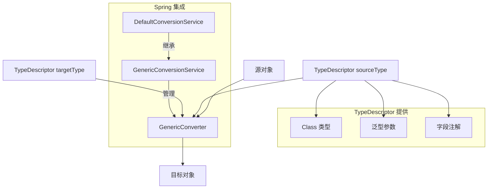
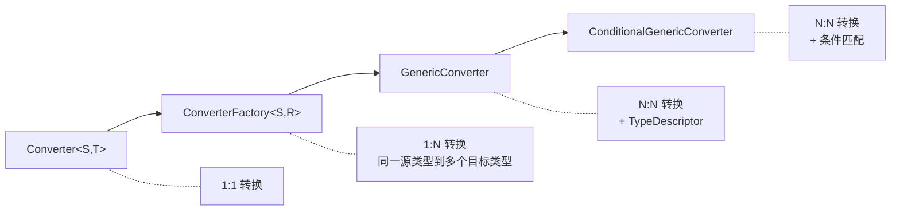

# GenericConverter：Spring 泛型类型转换器

> 本文档介绍 Spring `GenericConverter` 接口，用于实现多对多类型转换及基于 `TypeDescriptor` 的上下文感知转换，是 Spring 类型转换体系中最灵活的转换器接口。

---

## 📥 01. 一句话定义

**GenericConverter** 是 Spring 3.0 引入的高级类型转换接口，允许单个转换器处理**多个源-目标类型对**的转换，并提供 `TypeDescriptor` 上下文信息（如注解、泛型参数），适用于复杂的类型转换场景。

---

## 🔍 02. 背景与痛点

### 现状：简单 Converter 的局限

使用 `Converter<S, T>` 接口时，每个转换器只能处理一种固定的类型对：

```java
// 需要为每种数字类型编写独立的转换器
public class IntegerToMoneyConverter implements Converter<Integer, Money> { }
public class LongToMoneyConverter implements Converter<Long, Money> { }
public class DoubleToMoneyConverter implements Converter<Double, Money> { }
public class BigDecimalToMoneyConverter implements Converter<BigDecimal, Money> { }
```

### 痛点：多类型转换的问题

| 问题 | 说明 |
|------|------|
| **代码重复** | 相似的转换逻辑分散在多个类中 |
| **维护困难** | 修改逻辑需要同时改多个类 |
| **无法访问泛型信息** | 无法知道 `List<T>` 中 T 的具体类型 |
| **无法访问注解** | 无法根据字段注解定制转换行为 |

### 价值：GenericConverter 的优势

| 优势 | 说明 |
|------|------|
| **多对多转换** | 单个类处理多个源-目标类型对 |
| **类型描述符** | 通过 `TypeDescriptor` 访问完整类型信息 |
| **注解感知** | 可读取目标字段上的注解自定义行为 |
| **泛型支持** | 可获取 `Collection<T>` 的元素类型 T |

---

## ⚙️ 03. 核心机制

### GenericConverter 接口

```java
public interface GenericConverter {

    // 返回支持的 (源类型, 目标类型) 对集合
    Set<ConvertiblePair> getConvertibleTypes();

    // 执行转换，可访问完整的类型描述符
    Object convert(Object source, TypeDescriptor sourceType, TypeDescriptor targetType);
}
```

### ConditionalGenericConverter 接口

```java
public interface ConditionalGenericConverter extends GenericConverter {

    // 判断是否可以处理特定的转换请求
    boolean matches(TypeDescriptor sourceType, TypeDescriptor targetType);
}
```

### TypeDescriptor 核心 API

| 方法 | 说明 |
|------|------|
| `getType()` | 获取原始 Class 类型 |
| `getElementTypeDescriptor()` | 获取集合/数组的元素类型 |
| `getMapKeyTypeDescriptor()` | 获取 Map 的 Key 类型 |
| `getMapValueTypeDescriptor()` | 获取 Map 的 Value 类型 |
| `getAnnotations()` | 获取字段上的所有注解 |
| `getAnnotation(Class)` | 获取指定注解 |

### 核心组件关系



### 转换器层次对比



---

## 💻 04. 实战演示

### 示例 1：多对一转换（NumberToMoneyConverter）

```java
public class NumberToMoneyConverter implements GenericConverter {

    @Override
    public Set<ConvertiblePair> getConvertibleTypes() {
        Set<ConvertiblePair> pairs = new HashSet<>();
        pairs.add(new ConvertiblePair(Integer.class, Money.class));
        pairs.add(new ConvertiblePair(Long.class, Money.class));
        pairs.add(new ConvertiblePair(Double.class, Money.class));
        pairs.add(new ConvertiblePair(BigDecimal.class, Money.class));
        return pairs;
    }

    @Override
    public Object convert(Object source, TypeDescriptor sourceType, TypeDescriptor targetType) {
        if (source == null) return null;
        
        BigDecimal amount;
        Class<?> sourceClass = sourceType.getType();
        
        if (sourceClass == Integer.class) {
            amount = BigDecimal.valueOf((Integer) source);
        } else if (sourceClass == Long.class) {
            amount = BigDecimal.valueOf((Long) source);
        } else if (sourceClass == Double.class) {
            amount = BigDecimal.valueOf((Double) source);
        } else {
            amount = (BigDecimal) source;
        }
        
        return new Money(amount);
    }
}
```

### 示例 2：使用 TypeDescriptor（StringToCollectionConverter）

```java
public class StringToCollectionConverter implements ConditionalGenericConverter {

    private final ConversionService conversionService;

    @Override
    public Set<ConvertiblePair> getConvertibleTypes() {
        return Collections.singleton(new ConvertiblePair(String.class, Collection.class));
    }

    @Override
    public boolean matches(TypeDescriptor sourceType, TypeDescriptor targetType) {
        TypeDescriptor elementType = targetType.getElementTypeDescriptor();
        if (elementType == null) return true;
        // 检查能否将 String 转换为目标集合的元素类型
        return conversionService.canConvert(String.class, elementType.getType());
    }

    @Override
    public Object convert(Object source, TypeDescriptor sourceType, TypeDescriptor targetType) {
        String[] elements = ((String) source).split(",");
        Collection<Object> result = createCollection(targetType.getType());
        
        // 获取集合元素类型
        TypeDescriptor elementType = targetType.getElementTypeDescriptor();
        Class<?> elementClass = elementType != null ? elementType.getType() : String.class;
        
        for (String element : elements) {
            result.add(conversionService.convert(element.trim(), elementClass));
        }
        
        return result;
    }
}
```

### 示例 3：Spring 容器注册

```java
@Configuration
public class GenericConverterConfig {

    @Bean
    public ConversionService conversionService() {
        GenericConversionService service = new DefaultConversionService();
        service.addConverter(new NumberToMoneyConverter());
        service.addConverter(new StringToCollectionConverter(service));
        return service;
    }
}
```

### 运行输出示例

```
=== GenericConverter 接口用法演示 ===

【1. 直接使用 GenericConverter】
支持的转换类型:
  Long → Money
  Double → Money
  BigDecimal → Money
  Integer → Money

  [NumberToMoneyConverter] 100 (Integer) → Money{amount=100, currency=CNY}
转换结果: Money{amount=100, currency=CNY}

【2. 使用 GenericConversionService】
  [NumberToMoneyConverter] 888 (Long) → Money{amount=888, currency=CNY}
转换结果: Money{amount=888, currency=CNY}
  [StringToCollectionConverter] "1,2,3,4,5" → ArrayList<Integer>[1, 2, 3, 4, 5]
转换结果: [1, 2, 3, 4, 5]

【3. Spring 容器集成】
[GenericConverterConfig] 已注册自定义 GenericConverter:
  - NumberToMoneyConverter (Integer/Long/Double/BigDecimal → Money)
  - StringToCollectionConverter (String → Collection<T>)
```

### 关键点拨

1. **优先使用简单接口**：只有当 `Converter` 或 `ConverterFactory` 无法满足需求时才用 `GenericConverter`
2. **ConditionalGenericConverter**：当需要条件判断时实现此接口，避免不必要的转换尝试
3. **TypeDescriptor 创建**：使用 `TypeDescriptor.valueOf(Class)` 或 `TypeDescriptor.collection(Class, TypeDescriptor)`

---

## ⚖️ 05. 选型权衡

### 适用场景

| 场景 | 示例 |
|------|------|
| **多对一转换** | 多种数字类型 → 统一货币类型 |
| **需要泛型信息** | String → `List<T>`，需知道 T 的具体类型 |
| **注解驱动转换** | 根据 `@DateFormat("yyyy-MM-dd")` 自定义日期格式 |
| **复杂集合转换** | `Array` ↔ `Collection` ↔ `Stream` |

### 不适用场景

| 场景 | 原因 | 替代方案 |
|------|------|----------|
| **简单 1:1 转换** | 过于复杂 | 使用 `Converter<S, T>` |
| **同源多目标（有继承关系）** | 不需要多类型对 | 使用 `ConverterFactory<S, R>` |
| **无需类型元信息** | 不需要 TypeDescriptor | 使用简单 `Converter` |

### Spring 转换器接口对比

| 维度 | Converter | ConverterFactory | GenericConverter |
|------|-----------|------------------|------------------|
| **类型对数量** | 1:1 | 1:N | N:N |
| **类型信息** | 无 | 无 | `TypeDescriptor` |
| **Spring 版本** | 3.0+ | 3.0+ | 3.0+ |
| **复杂度** | 低 | 中 | 高 |
| **推荐程度** | **优先使用** | 按需使用 | 复杂场景使用 |

> [!TIP]
> **选择建议**：遵循最小复杂度原则。先考虑 `Converter`，不满足再考虑 `ConverterFactory`，最后才用 `GenericConverter`。

---

## 💡 06. 总结与自查

### 核心要点回顾

1. `GenericConverter` 支持多个源-目标类型对的转换
2. `TypeDescriptor` 提供完整类型信息（泛型、注解等）
3. `ConditionalGenericConverter` 添加条件匹配能力
4. 通过 `GenericConversionService.addConverter()` 注册到 Spring
5. 优先使用简单接口，仅在必要时使用 `GenericConverter`

### 自查 Checklist

- [x] 我是否解释清了 Why 而不仅仅是 How？
- [x] 读者是否能通过这个文档快速上手？
- [x] 边界情况（Edge cases）是否已提及？

### 代码示例位置

完整可运行的代码示例位于：

```
generic-converter/src/main/java/io/github/daihaowxg/genericconverter/converter/
├── Money.java                       # 自定义金额类型
├── NumberToMoneyConverter.java      # 多对一 GenericConverter
├── StringToCollectionConverter.java # ConditionalGenericConverter + TypeDescriptor
├── GenericConverterConfig.java      # Spring 配置类
└── GenericConverterDemo.java        # 演示主类（可直接运行）
```

运行命令：
```bash
cd sample03-spring-reading/generic-converter
mvn compile exec:java -Dexec.mainClass="io.github.daihaowxg.genericconverter.converter.GenericConverterDemo"
```

---

> **延伸阅读**：Spring 内置了许多 `GenericConverter` 实现，如 `ArrayToCollectionConverter`、`MapToMapConverter` 等，可参考 `org.springframework.core.convert.support` 包下的源码学习更多用法。
