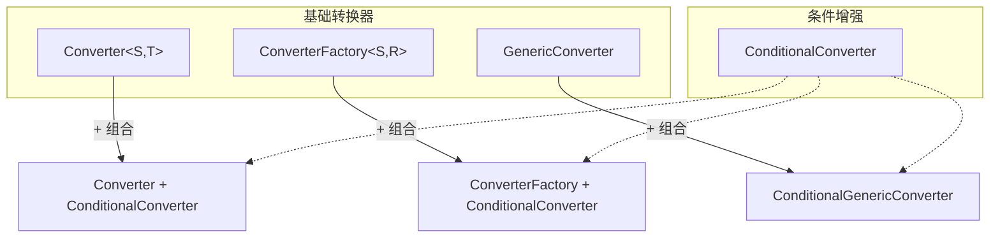
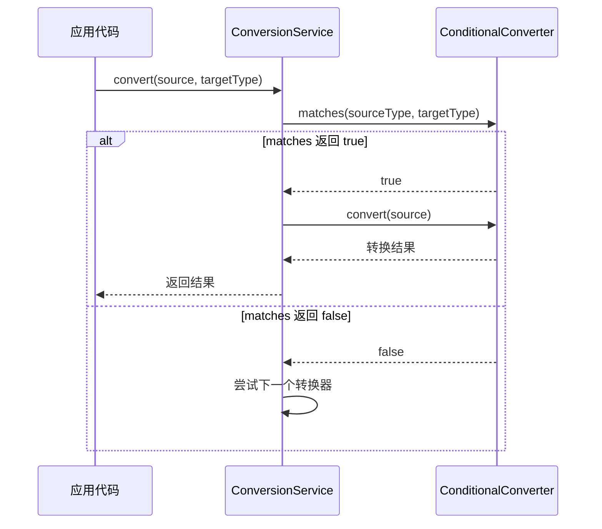

# ConditionalConverter：Spring 条件转换器

> 本文档介绍 Spring `ConditionalConverter` 接口，用于在类型转换前基于 `TypeDescriptor` 进行条件匹配，是 Spring 类型转换体系中的**条件判断增强接口**。

---

## 📥 01. 一句话定义

**ConditionalConverter** 是一个增强接口，它为转换器（`Converter`、`GenericConverter`、`ConverterFactory`）添加**条件匹配**能力，允许在执行转换前基于 `TypeDescriptor`（类型描述符）检查源类型或目标类型的元信息（如注解、泛型参数），从而决定是否执行转换。

---

## 🔍 02. 背景与痛点

### 现状：无条件的类型转换

在没有 `ConditionalConverter` 之前，类型转换器只能基于**类型签名**进行匹配：

```java
// 转换器只知道 String → Date，无法感知其他上下文
public class StringToDateConverter implements Converter<String, Date> {
    @Override
    public Date convert(String source) {
        // 只能使用固定格式，无法根据目标字段的注解动态调整
        return new SimpleDateFormat("yyyy-MM-dd").parse(source);
    }
}
```

### 痛点：类型匹配的局限

| 问题 | 说明 |
|------|------|
| **无法访问注解** | 转换器不知道目标字段是否有 `@DateFormat("yyyy-MM-dd HH:mm:ss")` |
| **无法访问泛型信息** | 无法知道 `List<T>` 中 T 的具体类型 |
| **无法进行条件判断** | 只能通过类型签名匹配，无法基于运行时上下文判断 |
| **一刀切的转换逻辑** | 同一类型对的所有转换都使用相同逻辑 |

### 价值：ConditionalConverter 的优势

| 优势 | 说明 |
|------|------|
| **注解感知** | 可读取目标字段的注解，如 `@DateFormat`、`@NumberFormat` |
| **泛型信息** | 可获取 `Collection<T>` 的元素类型 T |
| **条件匹配** | 在转换前先调用 `matches()` 判断是否应该处理 |
| **选择性转换** | 让 ConversionService 选择最合适的转换器 |

---

## ⚙️ 03. 核心机制

### ConditionalConverter 接口定义

```java
public interface ConditionalConverter {

    /**
     * 判断是否应该选择此转换器处理当前转换请求。
     *
     * @param sourceType 源类型描述符（可获取源类型的元信息）
     * @param targetType 目标类型描述符（可获取目标类型的元信息）
     * @return true 表示应该执行转换，false 表示跳过此转换器
     */
    boolean matches(TypeDescriptor sourceType, TypeDescriptor targetType);
}
```

### 核心设计：组合增强

`ConditionalConverter` **不是独立的转换器**，而是与其他转换器接口组合使用：



### TypeDescriptor 核心 API

`matches()` 方法的强大之处在于可以通过 `TypeDescriptor` 获取完整的类型元信息：

| 方法 | 说明 | 使用场景 |
|------|------|----------|
| `getType()` | 获取原始 Class 类型 | 基础类型判断 |
| `getAnnotation(Class)` | 获取指定注解 | 读取 `@DateFormat`、`@NumberFormat` 等 |
| `getAnnotations()` | 获取所有注解 | 遍历检查多个注解 |
| `getElementTypeDescriptor()` | 获取集合元素类型 | 处理 `List<T>` |
| `getMapKeyTypeDescriptor()` | 获取 Map Key 类型 | 处理 `Map<K,V>` |
| `isAssignableTo(TypeDescriptor)` | 类型兼容性判断 | 子类型判断 |

### 转换流程



### Spring 内置的 ConditionalConverter 实现

Spring 框架内置了多个 `ConditionalConverter` 实现：

| 类名 | 说明 |
|------|------|
| `ArrayToCollectionConverter` | 数组 → 集合，条件检查元素类型兼容性 |
| `CollectionToArrayConverter` | 集合 → 数组，条件检查元素类型兼容性 |
| `MapToMapConverter` | Map → Map，条件检查 Key/Value 类型兼容性 |
| `ObjectToObjectConverter` | 通用对象转换，检查目标类型是否有适合的构造函数或工厂方法 |

---

## 💻 04. 实战演示

### 示例 1：基础条件转换（StringToPersonConverter）

实现 `Converter<String, Person>` + `ConditionalConverter` 接口：

```java
public class StringToPersonConverter implements Converter<String, Person>, ConditionalConverter {

    @Override
    public boolean matches(TypeDescriptor sourceType, TypeDescriptor targetType) {
        // 只有目标类型是 Person 时才匹配
        boolean match = Person.class.isAssignableFrom(targetType.getType());
        System.out.println("matches: " + sourceType.getType().getSimpleName() + 
                " → " + targetType.getType().getSimpleName() + " = " + match);
        return match;
    }

    @Override
    public Person convert(String source) {
        // 格式：name:age
        String[] parts = source.split(":");
        return new Person(parts[0], Integer.parseInt(parts[1]));
    }
}
```

### 示例 2：注解感知的日期转换

读取目标字段的 `@DateFormat` 注解，动态选择日期格式：

```java
// 自定义注解
@Target({ElementType.FIELD, ElementType.PARAMETER})
@Retention(RetentionPolicy.RUNTIME)
public @interface DateFormat {
    String value() default "yyyy-MM-dd";
}

// 注解感知的转换器
public class AnnotationAwareDateConverter implements Converter<String, Date>, ConditionalConverter {

    private final ThreadLocal<String> currentPattern = new ThreadLocal<>();

    @Override
    public boolean matches(TypeDescriptor sourceType, TypeDescriptor targetType) {
        // 读取目标字段的 @DateFormat 注解
        DateFormat annotation = targetType.getAnnotation(DateFormat.class);
        String pattern = (annotation != null) ? annotation.value() : "yyyy-MM-dd";
        currentPattern.set(pattern);
        return true;
    }

    @Override
    public Date convert(String source) {
        String pattern = currentPattern.get();
        try {
            return new SimpleDateFormat(pattern).parse(source);
        } catch (ParseException e) {
            throw new IllegalArgumentException("日期解析失败: " + source);
        } finally {
            currentPattern.remove();
        }
    }
}
```

### 示例 3：Spring 容器注册

```java
@Configuration
public class ConditionalConverterConfig {

    @Bean
    public ConversionService conversionService() {
        GenericConversionService service = new DefaultConversionService();
        service.addConverter(new StringToPersonConverter());
        service.addConverter(new AnnotationAwareDateConverter());
        return service;
    }
}
```

### 运行输出示例

```
=== ConditionalConverter 接口用法演示 ===

【1. 直接使用 ConditionalConverter】
测试 matches 方法:
  [StringToPersonConverter.matches] String → Person = true
  [StringToPersonConverter.matches] String → Integer = false

测试 convert 方法:
  [StringToPersonConverter.convert] "张三:25" → Person
转换结果: Person{name='张三', age=25}

【2. 使用 GenericConversionService】
通过 ConversionService 转换:
  [StringToPersonConverter.matches] String → Person = true
  [StringToPersonConverter.convert] "李四:30" → Person
转换结果: Person{name='李四', age=30}

【3. 注解感知的日期转换】
模拟带有 @DateFormat 注解的转换:
  [AnnotationAwareDateConverter.matches] 发现 @DateFormat("yyyy-MM-dd")
  [AnnotationAwareDateConverter.convert] "2025-01-13" (格式: yyyy-MM-dd) → Mon Jan 13 00:00:00 CST 2025
转换结果: Mon Jan 13 00:00:00 CST 2025
```

### 关键点拨

1. **matches() 先于 convert() 调用**：ConversionService 会先调用 `matches()`，只有返回 `true` 才会调用 `convert()`
2. **ThreadLocal 传递状态**：由于 `matches()` 和 `convert()` 是两个分离的方法调用，如需在它们之间传递状态（如解析出的注解值），可使用 `ThreadLocal`
3. **返回 false 的意义**：当 `matches()` 返回 `false` 时，ConversionService 会继续尝试其他注册的转换器

---

## ⚖️ 05. 选型权衡

### 适用场景

| 场景 | 示例 |
|------|------|
| **注解驱动转换** | 根据 `@DateFormat`、`@NumberFormat` 自定义格式 |
| **条件性目标类型** | 只转换带有特定注解的字段 |
| **泛型元素转换** | 检查 `List<T>` 的元素类型是否支持转换 |
| **复杂类型兼容性** | 在转换前验证源/目标类型的结构 |

### 不适用场景

| 场景 | 原因 | 替代方案 |
|------|------|----------|
| **简单类型转换** | 不需要条件判断 | 使用 `Converter<S, T>` |
| **基于值的条件** | `matches()` 无法访问源值 | 在 `convert()` 中处理 |
| **性能敏感场景** | `matches()` 会被频繁调用 | 考虑缓存或优化逻辑 |

### Spring 转换器接口对比

| 维度 | Converter | ConverterFactory | GenericConverter | ConditionalConverter |
|------|-----------|------------------|------------------|---------------------|
| **定位** | 基础转换 | 工厂转换 | 灵活转换 | **增强接口** |
| **独立使用** | ✅ | ✅ | ✅ | ❌（需组合） |
| **TypeDescriptor** | ❌ | ❌ | ✅ | ✅ |
| **条件匹配** | ❌ | ❌ | ❌ | ✅ |
| **典型用法** | 1:1 转换 | 1:N 转换 | N:N 转换 | 注解/泛型感知 |

> [!TIP]
> **最佳实践**：`ConditionalConverter` 通常与 `Converter` 组合使用。只有当你需要基于注解、泛型等类型元信息进行条件判断时才使用它。

---

## 💡 06. 总结与自查

### 核心要点回顾

1. `ConditionalConverter` 是**增强接口**，不能独立使用
2. 通过 `matches(TypeDescriptor, TypeDescriptor)` 方法进行条件匹配
3. `TypeDescriptor` 提供类型的完整元信息（注解、泛型等）
4. 当 `matches()` 返回 `false` 时，ConversionService 会尝试其他转换器
5. 常与 `Converter`、`GenericConverter`、`ConverterFactory` 组合使用

### 自查 Checklist

- [x] 我是否解释清了 Why 而不仅仅是 How？
- [x] 读者是否能通过这个文档快速上手？
- [x] 边界情况（Edge cases）是否已提及？

### 代码示例位置

完整可运行的代码示例位于：

```
conditional-converter/src/main/java/io/github/daihaowxg/conditionalconverter/converter/
├── Person.java                        # 自定义领域对象
├── DateFormat.java                    # 自定义日期格式注解
├── StringToPersonConverter.java       # Converter + ConditionalConverter 示例
├── AnnotationAwareDateConverter.java  # 注解感知的条件转换器
├── ConditionalConverterConfig.java    # Spring 配置类
└── ConditionalConverterDemo.java      # 演示主类（可直接运行）
```

运行命令：
```bash
cd sample03-spring-reading/spring-convert/conditional-converter
mvn compile exec:java -Dexec.mainClass="io.github.daihaowxg.conditionalconverter.converter.ConditionalConverterDemo"
```

---

> **延伸阅读**：Spring 的类型转换体系还包括 `Converter`（一对一转换）、`ConverterFactory`（一对多转换）和 `GenericConverter`（多对多转换）。`ConditionalConverter` 可以与它们任意组合，实现更灵活的条件转换逻辑。
