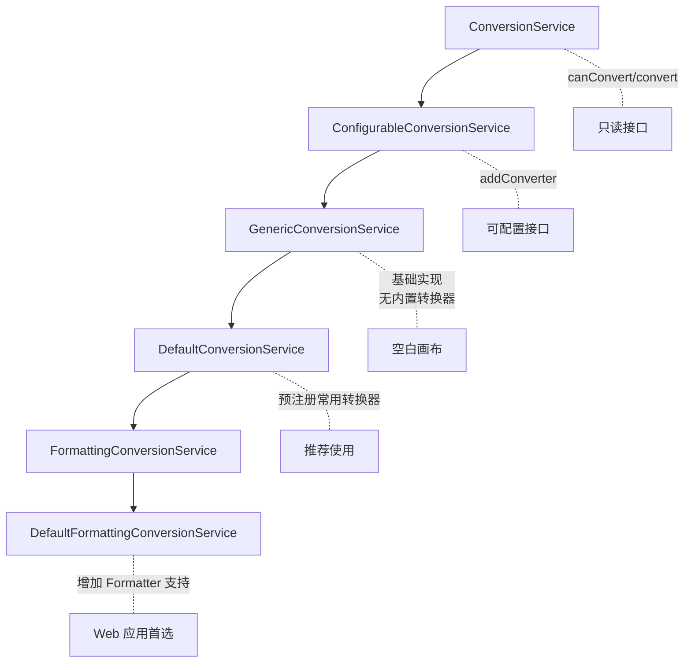
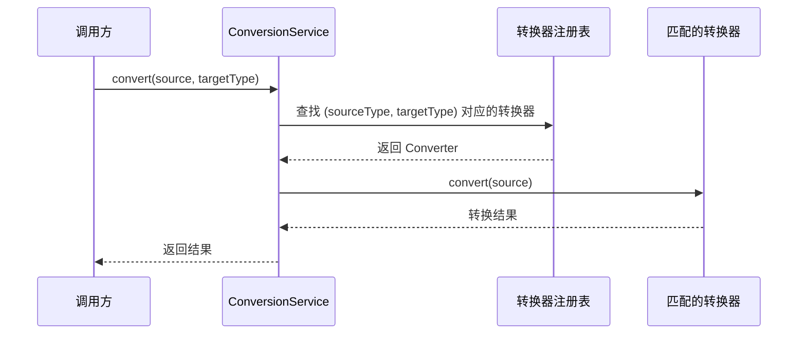

# ConversionService：Spring 类型转换统一入口

> 本文档介绍 Spring `ConversionService` 接口，它是 Spring 类型转换体系的**统一入口**，负责管理所有 Converter、ConverterFactory、GenericConverter 的注册、查找和调度。

---

## 📥 01. 一句话定义

**ConversionService** 是 Spring 3.0 引入的类型转换服务接口，提供 `canConvert()` 和 `convert()` 两个核心方法，将类型转换的**使用方**与**实现方**解耦，是 Spring 类型转换的统一门面（Facade）。

---

## 🔍 02. 背景与痛点

### 现状：分散的转换器管理

在没有 ConversionService 之前，类型转换器的管理是分散的：

```java
// ❌ 旧方式：直接实例化转换器
StringToAddressConverter converter = new StringToAddressConverter();
Address address = converter.convert("广东省/深圳市/南山区");

// 问题：每次使用都需要知道具体的转换器类
// 要换一个转换器实现？需要改所有调用点！
```

### 痛点：缺乏统一管理

| 问题 | 说明 |
|------|------|
| **耦合严重** | 调用方需要知道具体的转换器类 |
| **无法复用** | 同样的转换逻辑分散在各处 |
| **难以扩展** | 增加新转换器需要修改多处代码 |
| **无统一查找** | 无法根据源/目标类型自动匹配转换器 |

### 价值：统一的转换服务

| 优势 | 说明 |
|------|------|
| **解耦** | 调用方只依赖 ConversionService 接口 |
| **自动匹配** | 根据类型自动查找合适的转换器 |
| **统一注册** | 转换器集中管理，便于维护 |
| **链式转换** | 支持 A → B → C 的多步转换 |

---

## ⚙️ 03. 核心机制

### ConversionService 接口

```java
public interface ConversionService {

    /**
     * 检查是否能将 sourceType 转换为 targetType
     */
    boolean canConvert(Class<?> sourceType, Class<?> targetType);

    /**
     * 高级检查，支持泛型信息
     */
    boolean canConvert(TypeDescriptor sourceType, TypeDescriptor targetType);

    /**
     * 执行类型转换
     */
    <T> T convert(Object source, Class<T> targetType);

    /**
     * 高级转换，支持泛型信息
     */
    Object convert(Object source, TypeDescriptor sourceType, TypeDescriptor targetType);
}
```

### 实现类层次



### 实现类对比

| 实现类 | 内置转换器 | Formatter 支持 | 适用场景 |
|--------|-----------|---------------|----------|
| `GenericConversionService` | ❌ | ❌ | 完全自定义 |
| `DefaultConversionService` | ✅ | ❌ | **推荐默认** |
| `DefaultFormattingConversionService` | ✅ | ✅ | Web 应用 |

### 核心工作流



### 内置转换器清单

`DefaultConversionService` 预注册的常用转换器：

| 转换类型 | 示例 |
|---------|------|
| String → 基本类型 | `"123"` → `Integer`, `"true"` → `Boolean` |
| String → 枚举 | `"SECONDS"` → `TimeUnit.SECONDS` |
| String → 数组 | `"a,b,c"` → `String[]` |
| 数组 ↔ 集合 | `String[]` ↔ `List<String>` |
| 集合 ↔ 集合 | `List` ↔ `Set` |
| Map ↔ Map | 键值类型转换 |

---

## 💻 04. 实战演示

### 示例项目结构

```
conversion-service/src/main/java/io/github/daihaowxg/conversionservice/service/
├── Address.java                    # 自定义地址类型
├── StringToAddressConverter.java   # String → Address 转换器
├── AddressToStringConverter.java   # Address → String 转换器
├── ConversionServiceConfig.java    # Spring 配置类
└── ConversionServiceDemo.java      # 演示主类（可直接运行）
```

### 演示 1：核心 API 使用

```java
// 创建 ConversionService
DefaultConversionService cs = new DefaultConversionService();

// 注册自定义转换器
cs.addConverter(new StringToAddressConverter());
cs.addConverter(new AddressToStringConverter());

// ======= canConvert() =======
boolean canConvert = cs.canConvert(String.class, Address.class);
System.out.println("String → Address 可转换: " + canConvert);  // true

// ======= convert() =======
Address address = cs.convert("广东省/深圳市/南山区", Address.class);
System.out.println("转换结果: " + address);
// 输出: Address{province='广东省', city='深圳市', district='南山区'}

// 反向转换
String text = cs.convert(address, String.class);
System.out.println("反向转换: " + text);  // 广东省/深圳市/南山区
```

### 演示 2：实现类对比

```java
// 1️⃣ GenericConversionService - 空白画布
GenericConversionService generic = new GenericConversionService();
generic.canConvert(String.class, Integer.class);  // false ❌
generic.addConverter(new StringToAddressConverter());
generic.canConvert(String.class, Address.class);   // true ✅

// 2️⃣ DefaultConversionService - 推荐使用
DefaultConversionService defaults = new DefaultConversionService();
defaults.canConvert(String.class, Integer.class);  // true ✅（内置）
defaults.canConvert(String.class, Boolean.class);  // true ✅（内置）

// 3️⃣ DefaultFormattingConversionService - Web 应用
DefaultFormattingConversionService formatting = new DefaultFormattingConversionService();
// 支持 @DateTimeFormat, @NumberFormat 等注解
```

### 演示 3：内置转换器

```java
DefaultConversionService cs = new DefaultConversionService();

// 字符串 → 基本类型
cs.convert("123", Integer.class);      // 123
cs.convert("3.14", Double.class);      // 3.14
cs.convert("true", Boolean.class);     // true

// 字符串 → 枚举
cs.convert("SECONDS", TimeUnit.class); // TimeUnit.SECONDS

// 数组转换
cs.convert("a,b,c", String[].class);   // ["a", "b", "c"]
```

### 演示 4：Spring 容器集成

```java
@Configuration
public class ConversionServiceConfig {

    @Bean
    public ConversionService conversionService() {
        DefaultConversionService cs = new DefaultConversionService();
        cs.addConverter(new StringToAddressConverter());
        cs.addConverter(new AddressToStringConverter());
        return cs;
    }
}

// 使用
@Autowired
private ConversionService conversionService;

Address address = conversionService.convert("浙江省/杭州市/西湖区", Address.class);
```

### 运行输出

```
=== Spring ConversionService 接口用法演示 ===

【1. ConversionService 核心 API】

--- canConvert() 方法 ---
String → Integer: true
String → Address: true
Address → Integer: false

--- convert() 方法 ---
String → Address: Address{province='广东省', city='深圳市', district='南山区'}
Address → String: 广东省/深圳市/南山区

【2. ConversionService 实现类对比】

--- GenericConversionService（空白画布）---
String → Integer 支持: false
注册后 String → Address 支持: true

--- DefaultConversionService（推荐使用）---
String → Integer 支持: true
String → Boolean 支持: true
String → Long 支持: true

【3. 内置转换器演示】

--- 字符串 → 基本类型 ---
"123" → Integer: 123
"3.14" → Double: 3.14
"true" → Boolean: true

【4. Spring 容器集成】
从容器获取的 ConversionService 类型: DefaultConversionService
转换结果: Address{province='浙江省', city='杭州市', district='西湖区'}

=== 演示结束 ===
```

### 关键点拨

1. **优先使用 DefaultConversionService**：内置常用转换器，开箱即用
2. **TypeDescriptor 用于泛型**：当目标类型包含泛型参数时（如 `List<Integer>`），使用带 TypeDescriptor 的 convert 方法
3. **线程安全**：ConversionService 实现是线程安全的，可在多线程环境共享

---

## ⚖️ 05. 选型权衡

### 实现类选择

| 实现类 | 适用场景 | 理由 |
|--------|----------|------|
| **DefaultConversionService** | 大多数场景 | 内置常用转换器，简单直接 |
| GenericConversionService | 完全自定义 | 需要精确控制哪些转换可用 |
| DefaultFormattingConversionService | Web 应用 | 需要 @DateTimeFormat 等注解支持 |

### ConversionService vs 直接使用 Converter

| 维度 | ConversionService | 直接使用 Converter |
|------|-------------------|-------------------|
| **耦合度** | 低（接口依赖） | 高（类依赖） |
| **灵活性** | 高（运行时可替换） | 低（编译时绑定） |
| **复杂度** | 稍高 | 低 |
| **推荐场景** | 生产代码 | 简单脚本、测试 |

### 与其他类型转换方式对比

| 方式 | 优点 | 缺点 | 适用场景 |
|------|------|------|----------|
| **ConversionService** | 统一管理、自动匹配 | 需要注册 | Spring 应用 |
| PropertyEditor | 双向转换 | 非线程安全、接口臃肿 | 旧代码兼容 |
| 直接 Converter | 简单 | 无统一管理 | 测试、脚本 |

> [!TIP]
> **选择建议**：在 Spring 应用中，始终通过 ConversionService 使用转换器，而非直接实例化 Converter。这样可以获得更好的可测试性和可维护性。

---

## 💡 06. 总结与自查

### 核心要点回顾

1. **ConversionService** 是 Spring 类型转换的统一入口
2. 核心 API：`canConvert()` 检查、`convert()` 执行
3. **DefaultConversionService** 是推荐的默认实现
4. 内置了 String → 基本类型、枚举、数组、集合等常用转换器
5. 线程安全，可在多线程环境共享

### 自查 Checklist

- [x] 我是否解释清了 Why 而不仅仅是 How？
- [x] 读者是否能通过这个文档快速上手？
- [x] 边界情况（Edge cases）是否已提及？

### 代码示例位置

完整可运行的代码示例位于：

```
conversion-service/src/main/java/io/github/daihaowxg/conversionservice/service/
├── Address.java                    # 自定义地址类型
├── StringToAddressConverter.java   # String → Address 转换器
├── AddressToStringConverter.java   # Address → String 转换器
├── ConversionServiceConfig.java    # Spring 配置类
└── ConversionServiceDemo.java      # 演示主类（可直接运行）
```

运行命令：
```bash
cd sample03-spring-reading/spring-convert/conversion-service
mvn compile exec:java -Dexec.mainClass="io.github.daihaowxg.conversionservice.service.ConversionServiceDemo"
```

---

> **延伸阅读**：
> - [Spring类型转换体系综述](file:///Users/wxg/my-projects/daihaowxg/spring-samples/sample03-spring-reading/spring-convert/docs/Spring类型转换体系综述.md) - 四大接口对比
> - [Converter类型转换器](file:///Users/wxg/my-projects/daihaowxg/spring-samples/sample03-spring-reading/spring-convert/converter/docs/Converter类型转换器.md) - 1:1 类型转换
> - Spring 源码：`org.springframework.core.convert.ConversionService`
