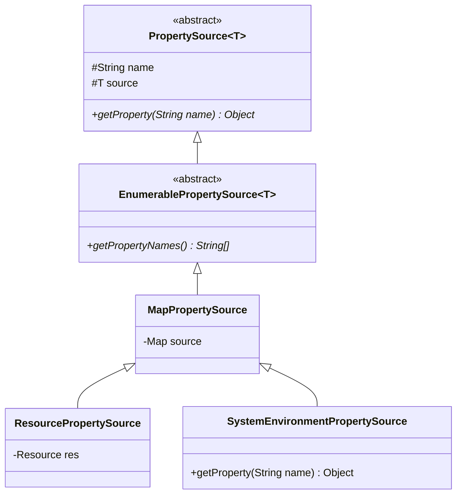

# PropertySource 及其实现类深度解析

## 📌 一句话定义

> `PropertySource` 是 Spring 对“配置来源”的原子抽象，它将任何 Key-Value 对（无论来自内存、文件还是系统环境）包装为统一的只读访问接口。

## 🎯 使用场景

| 场景 | 说明 |
|-----|------|
| **硬编码配置** | 将 `Map` 或 `Properties` 快速接入 Spring 环境 |
| **外部文件加载** | 从指定路径的 `.properties` 或 `.xml` 文件读取配置 |
| **自定义配置源** | 从数据库、Redis 或配置中心（如 Nacos/Apollo）拉取配置 |
| **命令行交互** | 处理启动命令中的 `--server.port=8081` |

## 🔍 背景与痛点

### 现状（痛点）
在没有 `PropertySource` 抽象前，开发者需要编写大量重复逻辑来处理多样的配置来源：
- 读取环境变量用 `System.getenv()`
- 读取系统属性用 `System.getProperties()`
- 读取文件用 `Properties.load(inputStream)`
- **主要问题**：缺乏统一的访问接口，无法实现“按优先级覆盖”（例如：环境变量覆盖文件配置）。

### 解决方案
`PropertySource` 定义了 `getName()` 和 `getProperty(name)` 的标准接口，使得：
- **统一访问**：外部使用者无需关心底层是文件还是 Map。
- **可组合性**：通过 `PropertySources` 将多个源串联，形成优先级链条。

## ⚙️ 核心机制

### 关键组件

### 常用实现类全景图

| 实现类 | 底层数据源 (`T`) | 特点/用途 |
|-------|----------------|----------|
| **`MapPropertySource`** | `Map<String, Object>` | 最基础的内存实现，通常用于代码注入。 |
| **`PropertiesPropertySource`** | `Properties` | 兼容 Java 原生的 `Properties` 对象。 |
| **`ResourcePropertySource`** | `Resource` | 加载具体物理文件，内部会转为 Map。 |
| **`SystemEnvironmentPropertySource`** | `Map` | 包装 OS 环境变量。**亮点**：支持宽松匹配，如 `APP_PORT` 可通过 `app.port` 访问。 |
| **`CommandLinePropertySource`** | `String[]` | 解析命令行参数。 |

## 💻 实战代码

### 代码示例
参见：[PropertySourceDemo.java](../src/main/java/io/github/daihaowxg/_06_spring_environment/_01_properties_data/PropertySourceDemo.java)

### 关键点说明

| 代码位置 | 说明 |
|---------|------|
| `new MapPropertySource("map-source", map)` | 每个源必须有一个唯一的 `name`，用于在 `PropertySources` 列表中定位。 |
| `new ResourcePropertySource(...)` | 直接从类路径或文件系统加载资源文件作为配置源。 |
| `instanceof EnumerablePropertySource` | 大多数内建实现都是“可枚举”的，意味着我们可以获取它定义的所有 Key。 |

## ⚠️ 注意事项

1.  **只读原则**：`PropertySource` 接口本身只定义了 `getProperty`，不涉及写操作。写操作由具体的 `Map` 或 `Environment` 配置类管理。
2.  **宽松匹配**：`SystemEnvironmentPropertySource` 会尝试将 `.` 替换为 `_` 并转大写来查找环境变量，这是 Spring Boot 能够支持环境变量映射的核心。
3.  **内聚性**：一个 `PropertySource` 应该代表一个内聚的配置单位（例如一个 `.properties` 文件）。
