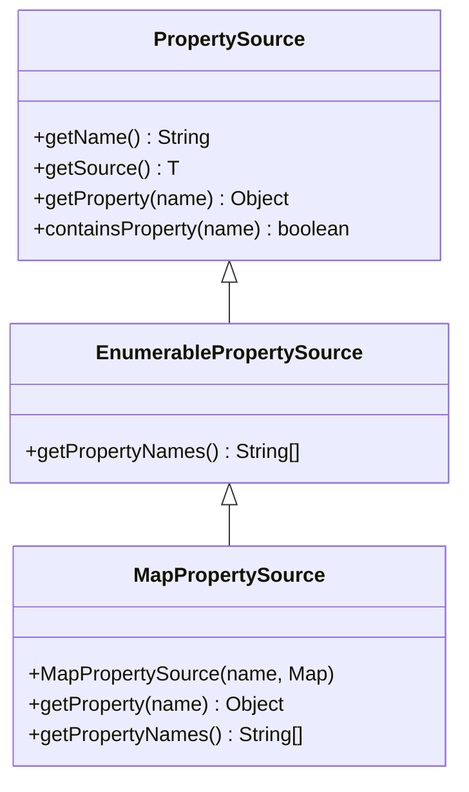

# MapPropertySource 详解

## 📌 一句话定义

> `MapPropertySource` 是 Spring `Environment` 抽象中最基础的属性源实现，它将标准的 Java `Map<String, Object>` 适配为 Spring 的 `PropertySource`，使键值对数据可以直接参与 Spring 的属性解析过程。

## 🎯 使用场景

| 场景 | 说明 |
|-----|------|
| **单元测试** | 在测试中快速模拟环境变量或配置，无需创建物理配置文件。 |
| **动态配置** | 运行时动态注入一组配置（如从数据库或远程配置中心拉取后转为 Map）。 |
| **编程方式定制** | 在 `ApplicationContextInitializer` 中通过代码手动添加高优先级的配置覆盖默认值。 |

## 🔍 背景与痛点

### 现状（痛点）
在 Spring 统一配置抽象（Environment）出现之前，或是如果不使用统一抽象，开发者处理配置往往面临困难：
- **异构数据难统一**：Properties 文件、YAML、系统环境变量、JVM 启动参数等格式各异，难以用统一接口访问。
- **测试困难**：为了测试读取配置的代码，往往需要准备真实的配置文件，不仅繁琐而且 IO 开销大。

### 解决方案
Spring 引入 `PropertySource` 抽象来统一所有配置源。`MapPropertySource` 作为最通用的适配器：
- 直接利用 Java 最常用的 `Map` 数据结构。
- 提供了**内存级**的配置注入能力，让配置不再局限于文件或系统变量。

## ⚙️ 核心机制

### 关键组件

`MapPropertySource` 继承自 `EnumerablePropertySource`，这意味着它不仅支持按 Key 查找，还支持枚举所有配置项的名称（`getPropertyNames`）。



### 工作流程

当 `Environment` 获取属性时，会遍历内部的 `MutablePropertySources` 列表。`MapPropertySource` 的查找逻辑非常简单：直接委托给底层的 `Map.get(key)`。

## 💻 实战代码

### 代码示例

参见 [MapPropertySourceDemo.java](../src/main/java/io/github/daihaowxg/_06_spring_environment/_01_properties_data/MapPropertySourceDemo.java)

```java
// 1. 准备数据
Map<String, Object> configMap = new HashMap<>();
configMap.put("app.name", "my-dymanic-app");

// 2. 包装为 PropertySource
MapPropertySource dynamicSource = new MapPropertySource("dynamic-config", configMap);

// 3. 注入到 Environment (通常通过 MutablePropertySources)
MutablePropertySources sources = new MutablePropertySources();
sources.addFirst(dynamicSource); // 放在第一位，优先级最高

// 4. 获取属性
String appName = (String) dynamicSource.getProperty("app.name");
```

### 关键点说明

| 代码位置 | 说明 |
|---------|------|
| `new MapPropertySource(name, map)` | 构造函数必须指定名称（name）和源数据（map）。名称用于在 Environment 中唯一标识该源。 |
| `sources.addFirst(...)` | 控制优先级。`MapPropertySource` 常被添加在队首以覆盖其他配置文件中的同名属性。 |
| `getPropertyNames()` | 因为是 `EnumerablePropertySource`，可以列出所有 Key。这在 Actuator `/env` 端点展示配置时非常有用。 |

## ⚠️ 注意事项

- **线程安全**：`MapPropertySource` 本身不保证线程安全，完全取决于传入的 `Map` 实现。通常配置在启动后是只读的，所以使用 `HashMap` 没问题；如果需要在运行时并发修改，请使用 `ConcurrentHashMap`。
- **不可变性**：Spring Environment 获取到的 `Map` 引用是直接持有的。如果在外部修改了 `Map` 的内容，`PropertySource` 中的数据也会随之变化（这既是特性也是风险）。
- **包含 Null 值**：标准的 `MapPropertySource` 允许 Map 中存在 Value 为 `null` 的情况，但 `getProperty` 返回 `null` 通常表示“未找到”，这可能会导致歧义（也就是 Fallback 到下一个 Source），需要注意。
