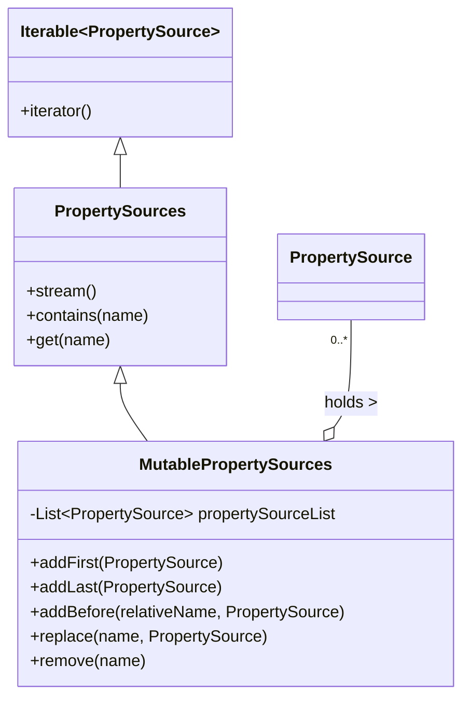

# MutablePropertySources 详解

## 📥 01. 一句话定义 (The "AHA" Moment)

> `MutablePropertySources` 是 Spring `Environment` 中用来管理 `PropertySource` 集合的核心容器，它本质上是一个**支持优先级的并发列表**，允许开发者精确控制配置源的在查找链中的顺序（谁覆盖谁）。

## 🔍 02. 背景与痛点 (Context & Problem)

- **现状**：配置通常散落在多处（File, Env, System Property）。如果没有统一容器，获取配置时需要开发者自己遍历多个源，并硬编码覆盖逻辑（如：System Property 必须覆盖 File）。
- **痛点**：硬编码的顺序难以调整，且缺乏线程安全的动态修改能力（如热加载配置）。
- **价值**：`MutablePropertySources` 提供了一套标准 API (`addFirst`, `addAfter` 等) 来动态编排配置源顺序，使得“配置覆盖策略”成为可编程、可扩展的能力。

## ⚙️ 03. 核心机制 (Mechanism & Architecture)

### 第一性原理
**List + Priority = Order**。它利用 List 的有序性，约定 **Index 越小，优先级越高**。

### 关键组件

它内部代理了一个 `CopyOnWriteArrayList`，这意味着它是线程安全的，且非常适合“读多写少”的场景（配置读取远多于变更）。



### 工作流
1. **注入**：通过 `addFirst/addLast` 将 `PropertySource` 放入内部 List。
2. **查找**：当调用 `env.getProperty("key")` 时，`PropertySourcesPropertyResolver` 会遍历这个 List。
3. **命中**：一旦在某个 Source 中找到 Key，立即返回（短路机制），后续 Source 被忽略。

## 💻 04. 实战演示 (Hands-on Practice)

### 代码范例

完整代码请参考：[MutablePropertySourcesDemo.java](../src/main/java/io/github/daihaowxg/_06_spring_environment/_01_properties_data/MutablePropertySourcesDemo.java)

```java
MutablePropertySources sources = new MutablePropertySources();

// 1. 默认后进先出（栈行为），通过 addFirst 抢占最高优先级
sources.addFirst(new MapPropertySource("high-priority", ...)); 

// 2. 也是队列行为，通过 addLast 放在最低优先级（兜底）
sources.addLast(new MapPropertySource("low-priority", ...));

// 3. 精细控制：插队
sources.addBefore("low-priority", new MapPropertySource("mid-priority", ...));
```

### 关键点拨
- **CopyOnWrite 开销**：每次修改（add/remove）都会复制整个底层数组。**不要在循环中高频调用 add 方法**，应该提前准备好集合。
- **Name 是唯一标识**：`remove` 和 `replace` 操作完全依赖 `PropertySource.getName()`。如果名字对不上，操作会静默失效（API 返回 null 或 void，不抛异常）。

## ⚖️ 05. 选型权衡 (Trade-offs & Constraints)

- **适用场景**：
    - Spring Boot 启动阶段构建 Environment（处理 application-{profile}.yml 的加载顺序）。
    - 配置中心客户端（Nacos/Apollo）在运行时动态刷新配置（使用 `replace`）。
- **不适用场景**：
    - 存储海量（如百万级）的独立配置源。因为遍历是 O(N) 复杂度，Source 太多会拖慢每次 `getProperty` 的速度。通常 Source 数量控制在几十个以内。

## 💡 06. 总结与自查 (Summary Checklist)

- [ ] 是否理解了“List 顺序即优先级”？（越靠前越优先）
- [ ] 是否注意到了它底层的 `CopyOnWriteArrayList` 特性？（读快写慢）
- [ ] 知道如何用 `replace` 实现配置热更新吗？
