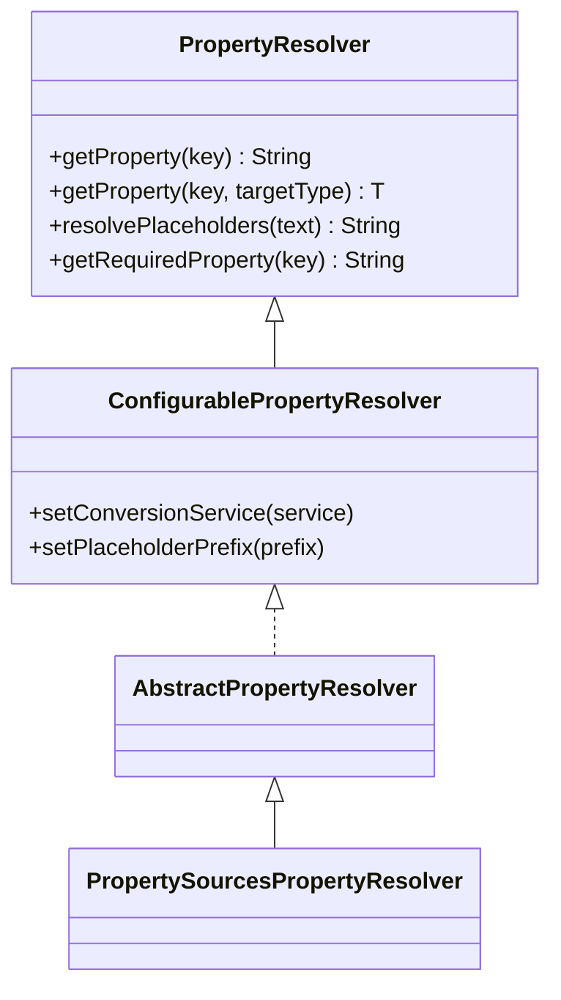

# PropertyResolver 详解

## 📥 01. 一句话定义 (The "AHA" Moment)

> `PropertyResolver` 是 Spring `Environment` 的**只读视图**接口，专职负责两件事：**获取属性值**（支持类型转换）和**解析占位符**（处理 `${key:default}`），它是应用程序访问配置数据的统一入口。

## 🔍 02. 背景与痛点 (Context & Problem)

- **现状**：在拥有配置源后，开发者若直接操作 `Map` 或 `Properties` 对象，只能拿到 String 类型的原始值。
- **痛点**：
    - **类型转换繁琐**：从配置中读出 "8080" 需要手动 `Integer.parseInt`。
    - **缺乏动态能力**：无法处理像 `${app.host}:${app.port}` 这样相互引用的动态配置值。
- **价值**：`PropertyResolver` 屏蔽了底层数据源的复杂性，提供了自动类型转换（ConversionService）和递归的文本替换能力，极大简化了配置消费端代码。

## ⚙️ 03. 核心机制 (Mechanism & Architecture)

### 第一性原理
**Resolution = Lookup + Transformation**。即：查找（从源中找值） + 变换（类型转换或文本替换）。

### 关键组件

它通常不直接独立使用，而是作为 `Environment` 的父接口存在。最常用的实现是 `PropertySourcesPropertyResolver`。



### 工作流
1. **占位符解析**：调用 `resolvePlaceholders` -> 遇到 `${...}` -> 提取 Key -> 递归调用 `getProperty`。
2. **属性获取**：调用 `getProperty(key, Integer.class)` -> 遍历 PropertySources 找到 String 值 -> 使用 `ConversionService` 转为 Integer。

## 💻 04. 实战演示 (Hands-on Practice)

### 代码范例

完整代码请参考：[PropertyResolverDemo.java](../src/main/java/io/github/daihaowxg/_06_spring_environment/_02_properties_resolver/PropertyResolverDemo.java)

```java
// 1. 准备数据源
MutablePropertySources sources = new MutablePropertySources();
sources.addFirst(new MapPropertySource("test", Map.of("port", "8080", "msg", "Hi ${user.name}")));

// 2. 创建 Resolver
PropertySourcesPropertyResolver resolver = new PropertySourcesPropertyResolver(sources);

// 3. 类型转换演示
Integer port = resolver.getProperty("port", Integer.class); // 自动转为 8080

// 4. 占位符解析演示
// 假设 system properties 中有 user.name=Alice
String msg = resolver.getProperty("msg"); // 输出 "Hi Alice"
```

### 关键点拨
- **递归解析**：`PropertyResolver` 会处理嵌套占位符，例如 `${app.${env}.name}`。
- **默认值语法**：支持 `${key:defaultValue}` 语法，这在处理可选配置时非常有用。
- **Required 检查**：`getRequiredProperty` 在找不到 key 时会抛出 `IllegalStateException`，适用于强制校验核心配置。

## ⚖️ 05. 选型权衡 (Trade-offs & Constraints)

- **适用场景**：
    - 开发自定义的配置加载器或框架扩展组件。
    - 在非 Bean 环境下（如 `ApplicationContextInitializer`）需要读取和处理配置。
- **不适用场景**：
    - **业务代码**：通常直接使用 `@Value("${key}")` 或 `@ConfigurationProperties`。直接操作 `PropertyResolver` 属于底层做法。

## 💡 06. 总结与自查 (Summary Checklist)

- [ ] 是否明白它与 `PropertySource` 的区别？（Source 是数据，Resolver 是操作数据的工具）
- [ ] 知道如何启用更复杂的类型转换吗？（通过 `setConversionService`）
- [ ] 了解 `${...}` 解析是支持递归的吗？
