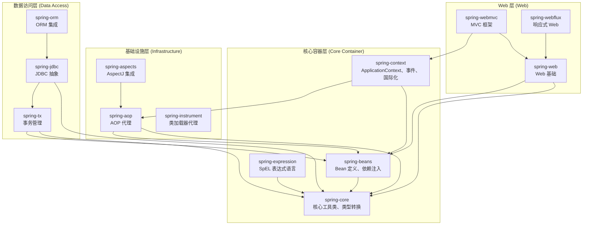

# Spring Framework 核心模块概览

## 概述

Spring Framework 采用**模块化设计**，按职责划分为多个独立模块。开发者可按需引入，避免引入不必要的依赖。本文梳理核心模块的职责与依赖关系，帮助建立全局认知。

---

## 模块依赖关系图



---

## 核心模块详解

### 1. 核心容器层（Core Container）

这是 Spring 的根基，所有其他模块都直接或间接依赖于此。

| 模块 | Maven ArtifactId | 主要包路径 | 核心职责 |
|------|------------------|-----------|----------|
| **spring-core** | `spring-core` | `org.springframework.core` | 类型转换（`Converter`）、资源抽象（`Resource`）、反射工具（`ReflectionUtils`）、环境抽象（`Environment`） |
| **spring-beans** | `spring-beans` | `org.springframework.beans` | `BeanFactory` 接口、`BeanDefinition`、依赖注入机制、`PropertyEditor` |
| **spring-context** | `spring-context` | `org.springframework.context` | `ApplicationContext`、事件发布/监听、国际化（i18n）、`@Component` 扫描、格式化（`format` 包） |
| **spring-expression** | `spring-expression` | `org.springframework.expression` | SpEL（Spring Expression Language）解析与求值引擎 |

> [!IMPORTANT]
> **`spring-context` 是日常开发中最核心的入口模块**，它整合了 Bean 容器、AOP、事件等能力。

---

### 2. 基础设施层（Infrastructure）

提供 AOP 和字节码增强能力。

| 模块 | Maven ArtifactId | 核心职责 |
|------|------------------|----------|
| **spring-aop** | `spring-aop` | JDK 动态代理 / CGLIB 代理、Pointcut / Advice 抽象 |
| **spring-aspects** | `spring-aspects` | AspectJ 编织支持（编译时 / 加载时织入） |
| **spring-instrument** | `spring-instrument` | 类加载时织入（Load-Time Weaving）的 Agent 支持 |

---

### 3. 数据访问层（Data Access）

提供数据库访问和事务管理抽象。

| 模块 | Maven ArtifactId | 核心职责 |
|------|------------------|----------|
| **spring-tx** | `spring-tx` | 声明式事务（`@Transactional`）、编程式事务（`TransactionTemplate`） |
| **spring-jdbc** | `spring-jdbc` | `JdbcTemplate`、`DataSource` 抽象、异常转换 |
| **spring-orm** | `spring-orm` | JPA / Hibernate / MyBatis 集成支持 |

---

### 4. Web 层（Web）

提供 Web 应用开发能力。

| 模块 | Maven ArtifactId | 核心职责 |
|------|------------------|----------|
| **spring-web** | `spring-web` | `HttpServletRequest/Response` 抽象、REST 客户端（`RestTemplate`）、WebClient |
| **spring-webmvc** | `spring-webmvc` | `DispatcherServlet`、`@Controller`、`ViewResolver`、传统 Servlet 栈 MVC |
| **spring-webflux** | `spring-webflux` | 响应式 Web 框架（基于 Project Reactor），非阻塞 I/O |

---

## 关键依赖链

理解依赖链有助于排查类加载和版本冲突问题：

```
spring-webmvc 
    └── spring-context 
            ├── spring-beans 
            │       └── spring-core
            └── spring-aop
                    └── spring-core
```

**核心结论**：

1. **`spring-core` 是最底层模块**，所有其他模块都依赖它
2. **`spring-beans` 提供 IoC 容器基础实现**（`BeanFactory`）
3. **`spring-context` 是功能最丰富的容器**（`ApplicationContext` = `BeanFactory` + AOP + 事件 + 国际化 + ...）
4. **Web 模块依赖 `spring-context`**，因此引入 `spring-webmvc` 会自动传递引入所有核心模块

---

## 与本项目学习路径的映射

| 学习模块 | 对应 Spring 模块 | 核心包 |
|----------|-----------------|--------|
| `spring-resource` | spring-core | `org.springframework.core.io` |
| `spring-metadata` | spring-core | `org.springframework.core.type` |
| `spring-validator` | spring-context | `org.springframework.validation` |
| `spring-convert` | spring-core | `org.springframework.core.convert` |
| `spring-format`（待创建） | spring-context | `org.springframework.format` |

---

## 参考资料

- [Spring Framework 官方文档 - Core Technologies](https://docs.spring.io/spring-framework/reference/core.html)
- [Spring Framework GitHub 仓库](https://github.com/spring-projects/spring-framework)
