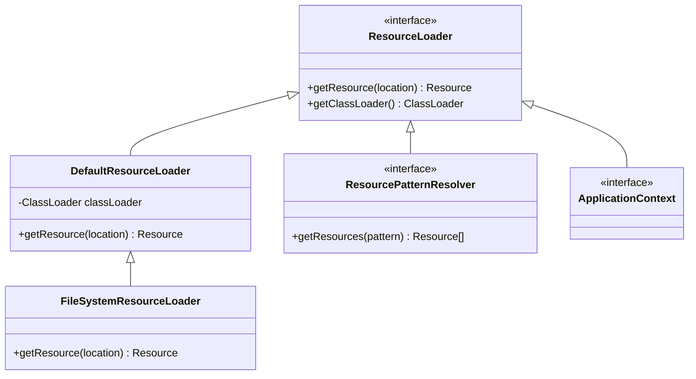
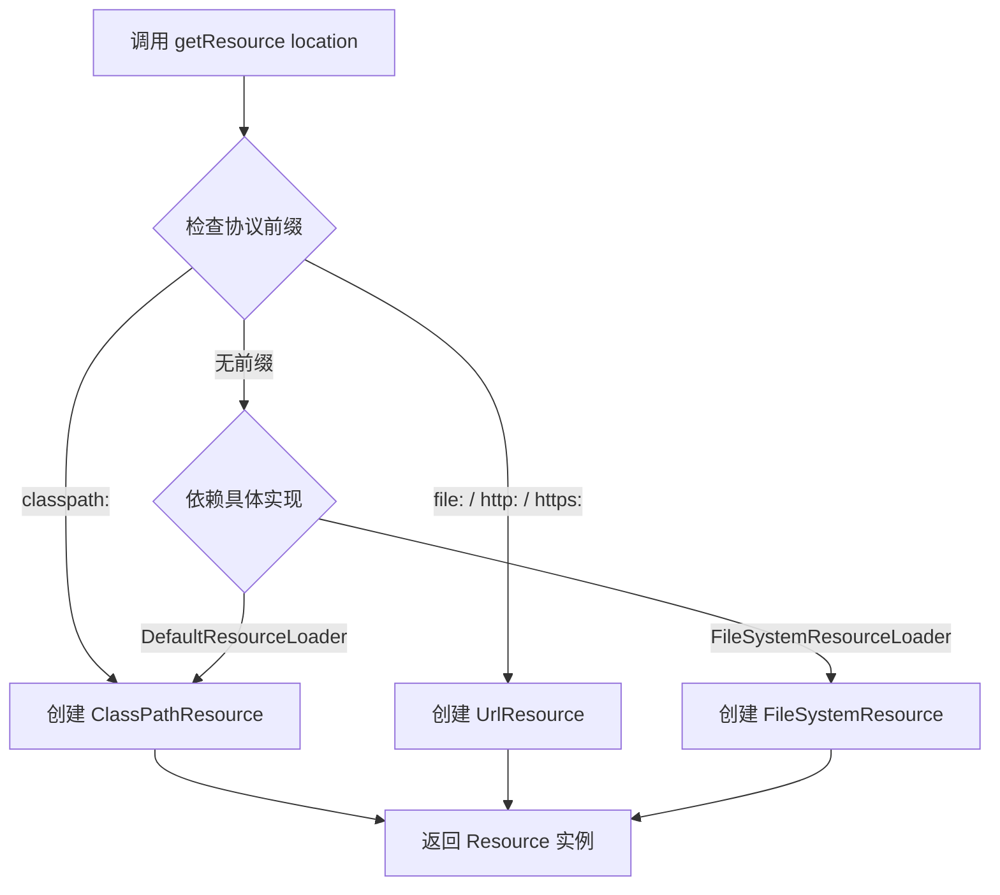

# ResourceLoader 接口

> 最后更新时间：2026-01-14

---

## 📥 01. 一句话定义 (The "AHA" Moment)

**ResourceLoader 是 Spring 用于加载资源的中央策略接口**。它将"如何定位资源"与"如何读取资源"解耦，让你只需提供一个字符串路径（可带协议前缀），就能自动获得对应类型的 `Resource` 实例。

---

## 🔍 02. 背景与痛点 (Context & Problem)

### 现状：没有 ResourceLoader 时的做法

在传统 JDK 中，加载资源需要根据类型使用不同的 API：

```java
// 类路径资源
InputStream is = getClass().getClassLoader().getResourceAsStream("config.xml");

// 文件系统资源
File file = new File("/path/to/config.xml");
InputStream is = new FileInputStream(file);

// 网络资源
URL url = new URL("https://example.com/config.xml");
InputStream is = url.openStream();
```

### 痛点：无法忍受的缺点

| 痛点 | 描述 |
| :--- | :--- |
| **API 割裂** | 类路径、文件系统、网络资源的加载方式完全不同，代码耦合度高 |
| **硬编码** | 资源来源写死在代码中，切换环境需要修改代码 |
| **错误处理复杂** | 每种方式的异常处理逻辑不一致 |
| **空指针风险** | `getResourceAsStream()` 找不到资源时返回 `null`，容易引发 NPE |

### 价值：ResourceLoader 带来的效率提升

1. **统一接口**：无论资源在哪里，都用 `getResource(String location)` 一个方法获取
2. **协议驱动**：通过前缀（`classpath:`, `file:`, `http:`）自动选择加载策略
3. **安全返回**：始终返回 `Resource` 对象，即使资源不存在也不会返回 `null`

---

## ⚙️ 03. 核心机制 (Mechanism & Architecture)

### 第一性原理：策略模式

`ResourceLoader` 的设计遵循**策略模式**：将"资源定位"这个变化点封装，让调用者无需关心底层实现。

```java
public interface ResourceLoader {
    /** 协议前缀：classpath: */
    String CLASSPATH_URL_PREFIX = "classpath:";
    
    /**
     * 根据路径字符串返回对应的 Resource 实例
     * @param location 资源路径（可包含协议前缀）
     */
    Resource getResource(String location);
    
    /**
     * 返回当前使用的 ClassLoader
     */
    ClassLoader getClassLoader();
}
```

### 关键组件



| 组件 | 职责 |
| :--- | :--- |
| **ResourceLoader** | 顶层策略接口，定义加载契约 |
| **DefaultResourceLoader** | 默认实现，支持 classpath/file/url 三种协议 |
| **FileSystemResourceLoader** | 无前缀时默认从文件系统加载（而非类路径） |
| **ApplicationContext** | Spring 容器本身就是 ResourceLoader，可直接注入使用 |

### 工作流：路径解析过程



**步骤详解：**

1. **接收路径**：`getResource("classpath:config.xml")`
2. **解析前缀**：提取协议（`classpath`）和路径（`config.xml`）
3. **选择策略**：根据协议选择对应的 `Resource` 实现类
4. **构造实例**：创建并返回 `Resource` 对象

---

## 💻 04. 实战演示 (Hands-on Practice)

### 代码范例 1：DefaultResourceLoader 基础用法

> 📁 完整代码：[DefaultResourceLoaderDemo.java](../../spring-resource/src/main/java/io/github/daihaowxg/sample03_resource/_03_resource_loader/DefaultResourceLoaderDemo.java)

```java
import org.springframework.core.io.DefaultResourceLoader;
import org.springframework.core.io.Resource;
import org.springframework.core.io.ResourceLoader;

public class DefaultResourceLoaderDemo {
    public static void main(String[] args) throws Exception {
        ResourceLoader loader = new DefaultResourceLoader();
        
        // 1. 类路径资源
        Resource classpathRes = loader.getResource("classpath:application.properties");
        System.out.println("类型: " + classpathRes.getClass().getSimpleName());
        // 输出: ClassPathResource
        
        // 2. 文件系统资源
        Resource fileRes = loader.getResource("file:pom.xml");
        System.out.println("类型: " + fileRes.getClass().getSimpleName());
        // 输出: FileUrlResource
        
        // 3. 网络资源
        Resource urlRes = loader.getResource("https://example.com");
        System.out.println("类型: " + urlRes.getClass().getSimpleName());
        // 输出: UrlResource
    }
}
```

### 代码范例 2：FileSystemResourceLoader 的差异

> 📁 完整代码：[FileSystemResourceLoaderDemo.java](../../spring-resource/src/main/java/io/github/daihaowxg/sample03_resource/_03_resource_loader/FileSystemResourceLoaderDemo.java)

```java
import org.springframework.core.io.FileSystemResourceLoader;
import org.springframework.core.io.Resource;
import org.springframework.core.io.ResourceLoader;

public class FileSystemResourceLoaderDemo {
    public static void main(String[] args) {
        ResourceLoader loader = new FileSystemResourceLoader();
        
        // 不带前缀 → 默认从文件系统加载（不是类路径！）
        Resource fileRes = loader.getResource("pom.xml");
        System.out.println("类型: " + fileRes.getClass().getSimpleName());
        // 输出: FileSystemResource
    }
}
```

### 代码范例 3：在 Spring 容器中获取 ResourceLoader

> 📁 完整代码：[ResourceLoaderAwareDemo.java](../../spring-resource/src/main/java/io/github/daihaowxg/sample03_resource/_03_resource_loader/ResourceLoaderAwareDemo.java)

```java
import org.springframework.context.ResourceLoaderAware;
import org.springframework.core.io.Resource;
import org.springframework.core.io.ResourceLoader;
import org.springframework.stereotype.Component;

@Component
public class MyService implements ResourceLoaderAware {
    
    private ResourceLoader resourceLoader;
    
    @Override
    public void setResourceLoader(ResourceLoader resourceLoader) {
        this.resourceLoader = resourceLoader;
        // Spring 容器启动时自动注入
    }
    
    public void loadConfig() {
        Resource config = resourceLoader.getResource("classpath:config.xml");
        // 使用资源...
    }
}
```

### 关键点拨

> [!IMPORTANT]
> **无前缀路径的行为取决于具体实现**
> - `DefaultResourceLoader`：无前缀默认为 **ClassPathResource**
> - `FileSystemResourceLoader`：无前缀默认为 **FileSystemResource**
> 
> 建议始终显式指定前缀，避免歧义！

---

## ⚖️ 05. 选型权衡 (Trade-offs & Constraints)

### ✅ 适用场景（银弹时刻）

| 场景 | 原因 |
| :--- | :--- |
| 加载单个确定位置的资源 | 精确、高效 |
| 需要统一处理不同来源的资源 | 协议前缀自动适配 |
| 在 Spring Bean 中获取资源 | 可通过依赖注入获得容器的 ResourceLoader |

### ❌ 不适用场景

| 场景 | 替代方案 |
| :--- | :--- |
| 批量扫描多个资源（如 `*.xml`） | 使用 `ResourcePatternResolver` |
| 跨多个 JAR 扫描同名资源 | 使用 `classpath*:` 前缀 + `ResourcePatternResolver` |
| 需要高级匹配（Ant 风格通配符） | 使用 `ResourcePatternResolver` |

### 对比：ResourceLoader vs ResourcePatternResolver

| 特性 | ResourceLoader | ResourcePatternResolver |
| :--- | :--- | :--- |
| 返回类型 | 单个 `Resource` | `Resource[]` 数组 |
| 通配符支持 | ❌ 不支持 | ✅ 支持 Ant 风格（`**/*.xml`） |
| classpath* 支持 | ❌ 不支持 | ✅ 支持跨 JAR 扫描 |
| 性能 | 更高（精确查找） | 略低（需要扫描） |

> [!TIP]
> 如果只是加载单个已知路径的资源，**优先使用 ResourceLoader**，性能更好。

---

## 💡 06. 总结与自查 (Summary Checklist)

### 核心要点回顾

1. `ResourceLoader` 是 Spring 资源加载的**策略接口**
2. 通过**协议前缀**（`classpath:`, `file:`, `http:`）自动选择加载策略
3. `DefaultResourceLoader` 是默认实现，无前缀时从类路径加载
4. `FileSystemResourceLoader` 无前缀时从文件系统加载
5. Spring 的 `ApplicationContext` 本身就是一个 `ResourceLoader`

### 自查清单

- [x] 我是否解释清了 **Why**（解决 JDK API 割裂问题）而不仅仅是 How？
- [x] 读者是否能通过这个文档快速上手？（提供了 3 个可运行的代码示例）
- [x] 边界情况（Edge cases）是否已提及？（无前缀行为差异、与 ResourcePatternResolver 的对比）

---

## 📚 延伸阅读

- [Resource接口详解](./02-Resource接口详解.md)
- [Ant风格路径匹配](./07-Ant风格路径匹配.md)
