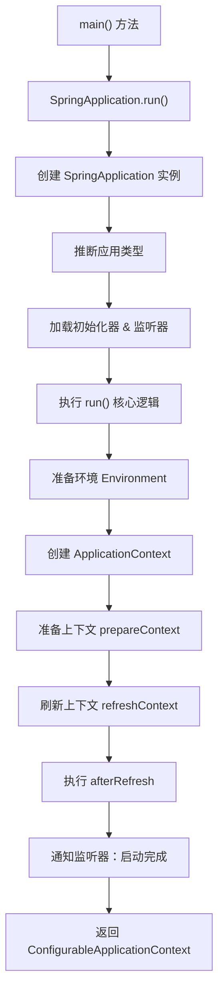
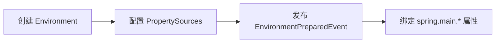
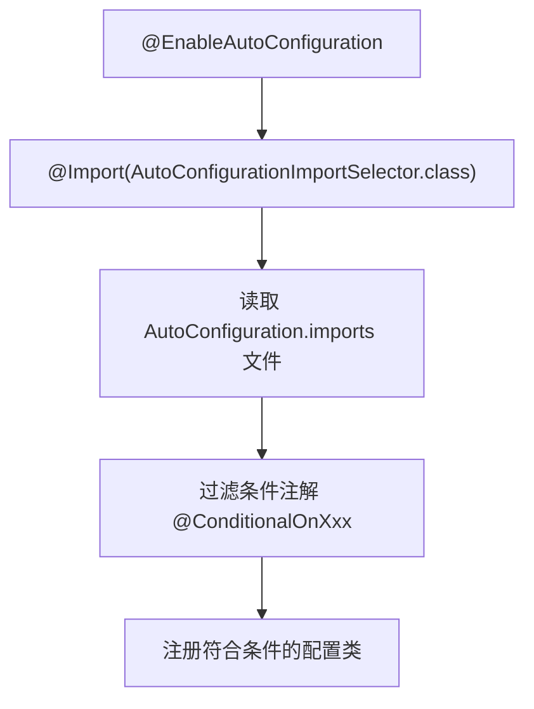
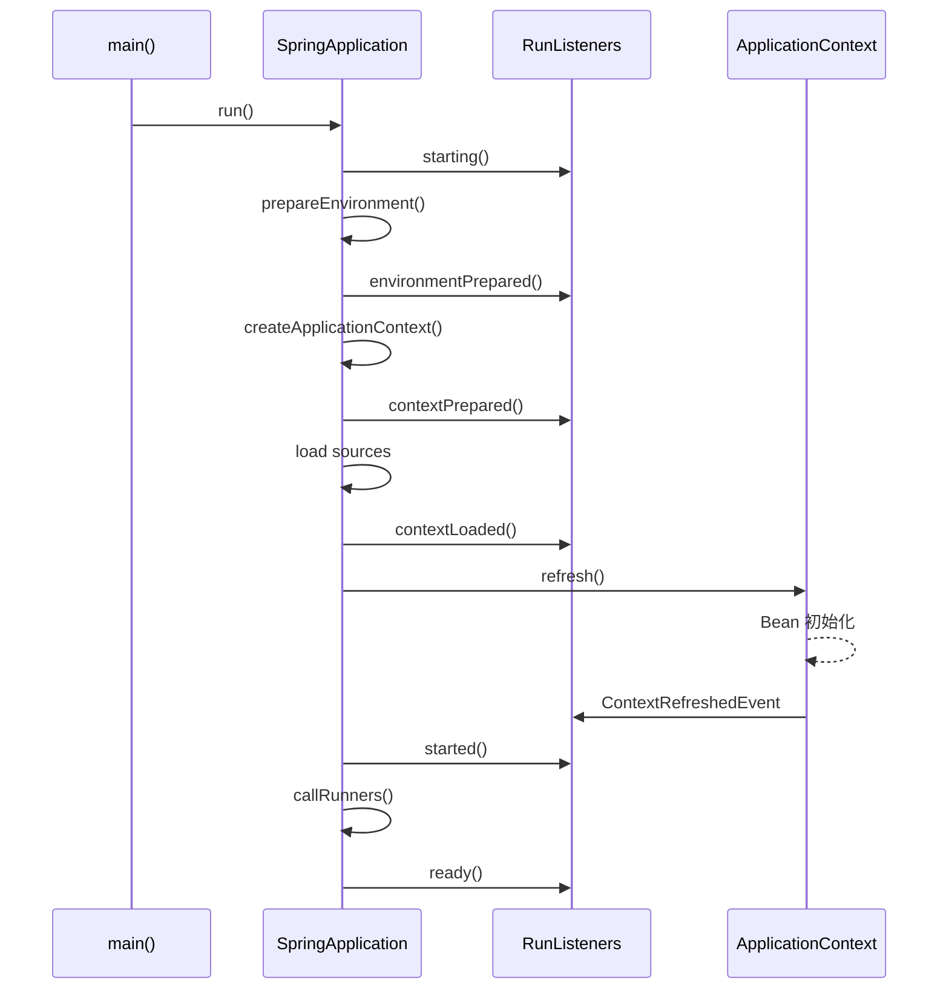

# Spring Boot 启动过程分析

> **基于项目版本**：Spring Boot 3.5.9  
> **入口类**：`Sample04SpringBootApplication`

---

## 1. 宏观启动流程概览



---

## 2. 入口点分析

### 2.1 主启动类

```java
@SpringBootApplication
public class Sample04SpringBootApplication {
    public static void main(String[] args) {
        SpringApplication.run(Sample04SpringBootApplication.class, args);
    }
}
```

### 2.2 `@SpringBootApplication` 注解解析

`@SpringBootApplication` 是一个**组合注解**，等价于以下三个注解的组合：

| 注解 | 作用 |
|------|------|
| `@SpringBootConfiguration` | 标识为配置类（等同于 `@Configuration`） |
| `@EnableAutoConfiguration` | 启用自动配置机制 |
| `@ComponentScan` | 启用组件扫描，扫描当前包及子包 |

---

## 3. `SpringApplication.run()` 详细流程

### 3.1 Phase 1：创建 SpringApplication 实例

```java
public SpringApplication(Class<?>... primarySources) {
    // 1. 记录主配置类
    this.primarySources = new LinkedHashSet<>(Arrays.asList(primarySources));
    
    // 2. 推断应用类型 (NONE / SERVLET / REACTIVE)
    this.webApplicationType = WebApplicationType.deduceFromClasspath();
    
    // 3. 加载 ApplicationContextInitializer
    setInitializers(getSpringFactoriesInstances(ApplicationContextInitializer.class));
    
    // 4. 加载 ApplicationListener
    setListeners(getSpringFactoriesInstances(ApplicationListener.class));
    
    // 5. 推断主启动类
    this.mainApplicationClass = deduceMainApplicationClass();
}
```

> [!NOTE]
> **应用类型推断规则**：
> - 存在 `DispatcherHandler` 且无 `DispatcherServlet` → `REACTIVE`
> - 存在 `Servlet` 相关类 → `SERVLET`
> - 其他情况 → `NONE`

### 3.2 Phase 2：执行 `run()` 方法核心逻辑

```java
public ConfigurableApplicationContext run(String... args) {
    // 1. 创建 BootstrapContext
    DefaultBootstrapContext bootstrapContext = createBootstrapContext();
    
    // 2. 获取 SpringApplicationRunListeners（用于发布启动事件）
    SpringApplicationRunListeners listeners = getRunListeners(args);
    listeners.starting(bootstrapContext, this.mainApplicationClass);
    
    try {
        // 3. 封装命令行参数
        ApplicationArguments applicationArguments = new DefaultApplicationArguments(args);
        
        // 4. 准备环境 Environment
        ConfigurableEnvironment environment = prepareEnvironment(listeners, bootstrapContext, applicationArguments);
        
        // 5. 打印 Banner
        Banner printedBanner = printBanner(environment);
        
        // 6. 创建 ApplicationContext
        context = createApplicationContext();
        
        // 7. 准备上下文
        prepareContext(bootstrapContext, context, environment, listeners, applicationArguments, printedBanner);
        
        // 8. 刷新上下文（核心！）
        refreshContext(context);
        
        // 9. 刷新后处理
        afterRefresh(context, applicationArguments);
        
        // 10. 通知监听器：启动完成
        listeners.started(context);
        
        // 11. 执行 Runner (ApplicationRunner / CommandLineRunner)
        callRunners(context, applicationArguments);
        
    } catch (Throwable ex) {
        handleRunFailure(context, ex, listeners);
    }
    
    listeners.ready(context);
    return context;
}
```

---

## 4. 核心阶段详解

### 4.1 环境准备 (`prepareEnvironment`)



**关键职责**：
- 加载 `application.properties` / `application.yml`
- 处理命令行参数 `--key=value`
- 处理环境变量和系统属性

### 4.2 创建 ApplicationContext (`createApplicationContext`)

根据应用类型创建不同的上下文实现：

| 应用类型 | ApplicationContext 实现 |
|----------|------------------------|
| `SERVLET` | `AnnotationConfigServletWebServerApplicationContext` |
| `REACTIVE` | `AnnotationConfigReactiveWebServerApplicationContext` |
| `NONE` | `AnnotationConfigApplicationContext` |

### 4.3 准备上下文 (`prepareContext`)

```java
private void prepareContext(ConfigurableApplicationContext context, ...) {
    // 1. 设置环境
    context.setEnvironment(environment);
    
    // 2. 执行所有 ApplicationContextInitializer
    applyInitializers(context);
    
    // 3. 发布 contextPrepared 事件
    listeners.contextPrepared(context);
    
    // 4. 注册主配置类为 BeanDefinition
    load(context, sources.toArray(new Object[0]));
    
    // 5. 发布 contextLoaded 事件
    listeners.contextLoaded(context);
}
```

### 4.4 刷新上下文 (`refreshContext`) - **最核心阶段**

`refreshContext` 最终调用 Spring Framework 的 `AbstractApplicationContext.refresh()` 方法：

```java
public void refresh() {
    // 1. 准备刷新：记录启动时间、设置状态
    prepareRefresh();
    
    // 2. 获取 BeanFactory
    ConfigurableListableBeanFactory beanFactory = obtainFreshBeanFactory();
    
    // 3. BeanFactory 前置处理
    prepareBeanFactory(beanFactory);
    
    try {
        // 4. 允许子类定制 BeanFactory
        postProcessBeanFactory(beanFactory);
        
        // 5. 【关键】调用 BeanFactoryPostProcessor
        //    - ConfigurationClassPostProcessor 解析 @Configuration
        //    - PropertySourcesPlaceholderConfigurer 处理占位符
        invokeBeanFactoryPostProcessors(beanFactory);
        
        // 6. 注册 BeanPostProcessor
        registerBeanPostProcessors(beanFactory);
        
        // 7. 初始化消息源（国际化）
        initMessageSource();
        
        // 8. 初始化事件广播器
        initApplicationEventMulticaster();
        
        // 9. 【Web 应用关键】onRefresh - 启动内嵌 Web 服务器
        onRefresh();
        
        // 10. 注册监听器
        registerListeners();
        
        // 11. 【关键】实例化所有非懒加载的单例 Bean
        finishBeanFactoryInitialization(beanFactory);
        
        // 12. 完成刷新：发布 ContextRefreshedEvent
        finishRefresh();
    } catch (...) { ... }
}
```

> [!IMPORTANT]
> **自动配置触发点**：在 `invokeBeanFactoryPostProcessors` 阶段，`ConfigurationClassPostProcessor` 会解析 `@EnableAutoConfiguration`，从 `META-INF/spring/org.springframework.boot.autoconfigure.AutoConfiguration.imports` 文件加载所有自动配置类。

---

## 5. 自动配置机制

### 5.1 加载流程



### 5.2 常用条件注解

| 注解 | 条件含义 |
|------|----------|
| `@ConditionalOnClass` | classpath 中存在指定类 |
| `@ConditionalOnMissingBean` | 容器中不存在指定 Bean |
| `@ConditionalOnProperty` | 配置属性满足条件 |
| `@ConditionalOnWebApplication` | 是 Web 应用 |

---

## 6. 启动事件时序



---

## 7. 扩展点总结

| 扩展点 | 接口/注解 | 执行时机 |
|--------|-----------|----------|
| 应用初始化 | `ApplicationContextInitializer` | `prepareContext` 阶段 |
| 启动监听 | `SpringApplicationRunListener` | 贯穿整个启动流程 |
| Bean 后处理 | `BeanPostProcessor` | Bean 实例化前后 |
| 启动后执行 | `ApplicationRunner` / `CommandLineRunner` | 容器刷新完成后 |
| 条件装配 | `@ConditionalOnXxx` | 自动配置阶段 |

---

## 8. 关键源码类索引

| 类名 | 职责 |
|------|------|
| `SpringApplication` | 启动入口，协调整个启动流程 |
| `SpringApplicationRunListener` | 启动过程事件发布 |
| `ConfigurationClassPostProcessor` | 解析 `@Configuration`，处理自动配置 |
| `AutoConfigurationImportSelector` | 加载自动配置类列表 |
| `AbstractApplicationContext` | Spring 容器核心，`refresh()` 方法所在 |

---

## 9. 调试技巧

1. **开启调试日志**：在 `application.properties` 中添加 `debug=true`，可查看自动配置报告
2. **断点位置推荐**：
   - `SpringApplication.run()` - 观察整体流程
   - `AbstractApplicationContext.refresh()` - 观察 Bean 加载过程
   - `ConfigurationClassPostProcessor.processConfigBeanDefinitions()` - 观察配置类解析
