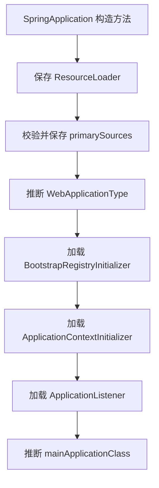

# SpringApplication 构造方法解析

> 基于 Spring Boot 3.5.9

---

## 构造方法源码

```java
public SpringApplication(ResourceLoader resourceLoader, Class<?>... primarySources) {
    this.resourceLoader = resourceLoader;
    Assert.notNull(primarySources, "'primarySources' must not be null");
    this.primarySources = new LinkedHashSet<>(Arrays.asList(primarySources));
    this.properties.setWebApplicationType(WebApplicationType.deduceFromClasspath());
    this.bootstrapRegistryInitializers = new ArrayList<>(
            getSpringFactoriesInstances(BootstrapRegistryInitializer.class));
    setInitializers((Collection) getSpringFactoriesInstances(ApplicationContextInitializer.class));
    setListeners((Collection) getSpringFactoriesInstances(ApplicationListener.class));
    this.mainApplicationClass = deduceMainApplicationClass();
}
```

---

## 逐行解析

### 1. 保存 ResourceLoader

```java
this.resourceLoader = resourceLoader;
```

- **作用**：保存外部传入的资源加载器。
- **说明**：`ResourceLoader` 用于加载类路径、文件系统等资源。若传入 `null`，后续会使用默认的 `DefaultResourceLoader`。

---

### 2. 校验并保存主配置类

```java
Assert.notNull(primarySources, "'primarySources' must not be null");
this.primarySources = new LinkedHashSet<>(Arrays.asList(primarySources));
```

- **作用**：确保至少有一个主配置类，并保存到 `LinkedHashSet` 中（**保证顺序 + 去重**）。
- **primarySources**：通常是标注了 `@SpringBootApplication` 的启动类。

---

### 3. 推断 Web 应用类型

```java
this.properties.setWebApplicationType(WebApplicationType.deduceFromClasspath());
```

- **作用**：根据类路径中存在的类，自动推断应用类型。
- **推断逻辑**（`WebApplicationType.deduceFromClasspath()`）：

| 类路径条件 | 推断结果 |
|---|---|
| 存在 `DispatcherHandler` 且无 `DispatcherServlet` | `REACTIVE`（响应式 Web） |
| 存在 `Servlet` 和 `ConfigurableWebApplicationContext` | `SERVLET`（传统 Servlet Web） |
| 其他情况 | `NONE`（非 Web 应用） |

---

### 4. 加载 BootstrapRegistryInitializer

```java
this.bootstrapRegistryInitializers = new ArrayList<>(
        getSpringFactoriesInstances(BootstrapRegistryInitializer.class));
```

- **作用**：通过 **SPI 机制** 加载所有 `BootstrapRegistryInitializer` 实现。
- **BootstrapRegistryInitializer**：用于在 `ApplicationContext` 创建之前，向 `BootstrapRegistry` 注册早期初始化器（例如：配置属性解密、云环境配置等）。
- **加载位置**：`META-INF/spring.factories` 或 `META-INF/spring/org.springframework.boot.BootstrapRegistryInitializer.imports`

---

### 5. 加载 ApplicationContextInitializer

```java
setInitializers((Collection) getSpringFactoriesInstances(ApplicationContextInitializer.class));
```

- **作用**：通过 **SPI 机制** 加载所有 `ApplicationContextInitializer` 实现。
- **ApplicationContextInitializer**：在 `ApplicationContext` **刷新（refresh）之前** 调用，用于对上下文进行编程式配置（例如：注册 PropertySource、激活 Profile 等）。
- **典型实现**：
  - `ConfigurationWarningsApplicationContextInitializer`：检查常见配置错误
  - `ContextIdApplicationContextInitializer`：设置应用 ID

---

### 6. 加载 ApplicationListener

```java
setListeners((Collection) getSpringFactoriesInstances(ApplicationListener.class));
```

- **作用**：通过 **SPI 机制** 加载所有 `ApplicationListener` 实现。
- **ApplicationListener**：监听 Spring 应用生命周期事件（如 `ApplicationStartingEvent`、`ApplicationReadyEvent` 等）。
- **典型实现**：
  - `LoggingApplicationListener`：配置日志系统
  - `AnsiOutputApplicationListener`：配置 ANSI 彩色输出

---

### 7. 推断主类

```java
this.mainApplicationClass = deduceMainApplicationClass();
```

- **作用**：推断包含 `main()` 方法的类。
- **实现原理**：遍历当前线程的调用栈，找到包含 `main` 方法的类。
- **用途**：用于日志输出、Banner 显示等场景。

---

## 核心机制：getSpringFactoriesInstances()

```java
private <T> List<T> getSpringFactoriesInstances(Class<T> type) {
    // 从 META-INF/spring.factories 或 .imports 文件加载实现类
    // 实例化并排序后返回
}
```

这是 Spring Boot 的 **SPI 扩展机制**，允许第三方库或用户自定义：
- `BootstrapRegistryInitializer`
- `ApplicationContextInitializer`
- `ApplicationListener`

只需在 `META-INF/spring.factories` 中声明实现类即可。

---

## 流程图



---

## 总结

| 步骤 | 关键动作 | 目的 |
|---|---|---|
| 1 | 保存 `ResourceLoader` | 资源加载 |
| 2 | 保存 `primarySources` | 确定主配置类 |
| 3 | 推断 `WebApplicationType` | 决定创建何种 `ApplicationContext` |
| 4 | 加载 `BootstrapRegistryInitializer` | 早期引导阶段扩展 |
| 5 | 加载 `ApplicationContextInitializer` | 上下文刷新前扩展 |
| 6 | 加载 `ApplicationListener` | 生命周期事件监听 |
| 7 | 推断 `mainApplicationClass` | 日志/Banner 显示 |

**核心设计思想**：通过 SPI 机制实现 **开放扩展、闭合修改**，允许用户在不修改框架源码的情况下定制启动行为。
