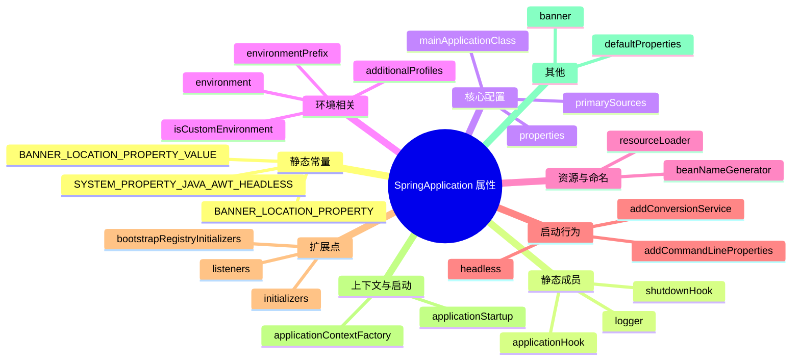

# SpringApplication 类属性解析

> 基于 Spring Boot 3.5.9

---

## 属性分类概览



---

## 一、静态常量

| 属性 | 类型 | 说明 |
|---|---|---|
| `BANNER_LOCATION_PROPERTY_VALUE` | `String` | Banner 文件的默认位置，值为 `banner.txt` |
| `BANNER_LOCATION_PROPERTY` | `String` | 配置 Banner 位置的属性键名：`spring.banner.location` |
| `SYSTEM_PROPERTY_JAVA_AWT_HEADLESS` | `String` | JVM 属性 `java.awt.headless`，用于设置无头模式 |

---

## 二、静态成员

| 属性 | 类型 | 说明 |
|---|---|---|
| `logger` | `Log` | 日志记录器 |
| `shutdownHook` | `SpringApplicationShutdownHook` | JVM 关闭钩子，用于优雅关闭 Spring 应用 |
| `applicationHook` | `ThreadLocal<SpringApplicationHook>` | 线程本地的应用钩子，支持测试场景下的自定义行为 |

---

## 三、核心配置属性

### 3.1 primarySources

```java
private final Set<Class<?>> primarySources;
```

- **类型**：`Set<Class<?>>`（不可变）
- **作用**：主配置类集合，通常是标注 `@SpringBootApplication` 的启动类
- **初始化**：通过构造方法传入，使用 `LinkedHashSet` 保证顺序

### 3.2 mainApplicationClass

```java
private Class<?> mainApplicationClass;
```

- **类型**：`Class<?>`
- **作用**：包含 `main()` 方法的类
- **初始化**：通过 `deduceMainApplicationClass()` 从调用栈推断
- **用途**：Banner 显示、日志输出

### 3.3 properties

```java
final ApplicationProperties properties = new ApplicationProperties();
```

- **类型**：`ApplicationProperties`
- **作用**：封装应用属性配置，包括：
  - `WebApplicationType`（SERVLET / REACTIVE / NONE）
  - `Banner.Mode`（OFF / CONSOLE / LOG）
  - `lazyInitialization`（是否延迟初始化）
  - 等等

---

## 四、环境相关属性

### 4.1 environment

```java
private ConfigurableEnvironment environment;
```

- **类型**：`ConfigurableEnvironment`
- **作用**：Spring 环境抽象，管理：
  - 激活的 Profile
  - PropertySource（配置属性来源）
  - 占位符解析

### 4.2 isCustomEnvironment

```java
private boolean isCustomEnvironment;
```

- **类型**：`boolean`
- **默认值**：`false`
- **作用**：标记是否使用了自定义 Environment，若为 `true`，则跳过默认 Environment 创建

### 4.3 environmentPrefix

```java
private String environmentPrefix;
```

- **类型**：`String`
- **作用**：环境变量前缀，用于系统环境变量的属性绑定
- **示例**：设置为 `MYAPP`，则 `MYAPP_SERVER_PORT` 会被解析为 `server.port`

### 4.4 additionalProfiles

```java
private Set<String> additionalProfiles = Collections.emptySet();
```

- **类型**：`Set<String>`
- **默认值**：空集合
- **作用**：编程式添加额外的激活 Profile（除了配置文件中定义的）

---

## 五、资源与命名属性

### 5.1 resourceLoader

```java
private ResourceLoader resourceLoader;
```

- **类型**：`ResourceLoader`
- **作用**：资源加载器，用于加载：
  - 类路径资源（`classpath:`）
  - 文件系统资源（`file:`）
  - URL 资源（`http:`）

### 5.2 beanNameGenerator

```java
private BeanNameGenerator beanNameGenerator;
```

- **类型**：`BeanNameGenerator`
- **作用**：Bean 名称生成策略
- **默认**：`AnnotationBeanNameGenerator`，基于类名生成（首字母小写）

---

## 六、启动行为属性

### 6.1 headless

```java
private boolean headless = true;
```

- **类型**：`boolean`
- **默认值**：`true`
- **作用**：设置 `java.awt.headless` 系统属性
- **说明**：无头模式下，服务器环境无需图形设备支持

### 6.2 addCommandLineProperties

```java
private boolean addCommandLineProperties = true;
```

- **类型**：`boolean`
- **默认值**：`true`
- **作用**：是否将命令行参数（`--key=value`）添加到 Environment
- **优先级**：命令行参数具有最高优先级

### 6.3 addConversionService

```java
private boolean addConversionService = true;
```

- **类型**：`boolean`
- **默认值**：`true`
- **作用**：是否添加 `ApplicationConversionService` 到 Environment
- **说明**：提供丰富的类型转换支持（如 `Duration`、`DataSize` 等）

---

## 七、扩展点属性

### 7.1 initializers

```java
private List<ApplicationContextInitializer<?>> initializers;
```

- **类型**：`List<ApplicationContextInitializer<?>>`
- **作用**：上下文初始化器集合
- **调用时机**：`ApplicationContext` 刷新（refresh）之前
- **加载方式**：SPI（`META-INF/spring.factories`）

### 7.2 listeners

```java
private List<ApplicationListener<?>> listeners;
```

- **类型**：`List<ApplicationListener<?>>`
- **作用**：应用事件监听器集合
- **监听事件**：

| 事件 | 触发时机 |
|---|---|
| `ApplicationStartingEvent` | run() 刚开始 |
| `ApplicationEnvironmentPreparedEvent` | Environment 准备完成 |
| `ApplicationContextInitializedEvent` | Context 初始化完成 |
| `ApplicationPreparedEvent` | Bean 定义加载完成，刷新前 |
| `ApplicationStartedEvent` | Context 刷新完成 |
| `ApplicationReadyEvent` | 完全启动，可接收请求 |
| `ApplicationFailedEvent` | 启动失败 |

### 7.3 bootstrapRegistryInitializers

```java
private final List<BootstrapRegistryInitializer> bootstrapRegistryInitializers;
```

- **类型**：`List<BootstrapRegistryInitializer>`（不可变）
- **作用**：引导注册表初始化器
- **调用时机**：在 `ApplicationContext` 创建之前的引导阶段
- **典型用途**：配置属性解密、云环境配置

---

## 八、上下文与启动属性

### 8.1 applicationContextFactory

```java
private ApplicationContextFactory applicationContextFactory = ApplicationContextFactory.DEFAULT;
```

- **类型**：`ApplicationContextFactory`
- **默认值**：`ApplicationContextFactory.DEFAULT`
- **作用**：根据 `WebApplicationType` 创建对应的 `ApplicationContext`

| WebApplicationType | 创建的 Context |
|---|---|
| `SERVLET` | `AnnotationConfigServletWebServerApplicationContext` |
| `REACTIVE` | `AnnotationConfigReactiveWebServerApplicationContext` |
| `NONE` | `AnnotationConfigApplicationContext` |

### 8.2 applicationStartup

```java
private ApplicationStartup applicationStartup = ApplicationStartup.DEFAULT;
```

- **类型**：`ApplicationStartup`
- **默认值**：`ApplicationStartup.DEFAULT`（空实现）
- **作用**：启动过程指标收集，用于性能分析
- **实现**：可替换为 `BufferingApplicationStartup` 或 `FlightRecorderApplicationStartup`

---

## 九、其他属性

### 9.1 banner

```java
private Banner banner;
```

- **类型**：`Banner`
- **作用**：自定义 Banner 实现
- **说明**：若未设置，使用默认的 `SpringBootBanner`

### 9.2 defaultProperties

```java
private Map<String, Object> defaultProperties;
```

- **类型**：`Map<String, Object>`
- **作用**：默认属性，优先级最低
- **用途**：设置应用的默认配置值

---

## 总结表格

| 分类 | 属性 | 默认值 | 说明 |
|---|---|---|---|
| **核心** | `primarySources` | - | 主配置类 |
| **核心** | `mainApplicationClass` | 推断 | main 方法所在类 |
| **环境** | `environment` | `null` | Spring Environment |
| **环境** | `additionalProfiles` | 空 | 额外激活的 Profile |
| **行为** | `headless` | `true` | 无头模式 |
| **行为** | `addCommandLineProperties` | `true` | 解析命令行参数 |
| **扩展** | `initializers` | SPI 加载 | Context 初始化器 |
| **扩展** | `listeners` | SPI 加载 | 事件监听器 |
| **扩展** | `bootstrapRegistryInitializers` | SPI 加载 | 引导初始化器 |
| **上下文** | `applicationContextFactory` | DEFAULT | Context 工厂 |
| **上下文** | `applicationStartup` | DEFAULT | 启动指标收集 |
