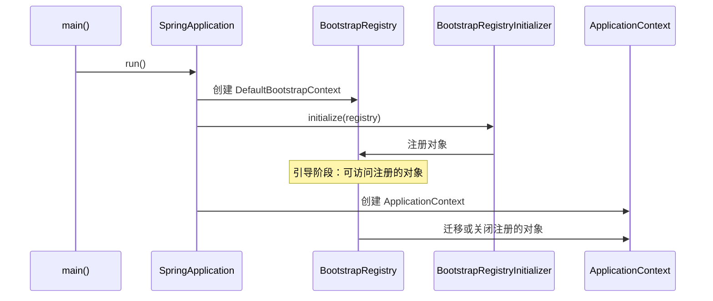
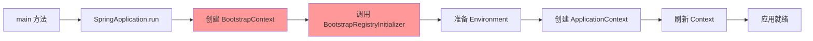
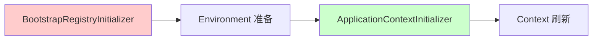
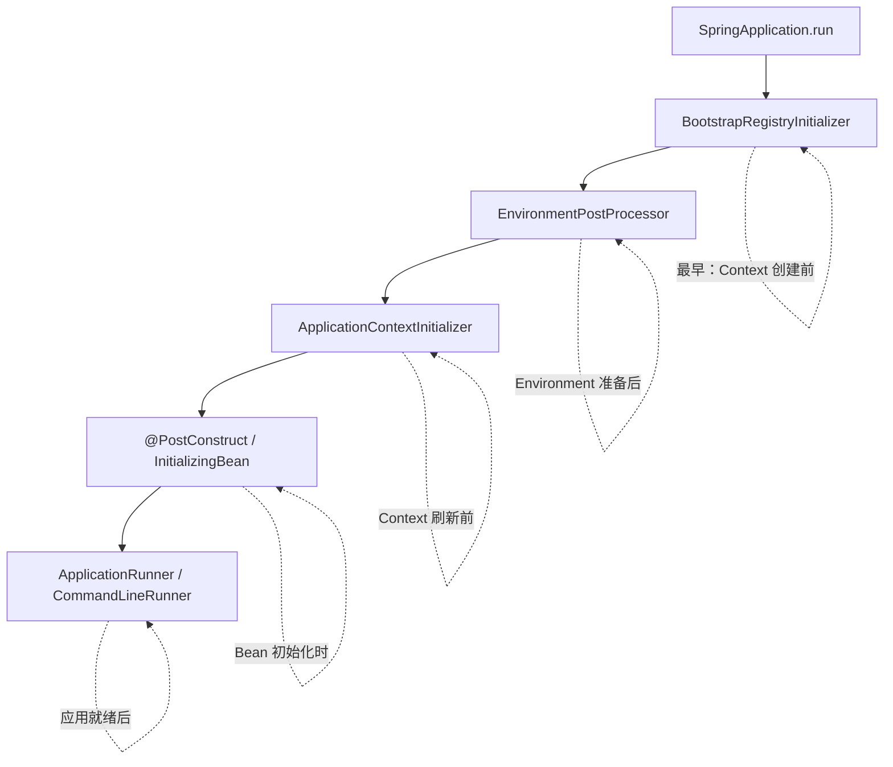

# BootstrapRegistryInitializer 解析

> 基于 Spring Boot 3.5.9

---

## 一、接口定义

```java
@FunctionalInterface
public interface BootstrapRegistryInitializer {
    
    void initialize(BootstrapRegistry registry);
    
}
```

- **函数式接口**：只有一个抽象方法，可用 Lambda 表达式实现
- **作用**：在 Spring Boot 应用启动的**最早期阶段**，向 `BootstrapRegistry` 注册对象

---

## 二、核心概念

### 2.1 什么是 BootstrapRegistry？

`BootstrapRegistry` 是一个**临时注册表**，存在于 `ApplicationContext` 创建之前。它提供了一种在引导阶段注册和共享对象的机制。



### 2.2 生命周期位置



> **红色部分**：`BootstrapRegistryInitializer` 的作用时机，早于 Environment 和 ApplicationContext

---

## 三、BootstrapRegistry API

### 3.1 核心方法

```java
public interface BootstrapRegistry {
    
    // 注册一个实例（单例）
    <T> void register(Class<T> type, InstanceSupplier<T> instanceSupplier);
    
    // 注册（如果不存在）
    <T> void registerIfAbsent(Class<T> type, InstanceSupplier<T> instanceSupplier);
    
    // 检查是否已注册
    <T> boolean isRegistered(Class<T> type);
    
    // 获取已注册的实例供应者
    <T> InstanceSupplier<T> getRegisteredInstanceSupplier(Class<T> type);
    
    // 添加关闭监听器
    void addCloseListener(ApplicationListener<BootstrapContextClosedEvent> listener);
}
```

### 3.2 InstanceSupplier

```java
@FunctionalInterface
public interface InstanceSupplier<T> {
    
    T get(BootstrapContext context);
    
    // 工厂方法
    static <T> InstanceSupplier<T> of(T instance) {
        return (context) -> instance;
    }
    
    // 指定作用域
    default InstanceSupplier<T> withScope(Scope scope) { ... }
}
```

**作用域（Scope）**：

| Scope | 说明 |
|---|---|
| `SINGLETON` | 单例（默认），只创建一次 |
| `PROTOTYPE` | 原型，每次获取都创建新实例 |

---

## 四、使用场景

### 4.1 典型用途

| 场景 | 说明 |
|---|---|
| **配置属性解密** | 在 Environment 准备前注册解密服务 |
| **云环境配置** | 从配置中心获取初始配置（如 Spring Cloud Config） |
| **日志系统初始化** | 在极早期配置日志 |
| **外部服务连接** | 建立早期需要的外部服务连接 |

### 4.2 代码示例

#### 示例 1：注册简单对象

```java
public class MyBootstrapInitializer implements BootstrapRegistryInitializer {
    
    @Override
    public void initialize(BootstrapRegistry registry) {
        // 注册一个配置解密服务
        registry.register(ConfigDecryptor.class, context -> new ConfigDecryptor());
    }
}
```

#### 示例 2：依赖其他已注册对象

```java
public class DependentInitializer implements BootstrapRegistryInitializer {
    
    @Override
    public void initialize(BootstrapRegistry registry) {
        registry.register(ServiceA.class, context -> new ServiceA());
        
        registry.register(ServiceB.class, context -> {
            // 从 BootstrapContext 获取已注册的 ServiceA
            ServiceA serviceA = context.get(ServiceA.class);
            return new ServiceB(serviceA);
        });
    }
}
```

#### 示例 3：迁移到 ApplicationContext

```java
public class MigrationInitializer implements BootstrapRegistryInitializer {
    
    @Override
    public void initialize(BootstrapRegistry registry) {
        registry.register(SharedService.class, context -> new SharedService());
        
        // 添加关闭监听器，在 BootstrapContext 关闭时将对象迁移到 ApplicationContext
        registry.addCloseListener(event -> {
            SharedService service = event.getBootstrapContext().get(SharedService.class);
            ConfigurableApplicationContext appContext = event.getApplicationContext();
            
            // 注册为 Spring Bean
            appContext.getBeanFactory().registerSingleton("sharedService", service);
        });
    }
}
```

---

## 五、注册方式

### 5.1 通过 SPI（推荐）

在 `META-INF/spring.factories` 中声明：

```properties
org.springframework.boot.BootstrapRegistryInitializer=\
  com.example.MyBootstrapInitializer
```

或在 `META-INF/spring/org.springframework.boot.BootstrapRegistryInitializer.imports`：

```
com.example.MyBootstrapInitializer
```

### 5.2 编程式注册

```java
@SpringBootApplication
public class MyApplication {
    
    public static void main(String[] args) {
        SpringApplication app = new SpringApplication(MyApplication.class);
        app.addBootstrapRegistryInitializer(registry -> {
            registry.register(MyService.class, ctx -> new MyService());
        });
        app.run(args);
    }
}
```

---

## 六、与 ApplicationContextInitializer 对比

| 特性 | BootstrapRegistryInitializer | ApplicationContextInitializer |
|---|---|---|
| **调用时机** | ApplicationContext 创建**之前** | ApplicationContext 刷新**之前** |
| **操作对象** | BootstrapRegistry | ConfigurableApplicationContext |
| **主要用途** | 早期引导阶段配置 | Context 级别配置 |
| **访问 Environment** | ❌ 无法访问 | ✅ 可以访问 |
| **访问 BeanFactory** | ❌ 无法访问 | ✅ 可以访问 |



---

## 七、Spring Cloud 中的应用

Spring Cloud 大量使用 `BootstrapRegistryInitializer` 实现：

| 组件 | 用途 |
|---|---|
| **Spring Cloud Config** | 从配置服务器获取初始配置 |
| **Spring Cloud Consul** | 连接 Consul 获取配置 |
| **Spring Cloud Vault** | 从 Vault 获取加密配置 |

这些组件需要在 Environment 准备之前就完成配置获取，因此必须使用 Bootstrap 阶段的扩展点。

---

## 八、完整启动阶段扩展点对比



| 扩展点 | 时机 | 用途 |
|---|---|---|
| `BootstrapRegistryInitializer` | 最早 | 引导阶段对象注册 |
| `EnvironmentPostProcessor` | Environment 准备后 | 修改 Environment |
| `ApplicationContextInitializer` | Context 刷新前 | 配置 ApplicationContext |
| `@PostConstruct` | Bean 初始化时 | Bean 级别初始化 |
| `ApplicationRunner` | 应用就绪后 | 启动后任务 |

---

## 总结

1. **定位**：`BootstrapRegistryInitializer` 是 Spring Boot 启动过程中**最早**的扩展点
2. **作用**：在 `ApplicationContext` 创建之前注册共享对象
3. **场景**：配置解密、云配置获取、极早期初始化
4. **注意**：此阶段无法访问 Environment 和 BeanFactory，能力受限
