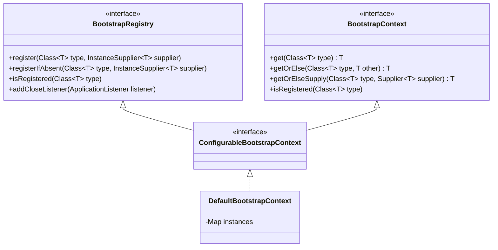
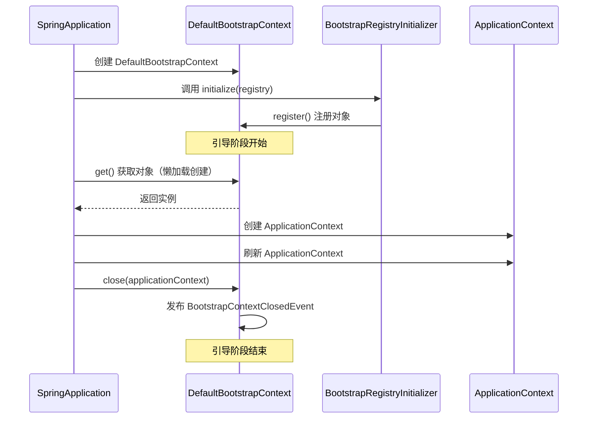
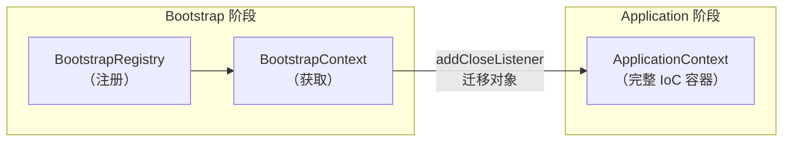

# BootstrapRegistry 与 BootstrapContext 解析

> 基于 Spring Boot 3.5.9

---

## 一、概述

`BootstrapRegistry` 和 `BootstrapContext` 是 Spring Boot 引导阶段的两个核心接口，它们共同构成了在 `ApplicationContext` 创建之前的**临时对象容器**。

| 接口 | 角色 | 说明 |
|---|---|---|
| `BootstrapRegistry` | **注册接口** | 用于注册对象（写入） |
| `BootstrapContext` | **访问接口** | 用于获取已注册的对象（读取） |



---

## 二、BootstrapRegistry 详解

### 2.1 接口定义

```java
public interface BootstrapRegistry {

    <T> void register(Class<T> type, InstanceSupplier<T> instanceSupplier);

    <T> void registerIfAbsent(Class<T> type, InstanceSupplier<T> instanceSupplier);

    <T> boolean isRegistered(Class<T> type);

    <T> InstanceSupplier<T> getRegisteredInstanceSupplier(Class<T> type);

    void addCloseListener(ApplicationListener<BootstrapContextClosedEvent> listener);
}
```

### 2.2 方法说明

| 方法 | 说明 |
|---|---|
| `register(type, supplier)` | 注册指定类型的实例供应者，若已存在则**覆盖** |
| `registerIfAbsent(type, supplier)` | 注册指定类型的实例供应者，若已存在则**忽略** |
| `isRegistered(type)` | 检查指定类型是否已注册 |
| `getRegisteredInstanceSupplier(type)` | 获取已注册的实例供应者 |
| `addCloseListener(listener)` | 添加关闭事件监听器 |

### 2.3 InstanceSupplier

```java
@FunctionalInterface
public interface InstanceSupplier<T> {
    
    T get(BootstrapContext context);
    
    // 创建包装已有实例的供应者
    static <T> InstanceSupplier<T> of(T instance) {
        return (context) -> instance;
    }
    
    // 创建从工厂获取实例的供应者
    static <T> InstanceSupplier<T> from(Supplier<T> supplier) {
        return (context) -> supplier.get();
    }
    
    // 设置作用域
    default InstanceSupplier<T> withScope(Scope scope) { ... }
}
```

**作用域（Scope）**：

```java
enum Scope {
    SINGLETON,  // 单例，只创建一次（默认）
    PROTOTYPE   // 原型，每次获取创建新实例
}
```

### 2.4 使用示例

```java
public class MyInitializer implements BootstrapRegistryInitializer {
    
    @Override
    public void initialize(BootstrapRegistry registry) {
        // 方式1：使用 Lambda
        registry.register(ServiceA.class, context -> new ServiceA());
        
        // 方式2：使用已有实例
        registry.register(ServiceB.class, InstanceSupplier.of(new ServiceB()));
        
        // 方式3：依赖其他已注册对象
        registry.register(ServiceC.class, context -> {
            ServiceA a = context.get(ServiceA.class);
            return new ServiceC(a);
        });
        
        // 方式4：条件注册（不覆盖）
        registry.registerIfAbsent(ServiceA.class, context -> new DefaultServiceA());
    }
}
```

---

## 三、BootstrapContext 详解

### 3.1 接口定义

```java
public interface BootstrapContext {

    <T> T get(Class<T> type) throws IllegalStateException;

    <T> T getOrElse(Class<T> type, T other);

    <T> T getOrElseSupply(Class<T> type, Supplier<T> other);

    <T> T getOrElseThrow(Class<T> type, Supplier<? extends X> exceptionSupplier) throws X;

    <T> boolean isRegistered(Class<T> type);
}
```

### 3.2 方法说明

| 方法 | 行为 |
|---|---|
| `get(type)` | 获取实例，未注册时抛出 `IllegalStateException` |
| `getOrElse(type, other)` | 获取实例，未注册时返回 `other` |
| `getOrElseSupply(type, supplier)` | 获取实例，未注册时调用 `supplier` 获取 |
| `getOrElseThrow(type, exceptionSupplier)` | 获取实例，未注册时抛出自定义异常 |
| `isRegistered(type)` | 检查是否已注册 |

### 3.3 使用示例

```java
// 在 InstanceSupplier 中使用 BootstrapContext
registry.register(ComplexService.class, context -> {
    // 必须存在
    ServiceA a = context.get(ServiceA.class);
    
    // 可选，提供默认值
    ServiceB b = context.getOrElse(ServiceB.class, new DefaultServiceB());
    
    // 可选，延迟创建默认值
    ServiceC c = context.getOrElseSupply(ServiceC.class, ServiceC::createDefault);
    
    return new ComplexService(a, b, c);
});
```

---

## 四、ConfigurableBootstrapContext

`ConfigurableBootstrapContext` 是 `BootstrapRegistry` 和 `BootstrapContext` 的组合接口：

```java
public interface ConfigurableBootstrapContext extends BootstrapRegistry, BootstrapContext {
    // 无额外方法，仅组合两个接口
}
```

---

## 五、DefaultBootstrapContext

`DefaultBootstrapContext` 是 `ConfigurableBootstrapContext` 的默认实现：

### 5.1 核心结构

```java
public class DefaultBootstrapContext implements ConfigurableBootstrapContext {
    
    // 存储已注册的 InstanceSupplier
    private final Map<Class<?>, InstanceSupplier<?>> instanceSuppliers = new HashMap<>();
    
    // 存储已创建的实例（单例缓存）
    private final Map<Class<?>, Object> instances = new HashMap<>();
    
    // 关闭事件监听器
    private final List<ApplicationListener<BootstrapContextClosedEvent>> closeListeners = new ArrayList<>();
}
```

### 5.2 懒加载机制

```java
@Override
public <T> T get(Class<T> type) {
    // 1. 先从实例缓存获取
    T instance = (T) this.instances.get(type);
    if (instance != null) {
        return instance;
    }
    
    // 2. 获取 InstanceSupplier
    InstanceSupplier<T> supplier = (InstanceSupplier<T>) this.instanceSuppliers.get(type);
    if (supplier == null) {
        throw new IllegalStateException("No instance registered for " + type);
    }
    
    // 3. 创建实例
    instance = supplier.get(this);
    
    // 4. 如果是单例，缓存
    if (supplier.getScope() == Scope.SINGLETON) {
        this.instances.put(type, instance);
    }
    
    return instance;
}
```

> **关键点**：实例是**懒加载**的，只有在首次 `get()` 时才创建

### 5.3 关闭处理

```java
public void close(ConfigurableApplicationContext applicationContext) {
    // 发布 BootstrapContextClosedEvent 事件
    BootstrapContextClosedEvent event = new BootstrapContextClosedEvent(this, applicationContext);
    for (ApplicationListener<BootstrapContextClosedEvent> listener : this.closeListeners) {
        listener.onApplicationEvent(event);
    }
}
```

---

## 六、生命周期



---

## 七、对象迁移到 ApplicationContext

### 7.1 为什么需要迁移？

`BootstrapContext` 中的对象在引导阶段后会被丢弃。如果需要在 `ApplicationContext` 中继续使用，必须手动迁移。

### 7.2 迁移方式

```java
public class MigrationInitializer implements BootstrapRegistryInitializer {
    
    @Override
    public void initialize(BootstrapRegistry registry) {
        // 注册需要迁移的对象
        registry.register(SharedConfig.class, context -> new SharedConfig());
        
        // 监听关闭事件，执行迁移
        registry.addCloseListener(event -> {
            // 获取 BootstrapContext 中的对象
            SharedConfig config = event.getBootstrapContext().get(SharedConfig.class);
            
            // 获取 ApplicationContext
            ConfigurableApplicationContext appContext = event.getApplicationContext();
            
            // 注册为 Spring Bean
            appContext.getBeanFactory()
                      .registerSingleton("sharedConfig", config);
        });
    }
}
```

### 7.3 BootstrapContextClosedEvent

```java
public class BootstrapContextClosedEvent extends ApplicationEvent {
    
    private final ConfigurableBootstrapContext bootstrapContext;
    private final ConfigurableApplicationContext applicationContext;
    
    // 获取 BootstrapContext
    public ConfigurableBootstrapContext getBootstrapContext() {
        return this.bootstrapContext;
    }
    
    // 获取 ApplicationContext
    public ConfigurableApplicationContext getApplicationContext() {
        return this.applicationContext;
    }
}
```

---

## 八、与 ApplicationContext 对比

| 特性 | BootstrapContext | ApplicationContext |
|---|---|---|
| **生命周期** | 引导阶段（短暂） | 应用整个生命周期 |
| **对象管理** | 简单的 Map 存储 | 完整的 IoC 容器 |
| **依赖注入** | 仅支持手动获取 | 支持自动注入 |
| **生命周期回调** | 无 | 支持 `@PostConstruct` 等 |
| **AOP** | 不支持 | 支持 |
| **事件机制** | 仅 `BootstrapContextClosedEvent` | 完整事件系统 |
| **配置绑定** | 不支持 | 支持 `@ConfigurationProperties` |

---

## 九、使用场景总结

| 场景 | 注册方式 | 获取方式 |
|---|---|---|
| 配置解密服务 | `register()` | `get()` |
| 云配置客户端 | `register()` | `get()` |
| 共享工具对象 | `register()` + `addCloseListener()` | 迁移后从 ApplicationContext 获取 |
| 可选依赖 | `registerIfAbsent()` | `getOrElse()` |

---

## 总结



1. **BootstrapRegistry**：引导阶段的**写接口**，用于注册对象
2. **BootstrapContext**：引导阶段的**读接口**，用于获取对象
3. **DefaultBootstrapContext**：实现类，内部使用 Map + 懒加载
4. **对象迁移**：通过 `addCloseListener` 将对象迁移到 `ApplicationContext`
