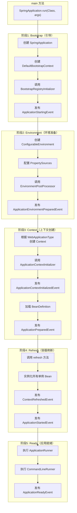
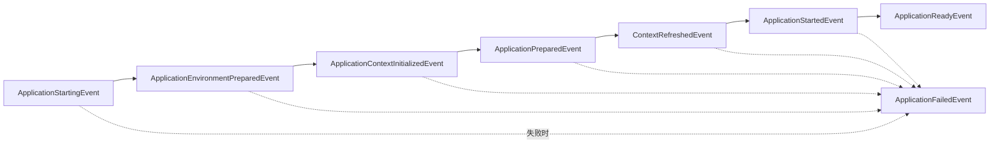
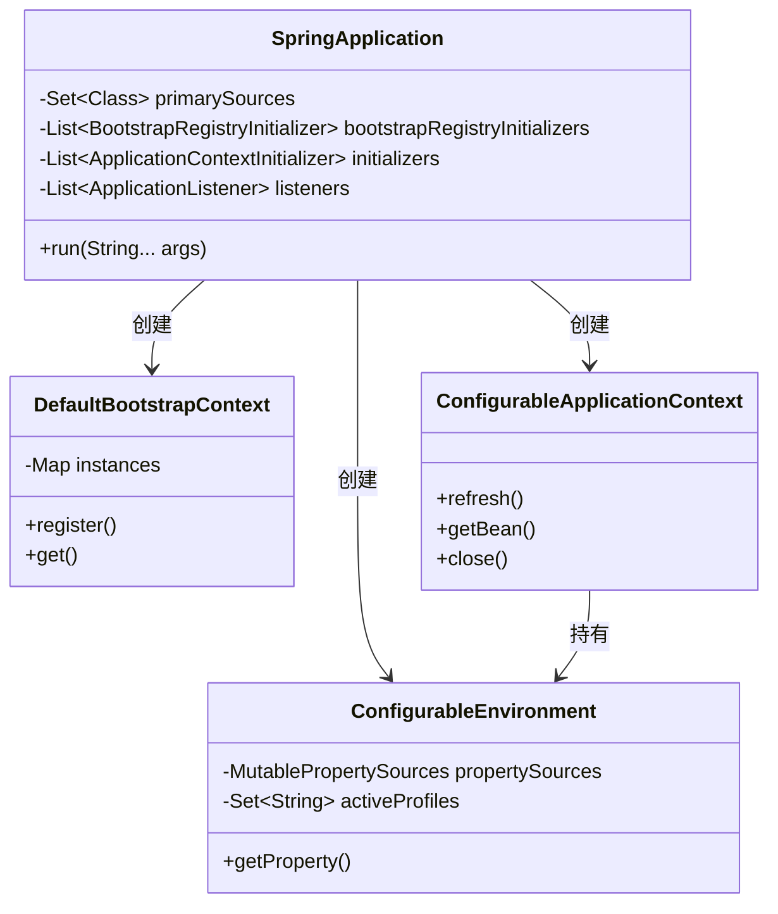

# Spring Boot 启动流程解析

> 基于 Spring Boot 3.5.9

---

## 一、启动流程全景图



---

## 二、核心方法 SpringApplication.run()

```java
public ConfigurableApplicationContext run(String... args) {
    // 1. 记录启动时间
    Startup startup = Startup.create();
    
    // 2. 创建 BootstrapContext
    DefaultBootstrapContext bootstrapContext = createBootstrapContext();
    
    // 3. 配置 Headless 模式
    configureHeadlessProperty();
    
    // 4. 获取 SpringApplicationRunListeners
    SpringApplicationRunListeners listeners = getRunListeners(args);
    
    // 5. 发布 ApplicationStartingEvent
    listeners.starting(bootstrapContext, this.mainApplicationClass);
    
    try {
        // 6. 解析命令行参数
        ApplicationArguments applicationArguments = new DefaultApplicationArguments(args);
        
        // 7. 准备 Environment
        ConfigurableEnvironment environment = prepareEnvironment(listeners, bootstrapContext, applicationArguments);
        
        // 8. 打印 Banner
        Banner printedBanner = printBanner(environment);
        
        // 9. 创建 ApplicationContext
        context = createApplicationContext();
        
        // 10. 准备 ApplicationContext
        prepareContext(bootstrapContext, context, environment, listeners, applicationArguments, printedBanner);
        
        // 11. 刷新 ApplicationContext
        refreshContext(context);
        
        // 12. 刷新后处理
        afterRefresh(context, applicationArguments);
        
        // 13. 发布 ApplicationStartedEvent
        listeners.started(context, startup.timeTakenToStarted());
        
        // 14. 执行 Runners
        callRunners(context, applicationArguments);
        
        // 15. 发布 ApplicationReadyEvent
        listeners.ready(context, startup.ready());
        
    } catch (Throwable ex) {
        // 异常处理，发布 ApplicationFailedEvent
        throw handleRunFailure(context, ex, listeners);
    }
    
    return context;
}
```

---

## 三、阶段详解

### 阶段1：Bootstrap（引导阶段）

#### 3.1.1 创建 SpringApplication

```java
public SpringApplication(ResourceLoader resourceLoader, Class<?>... primarySources) {
    this.resourceLoader = resourceLoader;
    this.primarySources = new LinkedHashSet<>(Arrays.asList(primarySources));
    this.properties.setWebApplicationType(WebApplicationType.deduceFromClasspath());
    this.bootstrapRegistryInitializers = getSpringFactoriesInstances(BootstrapRegistryInitializer.class);
    setInitializers(getSpringFactoriesInstances(ApplicationContextInitializer.class));
    setListeners(getSpringFactoriesInstances(ApplicationListener.class));
    this.mainApplicationClass = deduceMainApplicationClass();
}
```

#### 3.1.2 创建 BootstrapContext

```java
private DefaultBootstrapContext createBootstrapContext() {
    DefaultBootstrapContext bootstrapContext = new DefaultBootstrapContext();
    // 调用所有 BootstrapRegistryInitializer
    this.bootstrapRegistryInitializers.forEach((initializer) -> 
        initializer.initialize(bootstrapContext));
    return bootstrapContext;
}
```

#### 3.1.3 核心类

| 类 | 作用 |
|---|---|
| `SpringApplication` | 启动入口，协调整个启动流程 |
| `DefaultBootstrapContext` | 引导阶段的临时对象容器 |
| `BootstrapRegistryInitializer` | 引导阶段扩展点 |
| `SpringApplicationRunListeners` | 启动事件广播器 |

#### 3.1.4 触发事件

- **ApplicationStartingEvent**：应用开始启动

---

### 阶段2：Environment（环境准备阶段）

#### 3.2.1 prepareEnvironment 流程

```java
private ConfigurableEnvironment prepareEnvironment(
        SpringApplicationRunListeners listeners,
        DefaultBootstrapContext bootstrapContext,
        ApplicationArguments applicationArguments) {
    
    // 1. 创建 Environment
    ConfigurableEnvironment environment = getOrCreateEnvironment();
    
    // 2. 配置 Environment（命令行参数、Profile等）
    configureEnvironment(environment, applicationArguments.getSourceArgs());
    
    // 3. 附加 ConfigurationPropertySources
    ConfigurationPropertySources.attach(environment);
    
    // 4. 发布 ApplicationEnvironmentPreparedEvent
    //    -> 触发 EnvironmentPostProcessor
    listeners.environmentPrepared(bootstrapContext, environment);
    
    // 5. 移动 defaultProperties 到最后
    DefaultPropertiesPropertySource.moveToEnd(environment);
    
    // 6. 绑定 spring.main.* 属性
    bindToSpringApplication(environment);
    
    return environment;
}
```

#### 3.2.2 Environment 类型

| WebApplicationType | Environment 类型 |
|---|---|
| `SERVLET` | `ApplicationServletEnvironment` |
| `REACTIVE` | `ApplicationReactiveWebEnvironment` |
| `NONE` | `ApplicationEnvironment` |

#### 3.2.3 PropertySource 优先级（从高到低）

```
1. 命令行参数（--key=value）
2. JNDI 属性
3. Java 系统属性（-Dkey=value）
4. 操作系统环境变量
5. RandomValuePropertySource
6. application-{profile}.properties/yml
7. application.properties/yml
8. @PropertySource 注解
9. defaultProperties
```

#### 3.2.4 核心类

| 类 | 作用 |
|---|---|
| `ConfigurableEnvironment` | 环境抽象，管理配置属性 |
| `PropertySource` | 配置属性来源 |
| `EnvironmentPostProcessor` | 环境后处理器，可修改 Environment |
| `ConfigFileApplicationListener` | 加载 application.properties/yml |

#### 3.2.5 触发事件

- **ApplicationEnvironmentPreparedEvent**：环境准备完成

---

### 阶段3：Context（上下文创建阶段）

#### 3.3.1 createApplicationContext

```java
protected ConfigurableApplicationContext createApplicationContext() {
    return this.applicationContextFactory.create(this.properties.getWebApplicationType());
}
```

| WebApplicationType | ApplicationContext 类型 |
|---|---|
| `SERVLET` | `AnnotationConfigServletWebServerApplicationContext` |
| `REACTIVE` | `AnnotationConfigReactiveWebServerApplicationContext` |
| `NONE` | `AnnotationConfigApplicationContext` |

#### 3.3.2 prepareContext 流程

```java
private void prepareContext(DefaultBootstrapContext bootstrapContext,
        ConfigurableApplicationContext context,
        ConfigurableEnvironment environment,
        SpringApplicationRunListeners listeners,
        ApplicationArguments applicationArguments,
        Banner printedBanner) {
    
    // 1. 设置 Environment
    context.setEnvironment(environment);
    
    // 2. 后处理 Context
    postProcessApplicationContext(context);
    
    // 3. 添加 Initializers
    addAotGeneratedInitializerIfNecessary(this.initializers);
    
    // 4. 应用 ApplicationContextInitializer
    applyInitializers(context);
    
    // 5. 发布 ApplicationContextInitializedEvent
    listeners.contextPrepared(context);
    
    // 6. 关闭 BootstrapContext
    bootstrapContext.close(context);
    
    // 7. 注册特殊 Bean
    ConfigurableListableBeanFactory beanFactory = context.getBeanFactory();
    beanFactory.registerSingleton("springApplicationArguments", applicationArguments);
    if (printedBanner != null) {
        beanFactory.registerSingleton("springBootBanner", printedBanner);
    }
    
    // 8. 加载 BeanDefinition
    load(context, getAllSources().toArray(new Object[0]));
    
    // 9. 发布 ApplicationPreparedEvent
    listeners.contextLoaded(context);
}
```

#### 3.3.3 核心类

| 类 | 作用 |
|---|---|
| `ApplicationContextFactory` | 创建 ApplicationContext 的工厂 |
| `ApplicationContextInitializer` | Context 初始化器 |
| `BeanDefinitionLoader` | 加载 BeanDefinition |

#### 3.3.4 触发事件

- **ApplicationContextInitializedEvent**：Context 初始化完成
- **ApplicationPreparedEvent**：Context 准备完成（BeanDefinition 已加载）

---

### 阶段4：Refresh（容器刷新阶段）

#### 3.4.1 refresh 流程（AbstractApplicationContext）

```java
public void refresh() {
    // 1. 准备刷新
    prepareRefresh();
    
    // 2. 获取 BeanFactory
    ConfigurableListableBeanFactory beanFactory = obtainFreshBeanFactory();
    
    // 3. 准备 BeanFactory
    prepareBeanFactory(beanFactory);
    
    // 4. 后处理 BeanFactory（子类扩展点）
    postProcessBeanFactory(beanFactory);
    
    // 5. 调用 BeanFactoryPostProcessor
    invokeBeanFactoryPostProcessors(beanFactory);
    
    // 6. 注册 BeanPostProcessor
    registerBeanPostProcessors(beanFactory);
    
    // 7. 初始化 MessageSource
    initMessageSource();
    
    // 8. 初始化事件广播器
    initApplicationEventMulticaster();
    
    // 9. 子类扩展点（如启动内嵌 Web 服务器）
    onRefresh();
    
    // 10. 注册事件监听器
    registerListeners();
    
    // 11. 实例化所有非懒加载的单例 Bean
    finishBeanFactoryInitialization(beanFactory);
    
    // 12. 完成刷新（发布 ContextRefreshedEvent）
    finishRefresh();
}
```

#### 3.4.2 关键步骤说明

| 步骤 | 说明 |
|---|---|
| `invokeBeanFactoryPostProcessors` | 执行 `@Configuration` 类解析、`@ComponentScan` 等 |
| `registerBeanPostProcessors` | 注册 `@Autowired`、`@Value` 等处理器 |
| `onRefresh` | 启动内嵌 Tomcat/Jetty/Netty |
| `finishBeanFactoryInitialization` | 实例化 Bean、依赖注入、AOP 代理 |

#### 3.4.3 核心类

| 类 | 作用 |
|---|---|
| `AbstractApplicationContext` | refresh 流程模板 |
| `DefaultListableBeanFactory` | Bean 容器实现 |
| `BeanFactoryPostProcessor` | BeanFactory 后处理器 |
| `BeanPostProcessor` | Bean 后处理器 |
| `ConfigurationClassPostProcessor` | 处理 `@Configuration` |

#### 3.4.4 触发事件

- **ContextRefreshedEvent**：Context 刷新完成
- **ApplicationStartedEvent**：应用已启动（refresh 完成后）

---

### 阶段5：Ready（应用就绪阶段）

#### 3.5.1 callRunners

```java
private void callRunners(ApplicationContext context, ApplicationArguments args) {
    List<Object> runners = new ArrayList<>();
    
    // 收集所有 Runner
    runners.addAll(context.getBeansOfType(ApplicationRunner.class).values());
    runners.addAll(context.getBeansOfType(CommandLineRunner.class).values());
    
    // 排序
    AnnotationAwareOrderComparator.sort(runners);
    
    // 依次执行
    for (Object runner : runners) {
        if (runner instanceof ApplicationRunner ar) {
            ar.run(args);
        }
        if (runner instanceof CommandLineRunner cr) {
            cr.run(args.getSourceArgs());
        }
    }
}
```

#### 3.5.2 ApplicationRunner vs CommandLineRunner

| 接口 | 参数类型 | 特点 |
|---|---|---|
| `ApplicationRunner` | `ApplicationArguments` | 支持解析 `--key=value` 格式 |
| `CommandLineRunner` | `String[]` | 原始命令行参数 |

#### 3.5.3 触发事件

- **ApplicationReadyEvent**：应用完全就绪，可接收请求

---

## 四、事件时间线



| 事件 | 时机 | 可用资源 |
|---|---|---|
| `ApplicationStartingEvent` | 启动开始 | 无 |
| `ApplicationEnvironmentPreparedEvent` | Environment 准备完成 | Environment |
| `ApplicationContextInitializedEvent` | Context 初始化完成 | Context（空） |
| `ApplicationPreparedEvent` | BeanDefinition 加载完成 | Context（未刷新） |
| `ContextRefreshedEvent` | Context 刷新完成 | Context（完整） |
| `ApplicationStartedEvent` | refresh 完成 | Context（完整） |
| `ApplicationReadyEvent` | 应用完全就绪 | Context（完整） |
| `ApplicationFailedEvent` | 启动失败 | 异常信息 |

---

## 五、扩展点汇总

| 阶段 | 扩展点 | 注册方式 |
|---|---|---|
| Bootstrap | `BootstrapRegistryInitializer` | SPI / `addBootstrapRegistryInitializer()` |
| Environment | `EnvironmentPostProcessor` | SPI |
| Context | `ApplicationContextInitializer` | SPI / `addInitializers()` |
| Refresh | `BeanFactoryPostProcessor` | `@Bean` / `@Component` |
| Refresh | `BeanPostProcessor` | `@Bean` / `@Component` |
| Ready | `ApplicationRunner` | `@Bean` / `@Component` |
| Ready | `CommandLineRunner` | `@Bean` / `@Component` |

---

## 六、核心类关系图



---

## 七、总结

### 7.1 五个阶段

| 阶段 | 核心操作 | 产出 |
|---|---|---|
| **Bootstrap** | 创建 BootstrapContext | 早期对象注册 |
| **Environment** | 加载配置属性 | ConfigurableEnvironment |
| **Context** | 创建并配置 ApplicationContext | BeanDefinition |
| **Refresh** | 实例化 Bean、启动 Web 服务器 | 完整的 IoC 容器 |
| **Ready** | 执行启动后任务 | 应用就绪 |

### 7.2 关键设计

1. **SPI 机制**：通过 `spring.factories` 实现开放扩展
2. **事件驱动**：每个阶段都有对应事件，便于监听和扩展
3. **模板方法**：`refresh()` 使用模板方法模式，子类可扩展
4. **工厂模式**：`ApplicationContextFactory` 根据类型创建不同 Context
