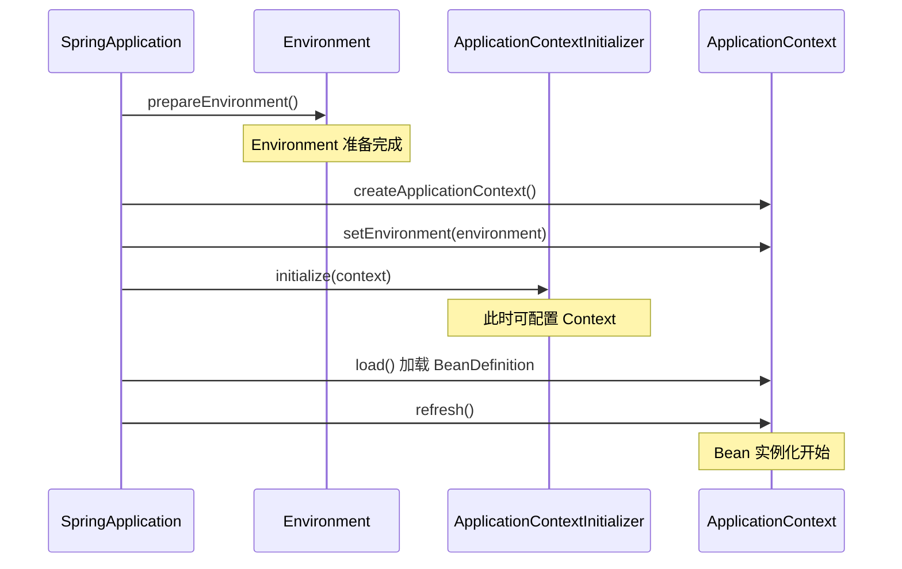
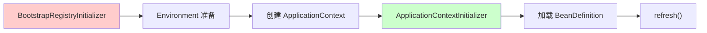
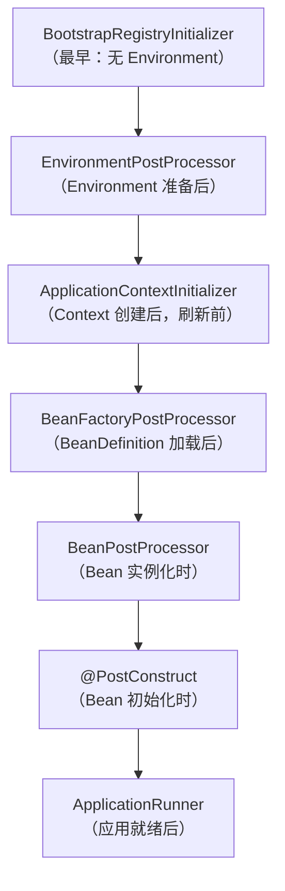

# ApplicationContextInitializer 解析

> 基于 Spring Boot 3.5.9

---

## 一、接口定义

```java
@FunctionalInterface
public interface ApplicationContextInitializer<C extends ConfigurableApplicationContext> {
    
    void initialize(C applicationContext);
    
}
```

- **函数式接口**：只有一个抽象方法，可用 Lambda 表达式实现
- **泛型参数**：`C` 是 `ConfigurableApplicationContext` 的子类
- **作用**：在 ApplicationContext **刷新（refresh）之前** 对其进行配置

---

## 二、调用时机



**关键点**：
- **Environment 已就绪**：可以读取配置属性
- **BeanDefinition 未加载**：Bean 定义尚未注册
- **Context 未刷新**：Bean 尚未实例化

---

## 三、与 BootstrapRegistryInitializer 对比

| 特性 | BootstrapRegistryInitializer | ApplicationContextInitializer |
|---|---|---|
| **调用时机** | ApplicationContext 创建**之前** | ApplicationContext 刷新**之前** |
| **操作对象** | `BootstrapRegistry` | `ConfigurableApplicationContext` |
| **访问 Environment** | ❌ 无法访问 | ✅ 可以访问 |
| **访问 BeanFactory** | ❌ 无法访问 | ✅ 可以访问（空） |
| **典型用途** | 极早期配置（云配置） | Context 级别配置 |



---

## 四、使用场景

| 场景 | 说明 |
|---|---|
| **注册 PropertySource** | 向 Environment 添加自定义属性源 |
| **激活 Profile** | 编程式激活特定 Profile |
| **注册 BeanDefinition** | 手动注册 Bean 定义 |
| **配置 BeanFactory** | 设置 BeanFactory 属性 |
| **设置 Context ID** | 自定义应用 ID |

---

## 五、代码示例

### 5.1 注册 PropertySource

```java
public class CustomPropertySourceInitializer 
        implements ApplicationContextInitializer<ConfigurableApplicationContext> {
    
    @Override
    public void initialize(ConfigurableApplicationContext context) {
        ConfigurableEnvironment env = context.getEnvironment();
        
        Map<String, Object> properties = new HashMap<>();
        properties.put("custom.property", "value");
        properties.put("custom.enabled", "true");
        
        env.getPropertySources()
           .addFirst(new MapPropertySource("customProperties", properties));
    }
}
```

### 5.2 激活 Profile

```java
public class ProfileActivationInitializer 
        implements ApplicationContextInitializer<ConfigurableApplicationContext> {
    
    @Override
    public void initialize(ConfigurableApplicationContext context) {
        ConfigurableEnvironment env = context.getEnvironment();
        
        // 根据条件激活 Profile
        if (isDevelopmentMachine()) {
            env.addActiveProfile("dev");
        }
        
        // 或者读取外部配置决定
        String profile = System.getenv("APP_PROFILE");
        if (profile != null) {
            env.addActiveProfile(profile);
        }
    }
    
    private boolean isDevelopmentMachine() {
        return "dev-machine".equals(System.getenv("HOSTNAME"));
    }
}
```

### 5.3 注册 BeanDefinition

```java
public class BeanRegistrationInitializer 
        implements ApplicationContextInitializer<GenericApplicationContext> {
    
    @Override
    public void initialize(GenericApplicationContext context) {
        // 编程式注册 Bean
        context.registerBean("myService", MyService.class, () -> {
            MyService service = new MyService();
            service.setEnabled(true);
            return service;
        });
        
        // 使用 BeanDefinition
        GenericBeanDefinition beanDefinition = new GenericBeanDefinition();
        beanDefinition.setBeanClass(AnotherService.class);
        beanDefinition.setScope(BeanDefinition.SCOPE_SINGLETON);
        context.registerBeanDefinition("anotherService", beanDefinition);
    }
}
```

### 5.4 配置日志上下文

```java
public class LoggingContextInitializer 
        implements ApplicationContextInitializer<ConfigurableApplicationContext> {
    
    @Override
    public void initialize(ConfigurableApplicationContext context) {
        ConfigurableEnvironment env = context.getEnvironment();
        
        // 获取应用名称，设置到日志 MDC
        String appName = env.getProperty("spring.application.name", "unknown");
        MDC.put("appName", appName);
    }
}
```

---

## 六、注册方式

### 6.1 通过 SPI（推荐）

在 `META-INF/spring.factories` 中声明：

```properties
org.springframework.context.ApplicationContextInitializer=\
  com.example.CustomPropertySourceInitializer,\
  com.example.ProfileActivationInitializer
```

### 6.2 编程式注册

```java
@SpringBootApplication
public class MyApplication {
    
    public static void main(String[] args) {
        SpringApplication app = new SpringApplication(MyApplication.class);
        
        // 添加初始化器
        app.addInitializers(context -> {
            context.getEnvironment().addActiveProfile("custom");
        });
        
        app.run(args);
    }
}
```

### 6.3 通过配置文件

在 `application.properties` 中指定：

```properties
context.initializer.classes=com.example.CustomPropertySourceInitializer
```

### 6.4 使用 @ContextConfiguration（测试场景）

```java
@SpringBootTest
@ContextConfiguration(initializers = TestInitializer.class)
public class MyIntegrationTest {
    // ...
}
```

---

## 七、执行顺序

### 7.1 使用 @Order 或 Ordered 接口

```java
@Order(Ordered.HIGHEST_PRECEDENCE)
public class FirstInitializer 
        implements ApplicationContextInitializer<ConfigurableApplicationContext> {
    
    @Override
    public void initialize(ConfigurableApplicationContext context) {
        System.out.println("First");
    }
}

@Order(Ordered.LOWEST_PRECEDENCE)
public class LastInitializer 
        implements ApplicationContextInitializer<ConfigurableApplicationContext> {
    
    @Override
    public void initialize(ConfigurableApplicationContext context) {
        System.out.println("Last");
    }
}
```

### 7.2 顺序规则

| 值 | 说明 |
|---|---|
| `Ordered.HIGHEST_PRECEDENCE` | 最先执行（`Integer.MIN_VALUE`） |
| `Ordered.LOWEST_PRECEDENCE` | 最后执行（`Integer.MAX_VALUE`） |
| 默认 | 按注册顺序 |

---

## 八、Spring Boot 内置实现

| 实现类 | 作用 | Order |
|---|---|---|
| `ConfigurationWarningsApplicationContextInitializer` | 检查常见配置错误 | 0 |
| `ContextIdApplicationContextInitializer` | 设置应用 ID | `HIGHEST_PRECEDENCE + 10` |
| `DelegatingApplicationContextInitializer` | 代理执行配置文件指定的初始化器 | 0 |
| `ServerPortInfoApplicationContextInitializer` | 记录服务器端口信息 | - |
| `SharedMetadataReaderFactoryContextInitializer` | 共享 MetadataReader 工厂 | `HIGHEST_PRECEDENCE` |
| `ConditionEvaluationReportLoggingListener` | 记录条件评估报告 | - |

---

## 九、可用资源

在 `initialize()` 方法中可以访问的资源：

```java
@Override
public void initialize(ConfigurableApplicationContext context) {
    // 1. Environment（已完全准备）
    ConfigurableEnvironment env = context.getEnvironment();
    String property = env.getProperty("my.property");
    String[] activeProfiles = env.getActiveProfiles();
    
    // 2. BeanFactory（空，但可配置）
    ConfigurableListableBeanFactory beanFactory = context.getBeanFactory();
    beanFactory.registerSingleton("earlySingleton", new Object());
    
    // 3. ApplicationContext 本身
    String contextId = context.getId();
    Resource resource = context.getResource("classpath:data.json");
    
    // 4. 类型检查
    if (context instanceof GenericApplicationContext gac) {
        gac.registerBean(MyService.class);
    }
    
    if (context instanceof WebApplicationContext wac) {
        ServletContext servletContext = wac.getServletContext();
    }
}
```

---

## 十、完整启动阶段扩展点对比



| 扩展点 | 可访问资源 | 用途 |
|---|---|---|
| `BootstrapRegistryInitializer` | BootstrapRegistry | 极早期对象注册 |
| `EnvironmentPostProcessor` | Environment | 修改配置属性 |
| `ApplicationContextInitializer` | Context + Environment | 配置 Context |
| `BeanFactoryPostProcessor` | BeanFactory + BeanDefinition | 修改 Bean 定义 |
| `BeanPostProcessor` | Bean 实例 | 修改 Bean 实例 |
| `ApplicationRunner` | 完整 Context | 启动后任务 |

---

## 总结

1. **定位**：`ApplicationContextInitializer` 是 ApplicationContext **刷新前**的扩展点
2. **时机**：Environment 已就绪，BeanDefinition 未加载，Bean 未实例化
3. **能力**：可访问 Environment、BeanFactory，可注册属性源、激活 Profile、注册 Bean
4. **注册**：支持 SPI、编程式、配置文件三种方式
5. **排序**：通过 `@Order` 或 `Ordered` 接口控制执行顺序
