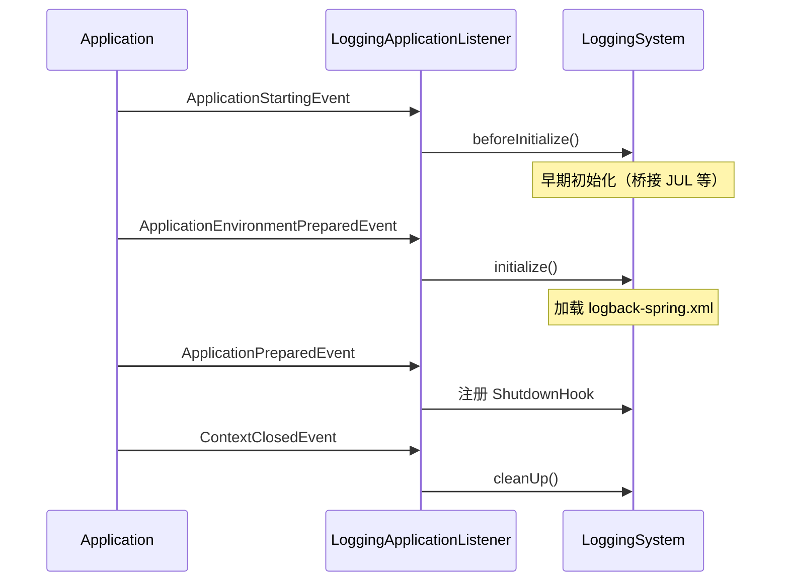
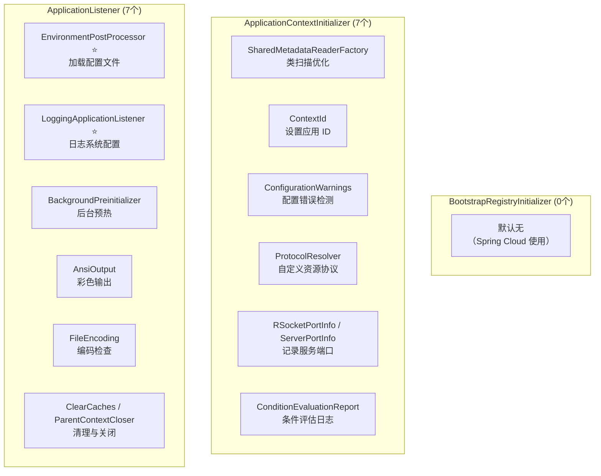

# Spring Boot 默认初始化器与监听器解析

> 基于 Spring Boot 3.5.9

---

## 一、数量分布概览

| 类型 | 默认数量 | 原因 |
|---|---|---|
| `BootstrapRegistryInitializer` | **0** | 相对较新的扩展点（Spring Boot 2.4+），主要用于 Spring Cloud 等场景。纯 Spring Boot 应用通常不需要在 Environment 准备之前做任何事情 |
| `ApplicationContextInitializer` | **7** | Spring Boot 需要在 Context 刷新前做大量准备工作（配置元数据、端口信息、日志等），这些都是框架核心功能 |
| `ApplicationListener` | **7** | Spring Boot 使用事件驱动架构，许多核心功能（日志、环境处理、编码检查等）都通过监听器实现 |

> **规律**：越早期的扩展点，默认实现越少；越靠近应用层的扩展点，默认实现越多。

---

## 二、7 个 ApplicationContextInitializer 详解

### 2.1 列表总览

| # | 类名 | 作用 |
|---|---|---|
| 0 | `SharedMetadataReaderFactoryContextInitializer` | 共享类元数据读取工厂，加速类扫描 |
| 1 | `ContextIdApplicationContextInitializer` | 设置应用上下文 ID |
| 2 | `ConfigurationWarningsApplicationContextInitializer` | 检测常见配置错误 |
| 3 | `ProtocolResolverApplicationContextInitializer` | 支持自定义资源协议 |
| 4 | `RSocketPortInfoApplicationContextInitializer` | 记录 RSocket 服务端口 |
| 5 | `ServerPortInfoApplicationContextInitializer` | 记录 Web 服务端口 |
| 6 | `ConditionEvaluationReportLoggingListener` | 记录条件评估报告 |

### 2.2 详细说明

#### 0. SharedMetadataReaderFactoryContextInitializer

```java
// 核心作用
public class SharedMetadataReaderFactoryContextInitializer 
        implements ApplicationContextInitializer<ConfigurableApplicationContext> {
    
    @Override
    public void initialize(ConfigurableApplicationContext context) {
        // 注册共享的 CachingMetadataReaderFactory
        // 用于 @ComponentScan 和 @Configuration 类解析
    }
}
```

| 特性 | 说明 |
|---|---|
| **作用** | 注册共享的 `MetadataReaderFactory`，避免重复解析类元数据 |
| **优化点** | 类扫描时读取 `.class` 文件的字节码信息，共享可减少 I/O |
| **Order** | `Ordered.HIGHEST_PRECEDENCE`（最高优先级） |

---

#### 1. ContextIdApplicationContextInitializer

```java
public class ContextIdApplicationContextInitializer 
        implements ApplicationContextInitializer<ConfigurableApplicationContext> {
    
    @Override
    public void initialize(ConfigurableApplicationContext context) {
        // 从 Environment 读取 spring.application.name
        // 设置为 ApplicationContext 的 ID
    }
}
```

| 特性 | 说明 |
|---|---|
| **作用** | 设置 `ApplicationContext.getId()` |
| **配置项** | `spring.application.name`（默认 `application`） |
| **用途** | 日志输出、监控标识、分布式追踪 |
| **Order** | `Ordered.HIGHEST_PRECEDENCE + 10` |

---

#### 2. ConfigurationWarningsApplicationContextInitializer

```java
public class ConfigurationWarningsApplicationContextInitializer 
        implements ApplicationContextInitializer<ConfigurableApplicationContext> {
    
    @Override
    public void initialize(ConfigurableApplicationContext context) {
        // 注册 ConfigurationWarningsPostProcessor
        // 检查是否在默认包下使用 @ComponentScan
    }
}
```

| 特性 | 说明 |
|---|---|
| **作用** | 注册 `BeanFactoryPostProcessor`，检测常见配置错误 |
| **检测项** | 在默认包（无包名）下使用 `@ComponentScan` |
| **警告示例** | `Your @ComponentScan is scanning the default package` |

---

#### 3. ProtocolResolverApplicationContextInitializer

| 特性 | 说明 |
|---|---|
| **作用** | 支持注册自定义 `ProtocolResolver` |
| **用途** | 支持自定义资源协议，如 `s3://`、`oss://`、`classpath*:` |
| **示例** | `context.getResource("s3://bucket/key")` |

---

#### 4. RSocketPortInfoApplicationContextInitializer

```java
public class RSocketPortInfoApplicationContextInitializer 
        implements ApplicationContextInitializer<ConfigurableApplicationContext> {
    
    // 监听 RSocketServerInitializedEvent
    // 将端口写入 Environment
}
```

| 特性 | 说明 |
|---|---|
| **作用** | 监听 RSocket 服务器启动事件，记录端口信息 |
| **写入属性** | `local.rsocket.server.port` |
| **用途** | 测试时获取动态分配的端口 |

---

#### 5. ServerPortInfoApplicationContextInitializer

```java
public class ServerPortInfoApplicationContextInitializer 
        implements ApplicationContextInitializer<ConfigurableApplicationContext>,
                   ApplicationListener<WebServerInitializedEvent> {
    
    @Override
    public void onApplicationEvent(WebServerInitializedEvent event) {
        // 获取实际端口，写入 Environment
        String propertyName = "local.server.port";
        setPortProperty(applicationContext, propertyName, event.getWebServer().getPort());
    }
}
```

| 特性 | 说明 |
|---|---|
| **作用** | 监听 Web 服务器启动事件，记录实际端口 |
| **写入属性** | `local.server.port` |
| **典型场景** | 配置 `server.port=0` 时获取动态端口 |

**使用示例**：

```java
@Value("${local.server.port}")
private int actualPort;

// 或在测试中
@LocalServerPort
private int port;
```

---

#### 6. ConditionEvaluationReportLoggingListener

```java
public class ConditionEvaluationReportLoggingListener 
        implements ApplicationContextInitializer<ConfigurableApplicationContext> {
    
    // 在 DEBUG 模式或启动失败时打印条件评估报告
}
```

| 特性 | 说明 |
|---|---|
| **作用** | 记录 `@Conditional` 条件评估结果 |
| **触发条件** | `--debug` 或 `logging.level.root=DEBUG` |
| **输出内容** | 哪些 Bean 被创建/跳过，原因是什么 |

**输出示例**：

```
============================
CONDITIONS EVALUATION REPORT
============================

Positive matches:
-----------------
   DataSourceAutoConfiguration matched:
      - @ConditionalOnClass found required classes 'javax.sql.DataSource' 

Negative matches:
-----------------
   ActiveMQAutoConfiguration:
      Did not match:
         - @ConditionalOnClass did not find required class 'javax.jms.ConnectionFactory'
```

---

## 三、7 个 ApplicationListener 详解

### 3.1 列表总览

| # | 类名 | 监听事件 | 作用 |
|---|---|---|---|
| 0 | `EnvironmentPostProcessorApplicationListener` | `ApplicationEnvironmentPreparedEvent` | 调用 EnvironmentPostProcessor |
| 1 | `AnsiOutputApplicationListener` | `ApplicationEnvironmentPreparedEvent` | 配置彩色输出 |
| 2 | `LoggingApplicationListener` | 多个事件 | 配置日志系统 |
| 3 | `BackgroundPreinitializer` | `ApplicationStartingEvent` | 后台预热 |
| 4 | `ParentContextCloserApplicationListener` | `ParentContextAvailableEvent` | 父子 Context 关闭 |
| 5 | `ClearCachesApplicationListener` | `ContextRefreshedEvent` | 清理反射缓存 |
| 6 | `FileEncodingApplicationListener` | `ApplicationEnvironmentPreparedEvent` | 检查文件编码 |

### 3.2 详细说明

#### 0. EnvironmentPostProcessorApplicationListener ⭐

```java
public class EnvironmentPostProcessorApplicationListener 
        implements ApplicationListener<ApplicationEnvironmentPreparedEvent> {
    
    @Override
    public void onApplicationEvent(ApplicationEnvironmentPreparedEvent event) {
        // 加载并执行所有 EnvironmentPostProcessor
        for (EnvironmentPostProcessor processor : postProcessors) {
            processor.postProcessEnvironment(environment, application);
        }
    }
}
```

| 特性 | 说明 |
|---|---|
| **作用** | 调用所有 `EnvironmentPostProcessor`，**加载配置文件** |
| **重要性** | ⭐⭐⭐⭐⭐ 核心监听器 |
| **触发的处理器** | `ConfigDataEnvironmentPostProcessor`（加载 application.yml） |

---

#### 1. AnsiOutputApplicationListener

| 特性 | 说明 |
|---|---|
| **作用** | 根据配置启用/禁用控制台彩色输出 |
| **配置项** | `spring.output.ansi.enabled=ALWAYS|DETECT|NEVER` |
| **默认** | `DETECT`（自动检测终端是否支持） |

---

#### 2. LoggingApplicationListener ⭐



| 特性 | 说明 |
|---|---|
| **作用** | 配置日志系统（Logback / Log4j2 / JUL） |
| **重要性** | ⭐⭐⭐⭐⭐ 核心监听器 |
| **配置项** | `logging.level.*`、`logging.file.*`、`logging.pattern.*` |

---

#### 3. BackgroundPreinitializer

```java
public class BackgroundPreinitializer 
        implements ApplicationListener<ApplicationStartingEvent> {
    
    @Override
    public void onApplicationEvent(ApplicationStartingEvent event) {
        // 在后台线程预初始化
        new Thread(() -> {
            // Jackson ObjectMapper
            // Charset
            // Validation
            // HTTP Client
        }).start();
    }
}
```

| 特性 | 说明 |
|---|---|
| **作用** | 在后台线程预初始化耗时组件 |
| **预热内容** | Jackson、Charset、Validation、HttpClient |
| **效果** | 加速首次请求响应时间 |

---

#### 4. ParentContextCloserApplicationListener

| 特性 | 说明 |
|---|---|
| **作用** | 当父 `ApplicationContext` 关闭时，自动关闭子 Context |
| **场景** | 父子 Context 层次结构（如 Spring Cloud） |

---

#### 5. ClearCachesApplicationListener

| 特性 | 说明 |
|---|---|
| **作用** | Context 刷新完成后清理反射缓存 |
| **时机** | `ContextRefreshedEvent` |
| **效果** | 释放启动阶段使用的内存 |

---

#### 6. FileEncodingApplicationListener

```java
public class FileEncodingApplicationListener 
        implements ApplicationListener<ApplicationEnvironmentPreparedEvent> {
    
    @Override
    public void onApplicationEvent(ApplicationEnvironmentPreparedEvent event) {
        // 检查 spring.mandatory-file-encoding 与系统编码是否一致
        if (!expectedEncoding.equals(systemEncoding)) {
            throw new IllegalStateException("...");
        }
    }
}
```

| 特性 | 说明 |
|---|---|
| **作用** | 检查强制文件编码配置 |
| **配置项** | `spring.mandatory-file-encoding=UTF-8` |
| **行为** | 若系统编码不匹配，**启动失败** |

---

## 四、关系图



---

## 五、设计哲学

| 扩展点 | 设计意图 |
|---|---|
| `BootstrapRegistryInitializer` | 留给用户/扩展框架（如 Spring Cloud），框架不预设实现 |
| `ApplicationContextInitializer` | 框架内部 Context 配置，提供必要的基础设施 |
| `ApplicationListener` | 事件驱动，解耦各功能模块，便于按需启用/禁用 |

**总结**：
- **0 个 BootstrapRegistryInitializer**：这是最早期的扩展点，框架层面通常不需要，留给 Spring Cloud 等分布式场景
- **7 个 ApplicationContextInitializer**：配置 Context 的基础设施（元数据、端口、ID、警告检测）
- **7 个 ApplicationListener**：事件驱动实现核心功能（日志、配置加载、预热、编码检查）
