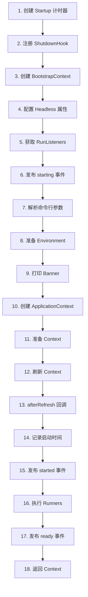
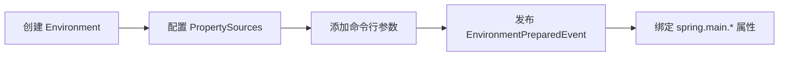
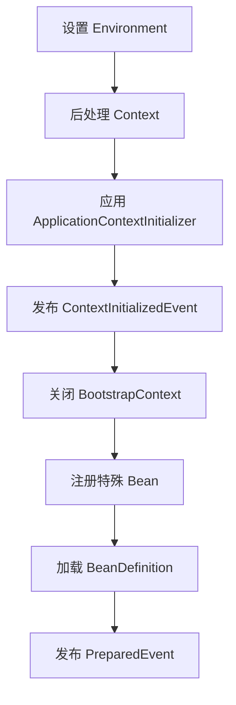
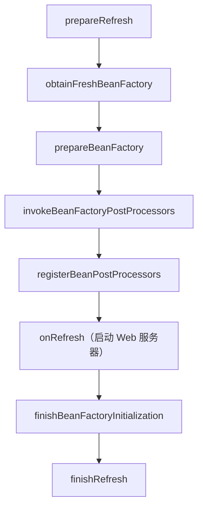
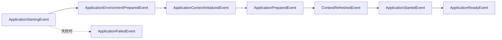
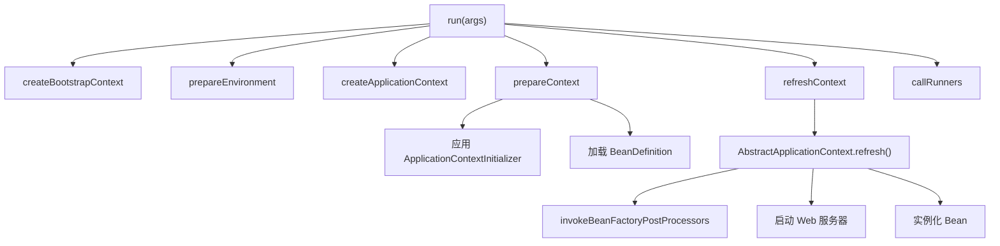

# SpringApplication.run() 方法解析

> 基于 Spring Boot 3.5.9

---

## 一、方法签名

```java
public ConfigurableApplicationContext run(String... args)
```

| 参数 | 说明 |
|---|---|
| `args` | 命令行参数（通常来自 `main` 方法） |
| **返回值** | 运行中的 `ConfigurableApplicationContext` |

---

## 二、执行流程概览



---

## 三、源码逐行解析

### 3.1 启动计时与 ShutdownHook

```java
Startup startup = Startup.create();
if (this.properties.isRegisterShutdownHook()) {
    SpringApplication.shutdownHook.enableShutdownHookAddition();
}
```

| 代码 | 说明 |
|---|---|
| `Startup.create()` | 创建启动计时器，用于统计启动耗时 |
| `shutdownHook.enableShutdownHookAddition()` | 注册 JVM 关闭钩子，确保应用优雅关闭 |

---

### 3.2 创建 BootstrapContext

```java
DefaultBootstrapContext bootstrapContext = createBootstrapContext();
```

```java
private DefaultBootstrapContext createBootstrapContext() {
    DefaultBootstrapContext bootstrapContext = new DefaultBootstrapContext();
    this.bootstrapRegistryInitializers.forEach((initializer) -> 
        initializer.initialize(bootstrapContext));
    return bootstrapContext;
}
```

| 说明 |
|---|
| 创建引导上下文，执行所有 `BootstrapRegistryInitializer` |
| 此时 Environment 和 ApplicationContext **尚未创建** |

---

### 3.3 配置 Headless 属性

```java
configureHeadlessProperty();
```

```java
private void configureHeadlessProperty() {
    System.setProperty(SYSTEM_PROPERTY_JAVA_AWT_HEADLESS,
        System.getProperty(SYSTEM_PROPERTY_JAVA_AWT_HEADLESS, 
            Boolean.toString(this.headless)));
}
```

| 说明 |
|---|
| 设置 `java.awt.headless=true`，服务器环境无需图形设备 |

---

### 3.4 获取 RunListeners 并发布 starting 事件

```java
SpringApplicationRunListeners listeners = getRunListeners(args);
listeners.starting(bootstrapContext, this.mainApplicationClass);
```

| 代码 | 说明 |
|---|---|
| `getRunListeners()` | 通过 SPI 加载 `SpringApplicationRunListener` 实现 |
| `listeners.starting()` | 发布 `ApplicationStartingEvent` 事件 |

**默认监听器**：`EventPublishingRunListener`，负责将事件广播给所有 `ApplicationListener`。

---

### 3.5 解析命令行参数

```java
ApplicationArguments applicationArguments = new DefaultApplicationArguments(args);
```

**解析规则**：
- `--key=value` → 选项参数（Option Arguments）
- 其他 → 非选项参数（Non-Option Arguments）

```java
// 示例
java -jar app.jar --server.port=8080 --debug foo bar

applicationArguments.getOptionNames();        // [server.port, debug]
applicationArguments.getOptionValues("server.port"); // [8080]
applicationArguments.getNonOptionArgs();      // [foo, bar]
```

---

### 3.6 准备 Environment

```java
ConfigurableEnvironment environment = prepareEnvironment(listeners, bootstrapContext, applicationArguments);
```

**prepareEnvironment 内部流程**：



| 步骤 | 说明 |
|---|---|
| 创建 Environment | 根据 WebApplicationType 创建对应类型 |
| 配置 PropertySources | 添加系统属性、环境变量等 |
| 发布事件 | 触发 `EnvironmentPostProcessor` 加载配置文件 |

---

### 3.7 打印 Banner

```java
Banner printedBanner = printBanner(environment);
```

| Banner 来源 | 优先级 |
|---|---|
| `spring.banner.image.location` | 最高（图片） |
| `spring.banner.location` | 次高（文本） |
| 默认 `SpringBootBanner` | 最低 |

---

### 3.8 创建 ApplicationContext

```java
context = createApplicationContext();
context.setApplicationStartup(this.applicationStartup);
```

| WebApplicationType | 创建的 Context |
|---|---|
| `SERVLET` | `AnnotationConfigServletWebServerApplicationContext` |
| `REACTIVE` | `AnnotationConfigReactiveWebServerApplicationContext` |
| `NONE` | `AnnotationConfigApplicationContext` |

---

### 3.9 准备 Context

```java
prepareContext(bootstrapContext, context, environment, listeners, applicationArguments, printedBanner);
```

**prepareContext 内部流程**：



**注册的特殊 Bean**：

| Bean 名称 | 类型 | 说明 |
|---|---|---|
| `springApplicationArguments` | `ApplicationArguments` | 命令行参数 |
| `springBootBanner` | `Banner` | Banner 实例 |

---

### 3.10 刷新 Context

```java
refreshContext(context);
```

**这是整个启动过程的核心**，执行 `AbstractApplicationContext.refresh()`：



| 关键步骤 | 说明 |
|---|---|
| `invokeBeanFactoryPostProcessors` | 解析 `@Configuration`、`@ComponentScan` |
| `onRefresh` | 启动内嵌 Tomcat/Jetty/Netty |
| `finishBeanFactoryInitialization` | 实例化所有非懒加载的单例 Bean |

---

### 3.11 afterRefresh 回调

```java
afterRefresh(context, applicationArguments);
```

```java
protected void afterRefresh(ConfigurableApplicationContext context, ApplicationArguments args) {
    // 空实现，留给子类扩展
}
```

---

### 3.12 记录启动信息

```java
startup.started();
if (this.properties.isLogStartupInfo()) {
    new StartupInfoLogger(this.mainApplicationClass, environment)
        .logStarted(getApplicationLog(), startup);
}
```

**输出示例**：

```
Started MyApplication in 2.345 seconds (process running for 2.789)
```

---

### 3.13 发布 started 事件

```java
listeners.started(context, startup.timeTakenToStarted());
```

| 事件 | 说明 |
|---|---|
| `ApplicationStartedEvent` | Context 刷新完成，但 Runners 尚未执行 |

---

### 3.14 执行 Runners

```java
callRunners(context, applicationArguments);
```

```java
private void callRunners(ApplicationContext context, ApplicationArguments args) {
    List<Object> runners = new ArrayList<>();
    runners.addAll(context.getBeansOfType(ApplicationRunner.class).values());
    runners.addAll(context.getBeansOfType(CommandLineRunner.class).values());
    AnnotationAwareOrderComparator.sort(runners);
    for (Object runner : runners) {
        if (runner instanceof ApplicationRunner ar) {
            ar.run(args);
        }
        if (runner instanceof CommandLineRunner cr) {
            cr.run(args.getSourceArgs());
        }
    }
}
```

| Runner 类型 | 参数 | 适用场景 |
|---|---|---|
| `ApplicationRunner` | `ApplicationArguments` | 需要解析后的参数 |
| `CommandLineRunner` | `String[]` | 原始命令行参数 |

---

### 3.15 发布 ready 事件

```java
if (context.isRunning()) {
    listeners.ready(context, startup.ready());
}
```

| 事件 | 说明 |
|---|---|
| `ApplicationReadyEvent` | 应用完全就绪，可接收请求 |

---

### 3.16 异常处理

```java
catch (Throwable ex) {
    throw handleRunFailure(context, ex, listeners);
}
```

**handleRunFailure 处理**：
1. 发布 `ApplicationFailedEvent`
2. 关闭已创建的 Context
3. 注销 ShutdownHook
4. 重新抛出异常

---

## 四、事件时间线



| 事件 | 触发时机 | 可用资源 |
|---|---|---|
| `ApplicationStartingEvent` | run() 开始 | 无 |
| `ApplicationEnvironmentPreparedEvent` | Environment 准备完成 | Environment |
| `ApplicationContextInitializedEvent` | Context 初始化完成 | Context（空） |
| `ApplicationPreparedEvent` | BeanDefinition 加载完成 | Context（未刷新） |
| `ContextRefreshedEvent` | refresh() 完成 | Context（完整） |
| `ApplicationStartedEvent` | Runners 执行前 | Context（完整） |
| `ApplicationReadyEvent` | 完全就绪 | Context（完整） |

---

## 五、核心方法调用关系



---

## 六、总结

| 阶段 | 关键操作 | 产出 |
|---|---|---|
| **Bootstrap** | 创建 BootstrapContext | 早期对象注册 |
| **Environment** | prepareEnvironment | 配置属性加载完成 |
| **Context 创建** | createApplicationContext | 空的 ApplicationContext |
| **Context 准备** | prepareContext | BeanDefinition 加载完成 |
| **Context 刷新** | refreshContext | Bean 实例化、Web 服务器启动 |
| **就绪** | callRunners | 执行启动后任务 |

**设计亮点**：
1. **事件驱动**：每个阶段都有对应事件，便于扩展
2. **异常安全**：try-catch 确保失败时正确清理
3. **计时统计**：`Startup` 类记录启动耗时
4. **优雅关闭**：ShutdownHook 确保资源正确释放
