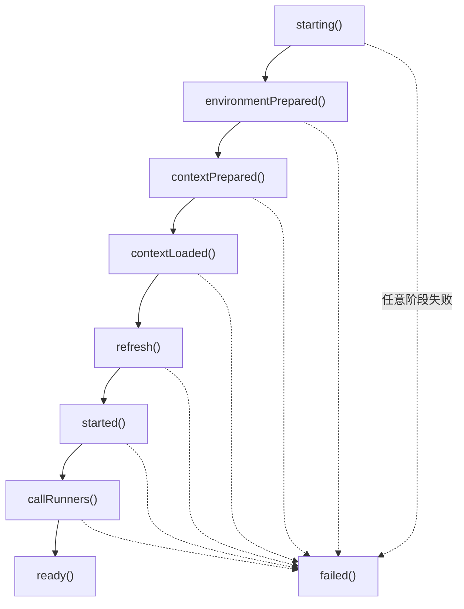
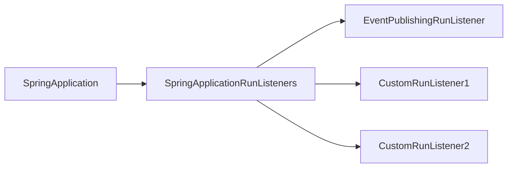
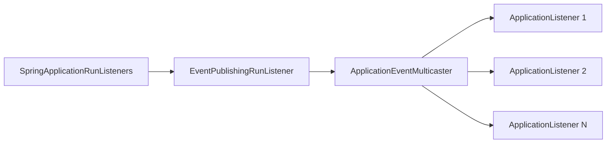
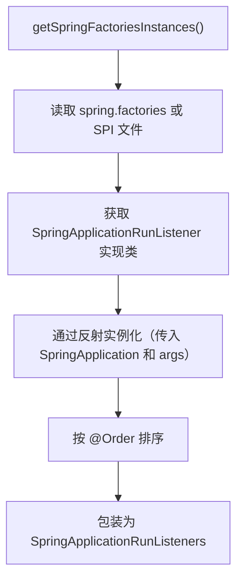

# SpringApplicationRunListeners 和 SpringApplicationRunListener 解析

> 基于 Spring Boot 3.5.9

---

## 一、概述

在 Spring Boot 启动过程中，`SpringApplicationRunListener` 和 `SpringApplicationRunListeners` 是两个关键组件：

| 组件 | 类型 | 职责 |
|---|---|---|
| `SpringApplicationRunListener` | 接口 | 定义启动过程中各阶段的回调方法 |
| `SpringApplicationRunListeners` | 聚合类 | 管理多个 `SpringApplicationRunListener`，统一调度 |

**关系**：`SpringApplicationRunListeners` 是 `SpringApplicationRunListener` 的集合包装器，采用**门面模式**简化调用。

---

## 二、SpringApplicationRunListener 接口

### 2.1 接口定义

```java
public interface SpringApplicationRunListener {

    // 默认方法：返回执行顺序（越小越先执行）
    default int getOrder() {
        return 0;
    }

    // 1. 应用启动时（最早）
    default void starting(ConfigurableBootstrapContext bootstrapContext) {}

    // 2. Environment 准备完成，Context 创建前
    default void environmentPrepared(ConfigurableBootstrapContext bootstrapContext,
            ConfigurableEnvironment environment) {}

    // 3. ApplicationContext 创建并初始化后，BeanDefinition 加载前
    default void contextPrepared(ConfigurableApplicationContext context) {}

    // 4. BeanDefinition 加载完成，refresh() 调用前
    default void contextLoaded(ConfigurableApplicationContext context) {}

    // 5. Context 刷新完成，Runners 执行前
    default void started(ConfigurableApplicationContext context, Duration timeTaken) {}

    // 6. 应用完全就绪，可接收请求
    default void ready(ConfigurableApplicationContext context, Duration timeTaken) {}

    // 7. 启动失败时调用
    default void failed(ConfigurableApplicationContext context, Throwable exception) {}
}
```

### 2.2 回调方法时机



### 2.3 各方法详解

| 方法 | 触发时机 | 可用资源 | 典型用途 |
|---|---|---|---|
| `starting()` | `run()` 刚开始 | BootstrapContext | 记录启动开始 |
| `environmentPrepared()` | Environment 配置完成 | Environment | 修改配置属性 |
| `contextPrepared()` | Context 创建后 | 空的 Context | 向 Context 添加组件 |
| `contextLoaded()` | BeanDefinition 加载后 | 未刷新的 Context | 修改 BeanDefinition |
| `started()` | Context 刷新后 | 完整的 Context | 记录启动耗时 |
| `ready()` | Runners 执行后 | 完整的 Context | 发送就绪通知 |
| `failed()` | 启动失败 | 部分 Context | 错误处理、清理 |

---

## 三、SpringApplicationRunListeners 聚合类

### 3.1 类结构

```java
class SpringApplicationRunListeners {

    private final List<SpringApplicationRunListener> listeners;
    private final ApplicationStartup applicationStartup;

    SpringApplicationRunListeners(List<SpringApplicationRunListener> listeners,
            ApplicationStartup applicationStartup) {
        this.listeners = List.copyOf(listeners);
        this.applicationStartup = applicationStartup;
    }
    
    // 聚合方法：遍历所有监听器并调用对应方法
    void starting(...) { ... }
    void environmentPrepared(...) { ... }
    void contextPrepared(...) { ... }
    void contextLoaded(...) { ... }
    void started(...) { ... }
    void ready(...) { ... }
    void failed(...) { ... }
}
```

### 3.2 设计模式

采用**门面模式（Facade Pattern）**：



**优点**：
1. 简化调用：`SpringApplication` 只需与 `SpringApplicationRunListeners` 交互
2. 统一管理：排序、异常处理等逻辑集中处理
3. 性能监控：通过 `ApplicationStartup` 记录每个阶段耗时

### 3.3 核心方法实现

以 `starting()` 为例：

```java
void starting(ConfigurableBootstrapContext bootstrapContext, 
              Class<?> mainApplicationClass) {
    doWithListeners("spring.boot.application.starting", 
        (listener) -> listener.starting(bootstrapContext),
        (step) -> {
            if (mainApplicationClass != null) {
                step.tag("mainApplicationClass", mainApplicationClass.getName());
            }
        });
}

private void doWithListeners(String stepName, 
        Consumer<SpringApplicationRunListener> listenerAction,
        Consumer<StartupStep> stepAction) {
    StartupStep step = this.applicationStartup.start(stepName);
    this.listeners.forEach(listenerAction);
    if (stepAction != null) {
        stepAction.accept(step);
    }
    step.end();
}
```

**执行流程**：
1. 开始 `StartupStep` 记录
2. 遍历所有监听器执行回调
3. 添加标签信息
4. 结束 `StartupStep` 记录

---

## 四、EventPublishingRunListener

这是 Spring Boot 默认提供的 `SpringApplicationRunListener` 实现。

### 4.1 职责

**桥接作用**：将 `SpringApplicationRunListener` 的回调转换为 Spring 事件。



### 4.2 回调与事件映射

| 回调方法 | 发布的事件 |
|---|---|
| `starting()` | `ApplicationStartingEvent` |
| `environmentPrepared()` | `ApplicationEnvironmentPreparedEvent` |
| `contextPrepared()` | `ApplicationContextInitializedEvent` |
| `contextLoaded()` | `ApplicationPreparedEvent` |
| `started()` | `ApplicationStartedEvent` |
| `ready()` | `ApplicationReadyEvent` |
| `failed()` | `ApplicationFailedEvent` |

### 4.3 源码示例

```java
public class EventPublishingRunListener implements SpringApplicationRunListener, Ordered {

    private final SpringApplication application;
    private final String[] args;
    private final SimpleApplicationEventMulticaster initialMulticaster;

    public EventPublishingRunListener(SpringApplication application, String[] args) {
        this.application = application;
        this.args = args;
        this.initialMulticaster = new SimpleApplicationEventMulticaster();
        // 添加已注册的监听器
        for (ApplicationListener<?> listener : application.getListeners()) {
            this.initialMulticaster.addApplicationListener(listener);
        }
    }

    @Override
    public void starting(ConfigurableBootstrapContext bootstrapContext) {
        multicastInitialEvent(new ApplicationStartingEvent(
            bootstrapContext, this.application, this.args));
    }

    @Override
    public void environmentPrepared(ConfigurableBootstrapContext bootstrapContext,
            ConfigurableEnvironment environment) {
        multicastInitialEvent(new ApplicationEnvironmentPreparedEvent(
            bootstrapContext, this.application, this.args, environment));
    }
    
    // ... 其他方法类似
}
```

---

## 五、自定义 SpringApplicationRunListener

### 5.1 实现步骤

**步骤 1**：创建实现类

```java
public class MyRunListener implements SpringApplicationRunListener {

    // 必须有此构造函数（SPI 加载时使用）
    public MyRunListener(SpringApplication application, String[] args) {
    }

    @Override
    public void starting(ConfigurableBootstrapContext bootstrapContext) {
        System.out.println(">>> 应用启动中...");
    }

    @Override
    public void ready(ConfigurableApplicationContext context, Duration timeTaken) {
        System.out.println(">>> 应用就绪，耗时：" + timeTaken.toMillis() + "ms");
    }

    @Override
    public int getOrder() {
        return Ordered.HIGHEST_PRECEDENCE; // 最先执行
    }
}
```

**步骤 2**：注册 SPI

创建文件 `META-INF/spring.factories`（Spring Boot 2.x）或 `META-INF/spring/org.springframework.boot.SpringApplicationRunListener`（Spring Boot 3.x）：

```properties
# Spring Boot 2.x: META-INF/spring.factories
org.springframework.boot.SpringApplicationRunListener=\
    com.example.MyRunListener

# Spring Boot 3.x: META-INF/spring/org.springframework.boot.SpringApplicationRunListener
com.example.MyRunListener
```

### 5.2 常见应用场景

| 场景 | 实现方式 |
|---|---|
| 自定义启动日志 | 在 `starting()` 和 `ready()` 中打印 |
| 启动耗时监控 | 在 `started()` 中上报指标 |
| 配置中心集成 | 在 `environmentPrepared()` 中加载远程配置 |
| 健康检查注册 | 在 `ready()` 中向注册中心发送心跳 |
| 启动失败告警 | 在 `failed()` 中发送通知 |

---

## 六、加载机制

### 6.1 获取 RunListeners

```java
// SpringApplication 中
private SpringApplicationRunListeners getRunListeners(String[] args) {
    ArgumentResolver argumentResolver = ArgumentResolver.of(SpringApplication.class, this)
            .and(String[].class, args);
    List<SpringApplicationRunListener> listeners = 
        getSpringFactoriesInstances(SpringApplicationRunListener.class, argumentResolver);
    return new SpringApplicationRunListeners(listeners, this.applicationStartup);
}
```

### 6.2 加载过程



---

## 七、与 ApplicationListener 的区别

| 对比项 | SpringApplicationRunListener | ApplicationListener |
|---|---|---|
| 触发时机 | 启动过程的固定阶段 | 任意 ApplicationEvent |
| 注册方式 | SPI（spring.factories） | `@Component` / `addListener()` |
| 可用时机 | 早于 ApplicationContext 创建 | ApplicationContext 存在后 |
| 适用场景 | 框架级扩展 | 业务级事件监听 |
| 事件类型 | 预定义 7 种启动事件 | 任意自定义事件 |

**选择建议**：
- 需要在 Environment 准备前介入 → `SpringApplicationRunListener`
- 常规业务事件监听 → `ApplicationListener`

---

## 八、执行顺序

### 8.1 在 run() 方法中的位置

```java
public ConfigurableApplicationContext run(String... args) {
    // 1. 获取 RunListeners
    SpringApplicationRunListeners listeners = getRunListeners(args);
    
    // 2. 发布 starting 事件
    listeners.starting(bootstrapContext, this.mainApplicationClass);
    
    // 3. 准备 Environment
    ConfigurableEnvironment environment = prepareEnvironment(listeners, ...);
    // ↑ 内部调用 listeners.environmentPrepared()
    
    // 4. 准备 Context
    prepareContext(bootstrapContext, context, environment, listeners, ...);
    // ↑ 内部调用 listeners.contextPrepared() 和 contextLoaded()
    
    // 5. 刷新 Context
    refreshContext(context);
    
    // 6. 发布 started 事件
    listeners.started(context, startup.timeTakenToStarted());
    
    // 7. 执行 Runners
    callRunners(context, applicationArguments);
    
    // 8. 发布 ready 事件
    listeners.ready(context, startup.ready());
    
    return context;
}
```

---

## 九、总结

### 核心要点

| 组件 | 作用 |
|---|---|
| `SpringApplicationRunListener` | 启动生命周期回调接口，定义 7 个阶段方法 |
| `SpringApplicationRunListeners` | 门面类，聚合管理所有 RunListener |
| `EventPublishingRunListener` | 默认实现，将回调转为 Spring 事件 |

### 设计亮点

1. **SPI 驱动**：通过 `spring.factories` 实现松耦合扩展
2. **门面模式**：简化 `SpringApplication` 与监听器的交互
3. **事件桥接**：`EventPublishingRunListener` 统一事件模型
4. **性能监控**：集成 `ApplicationStartup` 记录各阶段耗时
5. **有序执行**：支持 `@Order` / `Ordered` 控制执行顺序
